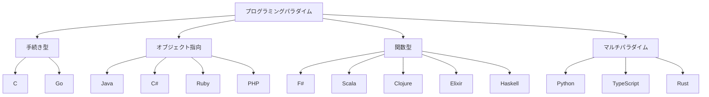

# 第 1 章 言語概要と開発環境比較

## はじめに

本章では、シリーズで使用した 14 言語を **パラダイム**・**型システム**・**メモリ管理**・**開発環境** の観点から俯瞰的に比較します。アルゴリズム実装の具体的な違いに入る前に、各言語がどのような設計思想を持ち、どのような場面で使われているかを整理します。

## 言語パラダイム分類

プログラミング言語は、その設計思想に基づいていくつかのパラダイムに分類できます。



### パラダイム別グルーピング

| グループ | 言語 | 特徴 |
|---------|------|------|
| **OOP 中心** | Java, C#, Ruby, PHP | クラスベースのオブジェクト指向。継承・ポリモーフィズム・カプセル化が基本 |
| **マルチパラダイム** | Python, TypeScript, Rust | OOP と関数型を柔軟に組み合わせ可能 |
| **手続き型 / システム言語** | C, Go | シンプルな構文。低レベル制御（C）またはシンプルさ重視（Go） |
| **関数型（OOP ハイブリッド）** | F#, Scala | .NET / JVM 上で関数型を主軸に OOP も活用 |
| **関数型（動的）** | Clojure, Elixir | LISP 系（Clojure）/ BEAM VM（Elixir）。イミュータブルデータが基本 |
| **純粋関数型** | Haskell | 副作用を型で管理。遅延評価。最も厳格な関数型 |

## 型システム比較

| 言語 | 型付け | 型推論 | ジェネリクス | Null 安全性 |
|------|--------|--------|------------|------------|
| Python | 動的・強い | - | 型ヒント（3.5+） | Optional 型ヒント |
| TypeScript | 静的・強い | あり | あり | strictNullChecks |
| Java | 静的・強い | 限定的 | あり（型消去） | Optional クラス |
| C# | 静的・強い | var | あり | Nullable 参照型（8.0+） |
| Ruby | 動的・強い | - | なし | nil（NilClass） |
| PHP | 動的・弱い | - | なし | nullable 型（7.1+） |
| Go | 静的・強い | := | あり（1.18+） | nil（ポインタ型） |
| C | 静的・弱い | なし | なし（マクロ/void*） | NULL ポインタ |
| Rust | 静的・強い | あり | あり | `Option<T>`（null なし） |
| F# | 静的・強い | 強力 | あり | `Option<'T>` |
| Scala | 静的・強い | 強力 | あり | `Option[T]` / Union Type |
| Clojure | 動的・強い | - | なし（多相性） | nil |
| Elixir | 動的・強い | - | なし | nil |
| Haskell | 静的・強い | 強力 | あり（型変数） | `Maybe a`（null なし） |

### 型システムの厳格さスペクトラム

```
弱い型付け                                              強い型付け
 ←─────────────────────────────────────────────────────→
 C    PHP         Python  Ruby     Go  Java    Rust  Haskell
                  Elixir  Clojure  C#  TypeScript  F#  Scala
```

## メモリ管理方式

| 方式 | 言語 | 説明 |
|------|------|------|
| **手動管理** | C | `malloc`/`free` による明示的なメモリ管理 |
| **所有権システム** | Rust | コンパイル時に所有権・借用をチェック。GC 不要 |
| **ガベージコレクション（GC）** | Java, C#, Go, Python, Ruby, PHP, TypeScript, Scala, Clojure, Haskell | ランタイムが自動でメモリを回収 |
| **参照カウント + GC** | Python, PHP, Elixir | 参照カウントを基本に、循環参照は GC で回収 |
| **BEAM VM** | Elixir | プロセスごとの GC。軽量プロセスモデル |

## 開発環境・テストフレームワーク比較

| 言語 | パッケージ管理 | テストフレームワーク | リンター / フォーマッター | ビルドツール |
|------|--------------|-------------------|----------------------|------------|
| Python | uv / pip | pytest | Ruff, mypy | tox |
| TypeScript | npm | Jest | ESLint, Prettier | npm scripts |
| Java | Gradle | JUnit 5 | Checkstyle, PMD, SpotBugs | Gradle |
| C# | NuGet | xUnit | dotnet format, Roslyn | dotnet CLI |
| Ruby | Bundler | Minitest | RuboCop | Rake |
| PHP | Composer | PHPUnit | PHP_CodeSniffer, PHPStan | Composer scripts |
| Go | Go Modules | testing（標準） | golangci-lint | go build |
| C | - | Unity（C テスト） | - | Makefile |
| Rust | Cargo | cargo test（標準） | Clippy, rustfmt | Cargo |
| F# | NuGet | xUnit | Fantomas | dotnet CLI |
| Scala | sbt | ScalaTest | scalafmt, WartRemover | sbt |
| Clojure | Leiningen | clojure.test（標準） | Eastwood, cljfmt | Leiningen |
| Elixir | Mix | ExUnit（標準） | Credo, Dialyxir | Mix |
| Haskell | Cabal | HSpec | HLint, stylish-haskell | Cabal |

## 実行モデル比較

| 実行モデル | 言語 | 説明 |
|-----------|------|------|
| **ネイティブコンパイル** | C, Go, Rust, Haskell | ソースコードを直接機械語にコンパイル |
| **JVM バイトコード** | Java, Scala, Clojure | Java 仮想マシン上で実行。JIT コンパイル |
| **.NET IL** | C#, F# | .NET ランタイム上で実行。JIT/AOT コンパイル |
| **インタプリタ** | Python, Ruby, PHP | ソースコードを逐次解釈して実行 |
| **トランスパイル** | TypeScript | JavaScript に変換後、Node.js / ブラウザで実行 |
| **BEAM VM** | Elixir | Erlang 仮想マシン上で実行。軽量プロセスモデル |

## Nix 開発環境

本プロジェクトでは、全 14 言語の開発環境を **Nix** で統一管理しています。

```bash
# 各言語の開発環境に入る
nix develop .#python
nix develop .#node
nix develop .#java
nix develop .#dotnet    # C# / F#
nix develop .#ruby
nix develop .#php
nix develop .#go
nix develop .#c
nix develop .#rust
nix develop .#scala
nix develop .#clojure
nix develop .#haskell
nix develop .#elixir
```

Nix を使うことで、言語処理系のバージョン差異に悩まされることなく、全言語で再現性のある開発環境を構築できます。

## 言語の歴史と設計哲学

| 言語 | 登場年 | 設計者 | 設計哲学 |
|------|--------|--------|---------|
| C | 1972 | Dennis Ritchie | ハードウェアに近い低レベル制御と移植性 |
| Haskell | 1990 | 委員会 | 純粋関数型の学術的研究と実用化 |
| Python | 1991 | Guido van Rossum | 可読性と簡潔さ。「一つの明白な方法」 |
| Java | 1995 | James Gosling | 「Write Once, Run Anywhere」。安全性と移植性 |
| Ruby | 1995 | まつもとゆきひろ | プログラマの幸福。「驚き最小の原則」 |
| PHP | 1995 | Rasmus Lerdorf | Web 開発に特化。実用主義 |
| C# | 2000 | Anders Hejlsberg | .NET プラットフォームの中心。モダン OOP |
| Scala | 2004 | Martin Odersky | OOP と FP の統合。JVM 上の関数型 |
| F# | 2005 | Don Syme | .NET 上の ML 系関数型。実用的な関数型 |
| Clojure | 2007 | Rich Hickey | JVM 上の LISP。永続データ構造と並行処理 |
| Go | 2009 | Rob Pike, Ken Thompson | シンプルさと並行処理。コンパイル速度 |
| Rust | 2010 | Graydon Hoare | メモリ安全性とパフォーマンスの両立 |
| TypeScript | 2012 | Anders Hejlsberg | JavaScript に型安全性を追加 |
| Elixir | 2012 | Jose Valim | BEAM VM 上の関数型。耐障害性と並行処理 |

## まとめ

14 言語は、以下の軸で大きく異なります:

1. **パラダイム**: 手続き型 / OOP / 関数型 / 純粋関数型
2. **型システム**: 静的 vs 動的、型推論の有無、Null 安全性
3. **メモリ管理**: 手動 / GC / 所有権システム
4. **実行モデル**: ネイティブ / VM / インタプリタ

次章以降では、これらの違いが実際のアルゴリズム実装にどう影響するかを、具体的なコード比較で見ていきます。
