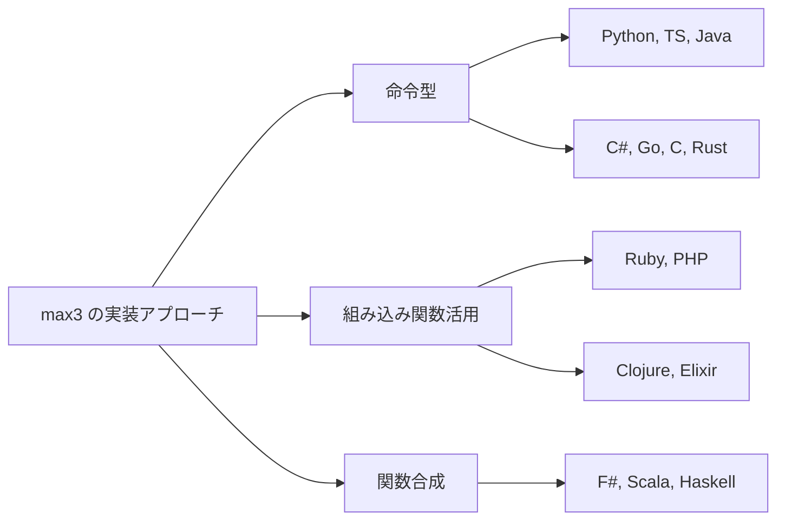

# 第 2 章 基本構文と制御フロー比較

## はじめに

同じアルゴリズムでも、言語によって構文の見た目は大きく異なります。本章では、最もシンプルなアルゴリズム —— **3 値の最大値（max3）** を題材に、14 言語の基本構文を比較します。

## 関数定義の比較

### max3 の 14 言語実装

#### OOP 言語グループ

**Python**:

```python
def max3(a: int, b: int, c: int) -> int:
    maximum = a
    if b > maximum:
        maximum = b
    if c > maximum:
        maximum = c
    return maximum
```

**TypeScript**:

```typescript
export function max3(a: number, b: number, c: number): number {
  let maximum = a;
  if (b > maximum) maximum = b;
  if (c > maximum) maximum = c;
  return maximum;
}
```

**Java**:

```java
public static int max3(int a, int b, int c) {
    int max = a;
    if (b > max) max = b;
    if (c > max) max = c;
    return max;
}
```

**C#**:

```csharp
public static int Max3(int a, int b, int c)
{
    int max = a;
    if (b > max) max = b;
    if (c > max) max = c;
    return max;
}
```

**Ruby**:

```ruby
def self.max3(a, b, c)
  [a, b, c].max
end
```

**PHP**:

```php
public static function max3(int $a, int $b, int $c): int
{
    return max($a, $b, $c);
}
```

#### 手続き型 / システム言語グループ

**Go**:

```go
func Max3(a, b, c int) int {
    max := a
    if b > max { max = b }
    if c > max { max = c }
    return max
}
```

**C**:

```c
int max3(int a, int b, int c) {
    int max = a;
    if (b > max) max = b;
    if (c > max) max = c;
    return max;
}
```

**Rust**:

```rust
pub fn max3(a: i32, b: i32, c: i32) -> i32 {
    let mut max = a;
    if b > max { max = b; }
    if c > max { max = c; }
    max
}
```

#### 関数型言語グループ

**F#**:

```fsharp
let max3 a b c =
    max a (max b c)
```

**Scala**:

```scala
def max3(a: Int, b: Int, c: Int): Int =
    a max b max c
```

**Clojure**:

```clojure
(defn max3
  [a b c]
  (max a b c))
```

**Elixir**:

```elixir
def max3(a, b, c) do
  Enum.max([a, b, c])
end
```

**Haskell**:

```haskell
max3 :: Ord a => a -> a -> a -> a
max3 a b c = max a (max b c)
```

## 構文の比較ポイント

### 関数定義の構文

| 言語 | キーワード | 型注釈 | 波括弧 | セミコロン | 戻り値 |
|------|-----------|--------|--------|-----------|--------|
| Python | `def` | 型ヒント（任意） | なし（インデント） | なし | `return` |
| TypeScript | `function` | 必須 | `{}` | あり | `return` |
| Java | 型名 | 必須 | `{}` | あり | `return` |
| C# | 型名 | 必須 | `{}` | あり | `return` |
| Ruby | `def` | なし | `end` | なし | 最後の式 |
| PHP | `function` | 任意（推奨） | `{}` | あり | `return` |
| Go | `func` | 必須 | `{}` | なし | `return` |
| C | 型名 | 必須 | `{}` | あり | `return` |
| Rust | `fn` | 必須 | `{}` | あり | 最後の式 |
| F# | `let` | 推論（任意） | なし（インデント） | なし | 最後の式 |
| Scala | `def` | 推論（推奨） | なし / `{}` | なし | 最後の式 |
| Clojure | `defn` | なし | `()` | なし | 最後の式 |
| Elixir | `def` | なし | `do...end` | なし | 最後の式 |
| Haskell | なし（型宣言別） | 型宣言（推奨） | なし（インデント） | なし | 最後の式 |

### 実装アプローチの違い

上記の `max3` 実装を見ると、大きく **3 つのアプローチ** に分かれます:

1. **命令型**: 変数に代入しながら `if` で更新（Python, TypeScript, Java, C#, Go, C, Rust）
2. **組み込み関数活用**: 言語標準の `max` 関数やコレクション操作を利用（Ruby, PHP, Clojure, Elixir）
3. **関数合成**: `max` 関数を合成して表現（F#, Scala, Haskell）



## 変数宣言の比較

| 言語 | 不変 | 可変 | 型推論 |
|------|------|------|--------|
| Python | - | `x = 1` | 常に推論 |
| TypeScript | `const x = 1` | `let x = 1` | `const` 時推論 |
| Java | `final int x = 1` | `int x = 1` | `var x = 1`（10+） |
| C# | - | `int x = 1` / `var x = 1` | `var` で推論 |
| Ruby | `X = 1`（定数） | `x = 1` | 常に推論 |
| PHP | `const X = 1` | `$x = 1` | 常に推論 |
| Go | `const x = 1` | `x := 1` / `var x int = 1` | `:=` で推論 |
| C | `const int x = 1` | `int x = 1` | なし |
| Rust | `let x = 1` | `let mut x = 1` | 推論あり |
| F# | `let x = 1` | `let mutable x = 1` | 推論あり |
| Scala | `val x = 1` | `var x = 1` | 推論あり |
| Clojure | `(def x 1)` | `(atom 1)` | 常に推論 |
| Elixir | `x = 1` | -（再束縛可） | 常に推論 |
| Haskell | `x = 1`（全て不変） | `IORef`（IO 内） | 推論あり |

### デフォルトの不変性

関数型言語は **デフォルトが不変**（immutable）で、可変にするには明示的な宣言が必要です:

- **デフォルト不変**: Rust (`let`), F# (`let`), Scala (`val`), Haskell（全て不変）
- **デフォルト可変**: Python, Java, C#, Ruby, PHP, Go, C

## 条件分岐の比較

**if-else の構文**:

| 言語 | 構文例 | 式 or 文 |
|------|--------|---------|
| Python | `if x > 0: ... elif: ... else: ...` | 式（三項） |
| TypeScript | `if (x > 0) { } else if { } else { }` | 文 |
| Java | `if (x > 0) { } else if { } else { }` | 文 |
| Ruby | `if x > 0 ... elsif ... else ... end` | 式 |
| Go | `if x > 0 { } else if { } else { }` | 文 |
| C | `if (x > 0) { } else if { } else { }` | 文 |
| Rust | `if x > 0 { } else if { } else { }` | 式 |
| F# | `if x > 0 then ... elif ... else ...` | 式 |
| Scala | `if x > 0 then ... else ...` | 式 |
| Clojure | `(if (> x 0) ... ...)` / `(cond ...)` | 式 |
| Elixir | `if x > 0 do ... else ... end` / `cond` | 式 |
| Haskell | `if x > 0 then ... else ...` / ガード | 式 |

**パターンマッチング対応**:

| 言語 | パターンマッチング |
|------|------------------|
| Rust | `match` 式（網羅性チェックあり） |
| F# | `match ... with` 式（網羅性チェックあり） |
| Scala | `match` 式（sealed trait で網羅性チェック） |
| Haskell | `case ... of` / 関数定義でのパターンマッチ（網羅性警告） |
| Elixir | `case` / 関数の複数定義 |
| Clojure | `condp`、`case`、マルチメソッド |
| C# | `switch` 式（8.0+パターンマッチング） |
| Java | `switch` 式（14+） |

## テストの書き方比較

`max3` のテストを各言語で比較すると、テストフレームワークの違いが明確になります:

**Python (pytest)**:

```python
def test_max3_cases(self):
    cases = [(3, 2, 1, 3), (1, 3, 2, 3), (1, 2, 3, 3)]
    for a, b, c, expected in cases:
        assert max3(a, b, c) == expected
```

**Java (JUnit 5)**:

```java
@Test void testMax3() {
    int[][] cases = {{3,2,1,3}, {1,3,2,3}, {1,2,3,3}};
    for (int[] c : cases)
        assertEquals(c[3], BasicAlgorithms.max3(c[0], c[1], c[2]));
}
```

**Haskell (HSpec)**:

```haskell
describe "max3" $ do
  it "returns the maximum of three values" $ do
    max3 3 2 1 `shouldBe` 3
    max3 1 3 2 `shouldBe` 3
    max3 1 2 3 `shouldBe` 3
```

**Elixir (ExUnit)**:

```elixir
test "max3 returns the maximum of three values" do
  assert BasicAlgorithms.max3(3, 2, 1) == 3
  assert BasicAlgorithms.max3(1, 3, 2) == 3
end
```

## まとめ

- **OOP 言語**（Java, C#, Python, TypeScript）は似た構文で命令型のアプローチを取る
- **関数型言語**（F#, Scala, Haskell）は関数合成による簡潔な表現が特徴
- **動的型付き言語**（Ruby, PHP, Clojure, Elixir）は組み込み関数を活用した短い実装になる
- **パターンマッチング**は関数型言語に共通する強力な機能で、`mid3` のような条件分岐で威力を発揮する
- **デフォルトの不変性**は、関数型言語と Rust の重要な設計思想で、安全性と予測可能性を高める
