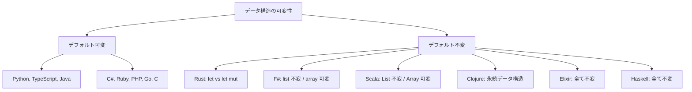

# 第 3 章 配列・コレクション比較

## はじめに

配列やリストは、ほぼすべてのアルゴリズムの基盤となるデータ構造です。本章では、14 言語における配列・コレクションの扱いと、線形探索・二分探索の実装パターンを比較します。

## 配列 / リスト / コレクションの分類

| 言語 | 基本データ構造 | 可変性 | サイズ | 要素型 |
|------|--------------|--------|--------|--------|
| Python | `list` | 可変 | 可変長 | 任意（動的） |
| TypeScript | `Array<T>` | 可変 | 可変長 | 同一型（ジェネリクス） |
| Java | `int[]` / `ArrayList<T>` | 配列: 可変 / List: 可変 | 配列: 固定 / List: 可変 | 同一型 |
| C# | `int[]` / `List<T>` | 可変 | 配列: 固定 / List: 可変 | 同一型 |
| Ruby | `Array` | 可変 | 可変長 | 任意（動的） |
| PHP | `array` | 可変 | 可変長 | 任意（動的） |
| Go | `[N]int` / `[]int`（スライス） | 可変 | 配列: 固定 / スライス: 可変 | 同一型 |
| C | `int arr[N]` | 可変 | 固定長 | 同一型 |
| Rust | `[i32; N]` / `Vec<T>` | `mut` で可変 | 配列: 固定 / Vec: 可変 | 同一型 |
| F# | `list<'T>` / `array<'T>` | リスト: 不変 / 配列: 可変 | リスト: 可変長 | 同一型 |
| Scala | `List[T]` / `Array[T]` | List: 不変 / Array: 可変 | 可変長 | 同一型 |
| Clojure | `vector` `[1 2 3]` | 不変（永続的） | 可変長 | 任意（動的） |
| Elixir | `list` `[1, 2, 3]` | 不変 | 可変長 | 任意（動的） |
| Haskell | `[a]`（リスト） / `Data.Array` | リスト: 不変 / Array: 不変 | 可変長 | 同一型 |

### 不変 vs 可変のアプローチ



## 線形探索の比較

同じ「配列から値を探す」処理が、言語ごとにどう表現されるかを見ます。

### 命令型アプローチ（ループで探索）

**Python**:

```python
def linear_search(a, key):
    for i in range(len(a)):
        if a[i] == key:
            return i
    return -1
```

**Java**:

```java
static int linearSearch(int[] a, int key) {
    for (int i = 0; i < a.length; i++)
        if (a[i] == key) return i;
    return -1;
}
```

**Go**:

```go
func LinearSearch(a []int, key int) int {
    for i, v := range a {
        if v == key { return i }
    }
    return -1
}
```

**C**:

```c
int linear_search(int a[], int n, int key) {
    for (int i = 0; i < n; i++)
        if (a[i] == key) return i;
    return -1;
}
```

**Rust**:

```rust
pub fn linear_search(a: &[i32], key: i32) -> Option<usize> {
    a.iter().position(|&x| x == key)
}
```

### 関数型アプローチ（高階関数で探索）

**F#**:

```fsharp
let linearSearch (a: 'T list) (key: 'T) =
    a |> List.tryFindIndex (fun x -> x = key)
```

**Scala**:

```scala
def linearSearch(a: Array[Int], key: Int): Int =
  a.indexOf(key)
```

**Clojure**:

```clojure
(defn linear-search [a key]
  (.indexOf (vec a) key))
```

**Elixir**:

```elixir
def linear_search(list, key) do
  Enum.find_index(list, &(&1 == key))
end
```

**Haskell**:

```haskell
linearSearch :: Eq a => [a] -> a -> Maybe Int
linearSearch xs key = elemIndex key xs
```

### 戻り値の型安全性

| 言語 | 「見つからない」の表現 | 型安全 |
|------|---------------------|--------|
| Python | `-1` | いいえ（マジックナンバー） |
| TypeScript | `-1` | いいえ |
| Java | `-1` | いいえ |
| C# | `-1` | いいえ |
| Ruby | `nil` | 部分的 |
| PHP | `false` | いいえ |
| Go | `-1` | いいえ |
| C | `-1` | いいえ |
| **Rust** | `None`（`Option<usize>`） | **はい** |
| **F#** | `None`（`option<int>`） | **はい** |
| **Scala** | `-1`（indexOf）/ `None`（find） | 選択可能 |
| Clojure | `-1` | いいえ |
| **Elixir** | `nil` | 部分的 |
| **Haskell** | `Nothing`（`Maybe Int`） | **はい** |

型安全な言語（Rust, F#, Haskell）では、「見つからない」ケースをコンパイル時に強制的にハンドリングさせることができます。

## 二分探索の比較

ソート済み配列に対する二分探索は、言語ごとの配列アクセスとインデックス操作の違いが顕著です。

**Python**:

```python
def binary_search(a, key):
    pl, pr = 0, len(a) - 1
    while pl <= pr:
        pc = (pl + pr) // 2
        if a[pc] == key:
            return pc
        elif a[pc] < key:
            pl = pc + 1
        else:
            pr = pc - 1
    return -1
```

**Rust**:

```rust
pub fn binary_search(a: &[i32], key: i32) -> Option<usize> {
    let (mut lo, mut hi) = (0, a.len() as i32 - 1);
    while lo <= hi {
        let mid = ((lo + hi) / 2) as usize;
        match a[mid].cmp(&key) {
            Ordering::Equal => return Some(mid),
            Ordering::Less => lo = mid as i32 + 1,
            Ordering::Greater => hi = mid as i32 - 1,
        }
    }
    None
}
```

**Haskell**:

```haskell
binarySearch :: Ord a => [a] -> a -> Maybe Int
binarySearch xs target = go 0 (length xs - 1)
  where
    arr = listArray (0, length xs - 1) xs
    go lo hi
      | lo > hi         = Nothing
      | arr ! mid == target = Just mid
      | arr ! mid < target  = go (mid + 1) hi
      | otherwise           = go lo (mid - 1)
      where mid = (lo + hi) `div` 2
```

### 実装スタイルの違い

| アプローチ | 言語 | 特徴 |
|-----------|------|------|
| **while ループ** | Python, TypeScript, Java, C#, PHP, Go, C | 命令型。インデックスを可変変数で管理 |
| **while + match** | Rust | 命令型 + パターンマッチで比較結果を分岐 |
| **再帰** | F#, Haskell | 関数型。ループの代わりに再帰呼び出し |
| **メソッドチェーン** | Scala, Clojure | 標準ライブラリの探索メソッドを活用 |
| **ガード** | Haskell, Elixir | 条件分岐をガード式で表現 |

## ハッシュ法の比較

ハッシュテーブルの実装は、言語ごとのデータ構造設計の違いが最も顕著に現れます。

| 言語 | ハッシュ実装 | 衝突解決 |
|------|-----------|---------|
| Python | `class ChainedHash` + `list` | チェイン法（リスト） |
| TypeScript | `class ChainedHash` + `Array` | チェイン法（配列） |
| Java | `class ChainedHash` + `LinkedList` | チェイン法 |
| C# | `class ChainedHash` + `List<T>` | チェイン法 |
| Ruby | `class ChainedHash` + `Array` | チェイン法 |
| PHP | `class ChainedHash` + `array` | チェイン法 |
| Go | `struct ChainedHash` + slice | チェイン法 |
| C | `struct` + linked list（ポインタ） | チェイン法 |
| Rust | `struct ChainedHash` + `Vec<T>` | チェイン法 |
| F# | `record` / `module` + `list` | チェイン法 |
| Scala | `class ChainedHash` + `Array[Option]` | チェイン法 |
| Clojure | `defn` + `atom` + `vector` | チェイン法 |
| Elixir | `defmodule` + `Map` | チェイン法 |
| Haskell | `IORef` + `Data.Map` | チェイン法 |

## 配列操作のイディオム比較

### 要素のフィルタリング

| 言語 | 偶数のみ抽出 |
|------|------------|
| Python | `[x for x in arr if x % 2 == 0]` |
| TypeScript | `arr.filter(x => x % 2 === 0)` |
| Java | `Arrays.stream(arr).filter(x -> x % 2 == 0).toArray()` |
| C# | `arr.Where(x => x % 2 == 0).ToArray()` |
| Ruby | `arr.select { \|x\| x.even? }` |
| PHP | `array_filter($arr, fn($x) => $x % 2 === 0)` |
| Go | （手動ループ） |
| C | （手動ループ） |
| Rust | `arr.iter().filter(\|&&x\| x % 2 == 0).collect()` |
| F# | `arr \|> List.filter (fun x -> x % 2 = 0)` |
| Scala | `arr.filter(_ % 2 == 0)` |
| Clojure | `(filter even? arr)` |
| Elixir | `Enum.filter(arr, &(rem(&1, 2) == 0))` |
| Haskell | `filter even arr` |

### 簡潔さのスペクトラム

```
冗長                                                    簡潔
 ←─────────────────────────────────────────────────────→
 C    Go    Java    C#    Python  TypeScript  Ruby  Haskell
                    PHP   Rust    Elixir      Scala Clojure
                                              F#
```

## まとめ

- **配列の可変性**: OOP 言語はデフォルト可変、関数型言語はデフォルト不変
- **探索の戻り値**: 型安全な言語（Rust, F#, Haskell）は `Option`/`Maybe` で「見つからない」を表現
- **二分探索**: 命令型は while ループ、関数型は再帰で実装するのが自然
- **高階関数**: `filter`, `map`, `find` などは関数型言語で最も簡潔に書ける
- **C と Go**: 高階関数が限定的で、手動ループが基本
