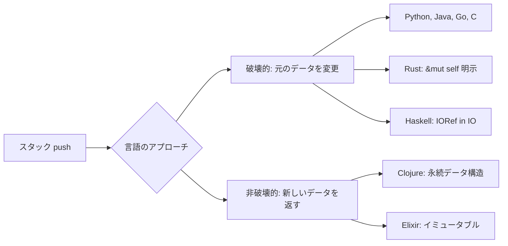

# 第 4 章 データ構造の実装アプローチ比較

## はじめに

スタック・キューは基本的なデータ構造ですが、その実装は言語のパラダイムによって大きく異なります。本章では、クラス・構造体・モジュール・代数的データ型など、言語ごとの設計アプローチを比較します。

## スタックの実装パターン

### パターン 1: クラスベース（OOP 言語）

OOP 言語ではクラスにデータと操作をカプセル化します。

**Python**:

```python
class FixedStack:
    def __init__(self, capacity):
        self.stk = [None] * capacity
        self.ptr = 0
        self.capacity = capacity

    def push(self, value):
        if self.ptr >= self.capacity:
            raise FixedStack.Full
        self.stk[self.ptr] = value
        self.ptr += 1

    def pop(self):
        if self.ptr <= 0:
            raise FixedStack.Empty
        self.ptr -= 1
        return self.stk[self.ptr]
```

**Java**:

```java
public class FixedStack<T> {
    private Object[] stk;
    private int ptr = 0;
    private int capacity;

    public void push(T value) {
        if (ptr >= capacity) throw new OverflowError();
        stk[ptr++] = value;
    }

    public T pop() {
        if (ptr <= 0) throw new EmptyError();
        return (T) stk[--ptr];
    }
}
```

### パターン 2: 構造体 + 関数（手続き型 / システム言語）

**Go**:

```go
type FixedStack struct {
    data     []interface{}
    ptr      int
    capacity int
}

func (s *FixedStack) Push(value interface{}) error {
    if s.ptr >= s.capacity { return ErrOverflow }
    s.data[s.ptr] = value
    s.ptr++
    return nil
}
```

**C**:

```c
typedef struct {
    int data[MAX_SIZE];
    int ptr;
    int capacity;
} Stack;

int stack_push(Stack *s, int value) {
    if (s->ptr >= s->capacity) return -1;
    s->data[s->ptr++] = value;
    return 0;
}
```

**Rust**:

```rust
pub struct FixedStack<T> {
    data: Vec<Option<T>>,
    ptr: usize,
    capacity: usize,
}

impl<T: Clone> FixedStack<T> {
    pub fn push(&mut self, value: T) -> Result<(), &str> {
        if self.ptr >= self.capacity { return Err("Stack overflow"); }
        self.data[self.ptr] = Some(value);
        self.ptr += 1;
        Ok(())
    }
}
```

### パターン 3: モジュール + 関数（関数型言語）

**F#**:

```fsharp
module FixedStack =
    type Stack<'T> = { data: 'T option array; mutable ptr: int; capacity: int }

    let push (stack: Stack<'T>) (value: 'T) =
        if stack.ptr >= stack.capacity then failwith "Stack overflow"
        stack.data.[stack.ptr] <- Some value
        stack.ptr <- stack.ptr + 1
```

**Elixir**:

```elixir
defmodule FixedStack do
  defstruct data: [], capacity: 0

  def push(%FixedStack{data: data, capacity: cap} = stack, value) do
    if length(data) >= cap do
      {:error, :overflow}
    else
      {:ok, %{stack | data: [value | data]}}
    end
  end
end
```

### パターン 4: 代数的データ型 / リスト（純粋関数型）

**Haskell（IORef ベース）**:

```haskell
type Stack a = IORef [a]

newStack :: IO (Stack a)
newStack = newIORef []

push :: a -> Stack a -> IO ()
push x stack = modifyIORef stack (x:)

pop :: Stack a -> IO (Maybe a)
pop stack = do
  xs <- readIORef stack
  case xs of
    []     -> return Nothing
    (x:xs') -> writeIORef stack xs' >> return (Just x)
```

**Clojure（atom ベース）**:

```clojure
(defn new-stack [capacity]
  (atom {:data [] :capacity capacity}))

(defn stack-push [stack value]
  (swap! stack update :data conj value))

(defn stack-pop [stack]
  (let [top (peek (:data @stack))]
    (swap! stack update :data pop)
    top))
```

## 実装アプローチの比較

| アプローチ | 言語 | データ隠蔽 | 可変状態 | エラー処理 |
|-----------|------|-----------|---------|-----------|
| **クラス** | Python, TS, Java, C#, Ruby, PHP | private/public | メソッド内で変更 | 例外 |
| **構造体 + 関数** | Go, C | アクセス修飾子（Go）/ なし（C） | ポインタ経由 | 戻り値（error） |
| **構造体 + impl** | Rust | pub/private | `&mut self` | `Result<T, E>` |
| **モジュール + 型** | F#, Scala | モジュール境界 | mutable 明示 | 例外 / Option |
| **不変データ + IORef** | Haskell | 型で保護 | IO モナド内 | `Maybe` / `Either` |
| **不変データ + atom** | Clojure, Elixir | なし（データ指向） | atom / Agent | 戻り値 |

## キューの実装 — リングバッファ比較

キューは **リングバッファ** で効率的に実装されます。言語ごとのインデックス操作の違いが顕著です。

### リングバッファの折り返し計算

全言語で共通する核心ロジック:

```
rear = (rear + 1) % capacity    // enqueue 時
front = (front + 1) % capacity  // dequeue 時
```

| 言語 | 剰余演算子 | 実装例 |
|------|-----------|--------|
| Python | `%` | `self.rear = (self.rear + 1) % self.capacity` |
| Java | `%` | `rear = (rear + 1) % capacity;` |
| Go | `%` | `q.rear = (q.rear + 1) % q.capacity` |
| Rust | `%` | `self.rear = (self.rear + 1) % self.capacity;` |
| F# | `%` | `queue.rear <- (queue.rear + 1) % queue.capacity` |
| Haskell | `` `mod` `` | `(rear + 1) \`mod\` capacity` |
| Clojure | `mod` | `(mod (inc rear) capacity)` |

## 可変/不変データ構造のアプローチ

### 破壊的操作（in-place）vs 非破壊的操作

| アプローチ | 言語 | push の結果 |
|-----------|------|-----------|
| **破壊的** | Python, TS, Java, C#, Ruby, PHP, Go, C | 元のスタックが変更される |
| **破壊的（明示的）** | Rust | `&mut self` で可変参照を明示 |
| **破壊的（IORef）** | Haskell, F# | IO モナド / mutable 内で変更 |
| **非破壊的** | Clojure, Elixir | 新しいスタックが返される |



### ジェネリクス（型パラメータ）のサポート

| 言語 | スタックの型パラメータ | 記法 |
|------|---------------------|------|
| Python | なし（動的型付き） | `FixedStack` |
| TypeScript | `T` | `FixedStack<T>` |
| Java | `T` | `FixedStack<T>` |
| C# | `T` | `FixedStack<T>` |
| Ruby | なし（動的型付き） | `FixedStack` |
| PHP | なし（動的型付き） | `FixedStack` |
| Go | `T any`（1.18+） | `FixedStack[T any]` |
| C | なし（`void*` / マクロ） | `Stack`（int 固定が多い） |
| Rust | `T` | `FixedStack<T>` |
| F# | `'T` | `Stack<'T>` |
| Scala | `T` | `FixedStack[T]` |
| Clojure | なし（動的型付き） | `(new-stack capacity)` |
| Elixir | なし（動的型付き） | `%FixedStack{}` |
| Haskell | `a` | `Stack a` |

## エラー処理パターン

スタックの overflow/underflow の処理方法は、言語の設計哲学を反映しています。

| パターン | 言語 | 例 |
|---------|------|-----|
| **例外** | Python, Java, C#, Ruby, PHP | `raise OverflowError` / `throw new ...` |
| **戻り値（error）** | Go | `return nil, ErrOverflow` |
| **Result 型** | Rust | `Err("Stack overflow")` |
| **Option/Maybe** | Haskell, F# | `Nothing` / `None` |
| **タプル** | Elixir | `{:error, :overflow}` |
| **nil** | Clojure | `nil`（空スタックの pop） |

## まとめ

- **OOP 言語**: クラスでデータと操作をカプセル化。例外でエラーを通知
- **システム言語（Go, C）**: 構造体 + 関数。エラーは戻り値で返す
- **Rust**: 構造体 + impl。所有権システムと `Result` 型で安全性を保証
- **関数型言語**: モジュール / 代数的データ型。不変データを基本とし、可変状態は明示的に管理
- **Haskell**: 最も厳格。可変状態は `IORef` を通じて IO モナド内でのみ許可
- **Clojure/Elixir**: 不変データ構造を基本とし、状態管理は `atom` / プロセスで行う
