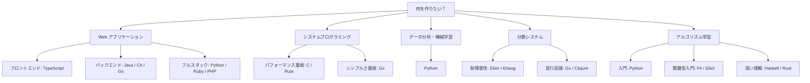
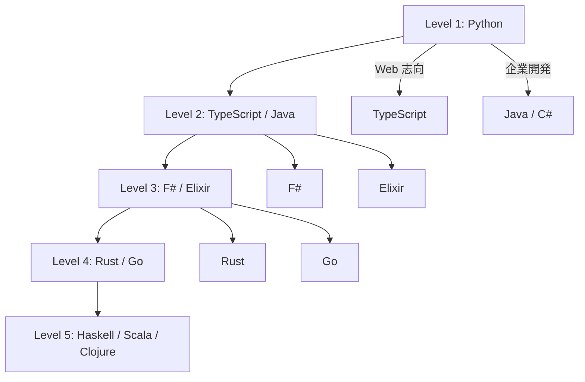

# 第 7 章 総合比較とまとめ

## はじめに

ここまで 14 言語でアルゴリズムとデータ構造を実装し、パラダイム・型システム・メモリ管理・実装スタイルの違いを比較してきました。最終章では、これらの知見を総合し、言語選択の指針と学習ロードマップを提示します。

## 総合評価マトリックス

### 可読性・安全性・パフォーマンス

| 言語 | 可読性 | 型安全性 | メモリ安全性 | パフォーマンス | 学習コスト |
|------|--------|---------|-------------|-------------|-----------|
| Python | ★★★★★ | ★★☆☆☆ | ★★★★☆（GC） | ★★☆☆☆ | ★★★★★ |
| TypeScript | ★★★★☆ | ★★★★☆ | ★★★★☆（GC） | ★★★☆☆ | ★★★★☆ |
| Java | ★★★☆☆ | ★★★★☆ | ★★★★☆（GC） | ★★★★☆ | ★★★☆☆ |
| C# | ★★★★☆ | ★★★★☆ | ★★★★☆（GC） | ★★★★☆ | ★★★☆☆ |
| Ruby | ★★★★★ | ★★☆☆☆ | ★★★★☆（GC） | ★★☆☆☆ | ★★★★☆ |
| PHP | ★★★☆☆ | ★★☆☆☆ | ★★★★☆（GC） | ★★☆☆☆ | ★★★★☆ |
| Go | ★★★★☆ | ★★★☆☆ | ★★★★☆（GC） | ★★★★☆ | ★★★★★ |
| C | ★★★☆☆ | ★☆☆☆☆ | ★☆☆☆☆（手動） | ★★★★★ | ★★☆☆☆ |
| Rust | ★★★☆☆ | ★★★★★ | ★★★★★（所有権） | ★★★★★ | ★★☆☆☆ |
| F# | ★★★★☆ | ★★★★★ | ★★★★☆（GC） | ★★★★☆ | ★★★☆☆ |
| Scala | ★★★★☆ | ★★★★☆ | ★★★★☆（GC） | ★★★★☆ | ★★☆☆☆ |
| Clojure | ★★★☆☆ | ★★☆☆☆ | ★★★★☆（GC） | ★★★☆☆ | ★★☆☆☆ |
| Elixir | ★★★★☆ | ★★☆☆☆ | ★★★★★（BEAM） | ★★★☆☆ | ★★★☆☆ |
| Haskell | ★★★☆☆ | ★★★★★ | ★★★★☆（GC） | ★★★☆☆ | ★☆☆☆☆ |

### アルゴリズム実装の適性

| 観点 | 最適な言語 | 理由 |
|------|-----------|------|
| **学習・プロトタイピング** | Python | シンプルな構文、豊富なライブラリ、対話的実行 |
| **パフォーマンス重視** | C, Rust | ネイティブコンパイル、メモリ制御 |
| **型安全性重視** | Rust, Haskell, F# | コンパイル時の厳格なチェック |
| **簡潔な表現** | Haskell, F#, Scala | パターンマッチ、関数合成、型推論 |
| **並行処理** | Go, Elixir, Clojure | ゴルーチン、BEAM プロセス、STM |
| **企業開発** | Java, C#, TypeScript | エコシステム、ツール、人材 |

## 言語パラダイム別の強み・弱み

### OOP 言語（Python, TypeScript, Java, C#, Ruby, PHP）

**強み**:

- データと操作をクラスに **カプセル化** できる
- 継承・ポリモーフィズムで **コードの再利用** が容易
- **豊富なエコシステム** とコミュニティ

**弱み**:

- 状態の変更が追跡しにくい（**可変性がデフォルト**）
- 並行処理で **共有状態の管理** が複雑
- クラス設計が **過剰に複雑化** しやすい

### システム言語（C, Go, Rust）

**強み**:

- **パフォーマンス** が最も高い
- メモリの **細かな制御** が可能
- Go はシンプルさ、Rust は安全性を追求

**弱み**:

- C は **メモリ安全性** が低い
- Go は **ジェネリクス** が限定的（1.18 で改善）
- Rust は **学習曲線** が急

### 関数型言語（F#, Scala, Clojure, Elixir, Haskell）

**強み**:

- **不変データ** による予測可能性と安全性
- **パターンマッチ** による簡潔な表現
- **並行処理** との親和性が高い

**弱み**:

- **学習コスト** が高い（特に Haskell）
- **可変データ構造** の実装が不自然になる場合がある
- **エコシステム** が OOP 言語に比べて小さい

## 言語選択ガイド

### 用途別おすすめ言語

### 「次に学ぶ言語」の選び方

| 現在の言語 | 次におすすめ | 理由 |
|-----------|------------|------|
| Python | TypeScript | 型安全性を学ぶ。Web 開発にも展開 |
| Java | Scala または Kotlin | 関数型の考え方を JVM 上で学ぶ |
| C# | F# | 同じ .NET 上で関数型を体験 |
| JavaScript | TypeScript → Rust | 型安全性 → メモリ安全性を段階的に |
| C | Rust | メモリ安全性を保ちつつ低レベル制御 |
| Ruby | Elixir | 同じ関数型フレンドリーな文化 |

## 学習ロードマップ

### レベル 1: 基礎（1 言語目）

**Python** から始めることを推奨します。

- シンプルな構文でアルゴリズムの本質に集中できる
- REPL で対話的にテスト・デバッグが可能
- 動的型付きで、型の煩雑さに悩まされない

### レベル 2: 型安全性の理解（2 言語目）

**TypeScript** または **Java** を学びます。

- 静的型付きの恩恵（コンパイル時エラー検出）を体験
- ジェネリクスで型パラメータの概念を学ぶ
- OOP の設計パターンを深める

### レベル 3: 関数型プログラミング入門（3 言語目）

**F#** または **Elixir** を学びます。

- 不変データ・パターンマッチ・パイプライン演算子を体験
- 再帰をループの代替として自然に使う
- 副作用の管理について意識する

### レベル 4: システムプログラミング（4 言語目）

**Rust** または **Go** を学びます。

- メモリ管理の仕組みを理解（所有権 or GC）
- パフォーマンス意識のプログラミング
- 並行処理の実践

### レベル 5: 深い理論的理解（5 言語目以降）

**Haskell** / **Scala** / **Clojure** を学びます。

- 純粋関数型の考え方（Haskell）
- OOP と FP の統合（Scala）
- LISP 系の柔軟性と永続データ構造（Clojure）

## シリーズを通じて学べたこと

### 1. 同じアルゴリズムでも言語で表現が変わる

クイックソートは C では 30 行、Haskell では 3 行。しかしどちらも正しく、同じ計算量で動作します。言語は **思考のツール** であり、異なる言語は異なる **思考方法** を提供します。

### 2. パラダイムを超えて共通するもの

どの言語でも、以下の原則は変わりません:

- **テストを先に書く**（TDD）ことでコードの品質を保証する
- **小さなステップ** で前進する（Red → Green → Refactor）
- **アルゴリズムの計算量** は言語に依存しない

### 3. 言語の設計思想は実装に影響する

- **不変性** を重視する言語はバグが少ないが、一部のデータ構造（双方向リスト）が不自然になる
- **型安全性** を重視する言語はコンパイル時にエラーを検出するが、記述量が増える場合がある
- **シンプルさ** を重視する言語は学びやすいが、大規模開発で限界が見える場合がある

### 4. 多言語を学ぶ価値

複数の言語を学ぶことで:

- **問題を多角的に見る力** が身につく
- **最適なツール（言語）を選ぶ目** が養われる
- **プログラミングの本質** —— つまりアルゴリズムとデータ構造 —— がより深く理解できる

## おわりに

14 言語を通じてアルゴリズムとデータ構造を学ぶ旅は、単なる言語の構文比較ではありません。各言語が体現する **設計思想の違い** を理解し、**問題に最適なアプローチを選ぶ力** を養うことが、このシリーズの本当の目的です。

プログラミング言語は道具です。しかし、よい道具を知ることで、よいソフトウェアを作る力は確実に高まります。

---

## 参考文献

- 『新・明解 Python で学ぶアルゴリズムとデータ構造』 - 柴田望洋
- 『テスト駆動開発』 - Kent Beck
- 『プログラミング言語の基礎概念』 - 五十嵐淳
- 『Seven Languages in Seven Weeks』 - Bruce A. Tate
