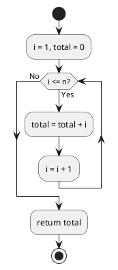

# 第 1 章 基本的なアルゴリズム

## はじめに

基本的なアルゴリズムとして、最大値・中央値の求め方、条件分岐、繰り返し処理を Clojure で TDD 実装します。

### 目次

- [3 値の最大値](#3-値の最大値)
- [3 値の中央値](#3-値の中央値)
- [符号判定](#符号判定)
- [1 から n までの総和](#1-から-n-までの総和)
- [記号文字の交互表示](#記号文字の交互表示)
- [長方形の辺の長さ](#長方形の辺の長さ)
- [九九の表](#九九の表)
- [直角三角形](#直角三角形)

---

## 3 値の最大値

### Red -- 失敗するテストを書く

```clojure
(deftest max3-test
  (testing "3値の最大値"
    (are [a b c expected]
         (= expected (max3 a b c))
      3 2 1 3
      1 2 3 3
      3 3 3 3)))
```

### Green -- テストを通す実装

```clojure
(defn max3
  "3つの整数値の最大値を返す"
  [a b c]
  (max a b c))
```

**計算量**: O(1)

---

## 3 値の中央値

### Red -- 失敗するテストを書く

```clojure
(deftest med3-test
  (testing "3値の中央値"
    (are [a b c expected]
         (= expected (med3 a b c))
      3 2 1 2
      1 2 3 2
      3 3 3 3)))
```

### Green -- テストを通す実装

```clojure
(defn med3
  "3つの整数値の中央値を返す"
  [a b c]
  (let [sorted (sort [a b c])]
    (nth sorted 1)))
```

**計算量**: O(1)

---

## 符号判定

### Red -- 失敗するテストを書く

```clojure
(deftest judge-sign-test
  (testing "符号判定"
    (is (= "その値は正です。" (judge-sign 17)))
    (is (= "その値は負です。" (judge-sign -5)))
    (is (= "その値は0です。" (judge-sign 0)))))
```

### Green -- テストを通す実装

```clojure
(defn judge-sign
  "整数値の符号を判定する"
  [n]
  (cond
    (pos? n) "その値は正です。"
    (neg? n) "その値は負です。"
    :else    "その値は0です。"))
```

---

## 1 から n までの総和

### Red -- 失敗するテストを書く

```clojure
(deftest sum1-to-n-while-test
  (testing "1からnまでの総和（loop/recur版）"
    (is (= 15 (sum1-to-n-while 5)))))

(deftest sum1-to-n-for-test
  (testing "1からnまでの総和（reduce版）"
    (is (= 15 (sum1-to-n-for 5)))))
```

### Green -- テストを通す実装

```clojure
(defn sum1-to-n-while
  "loop/recur で 1 から n までの総和を求める"
  [n]
  (loop [i 1 total 0]
    (if (> i n)
      total
      (recur (inc i) (+ total i)))))

(defn sum1-to-n-for
  "reduce で 1 から n までの総和を求める"
  [n]
  (reduce + (range 1 (inc n))))
```

### フローチャート



**計算量**: O(n)

---

## 記号文字の交互表示

### Green -- テストを通す実装

```clojure
(defn alternative1
  "記号文字 '+' と '-' を交互に表示する（剰余判定方式）"
  [n]
  (apply str (map #(if (even? %) \+ \-) (range n))))

(defn alternative2
  "記号文字 '+' と '-' を交互に表示する（パターン繰り返し方式）"
  [n]
  (let [base (apply str (repeat (quot n 2) "+-"))]
    (if (odd? n) (str base "+") base)))
```

---

## 長方形の辺の長さ

### Green -- テストを通す実装

```clojure
(defn rectangle
  "縦横が整数で面積が area の長方形の辺の長さを列挙する"
  [area]
  (loop [i 1 result ""]
    (if (> (* i i) area)
      result
      (recur (inc i)
             (if (zero? (rem area i))
               (str result i "x" (quot area i) " ")
               result)))))
```

---

## 九九の表

### Green -- テストを通す実装

```clojure
(defn multiplication-table
  "九九の表を返す"
  []
  (let [header (apply str (repeat 27 "-"))
        rows (for [i (range 1 10)]
               (apply str (for [j (range 1 10)]
                            (format "%3d" (* i j)))))]
    (str header "\n"
         (clojure.string/join "\n" rows) "\n"
         header)))
```

---

## 直角三角形

### Green -- テストを通す実装

```clojure
(defn triangle-lb
  "左下側が直角の二等辺三角形を返す"
  [n]
  (apply str (for [i (range 1 (inc n))]
               (str (apply str (repeat i "*")) "\n"))))
```

---

## まとめ

| アルゴリズム | 関数名 | 計算量 | Clojure の特徴 |
|------------|--------|--------|---------------|
| 3 値の最大値 | `max3` | O(1) | 組み込み `max` 関数 |
| 3 値の中央値 | `med3` | O(1) | `sort` + `nth` |
| 符号判定 | `judge-sign` | O(1) | `cond` による分岐 |
| 総和（ループ） | `sum1-to-n-while` | O(n) | `loop/recur` |
| 総和（reduce） | `sum1-to-n-for` | O(n) | `reduce` |
| 交互表示 | `alternative1` | O(n) | `map` + `apply str` |
| 長方形 | `rectangle` | O(sqrt(n)) | `loop/recur` |
| 九九の表 | `multiplication-table` | O(1) | `for` 内包表記 |
| 直角三角形 | `triangle-lb` | O(n^2) | `for` + `repeat` |

## 参考文献

- 『新・明解アルゴリズムとデータ構造』 -- 柴田望洋
- 『テスト駆動開発』 -- Kent Beck
