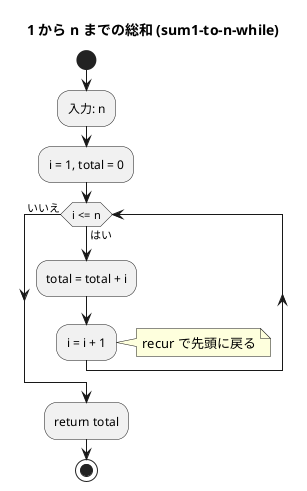

# 第 1 章 基本的なアルゴリズム

## はじめに

この章では、アルゴリズムの基礎として、条件判定、分岐、繰り返し処理を Clojure で TDD 実装します。

アルゴリズムとは、問題を解くための手順や方法のことです。プログラミングにおいては、入力に対して正しい出力を得るための具体的な計算手順を指します。

## 準備

### 環境構築

Clojure の開発環境は nix flake で管理しています。

```bash
nix develop .#clojure
```

### プロジェクト構成

```
apps/clojure/
  src/algorithm/
    basic_algorithms.clj   # 実装
  test/algorithm/
    basic_algorithms_test.clj  # テスト
  project.clj
```

### テスト実行コマンド

```bash
cd apps/clojure
lein test
```

## 1. アルゴリズムとは

アルゴリズムとは、ある問題を解くための明確に定義された有限個の手順です。良いアルゴリズムは以下の特性を持ちます：

- **正当性**: 正しい結果を出力する
- **効率性**: 時間とメモリを効率的に使う
- **明確性**: 手順が曖昧でない

### 目次

1. [3 値の最大値](#2-3-値の最大値)
2. [3 値の中央値](#3-3-値の中央値)
3. [条件判定と分岐](#4-条件判定と分岐)
4. [繰り返し処理](#5-繰り返し処理)
5. [多重ループ](#6-多重ループ)

---

## 2. 3 値の最大値

### Red -- 失敗するテストを書く

```clojure
(deftest max3-test
  (testing "3値の最大値"
    (are [a b c expected]
         (= expected (max3 a b c))
      3 2 1 3
      1 2 3 3
      3 3 3 3
      1 3 2 3
      2 1 3 3
      2 3 1 3)))
```

### Green -- テストを通す最小限の実装

```clojure
(defn max3
  "3つの整数値の最大値を返す"
  [a b c]
  (max a b c))
```

### アルゴリズムの考え方

Clojure の `max` 関数は可変長引数を取り、内部で順に比較を行います。手動で実装する場合：

```clojure
(defn max3-manual [a b c]
  (cond
    (and (>= a b) (>= a c)) a
    (and (>= b a) (>= b c)) b
    :else c))
```

しかし、Clojure では組み込みの `max` を使うのが最もシンプルです。

**計算量**: O(1)

---

## 3. 3 値の中央値

### Red -- 失敗するテストを書く

```clojure
(deftest med3-test
  (testing "3値の中央値"
    (are [a b c expected]
         (= expected (med3 a b c))
      3 2 1 2
      3 1 2 2
      1 2 3 2
      1 3 2 2
      2 1 3 2
      2 3 1 2
      3 3 3 3)))
```

### Green -- テストを通す最小限の実装

```clojure
(defn med3
  "3つの整数値の中央値を返す"
  [a b c]
  (let [sorted (sort [a b c])]
    (nth sorted 1)))
```

### アルゴリズムの考え方

3 つの値をソートして 2 番目の要素を取得します。条件分岐で実装すると複雑になりますが、`sort` + `nth` で簡潔に書けます。

条件分岐で実装する場合、比較の組み合わせが多くなります：

```
a >= b >= c → b が中央値
a >= c >= b → c が中央値
b >= a >= c → a が中央値
... (6 通り)
```

**計算量**: O(1)

---

## 4. 条件判定と分岐

### Red -- 失敗するテストを書く

```clojure
(deftest judge-sign-test
  (testing "符号判定"
    (is (= "その値は正です。" (judge-sign 17)))
    (is (= "その値は負です。" (judge-sign -5)))
    (is (= "その値は0です。" (judge-sign 0)))))
```

### Green -- テストを通す最小限の実装

```clojure
(defn judge-sign
  "整数値の符号を判定する"
  [n]
  (cond
    (pos? n) "その値は正です。"
    (neg? n) "その値は負です。"
    :else    "その値は0です。"))
```

Clojure の `cond` は、Python の `if/elif/else` に対応します。`pos?`、`neg?`、`zero?` などの述語関数が用意されています。

---

## 5. 繰り返し処理

### 5-1. 1 から n までの総和

#### Red -- 失敗するテストを書く

```clojure
(deftest sum1-to-n-while-test
  (testing "1からnまでの総和（loop/recur版）"
    (is (= 15 (sum1-to-n-while 5)))
    (is (= 55 (sum1-to-n-while 10)))))

(deftest sum1-to-n-for-test
  (testing "1からnまでの総和（reduce版）"
    (is (= 15 (sum1-to-n-for 5)))
    (is (= 55 (sum1-to-n-for 10)))))
```

#### Green -- テストを通す実装

```clojure
;; loop/recur 版（命令型スタイル）
(defn sum1-to-n-while [n]
  (loop [i 1 total 0]
    (if (> i n)
      total
      (recur (inc i) (+ total i)))))

;; reduce 版（関数型スタイル）
(defn sum1-to-n-for [n]
  (reduce + (range 1 (inc n))))
```

Clojure では `loop/recur` が命令型の `while` ループに対応し、`reduce` がより関数型のアプローチです。

#### フローチャート



**計算量**: O(n)

### 5-2. 記号文字の交互表示

#### Red -- 失敗するテストを書く

```clojure
(deftest alternative1-test
  (testing "記号文字の交互表示（剰余判定方式）"
    (is (= "+-+-+" (alternative1 5)))
    (is (= "+-+-" (alternative1 4)))
    (is (= "+" (alternative1 1)))))
```

#### Green -- テストを通す実装

```clojure
(defn alternative1
  "記号文字 '+' と '-' を交互に表示する（剰余判定方式）"
  [n]
  (apply str (map #(if (even? %) \+ \-) (range n))))

(defn alternative2
  "記号文字 '+' と '-' を交互に表示する（パターン繰り返し方式）"
  [n]
  (let [base (apply str (repeat (quot n 2) "+-"))]
    (if (odd? n) (str base "+") base)))
```

`map` と `even?` で関数型に実装。`apply str` で文字のシーケンスを文字列に変換します。

### 5-3. 長方形の辺の長さを列挙

#### Red -- 失敗するテストを書く

```clojure
(deftest rectangle-test
  (testing "長方形の辺の長さ"
    (is (clojure.string/includes? (rectangle 12) "1x12"))
    (is (clojure.string/includes? (rectangle 12) "2x6"))
    (is (clojure.string/includes? (rectangle 12) "3x4"))))
```

#### Green -- テストを通す実装

```clojure
(defn rectangle
  "縦横が整数で面積が area の長方形の辺の長さを列挙する"
  [area]
  (loop [i 1 result ""]
    (if (> (* i i) area)
      result
      (recur (inc i)
             (if (zero? (rem area i))
               (str result i "x" (quot area i) " ")
               result)))))
```

**計算量**: O(sqrt(n))

---

## 6. 多重ループ

### 6-1. 九九の表

#### Red -- 失敗するテストを書く

```clojure
(deftest multiplication-table-test
  (testing "九九の表"
    (let [table (multiplication-table)]
      (is (clojure.string/includes? table "1"))
      (is (clojure.string/includes? table "81")))))
```

#### Green -- テストを通す実装

```clojure
(defn multiplication-table []
  (let [header (apply str (repeat 27 "-"))
        rows (for [i (range 1 10)]
               (apply str (for [j (range 1 10)]
                            (format "%3d" (* i j)))))]
    (str header "\n"
         (clojure.string/join "\n" rows) "\n"
         header)))
```

Clojure の `for` はリスト内包表記に相当し、ネストした `for` で二重ループを表現します。

### 6-2. 直角三角形の表示

#### Red -- 失敗するテストを書く

```clojure
(deftest triangle-lb-test
  (testing "直角三角形"
    (is (clojure.string/includes? (triangle-lb 5) "*****"))))
```

#### Green -- テストを通す実装

```clojure
(defn triangle-lb
  "左下側が直角の二等辺三角形を返す"
  [n]
  (apply str (for [i (range 1 (inc n))]
               (str (apply str (repeat i "*")) "\n"))))
```

---

## テスト実行結果

```bash
$ lein test :only algorithm.basic-algorithms-test

lein test algorithm.basic-algorithms-test

Ran 12 tests containing 35 assertions.
0 failures, 0 errors.
```

---

## まとめ

この章では、基本的なアルゴリズムを Clojure で TDD 実装しました：

1. **3 値の最大値** -- 組み込み `max` 関数で 1 行実装
2. **3 値の中央値** -- `sort` + `nth` で簡潔に実装
3. **符号判定** -- `cond` + 述語関数（`pos?`、`neg?`）で分岐
4. **総和** -- `loop/recur`（命令型）と `reduce`（関数型）の 2 つのアプローチ
5. **交互表示** -- `map` + `even?` で関数型に実装
6. **長方形の辺** -- `loop/recur` で sqrt(n) までの探索
7. **九九の表** -- ネストした `for` 内包表記
8. **直角三角形** -- `for` + `repeat` で生成

Clojure では、`loop/recur` による命令型スタイルと、`map`/`reduce`/`for` による関数型スタイルの両方で表現できます。問題の性質に応じて適切なスタイルを選択することが重要です。

次の章では、配列について学んでいきましょう。

## 参考文献

- 『新・明解アルゴリズムとデータ構造』 -- 柴田望洋
- 『テスト駆動開発』 -- Kent Beck
