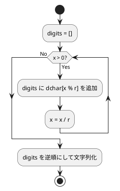

# 第 2 章 配列

## はじめに

配列（vector）の基本操作として、最大値の探索、反転、基数変換、素数列挙を Clojure で TDD 実装します。

### 目次

- [配列の最大値](#配列の最大値)
- [配列の反転](#配列の反転)
- [基数変換](#基数変換)
- [素数列挙](#素数列挙)

---

## 配列の最大値

### Red -- 失敗するテストを書く

```clojure
(deftest max-of-test
  (testing "配列の最大値"
    (is (= 192 (max-of [172 153 192 140 165])))
    (is (= 42 (max-of [42])))
    (is (= 5 (max-of [5 5 5])))))
```

### Green -- テストを通す実装

```clojure
(defn max-of
  "配列の要素の最大値を返す"
  [a]
  (reduce max a))
```

**計算量**: O(n)

---

## 配列の反転

### Red -- 失敗するテストを書く

```clojure
(deftest reverse-arr-test
  (testing "配列の反転"
    (is (= [7 6 9 3 1 5 2] (reverse-arr [2 5 1 3 9 6 7])))))
```

### Green -- テストを通す実装

```clojure
(defn reverse-arr
  "配列を反転した新しい vector を返す"
  [a]
  (vec (rseq (vec a))))
```

**計算量**: O(n)

---

## 基数変換

### Red -- 失敗するテストを書く

```clojure
(deftest card-conv-test
  (testing "基数変換"
    (is (= "11101" (card-conv 29 2)))
    (is (= "FF" (card-conv 255 16)))))
```

### Green -- テストを通す実装

```clojure
(defn card-conv
  "整数値 x を r 進数に変換した文字列を返す"
  [x r]
  (let [dchar "0123456789ABCDEFGHIJKLMNOPQRSTUVWXYZ"]
    (loop [x x digits []]
      (if (zero? x)
        (apply str (reverse digits))
        (recur (quot x r)
               (conj digits (nth dchar (rem x r))))))))
```

### フローチャート



**計算量**: O(log_r(x))

---

## 素数列挙

### Red -- 失敗するテストを書く

```clojure
(deftest prime1-test
  (testing "素数列挙（第1版）"
    (is (= 78022 (prime1 1000)))))

(deftest prime2-test
  (testing "素数列挙（第2版）"
    (is (= 14622 (prime2 1000)))))

(deftest prime3-test
  (testing "素数列挙（第3版）"
    (is (= 3774 (prime3 1000)))))
```

### Green -- テストを通す実装

3 つのバージョンで素数列挙の効率を比較します。

| バージョン | 手法 | 除算回数 |
|-----------|------|---------|
| prime1 | 全数試し割り | 78,022 |
| prime2 | 既知素数のみで割る | 14,622 |
| prime3 | sqrt(n) 最適化 | 3,774 |

---

## まとめ

| アルゴリズム | 関数名 | 計算量 | Clojure の特徴 |
|------------|--------|--------|---------------|
| 最大値 | `max-of` | O(n) | `reduce max` |
| 反転 | `reverse-arr` | O(n) | `rseq` で O(1) 逆順ビュー |
| 基数変換 | `card-conv` | O(log n) | `loop/recur` |
| 素数（v1） | `prime1` | O(n^2) | `loop/recur` |
| 素数（v2） | `prime2` | O(n sqrt(n)) | `int-array` で高速化 |
| 素数（v3） | `prime3` | O(n sqrt(n)/log n) | `int-array` + sqrt 最適化 |

## 参考文献

- 『新・明解アルゴリズムとデータ構造』 -- 柴田望洋
- 『テスト駆動開発』 -- Kent Beck
