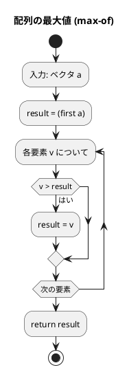
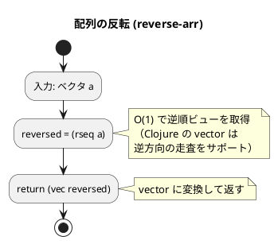
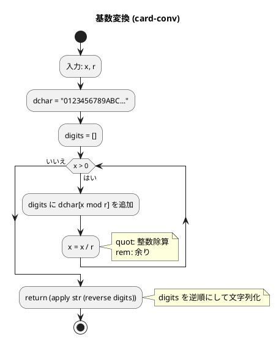
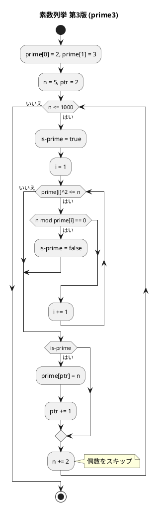

# 第 2 章 配列

## はじめに

前章では基本的なアルゴリズムを学びました。この章では、最も基本的なデータ構造である「配列」を使ったアルゴリズムを TDD で実装します。

配列は、同じ型のデータを連続して格納するデータ構造です。インデックスによる O(1) アクセスが特徴です。

### 目次

1. [データ構造と配列](#1-データ構造と配列)
2. [配列の要素の最大値](#2-配列の要素の最大値)
3. [配列の要素の並びを反転](#3-配列の要素の並びを反転)
4. [基数変換](#4-基数変換)
5. [素数の列挙](#5-素数の列挙)

---

## 1. データ構造と配列

### データ構造とは

データ構造とは、データの集まりを効率的に管理するための仕組みです。適切なデータ構造を選択することで、アルゴリズムの効率が大きく変わります。

### Clojure における配列：vector

Clojure の `vector` は、配列に相当するデータ構造です。イミュータブルで、インデックスによるアクセスが実質 O(1) です。

```clojure
;; vector の生成
[1 2 3 4 5]
(vector 1 2 3 4 5)

;; インデックスアクセス
(nth [10 20 30] 1)      ;=> 20
(get [10 20 30] 1)      ;=> 20
([10 20 30] 1)          ;=> 20

;; 末尾に追加
(conj [1 2 3] 4)        ;=> [1 2 3 4]

;; 走査
(map inc [1 2 3])        ;=> (2 3 4)
(filter odd? [1 2 3 4])  ;=> (1 3)
(reduce + [1 2 3 4])     ;=> 10

;; インデックス付き走査
(map-indexed vector [10 20 30])  ;=> ([0 10] [1 20] [2 30])
```

---

## 2. 配列の要素の最大値

### Red -- 失敗するテストを書く

```clojure
(deftest max-of-test
  (testing "配列の最大値"
    (is (= 192 (max-of [172 153 192 140 165])))
    (is (= 42 (max-of [42])))
    (is (= 5 (max-of [5 5 5])))))
```

### Green -- テストを通す最小限の実装

```clojure
(defn max-of
  "配列の要素の最大値を返す"
  [a]
  (reduce max a))
```

### アルゴリズムの考え方

`reduce max` は、配列の先頭から順に要素を比較し、その時点での最大値を保持しながら走査します。

```
reduce max [172 153 192 140 165]
→ max(172, 153) = 172
→ max(172, 192) = 192
→ max(192, 140) = 192
→ max(192, 165) = 192
→ 結果: 192
```



**計算量**: O(n)

---

## 3. 配列の要素の並びを反転

### Red -- 失敗するテストを書く

```clojure
(deftest reverse-arr-test
  (testing "配列の反転"
    (is (= [7 6 9 3 1 5 2] (reverse-arr [2 5 1 3 9 6 7])))
    (is (= [4 3 2 1] (reverse-arr [1 2 3 4])))
    (is (= [42] (reverse-arr [42])))))
```

### Green -- テストを通す最小限の実装

```clojure
(defn reverse-arr
  "配列を反転した新しい vector を返す"
  [a]
  (vec (rseq (vec a))))
```

### アルゴリズムの考え方

Clojure の `rseq` は vector に対して O(1) で逆順ビュー（lazy sequence）を返します。`vec` で vector に変換します。

#### フローチャート



**計算量**: O(n)（vec による実体化）

---

## 4. 基数変換

10 進数を任意の基数（2 進、8 進、16 進など）に変換します。

### Red -- 失敗するテストを書く

```clojure
(deftest card-conv-test
  (testing "基数変換"
    (is (= "11101" (card-conv 29 2)))
    (is (= "35" (card-conv 29 8)))
    (is (= "FF" (card-conv 255 16)))))
```

### Green -- テストを通す最小限の実装

```clojure
(defn card-conv
  "整数値 x を r 進数に変換した文字列を返す"
  [x r]
  (let [dchar "0123456789ABCDEFGHIJKLMNOPQRSTUVWXYZ"]
    (loop [x x digits []]
      (if (zero? x)
        (apply str (reverse digits))
        (recur (quot x r)
               (conj digits (nth dchar (rem x r))))))))
```

### アルゴリズムの考え方

x を r で割り続け、余りを逆順に並べることで r 進数表現を得ます。

```
29 を 2 進数に変換:
29 / 2 = 14 余り 1
14 / 2 =  7 余り 0
 7 / 2 =  3 余り 1
 3 / 2 =  1 余り 1
 1 / 2 =  0 余り 1
→ 逆順に並べて: "11101"
```

### フローチャート



**計算量**: O(log_r(x))

---

## 5. 素数の列挙

1000 以下の素数を列挙するアルゴリズムを、3 つのバージョンで効率を比較します。除算回数を返すことで、各バージョンの効率を定量的に評価します。

### Red -- 失敗するテストを書く

```clojure
(deftest prime1-test
  (testing "素数列挙（第1版）"
    (is (= 78022 (prime1 1000)))))

(deftest prime2-test
  (testing "素数列挙（第2版）"
    (is (= 14622 (prime2 1000)))))

(deftest prime3-test
  (testing "素数列挙（第3版）"
    (is (= 3774 (prime3 1000)))))
```

### Green -- テストを通す実装（3 バージョン）

#### 第 1 版：素直な実装

2 から n-1 までのすべての数で試し割りを行います。

```clojure
(defn prime1 [x]
  (loop [n 2 counter 0]
    (if (> n x)
      counter
      (let [c (loop [i 2 cnt 0]
                (if (>= i n)
                  cnt
                  (let [new-cnt (inc cnt)]
                    (if (zero? (rem n i))
                      new-cnt
                      (recur (inc i) new-cnt)))))]
        (recur (inc n) (+ counter c))))))
```

#### 第 2 版：既知の素数のみで割る

既に見つかった素数のみで試し割りを行います。`int-array` で素数リストを管理します。

```clojure
(defn prime2 [x]
  (let [prime (int-array 500)]
    (aset prime 0 2)
    (loop [n 3 ptr 1 counter 0]
      (if (> n x)
        counter
        (let [[is-prime c]
              (loop [i 1 cnt 0]
                (if (>= i ptr)
                  [true cnt]
                  (let [new-cnt (inc cnt)]
                    (if (zero? (rem n (aget prime i)))
                      [false new-cnt]
                      (recur (inc i) new-cnt)))))]
          (when is-prime
            (aset prime ptr (int n)))
          (recur (+ n 2)
                 (if is-prime (inc ptr) ptr)
                 (+ counter c)))))))
```

#### 第 3 版：平方根以下のみ確認

素数 p の 2 乗が n を超えたら、それ以上の割り算は不要です。

```clojure
(defn prime3 [x]
  (let [prime (int-array 500)]
    (aset prime 0 2)
    (aset prime 1 3)
    (loop [n 5 ptr 2 counter 0]
      (if (> n 1000)
        counter
        (let [[is-prime c]
              (loop [i 1 cnt 0]
                (let [p (aget prime i)]
                  (if (> (* p p) n)
                    [true (inc cnt)]
                    (let [new-cnt (+ cnt 2)]
                      (if (zero? (rem n p))
                        [false new-cnt]
                        (recur (inc i) new-cnt))))))]
          (when is-prime
            (aset prime ptr (int n)))
          (recur (+ n 2)
                 (if is-prime (inc ptr) ptr)
                 (+ counter c)))))))
```

### 効率の比較

| バージョン | 手法 | 除算回数 |
|-----------|------|---------|
| prime1 | 全数試し割り | 78,022 |
| prime2 | 既知素数のみで割る | 14,622 |
| prime3 | sqrt(n) 最適化 | 3,774 |

### フローチャート（第 3 版）



---

## テスト実行結果

```bash
$ lein test :only algorithm.arrays-test

lein test algorithm.arrays-test

Ran 6 tests containing 9 assertions.
0 failures, 0 errors.
```

---

## まとめ

この章では、配列（vector）を使った基本的なアルゴリズムを Clojure で TDD 実装しました：

1. **最大値** -- `reduce max` で 1 行実装。配列の全要素を走査
2. **反転** -- `rseq` で O(1) 逆順ビューを取得、`vec` で実体化
3. **基数変換** -- `loop/recur` で割り算を繰り返し、余りを逆順に結合
4. **素数列挙** -- 3 バージョンで効率を比較。`int-array` で Java 配列を使い高速化

Clojure の `reduce`、`rseq`、`frequencies` などの高階関数により、多くの配列操作が簡潔に書けます。また、パフォーマンスが重要な場合は `int-array` で Java 配列を直接操作することも可能です。

次の章では、探索アルゴリズムについて学んでいきましょう。

## 参考文献

- 『新・明解アルゴリズムとデータ構造』 -- 柴田望洋
- 『テスト駆動開発』 -- Kent Beck
