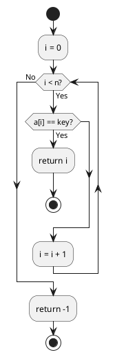
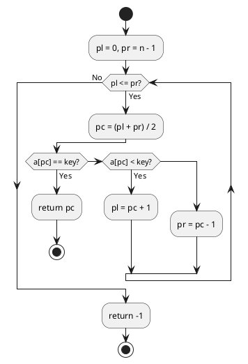

# 第 3 章 探索アルゴリズム

## はじめに

線形探索、番兵法、二分探索、ハッシュ法を Clojure で TDD 実装します。

### 目次

- [線形探索](#線形探索)
- [番兵法](#番兵法)
- [二分探索](#二分探索)
- [ハッシュ法（チェイン法）](#ハッシュ法チェイン法)

---

## 線形探索

### Red -- 失敗するテストを書く

```clojure
(deftest seq-search-test
  (testing "線形探索"
    (is (= 3 (seq-search [6 4 3 2 1 2 8] 2)))
    (is (= -1 (seq-search [1 2 3] 99)))))
```

### Green -- テストを通す実装

```clojure
(defn seq-search
  "線形探索: 配列 a から key-val と等しい要素のインデックスを返す"
  [a key-val]
  (loop [i 0]
    (cond
      (>= i (count a)) -1
      (= (nth a i) key-val) i
      :else (recur (inc i)))))
```

### フローチャート



**計算量**: O(n)

---

## 番兵法

### Green -- テストを通す実装

```clojure
(defn seq-search-ex
  "番兵法: 配列の末尾に番兵を追加して線形探索する"
  [a key-val]
  (let [a-with-sentinel (conj (vec a) key-val)
        n (count a)]
    (loop [i 0]
      (if (= (nth a-with-sentinel i) key-val)
        (if (= i n) -1 i)
        (recur (inc i))))))
```

**計算量**: O(n)

---

## 二分探索

### Red -- 失敗するテストを書く

```clojure
(deftest bin-search-test
  (testing "二分探索"
    (is (= 3 (bin-search [1 2 3 5 7 8 9] 5)))
    (is (= -1 (bin-search [1 2 3 5 7 8 9] 4)))))
```

### Green -- テストを通す実装

```clojure
(defn bin-search
  "二分探索: ソート済み配列 a から key-val のインデックスを返す"
  [a key-val]
  (loop [pl 0 pr (dec (count a))]
    (if (> pl pr)
      -1
      (let [pc (quot (+ pl pr) 2)
            v (nth a pc)]
        (cond
          (= v key-val) pc
          (< v key-val) (recur (inc pc) pr)
          :else (recur pl (dec pc)))))))
```

### フローチャート



**計算量**: O(log n)

---

## ハッシュ法（チェイン法）

### Red -- 失敗するテストを書く

```clojure
(deftest chained-hash-test
  (testing "チェイン法ハッシュ"
    (let [h (make-chained-hash 13)]
      (hash-add h 1 "赤尾")
      (is (= "赤尾" (hash-search h 1)))
      (is (nil? (hash-search h 100))))))
```

### Green -- テストを通す実装

```clojure
(defn make-chained-hash [capacity]
  (atom {:capacity capacity
         :table (vec (repeat capacity nil))}))
```

`atom` でハッシュテーブルの状態を管理し、`hash-add`・`hash-search`・`hash-remove` で操作します。

**計算量**: 平均 O(1)、最悪 O(n)

---

## まとめ

| アルゴリズム | 関数名 | 計算量 | Clojure の特徴 |
|------------|--------|--------|---------------|
| 線形探索 | `seq-search` | O(n) | `loop/recur` |
| 番兵法 | `seq-search-ex` | O(n) | `conj` で番兵追加 |
| 二分探索 | `bin-search` | O(log n) | `loop/recur` |
| ハッシュ法 | `make-chained-hash` | O(1) 平均 | `atom` + `vector` |

## 参考文献

- 『新・明解アルゴリズムとデータ構造』 -- 柴田望洋
- 『テスト駆動開発』 -- Kent Beck
