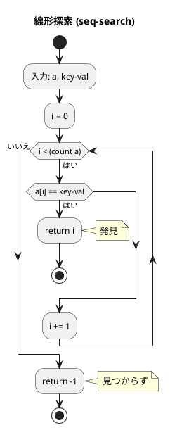
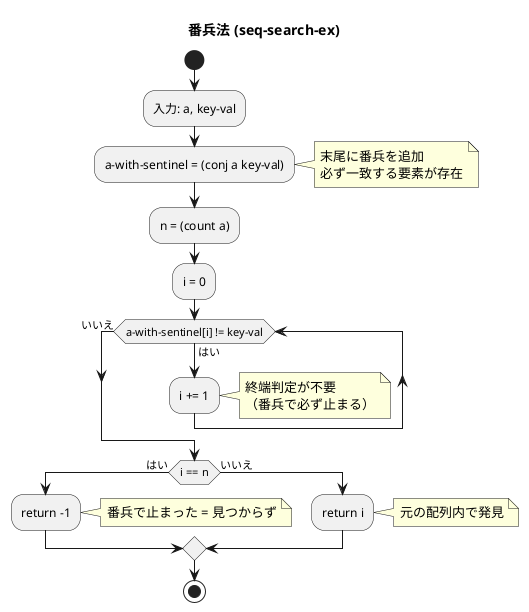
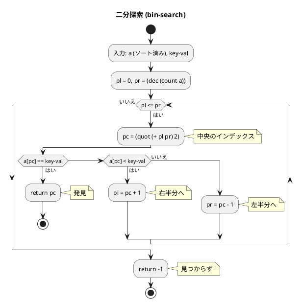

# 第 3 章 探索アルゴリズム

## はじめに

前章では配列の基本操作を学びました。この章では、データの中から特定の要素を見つけ出す「探索アルゴリズム」を TDD で実装します。

探索は、あらゆるプログラムで頻繁に使われる基本的な操作です。データの性質や量に応じて、適切な探索アルゴリズムを選択することが重要です。

### 目次

1. [探索アルゴリズムとは](#探索アルゴリズムとは)
2. [線形探索](#1-線形探索)
3. [二分探索](#2-二分探索)
4. [ハッシュ法](#3-ハッシュ法)

---

## 探索アルゴリズムとは

探索とは、データの集まりの中から特定の条件を満たす要素を見つけ出す操作です。主な探索アルゴリズムには以下のものがあります：

- **線形探索**: 先頭から順に比較する（O(n)）
- **二分探索**: ソート済みデータを半分に絞り込む（O(log n)）
- **ハッシュ法**: ハッシュ関数で位置を計算する（平均 O(1)）

---

## 1. 線形探索

配列の先頭から末尾に向かって順に探索します。最も単純なアルゴリズムです。

### Red -- 失敗するテストを書く

```clojure
(deftest seq-search-test
  (testing "線形探索"
    (is (= 3 (seq-search [6 4 3 2 1 2 8] 2)))
    (is (= -1 (seq-search [1 2 3] 99)))))
```

### Green -- テストを通す実装

```clojure
(defn seq-search
  "線形探索: 配列 a から key-val と等しい要素のインデックスを返す"
  [a key-val]
  (loop [i 0]
    (cond
      (>= i (count a)) -1
      (= (nth a i) key-val) i
      :else (recur (inc i)))))
```

### フローチャート



**計算量**: O(n)

### 番兵法

線形探索の改良版です。配列の末尾に探索する値（番兵）を追加することで、ループ内の終端判定を省略できます。

```clojure
(defn seq-search-ex
  "番兵法: 配列 a の末尾に番兵を追加して線形探索する"
  [a key-val]
  (let [a-with-sentinel (conj (vec a) key-val)
        n (count a)]
    (loop [i 0]
      (if (= (nth a-with-sentinel i) key-val)
        (if (= i n) -1 i)
        (recur (inc i))))))
```

### 番兵法の解説

通常の線形探索では、ループの各反復で「インデックスが範囲内か」と「値が一致するか」の 2 つの条件を判定します。番兵法では、配列の末尾に探索値を追加することで、値の比較だけでループを制御できます。



**計算量**: O(n)（ただし定数係数が小さい）

---

## 2. 二分探索

ソート済みの配列に対して、探索範囲を半分に絞り込みながら探索します。

### Red -- 失敗するテストを書く

```clojure
(deftest bin-search-test
  (testing "二分探索"
    (is (= 3 (bin-search [1 2 3 5 7 8 9] 5)))
    (is (= -1 (bin-search [1 2 3 5 7 8 9] 4)))))
```

### Green -- テストを通す実装

```clojure
(defn bin-search
  "二分探索: ソート済み配列 a から key-val のインデックスを返す"
  [a key-val]
  (loop [pl 0 pr (dec (count a))]
    (if (> pl pr)
      -1
      (let [pc (quot (+ pl pr) 2)
            v (nth a pc)]
        (cond
          (= v key-val) pc
          (< v key-val) (recur (inc pc) pr)
          :else (recur pl (dec pc)))))))
```

### アルゴリズムの考え方

二分探索は、ソート済み配列の中央要素と探索キーを比較し、探索範囲を半分に絞り込みます。

```
配列: [1 2 3 5 7 8 9]  探索キー: 5

Step 1: pl=0, pr=6, pc=3 → a[3]=5 == 5 → 発見!
```

```
配列: [1 2 3 5 7 8 9]  探索キー: 8

Step 1: pl=0, pr=6, pc=3 → a[3]=5 < 8 → 右半分へ
Step 2: pl=4, pr=6, pc=5 → a[5]=8 == 8 → 発見!
```

### フローチャート



### 解説

**計算量**: O(log n)

二分探索は、毎回探索範囲を半分に絞り込むため、n 個の要素に対して最大 log2(n) 回の比較で結果が得られます。ただし、配列が事前にソートされている必要があります。

`loop/recur` による末尾再帰で実装しているため、スタックオーバーフローの心配はありません。

---

## 3. ハッシュ法

ハッシュ関数を使ってキーから格納位置を直接計算する手法です。平均 O(1) で探索できます。

### チェイン法

同じハッシュ値を持つ要素をリスト（チェイン）で管理する方法です。

#### Red -- 失敗するテストを書く

```clojure
(deftest chained-hash-test
  (testing "チェイン法ハッシュ"
    (let [h (make-chained-hash 13)]
      (hash-add h 1 "赤尾")
      (hash-add h 14 "山田")  ;; 1 と同じハッシュ値（衝突）
      (is (= "赤尾" (hash-search h 1)))
      (is (= "山田" (hash-search h 14)))
      (is (nil? (hash-search h 100))))))
```

#### Green -- テストを通す実装

```clojure
(defn make-chained-hash [capacity]
  (atom {:capacity capacity
         :table (vec (repeat capacity nil))}))

(defn- hash-value [capacity key-val]
  (if (integer? key-val)
    (mod key-val capacity)
    (mod (Math/abs (.hashCode (str key-val))) capacity)))

(defn hash-search [h key-val]
  (let [{:keys [capacity table]} @h
        idx (hash-value capacity key-val)]
    (loop [chain (nth table idx)]
      (cond
        (nil? chain) nil
        (= (:key (first chain)) key-val) (:value (first chain))
        :else (recur (next chain))))))

(defn hash-add [h key-val value]
  (if (some? (hash-search h key-val))
    false
    (let [{:keys [capacity table]} @h
          idx (hash-value capacity key-val)
          chain (nth table idx)
          new-chain (cons {:key key-val :value value} chain)]
      (swap! h assoc :table (assoc table idx new-chain))
      true)))

(defn hash-remove [h key-val]
  (let [{:keys [capacity table]} @h
        idx (hash-value capacity key-val)
        chain (nth table idx)
        new-chain (remove #(= (:key %) key-val) chain)]
    (if (= (count chain) (count new-chain))
      false
      (do
        (swap! h assoc :table (assoc table idx (seq new-chain)))
        true))))
```

### 解説

**計算量**: 探索・追加・削除ともに平均 O(1)、最悪 O(n)

チェイン法では、ハッシュ値が衝突した場合にリストで管理します。Clojure の `cons` でリストの先頭に追加し、`remove` で要素を削除します。

`atom` でハッシュテーブルの状態を管理し、`swap!` で安全に更新します。

---

## テスト実行結果

```bash
$ lein test :only algorithm.search-algorithms-test

lein test algorithm.search-algorithms-test

Ran 4 tests containing 14 assertions.
0 failures, 0 errors.
```

---

## 探索アルゴリズムの比較

| アルゴリズム | 計算量 | 前提条件 | 特徴 |
|-------------|--------|----------|------|
| 線形探索 | O(n) | なし | 最も単純、未ソートデータ向け |
| 番兵法 | O(n) | なし | 線形探索の定数倍改善 |
| 二分探索 | O(log n) | ソート済み | 大規模データに有効 |
| ハッシュ法 | O(1) 平均 | ハッシュテーブル | 最速だがメモリ使用量大 |

## まとめ

この章では、探索アルゴリズムを Clojure で TDD 実装しました：

1. **線形探索** -- `loop/recur` で先頭から順に走査。最も単純だが O(n)
2. **番兵法** -- `conj` で末尾に番兵を追加、終端判定を省略
3. **二分探索** -- `loop/recur` で探索範囲を半分に絞り込み。O(log n) だがソート済みが前提
4. **ハッシュ法（チェイン法）** -- `atom` + `vector` + `cons` で平均 O(1) の探索を実現

データの特性（ソート済みか、サイズ、更新頻度）に応じて適切なアルゴリズムを選択することが重要です。

次の章では、スタックとキューについて学んでいきましょう。

## 参考文献

- 『新・明解アルゴリズムとデータ構造』 -- 柴田望洋
- 『テスト駆動開発』 -- Kent Beck
