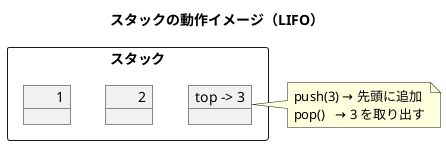
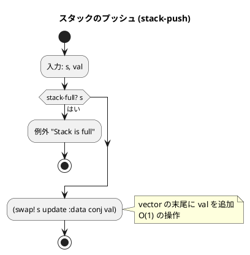
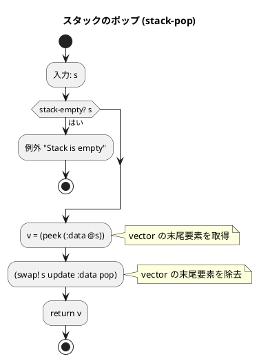
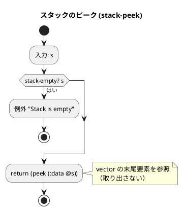
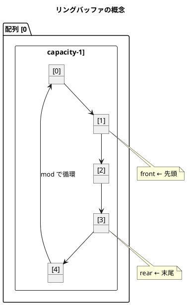
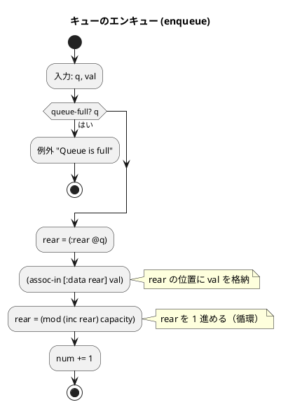
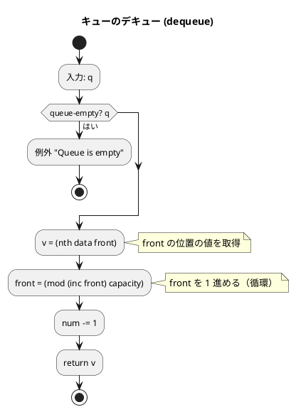
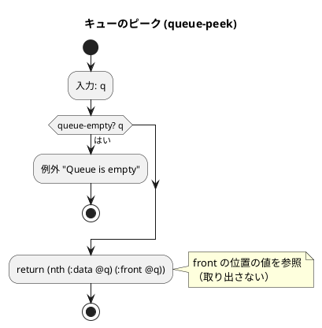

# 第 4 章 スタックとキュー

## はじめに

前章では探索アルゴリズムを学びました。この章では、データを一時的に蓄えるための基本的なデータ構造である「スタック」と「キュー」を TDD で実装します。

スタックとキューは、多くのアルゴリズムやシステムの基盤となる重要なデータ構造です。Clojure では `atom` を使って状態を管理します。

### 目次

1. [スタック](#1-スタック)
2. [キュー（リングバッファ）](#2-キューリングバッファ)

---

## 1. スタック

スタックは LIFO（Last In, First Out: 後入れ先出し）のデータ構造です。最後に追加された要素が最初に取り出されます。

スタックの操作：
- **push**: スタックの先頭に要素を追加
- **pop**: スタックの先頭から要素を取り出す
- **peek**: スタックの先頭要素を参照（取り出さない）

### Red -- 失敗するテストを書く

```clojure
(deftest stack-test
  (testing "スタックの初期状態"
    (let [s (make-stack 64)]
      (is (true? (stack-empty? s)))
      (is (false? (stack-full? s)))))

  (testing "push と peek"
    (let [s (make-stack 64)]
      (stack-push s 1)
      (is (= 1 (stack-peek s)))))

  (testing "push と pop"
    (let [s (make-stack 64)]
      (stack-push s 1)
      (is (= 1 (stack-pop s)))))

  (testing "LIFO 順序"
    (let [s (make-stack 64)]
      (stack-push s 1)
      (stack-push s 2)
      (stack-push s 3)
      (is (= 3 (stack-pop s)))
      (is (= 2 (stack-pop s)))
      (is (= 1 (stack-pop s)))))

  (testing "満杯判定"
    (let [s (make-stack 3)]
      (stack-push s 1)
      (stack-push s 2)
      (stack-push s 3)
      (is (true? (stack-full? s)))))

  (testing "空のスタックから pop で例外"
    (let [s (make-stack 64)]
      (is (thrown? Exception (stack-pop s)))))

  (testing "満杯のスタックに push で例外"
    (let [s (make-stack 2)]
      (stack-push s 1)
      (stack-push s 2)
      (is (thrown? Exception (stack-push s 3))))))
```

### Green -- テストを通す実装

```clojure
(defn make-stack [capacity]
  (atom {:data [] :max capacity}))

(defn stack-empty? [s]
  (empty? (:data @s)))

(defn stack-full? [s]
  (>= (count (:data @s)) (:max @s)))

(defn stack-push [s val]
  (if (stack-full? s)
    (throw (Exception. "Stack is full"))
    (swap! s update :data conj val)))

(defn stack-pop [s]
  (if (stack-empty? s)
    (throw (Exception. "Stack is empty"))
    (let [v (peek (:data @s))]
      (swap! s update :data pop)
      v)))

(defn stack-peek [s]
  (if (stack-empty? s)
    (throw (Exception. "Stack is empty"))
    (peek (:data @s))))
```

Clojure の `vector` は末尾の `conj`・`peek`・`pop` がすべて O(1) なので、スタックとして自然に使えます。

### アルゴリズムの考え方



### フローチャート

#### スタックのプッシュ操作



#### スタックのポップ操作



#### スタックのピーク操作



### 解説

**計算量**: push O(1)、pop O(1)、peek O(1)

Clojure の `vector` は永続データ構造であり、末尾への追加・参照・除去がすべて実質 O(1) で行えます。`atom` + `swap!` で安全に状態を更新できるため、スタックの実装が非常にシンプルになります。

---

## 2. キュー（リングバッファ）

キューは FIFO（First In, First Out: 先入れ先出し）のデータ構造です。最初に追加された要素が最初に取り出されます。

キューの操作：
- **enqueue**: キューの末尾に要素を追加
- **dequeue**: キューの先頭から要素を取り出す
- **peek**: キューの先頭要素を参照（取り出さない）

### リングバッファとは

リングバッファは、固定長の配列を環状に使用するデータ構造です。`front` と `rear` のポインタを `mod` で循環させることで、配列の先頭と末尾が繋がったように動作します。



### Red -- 失敗するテストを書く

```clojure
(deftest queue-test
  (testing "キューの初期状態"
    (let [q (make-queue 64)]
      (is (true? (queue-empty? q)))
      (is (false? (queue-full? q)))))

  (testing "enqueue と dequeue"
    (let [q (make-queue 64)]
      (enqueue q 1)
      (is (= 1 (dequeue q)))))

  (testing "FIFO 順序"
    (let [q (make-queue 64)]
      (enqueue q 1)
      (enqueue q 2)
      (enqueue q 3)
      (is (= 1 (dequeue q)))
      (is (= 2 (dequeue q)))
      (is (= 3 (dequeue q)))))

  (testing "peek"
    (let [q (make-queue 64)]
      (enqueue q 10)
      (enqueue q 20)
      (is (= 10 (queue-peek q)))))

  (testing "満杯判定"
    (let [q (make-queue 3)]
      (enqueue q 1)
      (enqueue q 2)
      (enqueue q 3)
      (is (true? (queue-full? q)))))

  (testing "空のキューから dequeue で例外"
    (let [q (make-queue 64)]
      (is (thrown? Exception (dequeue q)))))

  (testing "リングバッファの折り返し"
    (let [q (make-queue 3)]
      (enqueue q 1)
      (enqueue q 2)
      (enqueue q 3)
      (dequeue q)
      (enqueue q 4)
      (is (= 2 (dequeue q)))
      (is (= 3 (dequeue q)))
      (is (= 4 (dequeue q))))))
```

### Green -- テストを通す実装

```clojure
(defn make-queue [capacity]
  (atom {:data (vec (repeat capacity nil))
         :capacity capacity
         :front 0 :rear 0 :num 0}))

(defn queue-empty? [q]
  (zero? (:num @q)))

(defn queue-full? [q]
  (>= (:num @q) (:capacity @q)))

(defn enqueue [q val]
  (if (queue-full? q)
    (throw (Exception. "Queue is full"))
    (let [{:keys [rear capacity]} @q]
      (swap! q (fn [state]
                 (-> state
                     (assoc-in [:data rear] val)
                     (assoc :rear (mod (inc rear) capacity))
                     (update :num inc)))))))

(defn dequeue [q]
  (if (queue-empty? q)
    (throw (Exception. "Queue is empty"))
    (let [{:keys [front capacity data]} @q
          v (nth data front)]
      (swap! q (fn [state]
                 (-> state
                     (assoc :front (mod (inc front) capacity))
                     (update :num dec))))
      v)))

(defn queue-peek [q]
  (if (queue-empty? q)
    (throw (Exception. "Queue is empty"))
    (nth (:data @q) (:front @q))))
```

### フローチャート

#### キューのエンキュー操作



#### キューのデキュー操作



#### キューのピーク操作



### 解説

**計算量**: enqueue O(1)、dequeue O(1)、peek O(1)

リングバッファ方式により、enqueue も dequeue も O(1) で動作します。`mod` を使って `front` と `rear` を循環させることで、配列の再配置が不要です。

Clojure の `atom` + スレッドセーフな `swap!` で、並行環境でも安全にキューを操作できます。

---

## テスト実行結果

```bash
$ lein test :only algorithm.stacks-and-queues-test

lein test algorithm.stacks-and-queues-test

Ran 2 tests containing 22 assertions.
0 failures, 0 errors.
```

---

## スタックとキューの比較

| 項目 | スタック (LIFO) | キュー (FIFO) |
|------|----------------|---------------|
| 追加操作 | push（先頭に追加） | enqueue（末尾に追加） |
| 取得操作 | pop（先頭から取得） | dequeue（先頭から取得） |
| 参照操作 | peek（先頭を参照） | peek（先頭を参照） |
| 計算量 | すべて O(1) | すべて O(1) |
| 用途 | 関数呼び出し、括弧の対応、Undo | タスクキュー、BFS、バッファ |
| Clojure 実装 | `vector` の末尾操作 | リングバッファ + `mod` |

## まとめ

この章では、スタックとキューを Clojure で TDD 実装しました：

1. **スタック** -- `atom` + `vector` で LIFO を実現。Clojure の `vector` は末尾の `conj`・`peek`・`pop` がすべて O(1) なので、スタックとして自然に使える
2. **キュー** -- `atom` + リングバッファで FIFO を実現。`mod` による循環で固定長配列を効率的に利用

両方とも `atom` の `swap!` で安全に状態を管理しており、Clojure の並行性サポートとの相性が良い設計です。

次の章では、再帰アルゴリズムについて学んでいきましょう。

## 参考文献

- 『新・明解アルゴリズムとデータ構造』 -- 柴田望洋
- 『テスト駆動開発』 -- Kent Beck
