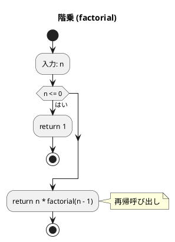
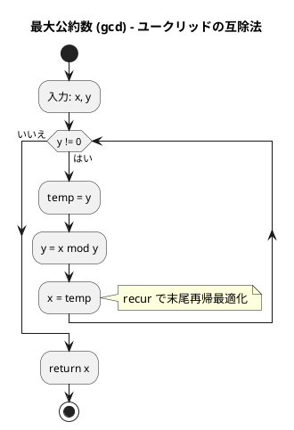
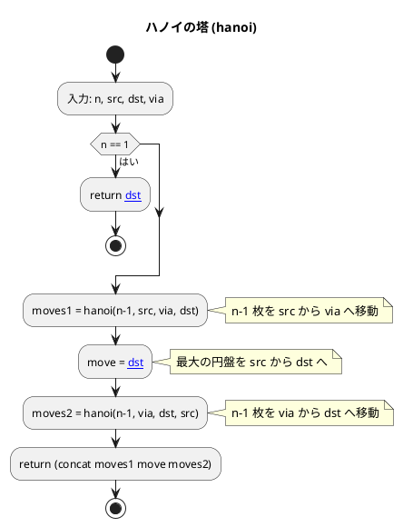
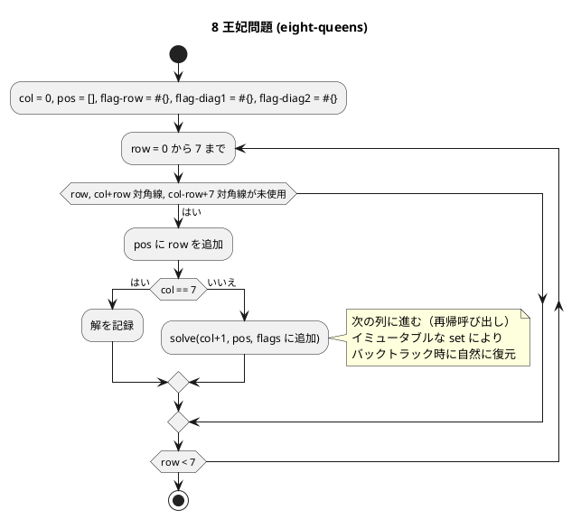
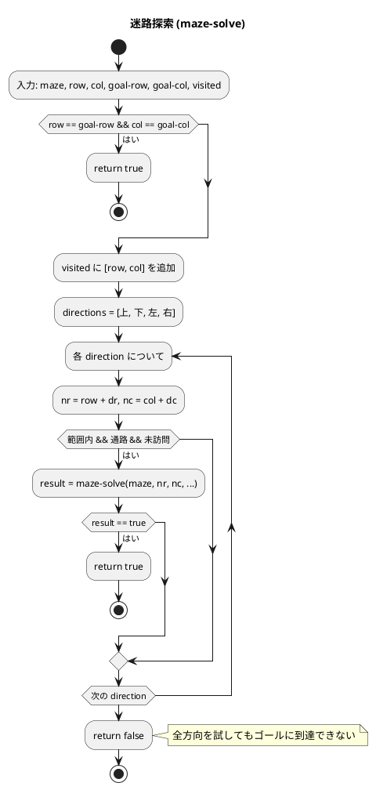

# 第 5 章 再帰アルゴリズム

## はじめに

前章ではスタックとキューを学びました。この章では、関数が自分自身を呼び出す「再帰」を使ったアルゴリズムを TDD で実装します。

再帰は、問題を同じ構造の小さな部分問題に分割して解く強力な手法です。Clojure は関数型言語として再帰と相性が良く、`recur` による末尾再帰最適化や、イミュータブルデータ構造によるバックトラッキングの自然な表現が可能です。

### 目次

1. [階乗](#1-階乗)
2. [最大公約数（ユークリッドの互除法）](#2-最大公約数ユークリッドの互除法)
3. [ハノイの塔](#3-ハノイの塔)
4. [再帰アルゴリズムの解析](#4-再帰アルゴリズムの解析)
5. [8 王妃問題](#5-8-王妃問題)
6. [迷路探索（バックトラッキング）](#6-迷路探索バックトラッキング)

---

## 1. 階乗

n! = n x (n-1) x ... x 1 を再帰的に計算します。

### Red -- 失敗するテストを書く

```clojure
(deftest factorial-test
  (testing "階乗"
    (is (= 1 (factorial 0)))
    (is (= 1 (factorial 1)))
    (is (= 120 (factorial 5)))
    (is (= 3628800 (factorial 10)))))
```

### Green -- テストを通す実装

```clojure
(defn factorial [n]
  (if (<= n 0) 1 (* n (factorial (dec n)))))
```

### フローチャート



#### 再帰呼び出しの展開

```
factorial(5)
= 5 * factorial(4)
= 5 * 4 * factorial(3)
= 5 * 4 * 3 * factorial(2)
= 5 * 4 * 3 * 2 * factorial(1)
= 5 * 4 * 3 * 2 * 1
= 120
```

### 解説

**計算量**: O(n)

この実装は通常の再帰（非末尾再帰）です。Clojure では JVM 上で動作するため、通常の再帰はスタックフレームを消費します。大きな n に対しては末尾再帰版を使うべきです。

---

## 2. 最大公約数（ユークリッドの互除法）

2 つの整数の最大公約数を、ユークリッドの互除法で求めます。

### Red -- 失敗するテストを書く

```clojure
(deftest gcd-test
  (testing "最大公約数"
    (is (= 2 (gcd 22 8)))
    (is (= 4 (gcd 12 4)))
    (is (= 1 (gcd 7 11)))
    (is (= 15 (gcd 15 15)))))
```

### Green -- テストを通す実装

```clojure
(defn gcd [x y]
  (if (zero? y) x (recur y (mod x y))))
```

`recur` を使うことで末尾再帰最適化が行われ、スタックオーバーフローを防ぎます。

### フローチャート



### 解説

**計算量**: O(log(min(x, y)))

ユークリッドの互除法は、`x mod y` で余りを求めることで、問題のサイズが急速に縮小します。`recur` による末尾再帰最適化で、事実上のループとして実行されます。

---

## 3. ハノイの塔

n 枚の円盤を、3 本の柱を使って移動させる問題です。

ルール：
- 一度に 1 枚の円盤しか移動できない
- 大きい円盤の上に小さい円盤しか置けない

### Red -- 失敗するテストを書く

```clojure
(deftest hanoi-test
  (testing "ハノイの塔"
    (is (= [["A" "C"]] (hanoi 1 "A" "C" "B")))
    (is (= [["A" "B"] ["A" "C"] ["B" "C"]] (hanoi 2 "A" "C" "B")))
    (is (= 7 (count (hanoi 3 "A" "C" "B"))))
    (doseq [n (range 1 6)]
      (is (= (int (dec (Math/pow 2 n))) (count (hanoi n "A" "C" "B")))))))
```

### Green -- テストを通す実装

```clojure
(defn hanoi [n src dst via]
  (if (= n 1)
    [[src dst]]
    (concat (hanoi (dec n) src via dst)
            [[src dst]]
            (hanoi (dec n) via dst src))))
```

### フローチャート



### 解説

**計算量**: O(2^n)

ハノイの塔の移動回数は 2^n - 1 回です。Clojure の `concat` はレイジーシーケンスを返すため、大きな n でもメモリ効率が良くなります。

---

## 4. 再帰アルゴリズムの解析

### 真に再帰的な関数

再帰呼び出しの結果に対して更に計算を行う関数は「真に再帰的」です。階乗がその例です：

```clojure
(defn recursive-sum [n]
  (if (<= n 0) 0 (+ n (recursive-sum (dec n)))))
```

### 末尾再帰の除去

Clojure では `recur` で末尾再帰を最適化できます。階乗の末尾再帰版：

```clojure
;; 通常の再帰
(defn factorial [n]
  (if (<= n 0) 1 (* n (factorial (dec n)))))

;; 末尾再帰（recur 使用）
(defn factorial-tail [n]
  (loop [i n acc 1]
    (if (<= i 0) acc (recur (dec i) (* acc i)))))
```

`loop/recur` により、再帰がループに変換され、スタックフレームを消費しません。これは Clojure が JVM 上で動作し、JVM が末尾呼び出し最適化をサポートしないことへの対策です。

---

## 5. 8 王妃問題

8x8 のチェス盤上に 8 個の王妃を互いに攻撃できないように配置する問題です。王妃は、同じ行、同じ列、同じ対角線上にある他の王妃を攻撃できます。

バックトラッキング（試行錯誤）と再帰を使って解きます。

### Red -- 失敗するテストを書く

```clojure
(deftest eight-queens-test
  (testing "8 王妃問題の解の数"
    (is (= 92 (count (eight-queens)))))
  (testing "各解は 8 要素のベクタ"
    (is (every? #(= 8 (count %)) (eight-queens))))
  (testing "各解で行の重複がない"
    (is (every? #(= 8 (count (set %))) (eight-queens)))))
```

### Green -- テストを通す実装

Clojure のイミュータブルな `set` をフラグとして使い、バックトラック時に自然に状態が復元されます。

```clojure
(defn eight-queens []
  (let [results (atom [])]
    (letfn [(solve [col pos flag-row flag-diag1 flag-diag2]
              (if (= col 8)
                (swap! results conj (vec pos))
                (doseq [row (range 8)]
                  (when (and (not (flag-row row))
                             (not (flag-diag1 (+ col row)))
                             (not (flag-diag2 (+ (- col row) 7))))
                    (solve (inc col)
                           (conj pos row)
                           (conj flag-row row)
                           (conj flag-diag1 (+ col row))
                           (conj flag-diag2 (+ (- col row) 7)))))))]
      (solve 0 [] #{} #{} #{}))
    @results))
```

### フローチャート



### 解説

Python 版ではミュータブルな配列でフラグを管理し、明示的にフラグの設定と解除（バックトラック）を行います。Clojure 版ではイミュータブルな `set` を使うため、再帰呼び出しから戻ると自動的に以前の状態に復元されます。これは Clojure のイミュータブルデータ構造の大きな利点です。

8 王妃問題の解は 92 個あります。各解は `[col0-row col1-row ... col7-row]` の形式で、各列に配置された王妃の行番号を表します。

---

## 6. 迷路探索（バックトラッキング）

再帰的バックトラッキングで迷路を解きます。行き止まりに達したら戻り、別の経路を試みます。

### Red -- 失敗するテストを書く

```clojure
(deftest maze-solve-test
  (testing "迷路探索"
    (let [solvable [[1 1 1 1 1]
                    [1 0 0 0 1]
                    [1 0 1 0 1]
                    [1 0 0 0 1]
                    [1 1 1 1 1]]
          unsolvable [[1 1 1 1 1]
                      [1 0 1 0 1]
                      [1 1 1 1 1]
                      [1 0 0 0 1]
                      [1 1 1 1 1]]]
      (is (true? (maze-solve solvable 1 1 3 3)))
      (is (false? (maze-solve unsolvable 1 1 3 1))))))
```

### Green -- テストを通す実装

```clojure
(defn maze-solve
  ([maze row col goal-row goal-col]
   (maze-solve maze row col goal-row goal-col #{}))
  ([maze row col goal-row goal-col visited]
   (if (and (= row goal-row) (= col goal-col))
     true
     (let [rows (count maze)
           cols (count (first maze))
           visited (conj visited [row col])
           directions [[-1 0] [1 0] [0 -1] [0 1]]]
       (boolean
        (some (fn [[dr dc]]
                (let [nr (+ row dr)
                      nc (+ col dc)]
                  (when (and (<= 0 nr (dec rows))
                             (<= 0 nc (dec cols))
                             (zero? (get-in maze [nr nc]))
                             (not (contains? visited [nr nc])))
                    (maze-solve maze nr nc goal-row goal-col visited))))
              directions))))))
```

Clojure の不変 `set` を `visited` として渡すことで、バックトラック時に自然に状態が復元されます。Python 版では明示的に visited の追加と削除を行う必要がありますが、Clojure では不要です。

### フローチャート



### 解説

**計算量**: O(V + E)（V: 通路のセル数、E: 隣接関係の数）

迷路探索は深さ優先探索（DFS）の一種です。`some` 関数を使うことで、最初に解が見つかった時点で探索を打ち切ります。

---

## テスト実行結果

```bash
$ lein test :only algorithm.recursion-test

lein test algorithm.recursion-test

Ran 6 tests containing 24 assertions.
0 failures, 0 errors.
```

---

## 再帰アルゴリズムの比較

| アルゴリズム | 関数名 | 計算量 | Clojure の特徴 |
|------------|--------|--------|---------------|
| 階乗 | `factorial` | O(n) | 通常の再帰 |
| GCD | `gcd` | O(log n) | `recur` で末尾再帰最適化 |
| ハノイの塔 | `hanoi` | O(2^n) | `concat` でレイジーシーケンス結合 |
| 8 王妃問題 | `eight-queens` | -- | イミュータブル `set` でバックトラック |
| 迷路探索 | `maze-solve` | O(V + E) | 不変 `set` + `some` |

## まとめ

この章では、再帰アルゴリズムを Clojure で TDD 実装しました：

1. **階乗** -- 基本的な再帰の例。通常の再帰と末尾再帰（`loop/recur`）の違い
2. **最大公約数** -- `recur` による末尾再帰最適化でスタックオーバーフローを防止
3. **ハノイの塔** -- `concat` によるレイジーシーケンスの結合
4. **8 王妃問題** -- イミュータブルな `set` でフラグを管理し、バックトラック時の状態復元が自動化
5. **迷路探索** -- 不変 `set` + `some` で深さ優先探索を実現

Clojure の特徴であるイミュータブルデータ構造は、バックトラッキングを使う再帰アルゴリズムで特に威力を発揮します。状態の保存と復元が自動的に行われるため、バグの入り込む余地が少なくなります。

次の章では、ソートアルゴリズムについて学んでいきましょう。

## 参考文献

- 『新・明解アルゴリズムとデータ構造』 -- 柴田望洋
- 『テスト駆動開発』 -- Kent Beck
