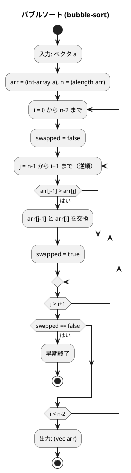
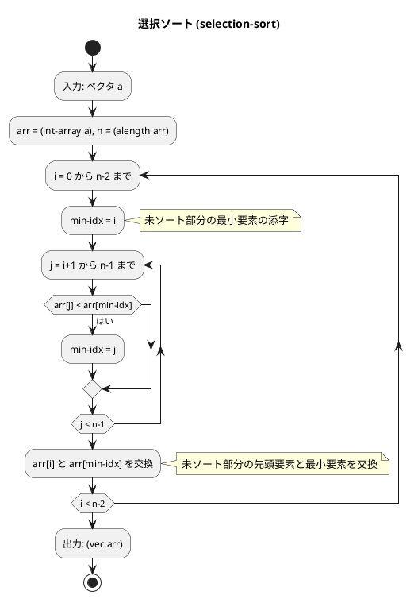
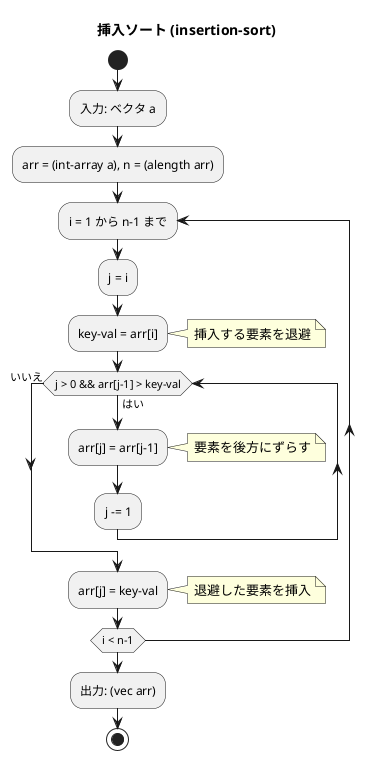
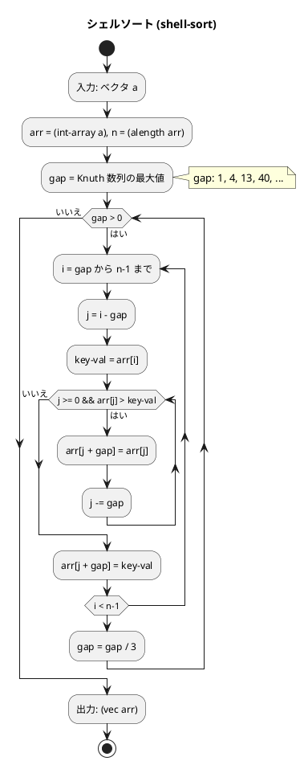
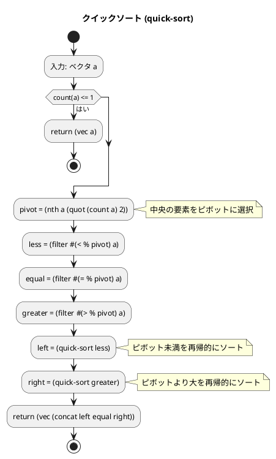
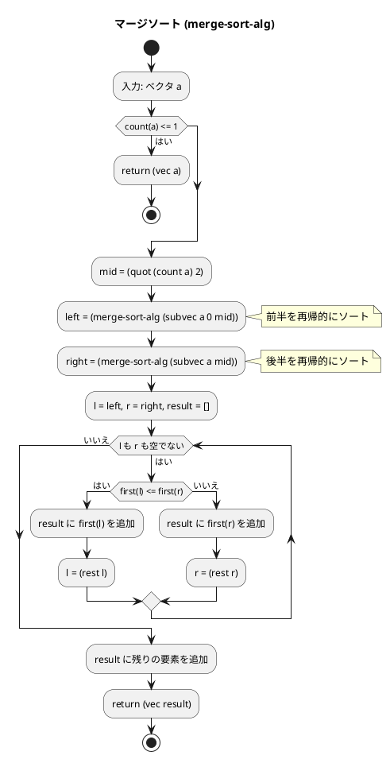

# 第 6 章 ソートアルゴリズム

## はじめに

前章では再帰アルゴリズムを学びました。この章では、データを特定の順序に並べ替える「ソートアルゴリズム」を TDD で実装します。

ソートは、コンピュータサイエンスにおける最も基本的かつ重要な操作の一つです。データが整列されていると、検索や他の操作が効率的に行えるようになります。様々なソートアルゴリズムが存在し、それぞれに長所と短所があります。

Clojure ではイミュータブルなデータ構造が基本ですが、パフォーマンスが重要な場合は Java 配列（`int-array`）を使った in-place 操作も可能です。この章では両方のアプローチを示します。

### 目次

1. [ソートとは](#ソートとは)
2. [バブルソート](#1-バブルソート)
3. [選択ソート](#2-選択ソート)
4. [挿入ソート](#3-挿入ソート)
5. [シェルソート](#4-シェルソート)
6. [クイックソート](#5-クイックソート)
7. [マージソート](#6-マージソート)
8. [ヒープソート](#7-ヒープソート)
9. [度数ソート](#8-度数ソート)

---

## ソートとは

ソートとは、データを特定の順序（通常は昇順または降順）に並べ替える操作です。ソートアルゴリズムは、以下のような特性によって評価されます：

- **時間計算量**: アルゴリズムの実行に必要な時間
- **空間計算量**: アルゴリズムが使用するメモリ量
- **安定性**: 同じ値を持つ要素の相対的な順序が保存されるか
- **適応性**: 既にある程度ソートされているデータに対する効率性

Clojure では `sort` 関数が標準で用意されていますが、ここではアルゴリズムの理解のために自前で実装します。

---

## 1. バブルソート

隣接する要素を比較・交換し、最大値を末尾へ「浮き上がらせる」アルゴリズムです。

### Red -- 失敗するテストを書く

```clojure
(def unsorted [6 4 3 7 1 9 8])
(def sorted-expected [1 3 4 6 7 8 9])

(deftest bubble-sort-test
  (testing "バブルソート"
    (is (= sorted-expected (bubble-sort unsorted)))
    (is (= sorted-expected (bubble-sort sorted-expected)))
    (is (= [42] (bubble-sort [42])))
    (is (= [] (bubble-sort [])))
    (is (= [1 1 2 3 3] (bubble-sort [3 1 2 1 3])))))
```

### Green -- テストを通す実装

`int-array` を使って Java 配列上で in-place 操作し、結果を `vec` で返します。交換が発生しなかった場合は早期終了する最適化を含みます。

```clojure
(defn bubble-sort
  "バブルソート（交換なし検出で早期終了）"
  [a]
  (let [arr (int-array a)
        n (alength arr)]
    (loop [i 0]
      (if (>= i (dec n))
        (vec arr)
        (let [swapped (loop [j (dec n) sw false]
                        (if (<= j i)
                          sw
                          (if (> (aget arr (dec j)) (aget arr j))
                            (let [tmp (aget arr (dec j))]
                              (aset arr (dec j) (aget arr j))
                              (aset arr j tmp)
                              (recur (dec j) true))
                            (recur (dec j) sw))))]
          (if (not swapped)
            (vec arr)
            (recur (inc i))))))))
```

### フローチャート



アルゴリズムの流れ：
1. 入力ベクタを Java 配列に変換します
2. 外側ループで i を 0 から n-2 まで繰り返します
3. 内側ループで j を n-1 から i+1 まで逆順に走査し、隣接要素を比較・交換します
4. 1 パスで交換が発生しなければ、配列は整列済みなので早期終了します
5. 結果を Clojure ベクタに変換して返します

### 解説

**計算量**: 最悪 O(n^2)、最良 O(n)（整列済みの場合、早期終了により）

バブルソートは単純で理解しやすいですが、大きなデータセットに対しては非効率です。Clojure の `loop/recur` は末尾再帰最適化されるため、スタックオーバーフローの心配はありません。

---

## 2. 選択ソート

未整列部分の最小値を探し、先頭と交換するアルゴリズムです。

### Red -- 失敗するテストを書く

```clojure
(deftest selection-sort-test
  (testing "選択ソート"
    (is (= sorted-expected (selection-sort unsorted)))
    (is (= sorted-expected (selection-sort sorted-expected)))
    (is (= [1 1 2 3 3] (selection-sort [3 1 2 1 3])))))
```

### Green -- テストを通す実装

```clojure
(defn selection-sort
  "選択ソート"
  [a]
  (let [arr (int-array a)
        n (alength arr)]
    (loop [i 0]
      (if (>= i (dec n))
        (vec arr)
        (let [min-idx (loop [j (inc i) mi i]
                        (if (>= j n)
                          mi
                          (recur (inc j)
                                 (if (< (aget arr j) (aget arr mi)) j mi))))]
          (when (not= min-idx i)
            (let [tmp (aget arr i)]
              (aset arr i (aget arr min-idx))
              (aset arr min-idx tmp)))
          (recur (inc i)))))))
```

### フローチャート



アルゴリズムの流れ：
1. 各パスで未整列部分から最小値のインデックスを見つけます
2. 最小値を未整列部分の先頭と交換します
3. 各パスで最大 1 回の交換しか行われません

### 解説

**計算量**: 常に O(n^2)（整列済みでも改善されない）

バブルソートと比較すると、交換回数が少ないという利点があります。

---

## 3. 挿入ソート

未整列部分の先頭要素を、整列済み部分の適切な位置に挿入するアルゴリズムです。トランプのカードを手に持って並べ替える操作に似ています。

### Red -- 失敗するテストを書く

```clojure
(deftest insertion-sort-test
  (testing "挿入ソート"
    (is (= sorted-expected (insertion-sort unsorted)))
    (is (= sorted-expected (insertion-sort sorted-expected)))
    (is (= [1 1 2 3 3] (insertion-sort [3 1 2 1 3])))))
```

### Green -- テストを通す実装

```clojure
(defn insertion-sort
  "挿入ソート"
  [a]
  (let [arr (int-array a)
        n (alength arr)]
    (loop [i 1]
      (if (>= i n)
        (vec arr)
        (let [key-val (aget arr i)]
          (loop [j (dec i)]
            (if (and (>= j 0) (> (aget arr j) key-val))
              (do (aset arr (inc j) (aget arr j))
                  (recur (dec j)))
              (aset arr (inc j) key-val)))
          (recur (inc i)))))))
```

### フローチャート



アルゴリズムの流れ：
1. 配列のインデックス 1 から開始します
2. 現在の要素（`key-val`）を退避します
3. 整列済み部分を後方から走査し、`key-val` より大きい要素を 1 つずつ後方にずらします
4. 空いた位置に `key-val` を挿入します

### 解説

**計算量**: 最悪 O(n^2)、最良 O(n)（整列済みの場合）

挿入ソートは、小さなデータセットや、ほぼソート済みのデータに対して効率的です。安定なソートアルゴリズムです。

---

## 4. シェルソート

挿入ソートの改良版。間隔（gap）を縮小しながら複数回の挿入ソートを行います。離れた要素同士を先に比較・交換することで、大きな値を素早く後方に、小さな値を素早く前方に移動させます。

### Red -- 失敗するテストを書く

```clojure
(deftest shell-sort-test
  (testing "シェルソート"
    (is (= sorted-expected (shell-sort unsorted)))
    (is (= sorted-expected (shell-sort sorted-expected)))
    (is (= [1 1 2 3 3] (shell-sort [3 1 2 1 3])))))
```

### Green -- テストを通す実装

Knuth 数列（1, 4, 13, 40, ...）で gap を決定します。

```clojure
(defn shell-sort
  "シェルソート（Knuth 数列使用）"
  [a]
  (let [arr (int-array a)
        n (alength arr)]
    (loop [gap (loop [g 1]
                 (if (< (* g 3 (+ 1)) n)
                   (recur (+ (* g 3) 1))
                   g))]
      (if (<= gap 0)
        (vec arr)
        (do
          (loop [i gap]
            (when (< i n)
              (let [key-val (aget arr i)]
                (loop [j (- i gap)]
                  (if (and (>= j 0) (> (aget arr j) key-val))
                    (do (aset arr (+ j gap) (aget arr j))
                        (recur (- j gap)))
                    (aset arr (+ j gap) key-val))))
              (recur (inc i))))
          (recur (quot gap 3)))))))
```

### フローチャート



アルゴリズムの流れ：
1. Knuth 数列で初期 gap を決定します
2. gap ごとに挿入ソートを行います
3. gap を 1/3 に縮小しながら繰り返します
4. 最終的に gap = 1 で通常の挿入ソートを行いますが、その時点で配列はほぼ整列済みです

### 解説

**計算量**: O(n^(3/2))（Knuth 数列の場合）

シェルソートの性能は gap 数列の選び方に大きく依存します。Knuth 数列は実用的に良い性能を示します。

---

## 5. クイックソート

ピボットを基準に配列を 3 分割（ピボット未満、ピボットと等しい、ピボットより大きい）し、再帰的にソートします。「分割統治法」に基づく効率的なソートアルゴリズムです。

### Red -- 失敗するテストを書く

```clojure
(deftest quick-sort-test
  (testing "クイックソート"
    (is (= sorted-expected (quick-sort unsorted)))
    (is (= sorted-expected (quick-sort sorted-expected)))
    (is (= [1] (quick-sort [1])))
    (is (= [1 1 2 3 3] (quick-sort [3 1 2 1 3])))))
```

### Green -- テストを通す実装

Clojure らしい純粋関数型の実装です。`filter` を使ってピボットより小さい要素、等しい要素、大きい要素に分割し、再帰的にソートして結合します。

```clojure
(defn quick-sort
  "クイックソート（純粋関数型）"
  [a]
  (if (<= (count a) 1)
    (vec a)
    (let [pivot (nth a (quot (count a) 2))
          less   (filter #(< % pivot) a)
          equal  (filter #(= % pivot) a)
          greater (filter #(> % pivot) a)]
      (vec (concat (quick-sort less) equal (quick-sort greater))))))
```

### フローチャート



アルゴリズムの流れ：
1. 要素数が 1 以下ならそのまま返します
2. 中央の要素をピボットとして選択します
3. `filter` でピボット未満、等しい、超過の 3 グループに分割します
4. ピボット未満と超過のグループを再帰的にソートします
5. ソート結果を `concat` で結合します

この実装は Python 版の in-place 実装とは異なり、Clojure のイミュータブルデータ構造を活かした純粋関数型のアプローチです。新しいシーケンスを生成するため追加メモリが必要ですが、コードが簡潔で理解しやすくなります。

### 解説

**計算量**: 平均 O(n log n)、最悪 O(n^2)

Clojure の `filter` はレイジーシーケンスを返すため、メモリ効率は比較的良好です。ただし、毎回 3 つの `filter` を走査するオーバーヘッドがあります。

---

## 6. マージソート

配列を半分に分割し、再帰的にソートして結合します。「分割統治法」に基づくもう一つの効率的なソートアルゴリズムです。

### Red -- 失敗するテストを書く

```clojure
(deftest merge-sort-test
  (testing "マージソート"
    (is (= sorted-expected (merge-sort-alg unsorted)))
    (is (= sorted-expected (merge-sort-alg sorted-expected)))
    (is (= [5] (merge-sort-alg [5])))
    (is (= [] (merge-sort-alg [])))
    (is (= [1 1 2 3 3] (merge-sort-alg [3 1 2 1 3])))))
```

### Green -- テストを通す実装

`loop/recur` を使ったマージ処理で、2 つのソート済みベクタを効率的に結合します。

```clojure
(defn merge-sort-alg
  "マージソート（純粋関数型）"
  [a]
  (if (<= (count a) 1)
    (vec a)
    (let [mid   (quot (count a) 2)
          left  (merge-sort-alg (subvec (vec a) 0 mid))
          right (merge-sort-alg (subvec (vec a) mid))]
      (vec (loop [l left r right result []]
             (cond
               (empty? l) (into result r)
               (empty? r) (into result l)
               (<= (first l) (first r))
               (recur (rest l) r (conj result (first l)))
               :else
               (recur l (rest r) (conj result (first r)))))))))
```

### フローチャート



アルゴリズムの流れ：
1. 要素数が 1 以下ならそのまま返します
2. 配列を中央で 2 分割します
3. 前半と後半をそれぞれ再帰的にソートします
4. 2 つのソート済みベクタを `loop/recur` でマージします
   - 両方に要素がある間、先頭要素を比較して小さい方を結果に追加
   - 片方が空になったら、残りの要素をすべて追加

### 解説

**計算量**: 常に O(n log n)

マージソートは、どのような入力に対しても安定した性能を発揮する安定なソートアルゴリズムです。Clojure の `subvec` は O(1) で部分ベクタを作成できるため、分割操作が効率的です。

---

## 7. ヒープソート

ヒープデータ構造を利用したソートアルゴリズムです。ヒープは、親ノードが子ノードよりも大きい（最大ヒープ）という性質を持つ完全二分木です。

### Red -- 失敗するテストを書く

```clojure
(deftest heap-sort-test
  (testing "ヒープソート"
    (is (= sorted-expected (heap-sort unsorted)))
    (is (= sorted-expected (heap-sort sorted-expected)))
    (is (= [42] (heap-sort [42])))
    (is (= [] (heap-sort [])))
    (is (= [1 1 2 3 3] (heap-sort [3 1 2 1 3])))))
```

### Green -- テストを通す実装

`int-array` を使った in-place ヒープソートです。`down-heap` 関数でヒープ性質を維持します。

```clojure
(defn heap-sort
  "ヒープソート"
  [a]
  (if (empty? a)
    []
    (let [arr (int-array a)
          n (alength arr)
          down-heap (fn [^ints arr left right]
                      (let [temp (aget arr left)]
                        (loop [parent left]
                          (if (>= parent (quot (inc right) 2))
                            (aset arr parent temp)
                            (let [cl (inc (* parent 2))
                                  cr (inc cl)
                                  child (if (and (<= cr right)
                                                 (> (aget arr cr) (aget arr cl)))
                                          cr cl)]
                              (if (>= temp (aget arr child))
                                (aset arr parent temp)
                                (do (aset arr parent (aget arr child))
                                    (recur child))))))))]
      ;; ヒープ構築
      (loop [i (quot (dec n) 2)]
        (when (>= i 0)
          (down-heap arr i (dec n))
          (recur (dec i))))
      ;; ソート
      (loop [i (dec n)]
        (when (> i 0)
          (let [tmp (aget arr 0)]
            (aset arr 0 (aget arr i))
            (aset arr i tmp))
          (down-heap arr 0 (dec i))
          (recur (dec i))))
      (vec arr))))
```

### 解説

**計算量**: 常に O(n log n)

ヒープソートは、追加のメモリ空間を必要としないという利点があります。ただし不安定なソートです。`down-heap` は `loop/recur` で末尾再帰最適化されています。

---

## 8. 度数ソート

度数ソート（カウンティングソート）は、要素の値の範囲が限られている場合に効率的なソートアルゴリズムです。要素同士の比較を行わず、各値の出現回数をカウントしてソートを実現します。

### Red -- 失敗するテストを書く

```clojure
(deftest counting-sort-test
  (testing "度数ソート"
    (is (= [5 11 22 32 68 70 120] (counting-sort [22 5 11 32 120 68 70])))
    (is (= sorted-expected (counting-sort unsorted)))
    (is (= [42] (counting-sort [42])))
    (is (= [] (counting-sort [])))
    (is (= [1 1 2 3 3] (counting-sort [3 1 2 1 3])))))
```

### Green -- テストを通す実装

```clojure
(defn counting-sort
  "度数ソート（カウンティングソート）"
  [a]
  (if (empty? a)
    []
    (let [max-val (apply max a)
          n (count a)
          freq (int-array (inc max-val) 0)
          b (int-array n 0)]
      ;; 各要素の度数をカウント
      (doseq [v a]
        (aset freq v (inc (aget freq v))))
      ;; 累積度数を計算
      (loop [i 1]
        (when (<= i max-val)
          (aset freq i (+ (aget freq i) (aget freq (dec i))))
          (recur (inc i))))
      ;; 各要素を作業用配列に格納（安定性のため逆順）
      (doseq [v (reverse a)]
        (aset freq v (dec (aget freq v)))
        (aset b (aget freq v) v))
      (vec b))))
```

### 解説

**計算量**: O(n + k)（n は要素数、k は値の範囲）

度数ソートは比較ベースのソートではないため、O(n log n) の下限を突破できます。ただし、値の範囲が大きい場合はメモリ使用量が増大します。Clojure の `doseq` は副作用を伴うループに適しており、Java 配列への書き込みに使用しています。

---

## テスト実行結果

```bash
$ lein test :only algorithm.sort-algorithms-test

lein test algorithm.sort-algorithms-test

Ran 8 tests containing 33 assertions.
0 failures, 0 errors.
```

---

## ソートアルゴリズムの比較

| アルゴリズム | 最良 | 平均 | 最悪 | 安定 | 備考 |
|-------------|------|------|------|------|------|
| バブルソート | O(n) | O(n^2) | O(n^2) | Yes | 整列済み検出あり |
| 選択ソート | O(n^2) | O(n^2) | O(n^2) | No | 交換回数が少ない |
| 挿入ソート | O(n) | O(n^2) | O(n^2) | Yes | 小規模データに有効 |
| シェルソート | O(n) | O(n^1.5) | O(n^2) | No | 挿入ソートの改良 |
| クイックソート | O(n log n) | O(n log n) | O(n^2) | No | 実用的に最速 |
| マージソート | O(n log n) | O(n log n) | O(n log n) | Yes | 追加メモリが必要 |
| ヒープソート | O(n log n) | O(n log n) | O(n log n) | No | 追加メモリ不要 |
| 度数ソート | O(n + k) | O(n + k) | O(n + k) | Yes | 値の範囲が限定的な場合に有効 |

## まとめ

この章では、様々なソートアルゴリズムを Clojure で TDD 実装しました：

1. **バブルソート** -- `int-array` + `loop/recur` で in-place 操作、早期終了最適化あり
2. **選択ソート** -- 最小値のインデックスを `loop` で探索、交換回数が少ない
3. **挿入ソート** -- 整列済み部分への挿入を `loop/recur` で実装
4. **シェルソート** -- Knuth 数列で gap を管理、挿入ソートの改良版
5. **クイックソート** -- `filter` による 3 分割で純粋関数型に実装
6. **マージソート** -- `subvec` + `loop/recur` マージで純粋関数型に実装
7. **ヒープソート** -- `int-array` + `down-heap` で in-place 操作
8. **度数ソート** -- `int-array` + `doseq` で比較なしソートを実装

Clojure では、クイックソートやマージソートのように純粋関数型で簡潔に書ける場合と、バブルソートやヒープソートのようにパフォーマンスのために Java 配列を使う場合があります。用途に応じて使い分けることが重要です。

次の章では、文字列処理について学んでいきましょう。

## 参考文献

- 『新・明解アルゴリズムとデータ構造』 -- 柴田望洋
- 『テスト駆動開発』 -- Kent Beck
