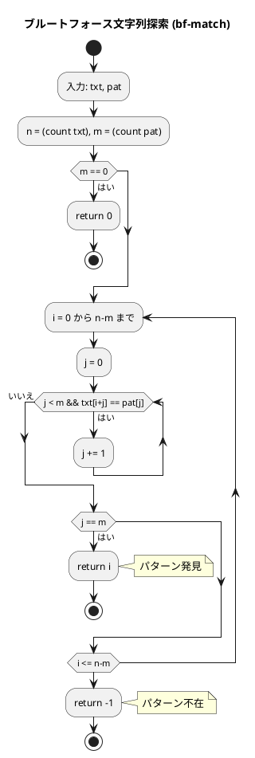
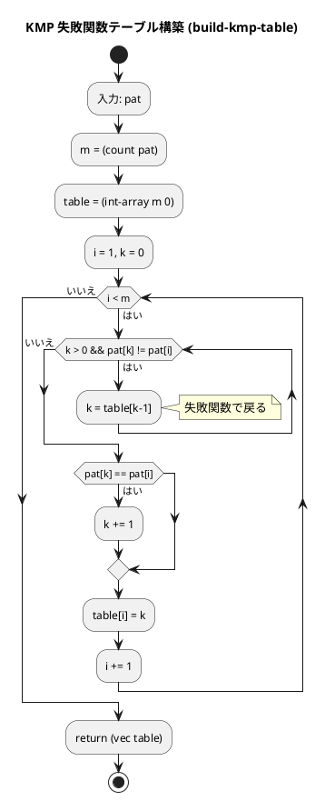
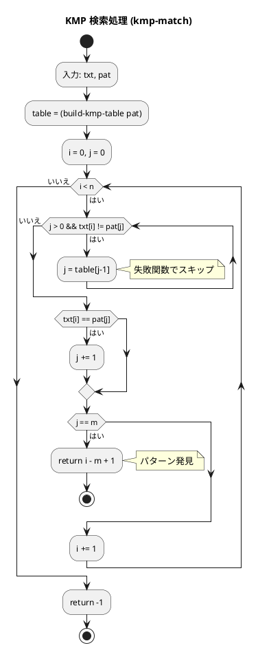
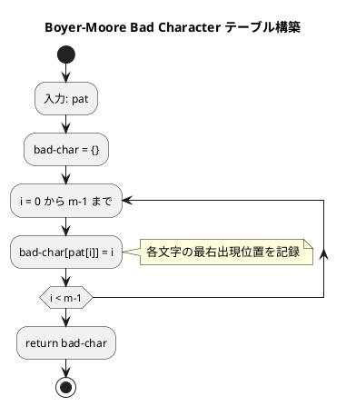
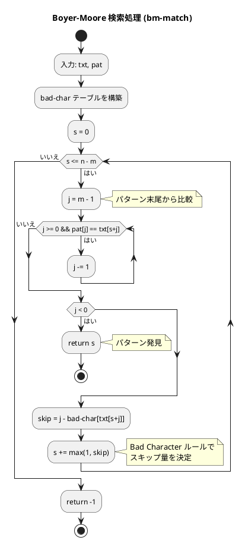

# 第 7 章 文字列処理

## はじめに

前章ではソートアルゴリズムを学びました。この章では、文字列の中から特定のパターンを探す「文字列探索アルゴリズム」と、基本的な文字列処理を TDD で実装します。

文字列探索は、テキストエディタの検索機能やウイルス検出、DNA 配列解析など、多くの場面で使われる基本的な操作です。

### 目次

1. [ブルートフォース文字列探索](#1-ブルートフォース文字列探索)
2. [KMP 法](#2-kmp-法)
3. [Boyer-Moore 法](#3-boyer-moore-法)
4. [文字カウント・逆順・回文判定](#4-文字カウント逆順回文判定)

---

## Clojure の文字列基本操作

Clojure の文字列は Java の `String` そのものです。シーケンスとして扱えるため、`count`、`nth`、`map`、`filter` などが使えます。

```clojure
;; 文字列の長さ
(count "hello")       ;=> 5

;; n番目の文字
(nth "hello" 0)       ;=> \h

;; 文字列の結合
(str "hello" " " "world")  ;=> "hello world"

;; 文字列の逆順
(apply str (reverse "hello"))  ;=> "olleh"

;; 文字の出現回数
(frequencies "hello")  ;=> {\h 1, \e 1, \l 2, \o 1}
```

---

## 1. ブルートフォース文字列探索

テキストの先頭から順に、パターンと一致するか 1 文字ずつ比較する最も単純な方法です。

### Red -- 失敗するテストを書く

```clojure
(deftest bf-match-test
  (testing "ブルートフォース文字列探索"
    (is (= 12 (bf-match "ABCXDEZCABACABAB" "ABAB")))
    (is (= 0 (bf-match "ABCDE" "ABC")))
    (is (= 2 (bf-match "ABCDE" "CDE")))
    (is (= -1 (bf-match "ABCDE" "XYZ")))
    (is (= 0 (bf-match "ABCDE" "")))
    (is (= -1 (bf-match "AB" "ABCDE")))
    (is (= 2 (bf-match "ABCDE" "C")))))
```

### Green -- テストを通す実装

```clojure
(defn bf-match [txt pat]
  (let [n (count txt) m (count pat)]
    (if (zero? m) 0
      (loop [i 0]
        (if (> i (- n m)) -1
          (let [matched (loop [j 0]
                          (cond
                            (>= j m) true
                            (not= (nth txt (+ i j)) (nth pat j)) false
                            :else (recur (inc j))))]
            (if matched i (recur (inc i)))))))))
```

### 解説

外側の `loop` でテキストの開始位置 `i` を移動し、内側の `loop` でパターンの各文字 `j` と比較します。不一致が見つかると内側のループを抜け、`i` を 1 つ進めて再試行します。

### フローチャート



**計算量**: 最悪 O(n * m)、平均 O(n)

---

## 2. KMP 法

KMP（Knuth-Morris-Pratt）法は、パターンの部分一致情報を利用して、不要な比較をスキップするアルゴリズムです。

### Red -- 失敗するテストを書く

```clojure
(deftest kmp-match-test
  (testing "KMP 文字列探索"
    (is (= 12 (kmp-match "ABCXDEZCABACABAB" "ABAB")))
    (is (= 0 (kmp-match "ABCDE" "ABC")))
    (is (= -1 (kmp-match "ABCDE" "XYZ")))
    (is (= 0 (kmp-match "ABCDE" "")))
    (is (= 0 (kmp-match "AAABAAAB" "AAAB")))))
```

### Green -- テストを通す実装

まず、失敗関数テーブル（部分一致テーブル）を構築します。

```clojure
(defn- build-kmp-table [pat]
  (let [m (count pat)
        table (int-array m 0)]
    (loop [i 1 k 0]
      (when (< i m)
        (let [k (loop [k k]
                  (if (and (> k 0) (not= (nth pat k) (nth pat i)))
                    (recur (aget table (dec k)))
                    k))
              k (if (= (nth pat k) (nth pat i)) (inc k) k)]
          (aset table i k)
          (recur (inc i) k))))
    (vec table)))
```

次に、テーブルを使って効率的に探索します。

```clojure
(defn kmp-match [txt pat]
  (let [n (count txt) m (count pat)]
    (if (zero? m) 0
      (let [table (build-kmp-table pat)]
        (loop [i 0 j 0]
          (if (>= i n) -1
            (let [j (loop [j j]
                      (if (and (> j 0) (not= (nth txt i) (nth pat j)))
                        (recur (nth table (dec j)))
                        j))
                  j (if (= (nth txt i) (nth pat j)) (inc j) j)]
              (if (= j m)
                (- i m -1)
                (recur (inc i) j)))))))))
```

### 解説

KMP 法の核心は失敗関数テーブルです。パターン内の接頭辞と接尾辞の一致情報を事前計算し、不一致が起きた際にパターンの比較位置を効率的に戻します。

### フローチャート

#### スキップテーブルの作成



#### 検索処理



**計算量**: O(n + m)（テーブル構築 O(m) + 探索 O(n)）

---

## 3. Boyer-Moore 法

Boyer-Moore 法は、パターンの末尾から比較を行い、不一致時にパターンを大きくスキップするアルゴリズムです。Bad Character ルールを使います。

### Red -- 失敗するテストを書く

```clojure
(deftest bm-match-test
  (testing "Boyer-Moore 文字列探索"
    (is (= 12 (bm-match "ABCXDEZCABACABAB" "ABAB")))
    (is (= 0 (bm-match "ABCDE" "ABC")))
    (is (= -1 (bm-match "ABCDE" "XYZ")))
    (is (= 0 (bm-match "ABCDE" "")))))
```

### Green -- テストを通す実装

```clojure
(defn bm-match [txt pat]
  (let [n (count txt) m (count pat)]
    (if (zero? m) 0
      (let [bad-char (into {} (map-indexed (fn [i c] [c i]) pat))]
        (loop [s 0]
          (if (> s (- n m)) -1
            (let [j (loop [j (dec m)]
                      (cond
                        (< j 0) j
                        (= (nth pat j) (nth txt (+ s j))) (recur (dec j))
                        :else j))]
              (if (< j 0)
                s
                (let [skip (- j (get bad-char (nth txt (+ s j)) -1))]
                  (recur (+ s (max 1 skip))))))))))))
```

### 解説

Bad Character テーブルは、Clojure の `map-indexed` と `into` で簡潔に構築できます。パターン末尾から比較し、不一致時には Bad Character ルールでスキップ量を決定します。

### フローチャート

#### スキップテーブルの作成



#### 検索処理



**計算量**: 最良 O(n/m)、最悪 O(n * m)

---

## 4. 文字カウント・逆順・回文判定

### 文字カウント

```clojure
(defn count-chars [s]
  (if (empty? s) {} (frequencies s)))
```

Clojure の組み込み `frequencies` 関数で各文字の出現回数をカウントします。

```clojure
(deftest count-chars-test
  (testing "文字のカウント"
    (let [result (count-chars "hello world")]
      (is (= 3 (get result \l)))
      (is (= 2 (get result \o)))
      (is (= 1 (get result \space))))
    (is (= {} (count-chars "")))))
```

### 文字列の逆順

```clojure
(defn str-reverse [s]
  (apply str (reverse s)))
```

```clojure
(deftest str-reverse-test
  (testing "文字列の逆順"
    (is (= "olleh" (str-reverse "hello")))
    (is (= "" (str-reverse "")))
    (is (= "a" (str-reverse "a")))))
```

### 回文判定

```clojure
(defn is-palindrome? [s]
  (= s (str-reverse s)))
```

Clojure では述語関数に `?` 接尾辞を付ける慣習があります。

```clojure
(deftest is-palindrome?-test
  (testing "回文判定"
    (is (true? (is-palindrome? "racecar")))
    (is (false? (is-palindrome? "hello")))
    (is (true? (is-palindrome? "a")))
    (is (true? (is-palindrome? "")))
    (is (true? (is-palindrome? "abba")))))
```

---

## テスト実行結果

```bash
$ lein test :only algorithm.strings-test

lein test algorithm.strings-test

Ran 6 tests containing 24 assertions.
0 failures, 0 errors.
```

---

## 文字列探索アルゴリズムの比較

| アルゴリズム | 前処理 | 最良 | 平均 | 最悪 | 特徴 |
|-------------|--------|------|------|------|------|
| ブルートフォース | なし | O(n) | O(n) | O(n*m) | 実装が最も簡単 |
| KMP 法 | O(m) | O(n) | O(n) | O(n+m) | 最悪でも線形時間 |
| Boyer-Moore 法 | O(m) | O(n/m) | O(n/m) | O(n*m) | 実用的に最速 |

## まとめ

この章では、文字列処理アルゴリズムを Clojure で TDD 実装しました：

1. **ブルートフォース法** -- `loop/recur` のネストで素直に実装。理解しやすいが最悪 O(n*m)
2. **KMP 法** -- `int-array` で失敗関数テーブルを構築。最悪でも O(n+m) を保証
3. **Boyer-Moore 法** -- `map-indexed` + `into` で Bad Character テーブルを簡潔に構築。実用的に最速
4. **文字カウント** -- `frequencies` で 1 行実装
5. **逆順** -- `reverse` + `apply str` で 1 行実装
6. **回文判定** -- `str-reverse` を再利用して 1 行実装

Clojure の豊富な標準ライブラリ（`frequencies`、`reverse`、`map-indexed` など）により、文字列処理が簡潔に書けます。

次の章では、リスト（連結リスト）について学んでいきましょう。

## 参考文献

- 『新・明解アルゴリズムとデータ構造』 -- 柴田望洋
- 『テスト駆動開発』 -- Kent Beck
