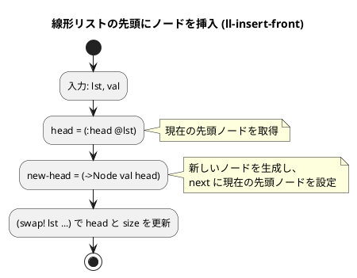
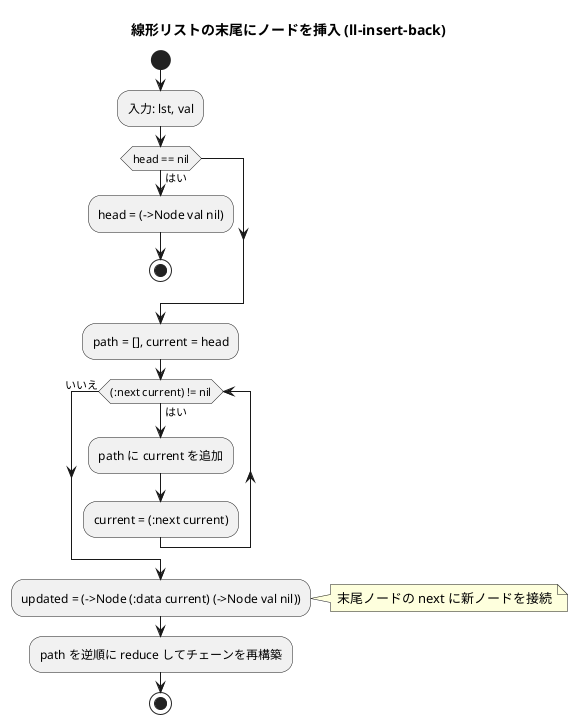
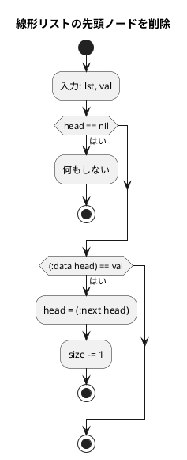
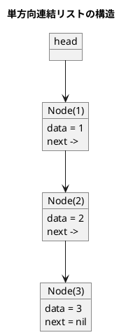
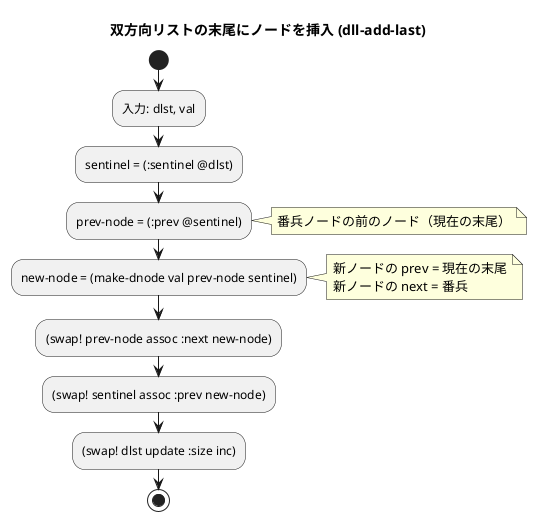
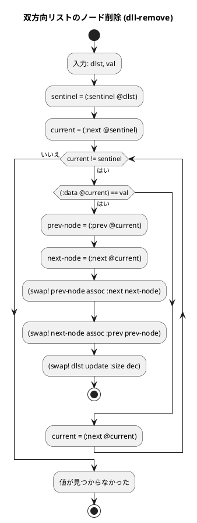
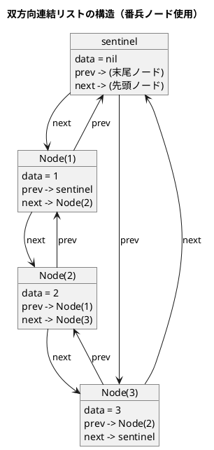

# 第 8 章 リスト

## はじめに

前章までで、配列や探索アルゴリズム、スタック、キュー、再帰、ソートアルゴリズム、文字列処理などを学んできました。この章では、データ構造の基本である「**リスト（連結リスト）**」を TDD で実装します。

配列と異なり、連結リストはメモリ上に不連続に配置されたノードをポインタで繋ぎます。要素の挿入・削除が O(1) ですが、ランダムアクセスは O(n) です。

Clojure では `defrecord` で不変ノードを定義し、`atom` でリスト全体の状態を管理する設計を採用します。

### 目次

1. [リストとは](#リストとは)
2. [線形リスト（単方向連結リスト）](#1-線形リスト単方向連結リスト)
3. [双方向連結リスト](#2-双方向連結リスト)

---

## リストとは

リストとは、データを順序付けて格納するデータ構造です。配列と似ていますが、リストは要素の追加や削除が容易であるという特徴があります。

リストには様々な種類があります：

- **線形リスト**：最も基本的なリスト構造で、各要素が一方向に連結されています。
- **連結リスト**：各要素（ノード）が次の要素へのポインタを持つリスト構造です。
- **循環リスト**：最後の要素が最初の要素を指す連結リストです。
- **双方向リスト**：各要素が前後の要素へのポインタを持つリスト構造です。

Clojure では通常、組み込みの `list` や `vector` を使いますが、教育目的で連結リストを手動実装します。

---

## 1. 線形リスト（単方向連結リスト）

各ノードが次のノードへの参照を持ちます。`defrecord` で不変ノードを定義し、`atom` でリスト全体の状態を管理します。

### Red -- 失敗するテストを書く

```clojure
(deftest linked-list-test
  (testing "初期状態"
    (let [lst (make-linked-list)]
      (is (= 0 (ll-size lst)))
      (is (= [] (ll-to-vec lst)))))

  (testing "先頭に挿入"
    (let [lst (make-linked-list)]
      (ll-insert-front lst 1)
      (is (= 1 (ll-size lst)))
      (is (= [1] (ll-to-vec lst)))))

  (testing "末尾に挿入"
    (let [lst (make-linked-list)]
      (ll-insert-back lst 1)
      (ll-insert-back lst 2)
      (is (= 2 (ll-size lst)))
      (is (= [1 2] (ll-to-vec lst)))))

  (testing "検索"
    (let [lst (make-linked-list)]
      (ll-insert-back lst 10)
      (ll-insert-back lst 20)
      (ll-insert-back lst 30)
      (is (true? (ll-search lst 20)))
      (is (false? (ll-search lst 99)))))

  (testing "削除"
    (let [lst (make-linked-list)]
      (ll-insert-back lst 1)
      (ll-insert-back lst 2)
      (ll-insert-back lst 3)
      (ll-delete lst 2)
      (is (false? (ll-search lst 2)))
      (is (= 2 (ll-size lst)))
      (is (= [1 3] (ll-to-vec lst))))))
```

### Green -- テストを通す実装

```clojure
(defrecord Node [data next])

(defn make-linked-list []
  (atom {:head nil :size 0}))

(defn ll-size [lst]
  (:size @lst))

(defn ll-insert-front
  "先頭にノードを挿入する"
  [lst val]
  (swap! lst (fn [{:keys [head size]}]
               {:head (->Node val head)
                :size (inc size)})))

(defn ll-insert-back
  "末尾にノードを挿入する"
  [lst val]
  (swap! lst (fn [{:keys [head size]}]
               (if (nil? head)
                 {:head (->Node val nil) :size (inc size)}
                 (let [new-node (->Node val nil)]
                   {:head (loop [current head path []]
                            (if (nil? (:next current))
                              (let [updated (->Node (:data current) new-node)]
                                (reduce (fn [acc node]
                                          (->Node (:data node) acc))
                                        updated
                                        (reverse path)))
                              (recur (:next current) (conj path current))))
                    :size (inc size)})))))

(defn ll-search
  "値を検索する"
  [lst val]
  (loop [current (:head @lst)]
    (cond
      (nil? current) false
      (= (:data current) val) true
      :else (recur (:next current)))))

(defn ll-delete
  "値に一致する最初のノードを削除する"
  [lst val]
  (swap! lst (fn [{:keys [head size]}]
               (cond
                 (nil? head) {:head nil :size size}
                 (= (:data head) val) {:head (:next head) :size (dec size)}
                 :else
                 (let [result (loop [current head path []]
                                (cond
                                  (nil? (:next current)) nil
                                  (= (:data (:next current)) val)
                                  (let [updated (->Node (:data current)
                                                        (:next (:next current)))]
                                    (reduce (fn [acc node]
                                              (->Node (:data node) acc))
                                            updated
                                            (reverse path)))
                                  :else
                                  (recur (:next current) (conj path current))))]
                   (if result
                     {:head result :size (dec size)}
                     {:head head :size size}))))))

(defn ll-to-vec
  "リストの全要素を vector に変換する"
  [lst]
  (loop [current (:head @lst) result []]
    (if (nil? current)
      result
      (recur (:next current) (conj result (:data current))))))
```

### Refactor -- 設計のポイント

`defrecord` で不変ノードを定義し、`atom` の `swap!` で安全に状態遷移を行います。末尾挿入や削除では、ノードチェーン全体を再構築する必要があります。これは Clojure のイミュータブルデータ構造の特徴です。

### フローチャート

#### 先頭にノードを挿入（ll-insert-front）



#### 末尾にノードを挿入（ll-insert-back）



#### 先頭ノードを削除



### アルゴリズムの考え方



### 解説

線形リストは、各ノードが次のノードへの参照を持つデータ構造です。Clojure の実装では以下の特徴があります：

1. **不変ノード**: `defrecord Node` でイミュータブルなノードを定義
2. **atom による状態管理**: リスト全体の状態を `atom` で管理し、`swap!` で安全に更新
3. **チェーン再構築**: 末尾挿入や中間の削除では、ノードチェーン全体を再構築（イミュータブルデータの特性）

**主な操作の計算量**:

| 操作 | 先頭 | 末尾 | 中間 |
|------|------|------|------|
| 挿入 | O(1) | O(n) | O(n) |
| 削除 | O(1) | O(n) | O(n) |
| 探索 | O(n) | O(n) | O(n) |

---

## 2. 双方向連結リスト

各ノードが前後両方のノードへの参照を持ちます。番兵ノード（ダミー）を使い、先頭・末尾の特殊処理を不要にします。循環リストとしても機能します。

### Red -- 失敗するテストを書く

```clojure
(deftest doubly-linked-list-test
  (testing "初期状態"
    (let [dlst (make-doubly-linked-list)]
      (is (= 0 (dll-size dlst)))
      (is (= [] (dll-to-vec dlst)))
      (is (true? (dll-empty? dlst)))))

  (testing "末尾に挿入"
    (let [dlst (make-doubly-linked-list)]
      (dll-add-last dlst 1)
      (dll-add-last dlst 2)
      (dll-add-last dlst 3)
      (is (= 3 (dll-size dlst)))
      (is (= [1 2 3] (dll-to-vec dlst)))))

  (testing "先頭に挿入"
    (let [dlst (make-doubly-linked-list)]
      (dll-add-first dlst 3)
      (dll-add-first dlst 2)
      (dll-add-first dlst 1)
      (is (= [1 2 3] (dll-to-vec dlst)))))

  (testing "検索"
    (let [dlst (make-doubly-linked-list)]
      (dll-add-last dlst 10)
      (dll-add-last dlst 20)
      (dll-add-last dlst 30)
      (is (true? (dll-search dlst 20)))
      (is (false? (dll-search dlst 99)))))

  (testing "値による削除"
    (let [dlst (make-doubly-linked-list)]
      (dll-add-last dlst 1)
      (dll-add-last dlst 2)
      (dll-add-last dlst 3)
      (dll-remove dlst 2)
      (is (= [1 3] (dll-to-vec dlst)))
      (is (= 2 (dll-size dlst))))))
```

### Green -- テストを通す実装

単方向リストとは異なり、各ノードを `atom` で管理し、`:prev` と `:next` で双方向に参照します。番兵ノードにより、空リストでも `:prev`/`:next` が常に有効なノードを指します。

```clojure
(defn- make-dnode [data prev next]
  (atom {:data data :prev prev :next next}))

(defn make-doubly-linked-list []
  (let [sentinel (make-dnode nil nil nil)]
    (swap! sentinel assoc :prev sentinel :next sentinel)
    (atom {:sentinel sentinel :size 0})))

(defn dll-add-last [dlst val]
  (let [sentinel (:sentinel @dlst)
        prev-node (:prev @sentinel)
        new-node (make-dnode val prev-node sentinel)]
    (swap! prev-node assoc :next new-node)
    (swap! sentinel assoc :prev new-node)
    (swap! dlst update :size inc)))

(defn dll-add-first [dlst val]
  (let [sentinel (:sentinel @dlst)
        next-node (:next @sentinel)
        new-node (make-dnode val sentinel next-node)]
    (swap! next-node assoc :prev new-node)
    (swap! sentinel assoc :next new-node)
    (swap! dlst update :size inc)))

(defn dll-remove [dlst val]
  (let [sentinel (:sentinel @dlst)]
    (loop [current (:next @sentinel)]
      (when (not= current sentinel)
        (if (= (:data @current) val)
          (let [prev-node (:prev @current)
                next-node (:next @current)]
            (swap! prev-node assoc :next next-node)
            (swap! next-node assoc :prev prev-node)
            (swap! dlst update :size dec))
          (recur (:next @current)))))))
```

### フローチャート

#### 末尾にノードを挿入（dll-add-last）



#### 値によるノードの削除（dll-remove）



### アルゴリズムの考え方



### 解説

双方向連結リストの特徴：

1. **番兵ノード**: 空リストでも `sentinel.prev` と `sentinel.next` が有効。先頭・末尾の特殊処理が不要になる
2. **O(1) の挿入・削除**: ノードの参照があれば、前後のポインタを繋ぎ替えるだけ
3. **atom ベースの設計**: Clojure では各ノードを `atom` で管理し、`swap!` でポインタを更新

**計算量**:

| 操作 | 計算量 |
|------|--------|
| 先頭挿入 | O(1) |
| 末尾挿入 | O(1) |
| 検索 | O(n) |
| 削除（ノード指定） | O(1) |
| 削除（値指定） | O(n) |

---

## テスト実行結果

```bash
$ lein test :only algorithm.linked-lists-test

lein test algorithm.linked-lists-test

Ran 2 tests containing 27 assertions.
0 failures, 0 errors.
```

---

## 配列 vs 連結リスト

| 項目 | 配列（vector） | 単方向連結リスト | 双方向連結リスト |
|------|---------------|----------------|----------------|
| ランダムアクセス | O(1) | O(n) | O(n) |
| 先頭への挿入 | O(n) | O(1) | O(1) |
| 末尾への挿入 | O(1)※ | O(n) | O(1) |
| 途中への挿入 | O(n) | O(1)（参照取得後） | O(1)（参照取得後） |
| 途中の削除 | O(n) | O(n) | O(1)（参照取得後） |
| メモリ使用 | 連続領域 | ポインタ分余分 | ポインタ x2 分余分 |

※ Clojure の vector は末尾追加が実質 O(1)（永続データ構造）

## まとめ

この章では、連結リストのデータ構造を Clojure で TDD 実装しました：

1. **線形リスト（単方向）** -- `defrecord` + `atom` で不変ノードと可変リスト状態を分離。末尾挿入・削除ではチェーン再構築が必要
2. **双方向連結リスト** -- 各ノードを `atom` で管理し、番兵ノードで先頭・末尾の特殊処理を排除。先頭・末尾への挿入が O(1)

Clojure では通常、組み込みの `list`（先頭追加 O(1)）や `vector`（末尾追加 O(1)）を使いますが、アルゴリズムの理解のために手動実装を行いました。

次の章では、木構造について学びます。

## 参考文献

- 『新・明解アルゴリズムとデータ構造』 -- 柴田望洋
- 『テスト駆動開発』 -- Kent Beck
