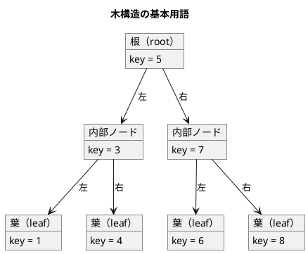
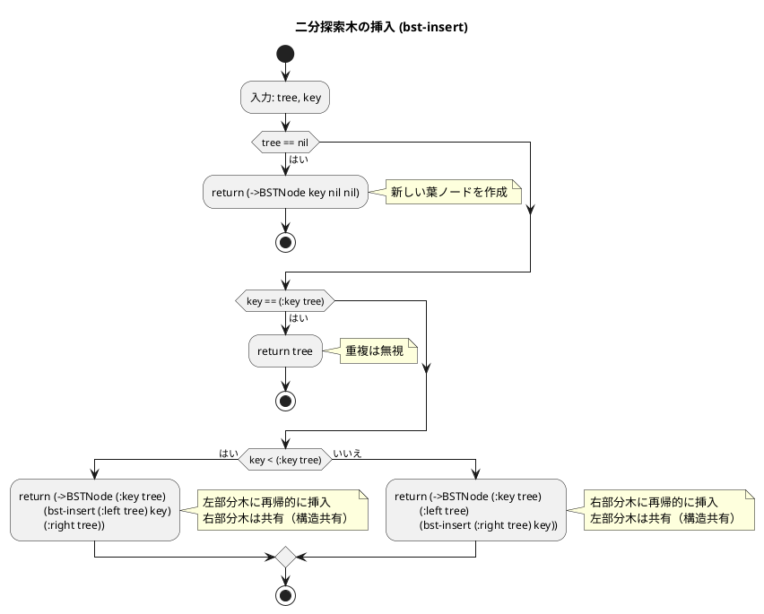
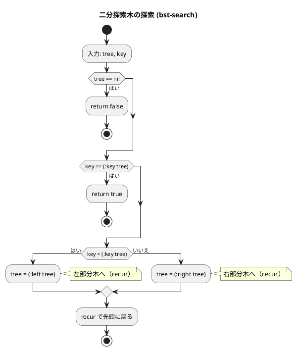
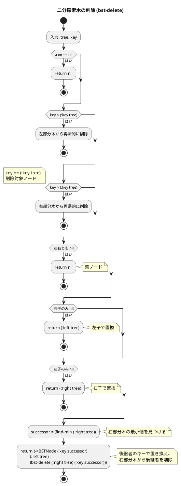
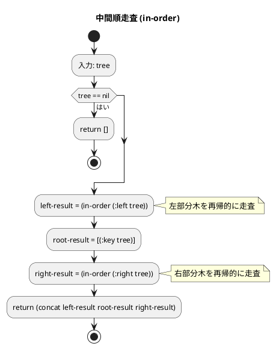

# 第 9 章 木構造

## はじめに

前章ではリスト（連結リスト）を学びました。この章では、階層的なデータ構造である「木構造」、特に「二分探索木」を TDD で実装します。

木構造は、データの検索、挿入、削除を効率的に行えるデータ構造です。Clojure では `defrecord` で不変のノードを定義し、挿入・削除・走査をすべて純粋関数として実装します。

### 目次

1. [木構造とは](#木構造とは)
2. [二分木](#二分木)
3. [二分探索木の実装](#二分探索木の実装)
4. [ノードの削除](#ノードの削除)
5. [木の走査](#木の走査)
6. [最小キー・最大キーの取得](#最小キー最大キーの取得)
7. [二分探索木の計算量](#二分探索木の計算量)

---

## 木構造とは

木構造は、ノード（節点）とそれらを結ぶエッジ（辺）からなる階層的なデータ構造です。



**基本用語**：
- **根（root）**: 最上位のノード
- **葉（leaf）**: 子を持たないノード
- **内部ノード**: 子を持つノード
- **深さ**: 根からそのノードまでのエッジの数
- **高さ**: そのノードから最も遠い葉までのエッジの数

### 順序木と無順序木

- **順序木**: 兄弟ノード間に順序がある木
- **無順序木**: 兄弟ノード間に順序がない木

---

## 二分木

各ノードが最大 2 つの子（左の子と右の子）を持つ木です。

---

## 二分探索木の実装

二分探索木（BST: Binary Search Tree）は、以下の性質を持つ二分木です：

- 左部分木のすべてのキーは、そのノードのキーより小さい
- 右部分木のすべてのキーは、そのノードのキーより大きい
- 左右の部分木もそれぞれ二分探索木である

### Red -- 失敗するテストを書く

```clojure
(deftest bst-insert-and-search-test
  (testing "挿入と検索"
    (let [tree (-> nil
                   (bst-insert 5)
                   (bst-insert 3)
                   (bst-insert 7))]
      (is (true? (bst-search tree 5)))
      (is (true? (bst-search tree 3)))
      (is (true? (bst-search tree 7)))
      (is (false? (bst-search tree 99))))))

(deftest bst-search-empty-test
  (testing "空の木での検索"
    (is (false? (bst-search nil 5)))))

(deftest bst-insert-duplicate-test
  (testing "重複キーの挿入は無視される"
    (let [tree (-> nil (bst-insert 5) (bst-insert 5))]
      (is (= [5] (in-order tree))))))
```

### Green -- テストを通す実装

```clojure
(defrecord BSTNode [key left right])

(defn bst-insert [tree key]
  (cond
    (nil? tree) (->BSTNode key nil nil)
    (= key (:key tree)) tree  ;; 重複は無視
    (< key (:key tree))
    (->BSTNode (:key tree) (bst-insert (:left tree) key) (:right tree))
    :else
    (->BSTNode (:key tree) (:left tree) (bst-insert (:right tree) key))))

(defn bst-search [tree key]
  (cond
    (nil? tree) false
    (= key (:key tree)) true
    (< key (:key tree)) (recur (:left tree) key)
    :else (recur (:right tree) key)))
```

不変データ構造の BST では、挿入のたびに新しいノードを作成します。変更されないサブツリーは共有されるため、メモリ効率は O(log n) です。

### フローチャート

#### ノード追加操作



#### 探索操作



---

## ノードの削除

二分探索木の削除は、3 つのケースを考慮します：

1. **葉ノードの削除**: 単にノードを `nil` に置き換える
2. **子が 1 つのノードの削除**: 子ノードで置き換える
3. **子が 2 つのノードの削除**: 右部分木の最小値（後継者）で置き換える

### Red -- 失敗するテストを書く

```clojure
(deftest bst-delete-leaf-test
  (testing "葉ノードの削除"
    (let [tree (reduce bst-insert nil [5 3 7])]
      (let [result (bst-delete tree 3)]
        (is (false? (bst-search result 3)))
        (is (true? (bst-search result 5)))
        (is (true? (bst-search result 7)))))))

(deftest bst-delete-two-children-test
  (testing "子が2つのノードの削除"
    (let [tree (reduce bst-insert nil [5 3 7 1 4])]
      (let [result (bst-delete tree 3)]
        (is (false? (bst-search result 3)))
        (is (true? (bst-search result 1)))
        (is (true? (bst-search result 4)))))))

(deftest bst-delete-root-test
  (testing "根ノードの削除"
    (let [tree (reduce bst-insert nil [5 3 7])]
      (let [result (bst-delete tree 5)]
        (is (false? (bst-search result 5)))
        (is (= [3 7] (in-order result)))))))
```

### Green -- テストを通す実装

```clojure
(defn find-min [tree]
  (if (nil? (:left tree))
    tree
    (recur (:left tree))))

(defn bst-delete [tree key]
  (cond
    (nil? tree) nil
    (< key (:key tree))
    (->BSTNode (:key tree) (bst-delete (:left tree) key) (:right tree))
    (> key (:key tree))
    (->BSTNode (:key tree) (:left tree) (bst-delete (:right tree) key))
    :else
    (cond
      ;; 葉ノード
      (and (nil? (:left tree)) (nil? (:right tree))) nil
      ;; 左子のみ
      (nil? (:right tree)) (:left tree)
      ;; 右子のみ
      (nil? (:left tree)) (:right tree)
      ;; 子が2つ: 右部分木の最小値で置き換え
      :else
      (let [successor (find-min (:right tree))]
        (->BSTNode (:key successor)
                   (:left tree)
                   (bst-delete (:right tree) (:key successor)))))))
```

### フローチャート



---

## 木の走査

木の全ノードを訪問する方法は 3 種類あります。

### 中間順走査（in-order）

左部分木 → ルート → 右部分木 の順に訪問。BST では昇順にキーを取得できます。

### 前順走査（pre-order）

ルート → 左部分木 → 右部分木 の順に訪問。木の構造をそのままコピーする際に使います。

### 後順走査（post-order）

左部分木 → 右部分木 → ルート の順に訪問。木のノードを安全に削除する際に使います。

```clojure
(defn in-order [tree]
  (if (nil? tree) []
    (concat (in-order (:left tree))
            [(:key tree)]
            (in-order (:right tree)))))

(defn pre-order [tree]
  (if (nil? tree) []
    (concat [(:key tree)]
            (pre-order (:left tree))
            (pre-order (:right tree)))))

(defn post-order [tree]
  (if (nil? tree) []
    (concat (post-order (:left tree))
            (post-order (:right tree))
            [(:key tree)])))
```

### フローチャート（中間順走査）



### テストと実行例

```clojure
(deftest bst-traversal-test
  (testing "走査"
    (let [tree (reduce bst-insert nil [5 3 7 1 4 6 8])]
      (is (= [1 3 4 5 6 7 8] (in-order tree)))
      (is (= [5 3 1 4 7 6 8] (pre-order tree)))
      (is (= [1 4 3 6 8 7 5] (post-order tree))))))
```

---

## 最小キー・最大キーの取得

```clojure
(defn find-min [tree]
  (if (nil? (:left tree))
    tree
    (recur (:left tree))))

(defn find-max [tree]
  (if (nil? (:right tree))
    tree
    (recur (:right tree))))
```

```clojure
(deftest bst-find-min-max-test
  (testing "最小キー・最大キーの取得"
    (let [tree (reduce bst-insert nil [5 3 7 1 4 6 8])]
      (is (= 1 (:key (find-min tree))))
      (is (= 8 (:key (find-max tree)))))))
```

`find-min` は左子を辿り続け、`find-max` は右子を辿り続けます。どちらも `recur` で末尾再帰最適化されています。

---

## テスト実行結果

```bash
$ lein test :only algorithm.trees-test

lein test algorithm.trees-test

Ran 10 tests containing 26 assertions.
0 failures, 0 errors.
```

---

## 二分探索木の計算量

| 操作 | 平均 | 最悪 |
|------|------|------|
| 探索 | O(log n) | O(n) |
| 挿入 | O(log n) | O(n) |
| 削除 | O(log n) | O(n) |
| 走査 | O(n) | O(n) |
| 最小/最大 | O(log n) | O(n) |

最悪ケースは、木が偏って線形リスト状になった場合に発生します。これを防ぐには、AVL 木や赤黒木などの自己平衡二分探索木を使用します。

---

## まとめ

この章では、二分探索木を Clojure で TDD 実装しました：

1. **挿入** -- `defrecord` + 構造共有で不変ツリーを効率的に更新
2. **探索** -- `recur` による末尾再帰最適化で O(log n)
3. **削除** -- 3 つのケース（葉、子 1 つ、子 2 つ）を純粋関数として再構築
4. **走査** -- 中間順（昇順）、前順、後順の 3 種類を `concat` で実装
5. **最小/最大** -- `recur` で左端/右端を辿る

Clojure の不変データ構造は、木構造の実装に特に適しています。挿入や削除で新しいノードを作成する際、変更されない部分木は共有されるため（構造共有: structural sharing）、メモリ効率が良くなります。

## 参考文献

- 『新・明解アルゴリズムとデータ構造』 -- 柴田望洋
- 『テスト駆動開発』 -- Kent Beck
