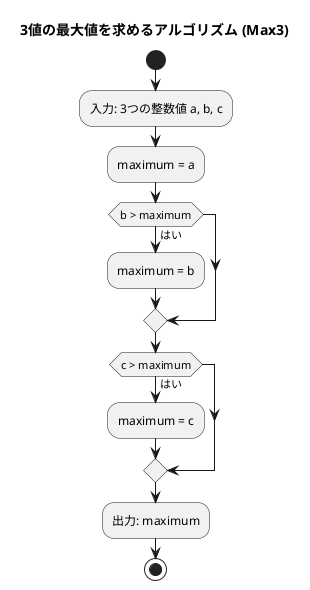
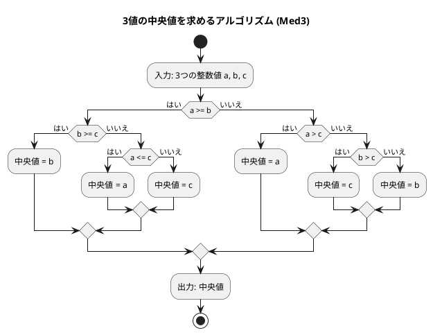

# 第 1 章 基本的なアルゴリズム（C#）

## はじめに

プログラミングを学ぶ上で、アルゴリズムの理解は非常に重要です。アルゴリズムとは、問題を解決するための手順や方法のことです。この章では、C# を使って基本的なアルゴリズムを学びながら、テスト駆動開発（TDD）の手法を用いて実装していきます。

テスト駆動開発とは、コードを書く前にまずテストを書き、そのテストが通るようにコードを実装していく開発手法です。Red-Green-Refactor というサイクルを繰り返しながら、確実に動作するコードを段階的に作り上げます。

## 準備

### 環境構築

```bash
# Nix 環境に入る（.NET SDK が利用可能になる）
nix develop .#csharp

# プロジェクトディレクトリへ移動
cd apps/csharp
```

### プロジェクト構成

```
apps/csharp/
├── Algorithm/
│   ├── Algorithm.csproj          # プロジェクト設定
│   └── BasicAlgorithms.cs        # 実装ファイル
└── Algorithm.Tests/
    ├── Algorithm.Tests.csproj    # テストプロジェクト設定
    └── BasicAlgorithmsTest.cs    # テストファイル
```

### テスト実行コマンド

```bash
# テスト実行
dotnet test

# 詳細出力付き
dotnet test --verbosity normal
```

---

## 1. アルゴリズムとは

アルゴリズムとは、問題を解決するための明確な手順のことです。コンピュータプログラムは、アルゴリズムを実行可能な形で表現したものと言えます。

良いアルゴリズムは以下の特徴を持ちます：

- 入力と出力が明確である
- 各ステップが明確である
- 有限のステップで終了する
- 効率的である

---

## 2. 3 値の最大値

3 つの整数値の中から最大値を求めるアルゴリズムを TDD で実装します。

### Red — 失敗するテストを書く

```csharp
// Algorithm.Tests/BasicAlgorithmsTest.cs
public class Max3Test
{
    [Fact]
    public void 各パターンで最大値を返す()
    {
        int[][] cases = [
            [3, 2, 1, 3], [3, 2, 2, 3], [3, 1, 2, 3],
            [3, 2, 3, 3], [2, 1, 3, 3], [3, 3, 2, 3],
            [3, 3, 3, 3], [2, 2, 3, 3], [2, 3, 1, 3],
            [2, 3, 2, 3], [1, 3, 2, 3], [2, 3, 3, 3],
            [1, 2, 3, 3],
        ];
        foreach (var c in cases)
            Assert.Equal(c[3], BasicAlgorithms.Max3(c[0], c[1], c[2]));
    }
}
```

3 つの値の大小関係の全パターン（13 通り）を網羅したテストです。

### Green — テストを通す最小限の実装

```csharp
// Algorithm/BasicAlgorithms.cs
public static class BasicAlgorithms
{
    /// <summary>3つの整数値の最大値を返す</summary>
    public static int Max3(int a, int b, int c)
    {
        int maximum = a;
        if (b > maximum) maximum = b;
        if (c > maximum) maximum = c;
        return maximum;
    }
}
```

### アルゴリズムの考え方



1. 最初の値を最大値と仮定する
2. 残りの値と比較し、より大きい値があれば最大値を更新する
3. すべての値との比較が終わったら、最大値を返す

---

## 3. 3 値の中央値

3 つの整数値の中央値（3 つの値を大きさの順に並べたときに真ん中に来る値）を求めます。

### Red — 失敗するテストを書く

```csharp
public class Med3Test
{
    [Fact]
    public void 各パターンで中央値を返す()
    {
        int[][] cases = [
            [3, 2, 1, 2], [3, 2, 2, 2], [3, 1, 2, 2],
            [3, 2, 3, 3], [2, 1, 3, 2], [3, 3, 2, 3],
            [3, 3, 3, 3], [2, 2, 3, 2], [2, 3, 1, 2],
            [2, 3, 2, 2], [1, 3, 2, 2], [2, 3, 3, 3],
            [1, 2, 3, 2],
        ];
        foreach (var c in cases)
            Assert.Equal(c[3], BasicAlgorithms.Med3(c[0], c[1], c[2]));
    }
}
```

### Green — テストを通す最小限の実装

```csharp
/// <summary>3つの整数値の中央値を返す</summary>
public static int Med3(int a, int b, int c)
{
    if (a >= b)
    {
        if (b >= c) return b;
        else if (a <= c) return a;
        else return c;
    }
    else if (a > c) return a;
    else if (b > c) return c;
    else return b;
}
```

### アルゴリズムの考え方



中央値を求めるアルゴリズムは、最大値よりも複雑です。すべての場合分けを考える必要があります：

| 条件 | 中央値 |
|------|--------|
| a >= b かつ b >= c | b |
| a >= b かつ a <= c | a |
| a >= b（それ以外、a > c > b） | c |
| a < b かつ a > c | a |
| a < b かつ b > c | c |
| a < b（それ以外、c >= b > a） | b |

---

## 4. 条件判定と分岐

プログラミングでは、条件に応じて処理を分岐させることが頻繁にあります。

### Red — 失敗するテストを書く

```csharp
public class JudgeSignTest
{
    [Fact]
    public void 正の値() => Assert.Equal("その値は正です。", BasicAlgorithms.JudgeSign(17));

    [Fact]
    public void 負の値() => Assert.Equal("その値は負です。", BasicAlgorithms.JudgeSign(-5));

    [Fact]
    public void ゼロ() => Assert.Equal("その値は0です。", BasicAlgorithms.JudgeSign(0));
}
```

### Green — テストを通す最小限の実装

```csharp
/// <summary>整数値の符号を判定する</summary>
public static string JudgeSign(int n)
{
    if (n > 0) return "その値は正です。";
    else if (n < 0) return "その値は負です。";
    else return "その値は0です。";
}
```

`if`, `else if`, `else` を使うことで、複数の条件に応じて処理を分岐させることができます。

---

## 5. 繰り返し処理

プログラミングでは、同じ処理を繰り返し実行することがよくあります。C# では `while` 文と `for` 文を使って繰り返し処理を実現できます。

### 5-1. 1 から n までの総和

#### Red — 失敗するテストを書く

```csharp
public class Sum1ToNTest
{
    [Fact]
    public void while文で総和() => Assert.Equal(15, BasicAlgorithms.Sum1ToNWhile(5));

    [Fact]
    public void for文で総和() => Assert.Equal(15, BasicAlgorithms.Sum1ToNFor(5));
}
```

#### Green — テストを通す実装

```csharp
/// <summary>while 文で 1 から n までの総和を求める</summary>
public static int Sum1ToNWhile(int n)
{
    int total = 0, i = 1;
    while (i <= n) { total += i; i++; }
    return total;
}

/// <summary>for 文で 1 から n までの総和を求める</summary>
public static int Sum1ToNFor(int n)
{
    int total = 0;
    for (int i = 1; i <= n; i++) total += i;
    return total;
}
```

`while` 文は条件が真の間、繰り返し実行します。`for` 文は初期化・条件・更新を一行で記述できます。

### 5-2. 記号文字の交互表示

`+` と `-` を交互に表示する 2 通りの実装を比較します。

#### Red — 失敗するテストを書く

```csharp
public class AlternativeTest
{
    [Fact]
    public void 剰余判定方式で12文字() => Assert.Equal("+-+-+-+-+-+-", BasicAlgorithms.Alternative1(12));

    [Fact]
    public void パターン繰り返し方式で12文字() => Assert.Equal("+-+-+-+-+-+-", BasicAlgorithms.Alternative2(12));

    [Fact]
    public void 奇数文字()
    {
        Assert.Equal("+-+-+", BasicAlgorithms.Alternative1(5));
        Assert.Equal("+-+-+", BasicAlgorithms.Alternative2(5));
    }
}
```

#### Green — テストを通す実装

```csharp
/// <summary>記号文字 '+' と '-' を交互に表示する（剰余判定方式）</summary>
public static string Alternative1(int n)
{
    var sb = new System.Text.StringBuilder();
    for (int i = 0; i < n; i++) sb.Append(i % 2 != 0 ? '-' : '+');
    return sb.ToString();
}

/// <summary>記号文字 '+' と '-' を交互に表示する（パターン繰り返し方式）</summary>
public static string Alternative2(int n)
{
    var sb = new System.Text.StringBuilder();
    for (int i = 0; i < n / 2; i++) sb.Append("+-");
    if (n % 2 != 0) sb.Append('+');
    return sb.ToString();
}
```

`Alternative1` は剰余（`%`）を使って偶数・奇数を判定します。`Alternative2` はパターンの繰り返しを使ったよりシンプルな実装です。C# では文字列の連結に `StringBuilder` を使うのが効率的です。

### 5-3. 長方形の辺の長さを列挙

面積が指定された長方形の辺の長さをすべて列挙します。

#### Red — 失敗するテストを書く

```csharp
public class RectangleTest
{
    [Fact]
    public void 面積32の長方形() => Assert.Equal("1x32 2x16 4x8 ", BasicAlgorithms.Rectangle(32));
}
```

#### Green — テストを通す実装

```csharp
/// <summary>縦横が整数で面積が area の長方形の辺の長さを列挙する</summary>
public static string Rectangle(int area)
{
    var sb = new System.Text.StringBuilder();
    for (int i = 1; i <= area; i++)
    {
        if ((long)i * i > area) break;
        if (area % i != 0) continue;
        sb.Append($"{i}x{area / i} ");
    }
    return sb.ToString();
}
```

`break` は繰り返しを中断し、`continue` は次の繰り返しへスキップします。`i * i > area` で探索範囲を絞り込むことで効率化しています。`(long)` キャストはオーバーフローを防ぐためです。

---

## 6. 多重ループ

ループの中にループを重ねることで、2 次元的な処理を実現できます。

### 6-1. 九九の表

#### Red — 失敗するテストを書く

```csharp
public class MultiplicationTableTest
{
    [Fact]
    public void 九九の表()
    {
        string expected =
            "---------------------------\n" +
            "  1  2  3  4  5  6  7  8  9\n" +
            "  2  4  6  8 10 12 14 16 18\n" +
            "  3  6  9 12 15 18 21 24 27\n" +
            "  4  8 12 16 20 24 28 32 36\n" +
            "  5 10 15 20 25 30 35 40 45\n" +
            "  6 12 18 24 30 36 42 48 54\n" +
            "  7 14 21 28 35 42 49 56 63\n" +
            "  8 16 24 32 40 48 56 64 72\n" +
            "  9 18 27 36 45 54 63 72 81\n" +
            "---------------------------";
        Assert.Equal(expected, BasicAlgorithms.MultiplicationTable());
    }
}
```

#### Green — テストを通す実装

```csharp
/// <summary>九九の表を返す</summary>
public static string MultiplicationTable()
{
    var sb = new System.Text.StringBuilder();
    sb.AppendLine(new string('-', 27));
    for (int i = 1; i <= 9; i++)
    {
        for (int j = 1; j <= 9; j++) sb.Append($"{i * j,3}");
        sb.AppendLine();
    }
    sb.Append(new string('-', 27));
    return sb.ToString();
}
```

外側のループが行（`i`）、内側のループが列（`j`）を担当します。`$"{i * j,3}"` は 3 文字幅の右揃えで数値を出力します。

### 6-2. 直角三角形の表示

#### Red — 失敗するテストを書く

```csharp
public class TriangleLbTest
{
    [Fact]
    public void 直角三角形()
    {
        string expected = "*\n**\n***\n****\n*****\n";
        Assert.Equal(expected, BasicAlgorithms.TriangleLb(5));
    }
}
```

#### Green — テストを通す実装

```csharp
/// <summary>左下側が直角の二等辺三角形を返す</summary>
public static string TriangleLb(int n)
{
    var sb = new System.Text.StringBuilder();
    for (int i = 0; i < n; i++) sb.AppendLine(new string('*', i + 1));
    return sb.ToString();
}
```

---

## テスト実行結果

```bash
$ dotnet test --verbosity normal

BasicAlgorithmsTest.Max3Test.各パターンで最大値を返す: Passed
BasicAlgorithmsTest.Med3Test.各パターンで中央値を返す: Passed
BasicAlgorithmsTest.JudgeSignTest.正の値: Passed
BasicAlgorithmsTest.JudgeSignTest.負の値: Passed
BasicAlgorithmsTest.JudgeSignTest.ゼロ: Passed
BasicAlgorithmsTest.Sum1ToNTest.while文で総和: Passed
BasicAlgorithmsTest.Sum1ToNTest.for文で総和: Passed
BasicAlgorithmsTest.AlternativeTest.剰余判定方式で12文字: Passed
BasicAlgorithmsTest.AlternativeTest.パターン繰り返し方式で12文字: Passed
BasicAlgorithmsTest.AlternativeTest.奇数文字: Passed
BasicAlgorithmsTest.RectangleTest.面積32の長方形: Passed
BasicAlgorithmsTest.MultiplicationTableTest.九九の表: Passed
BasicAlgorithmsTest.TriangleLbTest.直角三角形: Passed

13 passed in 0.5s
```

---

## まとめ

この章では、以下の基本的なアルゴリズムを TDD で実装しました：

| アルゴリズム | メソッド | キーポイント |
|-------------|---------|------------|
| 3 値の最大値 | `Max3` | 順次比較と更新 |
| 3 値の中央値 | `Med3` | 全パターンの条件分岐 |
| 符号判定 | `JudgeSign` | `if/else if/else` の基本 |
| 総和（while） | `Sum1ToNWhile` | `while` 文の繰り返し |
| 総和（for） | `Sum1ToNFor` | `for` 文の繰り返し |
| 交互表示 | `Alternative1/2` | 剰余判定 vs パターン繰り返し |
| 長方形列挙 | `Rectangle` | `break`/`continue` の活用 |
| 九九の表 | `MultiplicationTable` | 二重ループ |
| 直角三角形 | `TriangleLb` | ループと文字列繰り返し |

TDD の Red-Green-Refactor サイクルを通じて、テストが仕様の役割を果たし、確実に動作するコードを構築できることを確認しました。

## 参考文献

- 『新・明解 C# で学ぶアルゴリズムとデータ構造』 — 柴田望洋
- 『テスト駆動開発』 — Kent Beck
