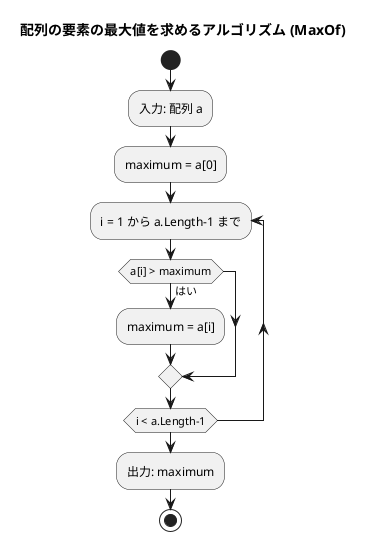
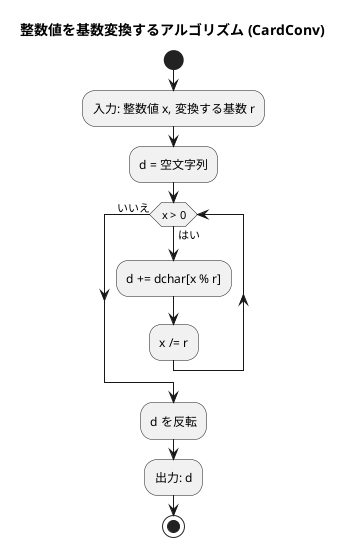

# 第 2 章 配列（C#）

## はじめに

前章では基本的なアルゴリズムについて学びました。この章では、プログラミングにおいて非常に重要なデータ構造である「配列」について学んでいきます。配列は、同じ型のデータを連続して格納するためのデータ構造で、多くのアルゴリズムの基礎となります。

C# では、配列は固定長の `int[]` や可変長の `List<T>` として利用できます。

---

## 1. データ構造と配列

### データ構造とは

データ構造とは、データ単位とデータ自身との間の物理的または論理的な関係を表したものです。適切なデータ構造を選ぶことで、効率的なアルゴリズムを実装することができます。

### C# における配列

C# では、配列は以下のように宣言・初期化します。

**配列**（固定長）

```csharp
int[] x = { 11, 22, 33, 44, 55, 66, 77 };
string[] names = { "John", "Paul", "George", "Ringo" };
```

**コレクション初期化子**（C# 12 以降）

```csharp
int[] x = [11, 22, 33, 44, 55, 66, 77];
```

### インデックスによるアクセス

配列の要素には、インデックス（添え字）を使ってアクセスします。C# のインデックスは 0 から始まります。

```csharp
int[] x = { 11, 22, 33, 44, 55, 66, 77 };
Console.WriteLine(x[2]);     // 33（3番目の要素）
Console.WriteLine(x[^3]);    // 55（後ろから3番目の要素、C# 8.0 以降）
```

### レンジによるアクセス

C# 8.0 以降では、レンジ演算子を使って配列の一部を取り出すことができます。

```csharp
int[] s = { 11, 22, 33, 44, 55, 66, 77 };
int[] sub1 = s[0..6];    // [11, 22, 33, 44, 55, 66]
int[] sub2 = s[^4..^2];  // [44, 55]
```

### 配列の走査

#### インデックスを使った走査

```csharp
string[] x = { "John", "George", "Paul", "Ringo" };
for (int i = 0; i < x.Length; i++)
    Console.WriteLine($"x[{i}] = {x[i]}");
```

#### foreach を使った走査

```csharp
string[] x = { "John", "George", "Paul", "Ringo" };
foreach (var name in x)
    Console.WriteLine(name);
```

---

## 2. 配列の要素の最大値

### Red — 失敗するテストを書く

```csharp
// Algorithm.Tests/ArrayAlgorithmsTest.cs
public class MaxOfTest
{
    [Fact] public void 複数要素の最大値() => Assert.Equal(192, ArrayAlgorithms.MaxOf([172, 153, 192, 140, 165]));
    [Fact] public void 単一要素() => Assert.Equal(42, ArrayAlgorithms.MaxOf([42]));
    [Fact] public void 全て同じ値() => Assert.Equal(5, ArrayAlgorithms.MaxOf([5, 5, 5]));
}
```

### Green — テストを通す最小限の実装

```csharp
// Algorithm/ArrayAlgorithms.cs
public static class ArrayAlgorithms
{
    public static int MaxOf(int[] a)
    {
        int maximum = a[0];
        for (int i = 1; i < a.Length; i++)
            if (a[i] > maximum) maximum = a[i];
        return maximum;
    }
}
```

### アルゴリズムの考え方



1. 配列の最初の要素を最大値と仮定する
2. 残りの要素を順に比較し、より大きい値があれば最大値を更新する
3. 全要素の比較が終わったら最大値を返す

計算量は O(n) です（n は配列の要素数）。

---

## 3. 配列の要素の並びを反転

### Red — 失敗するテストを書く

```csharp
public class ReverseArrayTest
{
    [Fact]
    public void 奇数長の配列を反転()
    {
        int[] a = [2, 5, 1, 3, 9, 6, 7];
        ArrayAlgorithms.Reverse(a);
        Assert.Equal([7, 6, 9, 3, 1, 5, 2], a);
    }

    [Fact]
    public void 偶数長の配列を反転()
    {
        int[] a = [1, 2, 3, 4];
        ArrayAlgorithms.Reverse(a);
        Assert.Equal([4, 3, 2, 1], a);
    }

    [Fact]
    public void 単一要素()
    {
        int[] a = [42];
        ArrayAlgorithms.Reverse(a);
        Assert.Equal([42], a);
    }
}
```

### Green — テストを通す最小限の実装

```csharp
public static void Reverse(int[] a)
{
    int n = a.Length;
    for (int i = 0; i < n / 2; i++)
        (a[i], a[n - i - 1]) = (a[n - i - 1], a[i]);
}
```

### アルゴリズムの考え方

配列の前半と後半の要素を対称的に交換することで反転します。

```
[2, 5, 1, 3, 9, 6, 7]
 ↕              ↕
[7, 5, 1, 3, 9, 6, 2]  → i=0: 2と7を交換
      ↕        ↕
[7, 6, 1, 3, 9, 5, 2]  → i=1: 5と6を交換
         ↕  ↕
[7, 6, 9, 3, 1, 5, 2]  → i=2: 1と9を交換（3は中央なので交換不要）
```

C# のタプル分解 `(a[i], a[n-i-1]) = (a[n-i-1], a[i])` で簡潔に交換できます。計算量は O(n/2) = O(n) です。

---

## 4. 基数変換

### Red — 失敗するテストを書く

```csharp
public class CardConvTest
{
    [Fact] public void 二進数変換() => Assert.Equal("11101", ArrayAlgorithms.CardConv(29, 2));
    [Fact] public void 八進数変換() => Assert.Equal("35", ArrayAlgorithms.CardConv(29, 8));
    [Fact] public void 十六進数変換() => Assert.Equal("FF", ArrayAlgorithms.CardConv(255, 16));
}
```

### Green — テストを通す最小限の実装

```csharp
public static string CardConv(int x, int r)
{
    const string dchar = "0123456789ABCDEFGHIJKLMNOPQRSTUVWXYZ";
    var d = new System.Text.StringBuilder();
    while (x > 0) { d.Append(dchar[x % r]); x /= r; }
    var arr = d.ToString().ToCharArray();
    System.Array.Reverse(arr);
    return new string(arr);
}
```

### アルゴリズムの考え方



29 を 2 進数に変換する例：

| x | x % 2 | 文字 | d（途中） |
|---|-------|------|---------|
| 29 | 1 | '1' | '1' |
| 14 | 0 | '0' | '10' |
| 7  | 1 | '1' | '101' |
| 3  | 1 | '1' | '1101' |
| 1  | 1 | '1' | '11101' |

反転して `'11101'`。

---

## 5. 素数の列挙

素数を列挙する 3 つのアルゴリズムを実装し、効率を比較します。

### Red — 失敗するテストを書く

```csharp
public class PrimeTest
{
    [Fact] public void 素数列挙第1版の除算回数() => Assert.Equal(78022, ArrayAlgorithms.Prime1(1000));
    [Fact] public void 素数列挙第2版の除算回数() => Assert.Equal(14622, ArrayAlgorithms.Prime2(1000));
    [Fact] public void 素数列挙第3版の除算回数() => Assert.Equal(3774, ArrayAlgorithms.Prime3(1000));
}
```

### Green — テストを通す実装（3 バージョン）

#### 第 1 版：素直な実装

```csharp
public static int Prime1(int x)
{
    int counter = 0;
    for (int n = 2; n <= x; n++)
        for (int i = 2; i < n; i++) { counter++; if (n % i == 0) break; }
    return counter;
}
```

#### 第 2 版：奇数のみ + 素数リスト活用

```csharp
public static int Prime2(int x)
{
    int counter = 0, ptr = 0;
    int[] prime = new int[500];
    prime[ptr++] = 2;
    for (int n = 3; n <= x; n += 2)
    {
        bool found = false;
        for (int i = 1; i < ptr; i++) { counter++; if (n % prime[i] == 0) { found = true; break; } }
        if (!found) prime[ptr++] = n;
    }
    return counter;
}
```

#### 第 3 版：平方根以下のみ確認

```csharp
public static int Prime3(int x)
{
    int counter = 0, ptr = 0;
    int[] prime = new int[500];
    prime[ptr++] = 2; prime[ptr++] = 3;
    for (int n = 5; n <= 1000; n += 2)
    {
        bool isPrime = true;
        int i = 1;
        while (prime[i] * prime[i] <= n)
        {
            counter += 2;
            if (n % prime[i] == 0) { isPrime = false; break; }
            i++;
        }
        if (isPrime) { prime[ptr++] = n; counter++; }
    }
    return counter;
}
```

### 効率の比較

| バージョン | 除算回数 | 改善率 |
|-----------|---------|--------|
| 第 1 版（素直な実装） | 78,022 | — |
| 第 2 版（奇数 + 素数リスト） | 14,622 | 約 81% 削減 |
| 第 3 版（平方根以下） | 3,774 | 約 95% 削減 |

---

## テスト実行結果

```bash
$ dotnet test --verbosity normal

ArrayAlgorithmsTest: 12 passed in 0.3s
```

---

## まとめ

| アルゴリズム | メソッド | 計算量 |
|-------------|---------|-------|
| 配列の最大値 | `MaxOf` | O(n) |
| 配列の反転 | `Reverse` | O(n) |
| 基数変換 | `CardConv` | O(log x) |
| 素数の列挙 v1 | `Prime1` | O(n²) |
| 素数の列挙 v2 | `Prime2` | O(n√n) |
| 素数の列挙 v3 | `Prime3` | O(n√n / log n) |

この章で学んだ内容：

1. データ構造と配列の基本概念
2. C# の配列の特徴と使い方
3. インデックスとレンジによるアクセス
4. 配列の走査方法（for、foreach）
5. 配列の要素の最大値を求めるアルゴリズム
6. 配列の要素の並びを反転するアルゴリズム
7. 基数変換アルゴリズム
8. 素数を列挙するアルゴリズムとその改良

## 参考文献

- 『新・明解 C# で学ぶアルゴリズムとデータ構造』 — 柴田望洋
- 『テスト駆動開発』 — Kent Beck
