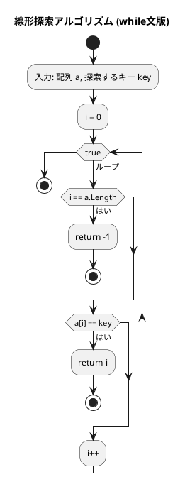
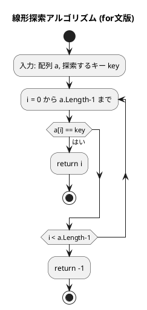
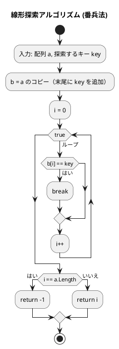
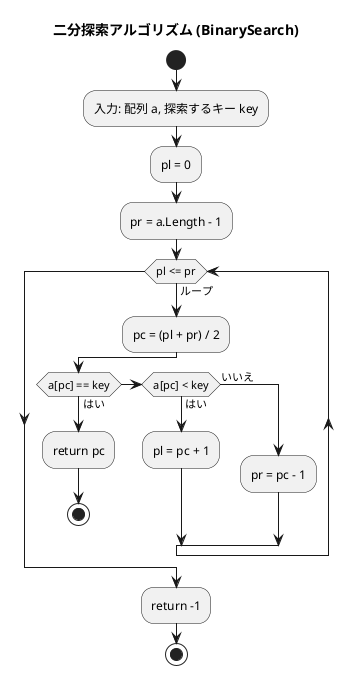

# 第 3 章 探索アルゴリズム（C#）

## はじめに

前章では配列とデータ構造について学びました。この章では、データの中から特定の値を見つけ出す「探索アルゴリズム」について学んでいきます。

主に以下の 3 つの方法を TDD で実装します：

1. 線形探索（シーケンシャルサーチ）
2. 二分探索（バイナリサーチ）
3. ハッシュ法

---

## 探索アルゴリズムとは

探索アルゴリズムとは、データの集合から特定の条件を満たす要素を見つけ出すための手順です。探索の結果は通常、キーが見つかった位置（インデックス）または見つからなかったことを示す -1 となります。

---

## 1. 線形探索

配列の先頭から順に各要素を調べ、目的のキーと一致する要素を探します。

### Red — 失敗するテストを書く

```csharp
// Algorithm.Tests/SearchTest.cs
public class LinearSearchTest
{
    [Fact] public void while文で探索_見つかる() => Assert.Equal(3, Search.LinearSearchWhile([6, 4, 3, 2, 1, 2, 8], 2));
    [Fact] public void while文で探索_見つからない() => Assert.Equal(-1, Search.LinearSearchWhile([1, 2, 3], 99));
    [Fact] public void for文で探索_見つかる() => Assert.Equal(3, Search.LinearSearchFor([6, 4, 3, 2, 1, 2, 8], 2));
    [Fact] public void for文で探索_見つからない() => Assert.Equal(-1, Search.LinearSearchFor([1, 2, 3], 99));
    [Fact] public void 番兵法で探索_見つかる() => Assert.Equal(3, Search.LinearSearchSentinel([6, 4, 3, 2, 1, 2, 8], 2));
    [Fact] public void 番兵法で探索_見つからない() => Assert.Equal(-1, Search.LinearSearchSentinel([1, 2, 3], 99));
}
```

### Green — テストを通す実装

```csharp
// Algorithm/Search.cs
public static class Search
{
    public static int LinearSearchWhile(int[] a, int key)
    {
        int i = 0;
        while (true)
        {
            if (i == a.Length) return -1;
            if (a[i] == key) return i;
            i++;
        }
    }

    public static int LinearSearchFor(int[] a, int key)
    {
        for (int i = 0; i < a.Length; i++)
            if (a[i] == key) return i;
        return -1;
    }
}
```

### アルゴリズムの考え方

線形探索は、配列が整列されているかどうかに関わらず使用できる汎用的なアルゴリズムです。

計算量：
- 最良の場合：O(1)（最初の要素がキーと一致する場合）
- 最悪の場合：O(n)（キーが見つからないか、最後の要素である場合）
- 平均の場合：O(n/2) = O(n)

#### while 文による線形探索のフローチャート



アルゴリズムの流れ：
1. 配列 a と探索するキー key を入力として受け取ります
2. 変数 i を 0 で初期化します
3. 無限ループ内で以下の処理を繰り返します：
   - i が a の長さに達した場合、-1 を返して終了します（探索失敗）
   - a[i] が key と一致する場合、i を返して終了します（探索成功）
   - i を 1 増やします（次の要素へ）

#### for 文による線形探索のフローチャート



アルゴリズムの流れ：
1. 配列 a と探索するキー key を入力として受け取ります
2. 0 から a.Length-1 までの各インデックス i について、以下の処理を繰り返します：
   - a[i] が key と一致する場合、i を返して終了します（探索成功）
3. ループが終了した場合（一致する要素が見つからなかった場合）、-1 を返します（探索失敗）

### 番兵法

末尾にキーを追加（番兵）することで、ループ内の終了判定を省略します。

```csharp
public static int LinearSearchSentinel(int[] a, int key)
{
    int[] b = new int[a.Length + 1];
    a.CopyTo(b, 0);
    b[a.Length] = key;
    int i = 0;
    while (b[i] != key) i++;
    return i == a.Length ? -1 : i;
}
```

### 番兵法の解説

番兵法では、探索対象の配列の末尾に探索するキーを追加（番兵として配置）することで、ループ内での終了判定を簡略化します。



アルゴリズムの利点：
- 通常の線形探索では、各ループで「配列の末尾か」と「値が一致したか」の 2 つの条件を確認します
- 番兵法では、末尾に必ず一致する値があるため「値が一致したか」の 1 条件だけで済みます
- 比較回数が約半分になるため、わずかな高速化が期待できます

**計算量**: 最悪 O(n)、平均 O(n/2)

---

## 2. 二分探索

**前提**: 配列が整列されていること。

中央の要素とキーを比較し、探索範囲を半分に絞り込むことを繰り返します。

### Red — 失敗するテストを書く

```csharp
public class BinarySearchTest
{
    [Fact] public void 中央の要素を探索() => Assert.Equal(3, Search.BinarySearch([1, 2, 3, 5, 7, 8, 9], 5));
    [Fact] public void 先頭の要素を探索() => Assert.Equal(0, Search.BinarySearch([1, 2, 3, 5, 7, 8, 9], 1));
    [Fact] public void 末尾の要素を探索() => Assert.Equal(6, Search.BinarySearch([1, 2, 3, 5, 7, 8, 9], 9));
    [Fact] public void 見つからない() => Assert.Equal(-1, Search.BinarySearch([1, 2, 3, 5, 7, 8, 9], 4));
}
```

### Green — テストを通す実装

```csharp
public static int BinarySearch(int[] a, int key)
{
    int pl = 0, pr = a.Length - 1;
    while (pl <= pr)
    {
        int pc = (pl + pr) / 2;
        if (a[pc] == key) return pc;
        else if (a[pc] < key) pl = pc + 1;
        else pr = pc - 1;
    }
    return -1;
}
```

### アルゴリズムの考え方



### 解説

二分探索では、探索のたびに探索範囲が半分になります。要素数 n の配列に対して、最悪でも log₂n 回の比較で探索が終わります。

**計算量**: O(log n)

| 要素数 | 線形探索（最悪） | 二分探索（最悪） |
|--------|--------------|--------------|
| 100 | 100回 | 7回 |
| 1,000 | 1,000回 | 10回 |
| 1,000,000 | 1,000,000回 | 20回 |

二分探索の前提条件として、配列が整列されている必要があります。整列されていない配列に対して二分探索を使用すると、正しい結果が得られません。

また、C# の標準ライブラリには `Array.BinarySearch` メソッドが用意されており、整列済み配列に対する二分探索を簡単に実行できます：

```csharp
int[] a = { 1, 2, 3, 5, 7, 8, 9 };
int idx = Array.BinarySearch(a, 5); // 3 が返る
```

---

## 3. ハッシュ法

キーからハッシュ関数でアドレスを求め、直接要素にアクセスします。理想的な場合 O(1) で探索できます。

### チェイン法

同じハッシュ値を持つ要素を連結リストで管理します。

#### Red — 失敗するテストを書く

```csharp
public class ChainedHashTest
{
    private Search.ChainedHash MakeHash()
    {
        var h = new Search.ChainedHash(13);
        h.Add(1, "赤尾"); h.Add(5, "武田"); h.Add(10, "小野");
        h.Add(12, "鈴木"); h.Add(14, "神崎");
        return h;
    }

    [Fact] public void 探索_見つかる() { var h = MakeHash(); Assert.Equal("赤尾", h.Search(1)); Assert.Equal("神崎", h.Search(14)); }
    [Fact] public void 探索_見つからない() => Assert.Null(MakeHash().Search(100));
    [Fact] public void 重複キーは追加できない() => Assert.False(MakeHash().Add(1, "重複"));
}
```

#### Green — テストを通す実装

```csharp
public class ChainedHash
{
    private class Node(int key, string value, Node? next)
    {
        public int Key = key;
        public string Value = value;
        public Node? Next = next;
    }

    private readonly int _capacity;
    private readonly Node?[] _table;

    public ChainedHash(int capacity) { _capacity = capacity; _table = new Node[capacity]; }

    private int HashValue(int key) => key % _capacity;

    public string? Search(int key)
    {
        var p = _table[HashValue(key)];
        while (p != null) { if (p.Key == key) return p.Value; p = p.Next; }
        return null;
    }

    public bool Add(int key, string value)
    {
        int h = HashValue(key);
        var p = _table[h];
        while (p != null) { if (p.Key == key) return false; p = p.Next; }
        _table[h] = new Node(key, value, _table[h]);
        return true;
    }

    public bool Remove(int key)
    {
        int h = HashValue(key);
        Node? p = _table[h], pp = null;
        while (p != null)
        {
            if (p.Key == key)
            {
                if (pp == null) _table[h] = p.Next; else pp.Next = p.Next;
                return true;
            }
            pp = p; p = p.Next;
        }
        return false;
    }
}
```

### オープンアドレス法

衝突時に空きスロットを探して要素を格納します。

```csharp
public class OpenHash
{
    private enum Status { Occupied, Empty, Deleted }

    private class Bucket
    {
        public int Key;
        public string Value = "";
        public Status Stat = Status.Empty;
    }

    private readonly int _capacity;
    private readonly Bucket[] _table;

    public OpenHash(int capacity)
    {
        _capacity = capacity;
        _table = new Bucket[capacity];
        for (int i = 0; i < capacity; i++) _table[i] = new Bucket();
    }

    private int HashValue(int key) => key % _capacity;

    public string? Search(int key)
    {
        int h = HashValue(key);
        for (int i = 0; i < _capacity; i++)
        {
            var p = _table[h];
            if (p.Stat == Status.Empty) break;
            if (p.Stat == Status.Occupied && p.Key == key) return p.Value;
            h = (h + 1) % _capacity;
        }
        return null;
    }

    public bool Add(int key, string value)
    {
        if (Search(key) != null) return false;
        int h = HashValue(key);
        for (int i = 0; i < _capacity; i++)
        {
            var p = _table[h];
            if (p.Stat == Status.Empty || p.Stat == Status.Deleted)
            {
                _table[h] = new Bucket { Key = key, Value = value, Stat = Status.Occupied };
                return true;
            }
            h = (h + 1) % _capacity;
        }
        return false;
    }

    public bool Remove(int key)
    {
        int h = HashValue(key);
        for (int i = 0; i < _capacity; i++)
        {
            var p = _table[h];
            if (p.Stat == Status.Empty) return false;
            if (p.Stat == Status.Occupied && p.Key == key) { p.Stat = Status.Deleted; return true; }
            h = (h + 1) % _capacity;
        }
        return false;
    }
}
```

バケットの状態は `Occupied`/`Empty`/`Deleted` の 3 種類で管理します。

---

## テスト実行結果

```bash
$ dotnet test --verbosity normal

SearchTest: 18 passed in 0.2s
```

---

## 探索アルゴリズムの比較

| アルゴリズム | 事前条件 | 計算量 | 適用場面 |
|-------------|---------|--------|---------|
| 線形探索 | なし | O(n) | 小規模・未整列データ |
| 二分探索 | 整列済み | O(log n) | 大規模・整列データ |
| ハッシュ法 | なし | O(1)平均 | 高速な挿入・削除・探索 |

## まとめ

この章では、3 つの主要な探索アルゴリズムについて学びました：

1. **線形探索**：最も単純な探索方法。番兵法を使うことでわずかに効率化できます。
2. **二分探索**：整列された配列に対して O(log n) で高速な探索が可能です。
3. **ハッシュ法**：理想的な状況では定数時間 O(1) で探索できます。チェイン法とオープンアドレス法があります。

## 参考文献

- 『新・明解 C# で学ぶアルゴリズムとデータ構造』 — 柴田望洋
- 『テスト駆動開発』 — Kent Beck
