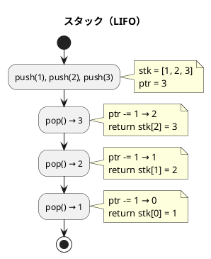
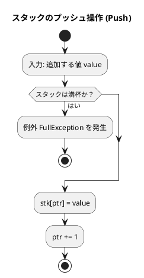
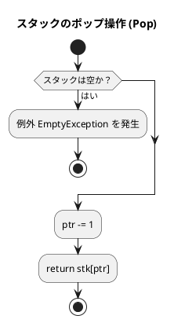
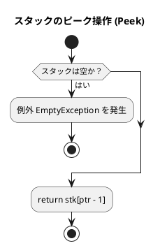
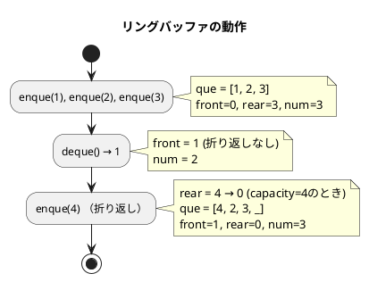
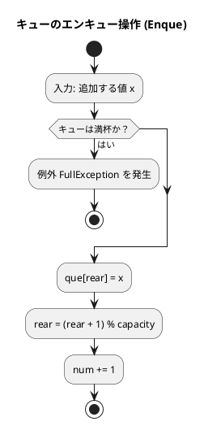
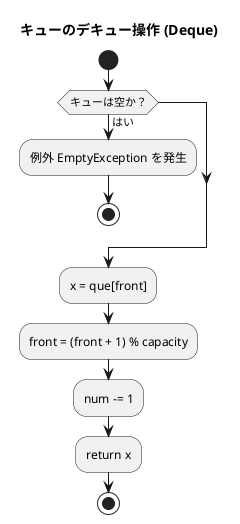
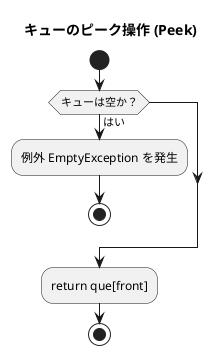

# 第 4 章 スタックとキュー

## はじめに

前章では探索アルゴリズムを学びました。この章では、データを特定の順序で格納・取り出すための基本的なデータ構造である「スタック」と「キュー」について TDD で実装します。

スタックとキューは、多くのアルゴリズムやプログラムの基礎となる重要なデータ構造です。これらの構造は、データの追加と削除の方法が異なり、それぞれ特定の問題に対して効率的な解決策を提供します。

### 目次

1. [スタック](#1-スタック)
2. [キュー](#2-キュー)
3. [スタックとキューの比較](#スタックとキューの比較)

---

## 1. スタック

スタックは **LIFO（Last In First Out）** — 後から入れたものを最初に取り出す — データ構造です。

皿を積み重ねるのに似ています。新しい皿は常に一番上に置かれ（プッシュ）、皿を取るときも一番上から取ります（ポップ）。

スタックの主な操作は以下の通りです：

- **プッシュ（Push）**: スタックの一番上にデータを追加する
- **ポップ（Pop）**: スタックの一番上からデータを取り出す
- **ピーク（Peek）**: スタックの一番上のデータを参照する（取り出さない）

スタックは、関数呼び出し、式の評価、構文解析、バックトラッキングなど、多くのアルゴリズムで使用されます。

### Red — 失敗するテストを書く

```csharp
// Algorithm.Tests/StackQueueTest.cs
public class FixedStackTest
{
    private readonly FixedStack<int> _stack = new(64);

    [Fact] public void 初期状態は空() { Assert.True(_stack.IsEmpty()); Assert.False(_stack.IsFull()); }
    [Fact] public void pushしてpop() { _stack.Push(1); Assert.Equal(1, _stack.Pop()); }
    [Fact]
    public void 複数pushしてLIFO順にpop()
    {
        _stack.Push(1); _stack.Push(2); _stack.Push(3);
        Assert.Equal(3, _stack.Pop());  // LIFO
    }
}
```

### Green — テストを通す実装

```csharp
// Algorithm/FixedStack.cs
namespace Algorithm;

/// <summary>第4章 固定長スタック</summary>
public class FixedStack<T>
{
    public class EmptyException() : Exception("スタックは空です");
    public class FullException() : Exception("スタックは満杯です");

    private readonly object?[] _stk;
    private readonly int _capacity;
    private int _ptr;

    public FixedStack(int capacity) { _capacity = capacity; _stk = new object[capacity]; _ptr = 0; }

    public bool IsEmpty() => _ptr <= 0;
    public bool IsFull() => _ptr >= _capacity;
    public int Size() => _ptr;
    public int GetCapacity() => _capacity;

    public void Push(T value) { if (IsFull()) throw new FullException(); _stk[_ptr++] = value; }

    public T Pop() { if (IsEmpty()) throw new EmptyException(); return (T)_stk[--_ptr]!; }

    public T Peek() { if (IsEmpty()) throw new EmptyException(); return (T)_stk[_ptr - 1]!; }

    public int Find(T value)
    {
        for (int i = _ptr - 1; i >= 0; i--)
            if (_stk[i] is T v && v!.Equals(value)) return i;
        return -1;
    }

    public bool Contains(T value) => Find(value) != -1;

    public int Count(T value)
    {
        int c = 0;
        for (int i = 0; i < _ptr; i++)
            if (_stk[i] is T v && v!.Equals(value)) c++;
        return c;
    }

    public void Clear() => _ptr = 0;
}
```

### C# 標準ライブラリの Stack<T> を使った実装

C# の標準ライブラリには `System.Collections.Generic.Stack<T>` クラスが用意されており、スタックを簡潔に利用できます：

```csharp
using System.Collections.Generic;

var stack = new Stack<int>();
stack.Push(1);
stack.Push(2);
stack.Push(3);
int top = stack.Pop();   // 3
int peek = stack.Peek(); // 2
bool empty = stack.Count == 0;
```

### 解説

スタックの実装には、主に以下の 2 つの方法があります：

1. **配列を使った実装**：
   - 長所：シンプルで理解しやすい
   - 短所：固定長の場合、容量を超えるとエラーになる

2. **標準ライブラリの Stack<T> を使った実装**：
   - 長所：C# の標準ライブラリを活用でき、コードが簡潔になる
   - 短所：内部実装の詳細が隠蔽されるため、学習目的では理解しにくい場合がある

どちらの実装も、スタックの基本操作（プッシュ、ポップ、ピーク）を提供します。また、便宜上、要素の検索や個数のカウントなどの追加機能も実装しています。

### アルゴリズムの考え方



**主な操作**:

| 操作 | メソッド | 計算量 | 説明 |
|------|---------|--------|------|
| プッシュ | `Push(value)` | O(1) | 頂上に追加 |
| ポップ | `Pop()` | O(1) | 頂上から取り出す |
| ピーク | `Peek()` | O(1) | 頂上を参照（取り出さない） |
| 探索 | `Find(value)` | O(n) | 値のインデックスを返す |
| カウント | `Count(value)` | O(n) | 値の出現回数 |

### フローチャート

#### スタックのプッシュ操作

以下は、スタックのプッシュ操作のフローチャートです：



この図は、スタックのプッシュ操作（FixedStack クラスの Push メソッド）のフローチャートです。

アルゴリズムの流れ：
1. 追加する値 value を入力として受け取ります
2. スタックが満杯かどうかをチェックします
   - 満杯の場合、例外 FullException を発生させて終了します
3. スタック配列の現在のポインタ位置に value を格納します
4. ポインタを 1 増やします（次の格納位置を指すように）

#### スタックのポップ操作

以下は、スタックのポップ操作のフローチャートです：



この図は、スタックのポップ操作（FixedStack クラスの Pop メソッド）のフローチャートです。

アルゴリズムの流れ：
1. スタックが空かどうかをチェックします
   - 空の場合、例外 EmptyException を発生させて終了します
2. ポインタを 1 減らします（最後に追加された要素の位置を指すように）
3. スタック配列のポインタ位置の値を返します

#### スタックのピーク操作

以下は、スタックのピーク操作のフローチャートです：



この図は、スタックのピーク操作（FixedStack クラスの Peek メソッド）のフローチャートです。

アルゴリズムの流れ：
1. スタックが空かどうかをチェックします
   - 空の場合、例外 EmptyException を発生させて終了します
2. スタック配列の ptr - 1 位置（最後に追加された要素の位置）の値を返します
   - ポインタは変更せず、値の参照のみを行います

スタックの基本操作は非常にシンプルで効率的です。すべての操作が O(1) の時間複雑度で実行できるため、多くのアルゴリズムで活用されています。

---

## 2. キュー

キューは **FIFO（First In First Out）** — 最初に入れたものを最初に取り出す — データ構造です。

銀行の行列をイメージすると分かりやすいです。新しい人は列の最後尾に並び（エンキュー）、サービスを受けるのは列の先頭の人からです（デキュー）。

キューの主な操作は以下の通りです：

- **エンキュー（Enqueue）**: キューの末尾にデータを追加する
- **デキュー（Dequeue）**: キューの先頭からデータを取り出す
- **ピーク（Peek）**: キューの先頭のデータを参照する（取り出さない）

キューは、幅優先探索、プリンタのスプーリング、プロセススケジューリングなど、多くのアルゴリズムやシステムで使用されます。

### 単純な配列によるキューの実現

単純な配列を使ってキューを実装する場合、デキュー操作を行うたびに残りの要素をシフトする必要があり、効率が悪くなります（O(n) の時間複雑度）。そのため、実用的なキューの実装には、リングバッファを使用することが一般的です。

### リングバッファ

固定長配列でキューを実現する際、素朴な実装では先頭要素を取り出すたびにすべての要素をシフトする必要があり O(n) のコストがかかります。

**リングバッファ**を使うと、`front`（先頭インデックス）と `rear`（末尾インデックス）を管理することで、エンキュー・デキューを O(1) で実現できます。



### Red — 失敗するテストを書く

```csharp
// Algorithm.Tests/StackQueueTest.cs
public class FixedQueueTest
{
    private readonly FixedQueue<int> _queue = new(64);

    [Fact]
    public void 複数enqueしてFIFO順にdeque()
    {
        _queue.Enque(1); _queue.Enque(2); _queue.Enque(3);
        Assert.Equal(1, _queue.Deque());  // FIFO
    }

    [Fact]
    public void リングバッファの折り返し()
    {
        var q = new FixedQueue<int>(3);
        q.Enque(1); q.Enque(2); q.Enque(3);
        q.Deque();   // 1 を取り出す
        q.Enque(4);  // 空き位置（先頭）に追加
        Assert.Equal(2, q.Deque());
        Assert.Equal(3, q.Deque());
        Assert.Equal(4, q.Deque());
    }
}
```

### Green — テストを通す実装

```csharp
// Algorithm/FixedQueue.cs
namespace Algorithm;

/// <summary>第4章 固定長キュー（リングバッファ）</summary>
public class FixedQueue<T>
{
    public class EmptyException() : Exception("キューは空です");
    public class FullException() : Exception("キューは満杯です");

    private readonly object?[] _que;
    private readonly int _capacity;
    private int _front, _rear, _num;

    public FixedQueue(int capacity) { _capacity = capacity; _que = new object[capacity]; }

    public bool IsEmpty() => _num <= 0;
    public bool IsFull() => _num >= _capacity;
    public int Size() => _num;
    public int GetCapacity() => _capacity;

    public void Enque(T value)
    {
        if (IsFull()) throw new FullException();
        _que[_rear] = value; _rear = (_rear + 1) % _capacity; _num++;
    }

    public T Deque()
    {
        if (IsEmpty()) throw new EmptyException();
        T value = (T)_que[_front]!; _front = (_front + 1) % _capacity; _num--;
        return value;
    }

    public T Peek() { if (IsEmpty()) throw new EmptyException(); return (T)_que[_front]!; }

    public int Find(T value)
    {
        for (int i = 0; i < _num; i++)
        {
            int idx = (i + _front) % _capacity;
            if (_que[idx] is T v && v!.Equals(value)) return i;
        }
        return -1;
    }

    public bool Contains(T value) => Find(value) != -1;

    public int Count(T value)
    {
        int c = 0;
        for (int i = 0; i < _num; i++)
        {
            int idx = (i + _front) % _capacity;
            if (_que[idx] is T v && v!.Equals(value)) c++;
        }
        return c;
    }

    public void Clear() { _front = _rear = _num = 0; }
}
```

### 解説

キューの実装には、主に以下の 2 つの方法があります：

1. **単純な配列を使った実装**：
   - 長所：シンプルで理解しやすい
   - 短所：デキュー操作が非効率（O(n) の時間複雑度）

2. **リングバッファを使った実装**：
   - 長所：すべての操作が効率的（O(1) の時間複雑度）
   - 短所：実装がやや複雑

リングバッファを使った実装では、`_front` と `_rear` の 2 つのポインタを使用して、キューの先頭と末尾を追跡します。これにより、配列の物理的な終端に達した後も、論理的に連続したキューを維持することができます。

C# の標準ライブラリには、`System.Collections.Generic.Queue<T>` クラスがあり、これを使ってキューを簡単に利用することもできます。`Queue<T>` は内部的に動的配列で実装されており、追加と取り出しを効率的に行うことができます。

### フローチャート

#### キューのエンキュー操作

以下は、リングバッファを使ったキューのエンキュー操作のフローチャートです：



この図は、リングバッファを使ったキューのエンキュー操作（FixedQueue クラスの Enque メソッド）のフローチャートです。

アルゴリズムの流れ：
1. 追加する値 x を入力として受け取ります
2. キューが満杯かどうかをチェックします
   - 満杯の場合、例外 FullException を発生させて終了します
3. キュー配列の rear 位置（末尾）に x を格納します
4. rear を `(rear + 1) % capacity` で更新します（リングバッファの折り返し）
5. num（格納されているデータ数）を 1 増やします

#### キューのデキュー操作

以下は、リングバッファを使ったキューのデキュー操作のフローチャートです：



この図は、リングバッファを使ったキューのデキュー操作（FixedQueue クラスの Deque メソッド）のフローチャートです。

アルゴリズムの流れ：
1. キューが空かどうかをチェックします
   - 空の場合、例外 EmptyException を発生させて終了します
2. キュー配列の front 位置（先頭）の値を変数 x に格納します
3. front を `(front + 1) % capacity` で更新します（リングバッファの折り返し）
4. num（格納されているデータ数）を 1 減らします
5. 取り出した値 x を返します

#### キューのピーク操作

以下は、リングバッファを使ったキューのピーク操作のフローチャートです：



この図は、リングバッファを使ったキューのピーク操作（FixedQueue クラスの Peek メソッド）のフローチャートです。

アルゴリズムの流れ：
1. キューが空かどうかをチェックします
   - 空の場合、例外 EmptyException を発生させて終了します
2. キュー配列の front 位置（先頭）の値を返します
   - ポインタは変更せず、値の参照のみを行います

リングバッファを使ったキューの実装は、すべての操作が O(1) の時間複雑度で実行できるため、効率的です。また、配列の物理的な終端に達した後も、論理的に連続したキューを維持できる点が大きな利点です。

---

## テスト実行結果

```bash
$ dotnet test --filter "FullyQualifiedName~StackQueueTest" --verbosity normal

...（31 テスト全パス）...

テスト実行に成功しました。
```

---

## スタックとキューの比較

| 項目 | スタック | キュー |
|------|---------|--------|
| 取り出し順序 | LIFO（後入れ先出し） | FIFO（先入れ先出し） |
| 追加操作 | `Push()` | `Enque()` |
| 取り出し操作 | `Pop()` | `Deque()` |
| 主な用途 | 関数呼び出し、DFS | タスクキュー、BFS |
| 計算量（追加/取り出し） | O(1) | O(1) |

## まとめ

この章では、2 つの基本的なデータ構造、スタックとキューについて学びました：

1. **スタック**：後入れ先出し（LIFO）の原則に従うデータ構造。主な操作はプッシュ、ポップ、ピーク。

2. **キュー**：先入れ先出し（FIFO）の原則に従うデータ構造。主な操作はエンキュー、デキュー、ピーク。

これらのデータ構造は、それぞれ異なる問題に対して効率的な解決策を提供します。スタックは関数呼び出しや式の評価に適しており、キューは幅優先探索やプロセススケジューリングに適しています。

テスト駆動開発の手法を用いることで、これらのデータ構造の正確な実装と理解を深めることができました。

次の章では、再帰アルゴリズムについて学んでいきましょう。

## 参考文献

- 『新・明解 C# で学ぶアルゴリズムとデータ構造』 — 柴田望洋
- 『テスト駆動開発』 — Kent Beck
