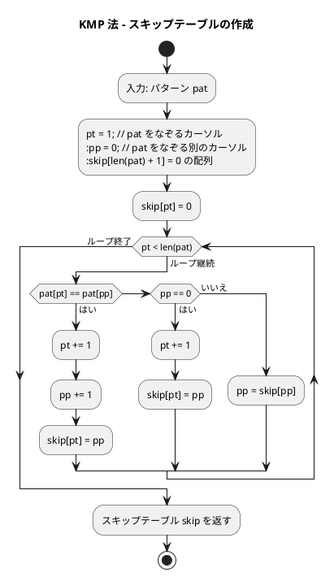
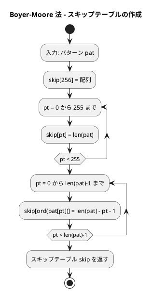
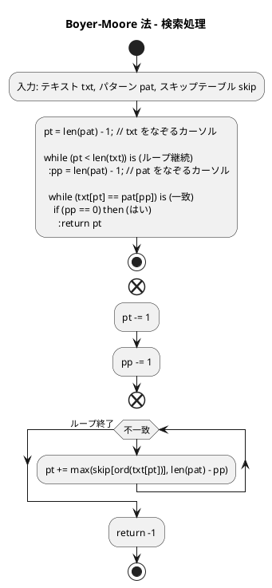

# 第 7 章 文字列処理

## はじめに

前章ではソートアルゴリズムを学びました。この章では、プログラミングにおいて非常に重要な「文字列処理」について TDD で実装します。

文字列処理は、テキストデータの操作や解析に欠かせない技術です。特に、テキスト検索、パターンマッチング、データ抽出などの処理は、多くのアプリケーションで必要とされます。

この章では、まず C# における基本的な文字列操作について学び、その後、テスト駆動開発の手法を用いて、効率的な文字列検索アルゴリズムを実装していきます。

### 目次

1. [C# の文字列基本操作](#c-の文字列基本操作)
2. [ブルートフォース文字列探索（力まかせ法）](#1-ブルートフォース文字列探索)
3. [KMP 法](#2-kmp-法)
4. [Boyer-Moore 法](#3-boyer-moore-法)
5. [文字カウント・逆順・回文判定](#4-文字カウント逆順回文判定)

---

## C# の文字列基本操作

C# では、文字列は不変（immutable）な参照型オブジェクトとして扱われます。`System.String` クラス（`string` キーワード）には文字列を操作するための豊富なメソッドが用意されており、これらを使うことで様々な文字列処理を簡単に行うことができます。

### 文字列の生成と基本操作

```csharp
// 文字列の生成
string s1 = "Hello";
string s2 = "World";
string s3 = @"This is a
multiline string";

// 文字列の連結
string s = s1 + " " + s2;  // "Hello World"

// 文字列の繰り返し（C# 8.0 以降）
string repeated = string.Concat(Enumerable.Repeat(s1, 3));  // "HelloHelloHello"

// 文字列の長さ
int length = s1.Length;  // 5

// 文字へのアクセス
char firstChar = s1[0];   // 'H'
char lastChar = s1[^1];   // 'o'

// 部分文字列
string substring = s1.Substring(1, 3);  // "ell"
// または Range 構文（C# 8.0 以降）
string substring2 = s1[1..4];           // "ell"
```

### 文字列のメソッド

C# の文字列には、多くの便利なメソッドが用意されています：

```csharp
string s = "Hello, World!";

// 検索
int pos = s.IndexOf("World");   // 7
int pos2 = s.IndexOf("CSharp"); // -1（見つからない場合）

// 置換
string newS = s.Replace("World", "CSharp");  // "Hello, CSharp!"

// 分割
string[] parts = s.Split(", ");  // ["Hello", "World!"]

// 結合
string joined = string.Join(", ", new[] { "Hello", "World" });  // "Hello, World"

// 大文字・小文字変換
string upper = s.ToUpper();  // "HELLO, WORLD!"
string lower = s.ToLower();  // "hello, world!"

// 先頭・末尾の処理
string stripped = "  Hello  ".Trim();      // "Hello"
bool starts = s.StartsWith("Hello");       // true
bool ends = s.EndsWith("World!");          // true
```

### 文字列のフォーマット

C# では、文字列のフォーマットにいくつかの方法があります：

```csharp
string name = "Alice";
int age = 30;

// string.Format
string s1 = string.Format("Name: {0}, Age: {1}", name, age);  // "Name: Alice, Age: 30"

// 文字列補間（C# 6.0 以降）
string s2 = $"Name: {name}, Age: {age}";  // "Name: Alice, Age: 30"

// 複合書式指定
string s3 = $"Price: {123.456:F2}";  // "Price: 123.46"
```

これらの基本的な文字列操作を理解した上で、より高度な文字列検索アルゴリズムを見ていきましょう。

---

## 1. ブルートフォース文字列探索

テキストを左から順にパターンと比較する最もシンプルな方法です。

### Red — 失敗するテストを書く

```csharp
// Algorithm.Tests/StringAlgorithmsTest.cs
public class BfMatchTest
{
    [Fact] public void 見つかる() => Assert.Equal(12, StringAlgorithms.BfMatch("ABCXDEZCABACABAB", "ABAB"));
    [Fact] public void 見つからない() => Assert.Equal(-1, StringAlgorithms.BfMatch("ABCDE", "XYZ"));
}
```

### Green — テストを通す実装

```csharp
// Algorithm/StringAlgorithms.cs
public static class StringAlgorithms
{
    public static int BfMatch(string txt, string pat)
    {
        int n = txt.Length, m = pat.Length;
        if (m == 0) return 0;
        for (int i = 0; i <= n - m; i++)
        {
            int j = 0;
            while (j < m && txt[i + j] == pat[j]) j++;
            if (j == m) return i;
        }
        return -1;
    }
}
```

### 解説

力まかせ法（ブルートフォース法）のアルゴリズムは以下の通りです：

1. テキスト内の各位置から順にパターンとの一致を調べる
2. 一致しない文字が見つかったら、テキストのカーソルを 1 つ進めて再度パターンの先頭から比較を始める
3. パターン全体が一致したら、その位置を返す

**計算量**:
- 最良の場合：O(m)（m はパターンの長さ）
- 最悪の場合：O(n × m)（n はテキストの長さ）
- 平均の場合：O(n × m)

力まかせ法は単純で理解しやすいですが、テキストとパターンが長い場合には効率が悪くなります。そこで、より効率的なアルゴリズムが開発されました。

### フローチャート

```plantuml
@startuml
title 力まかせ法による文字列検索 (BfMatch)

start
:入力: テキスト txt, パターン pat;
:pt = 0; // txt をなぞるカーソル
:pp = 0; // pat をなぞるカーソル

while (pt < len(txt) && pp < len(pat)) is (ループ継続)
  if (txt[pt] == pat[pp]) then (はい)
    :pt += 1;
    :pp += 1;
  else (いいえ)
    :pt = pt - pp + 1;
    :pp = 0;
  endif
endwhile (ループ終了)

if (pp == len(pat)) then (はい)
  :return pt - pp;
else (いいえ)
  :return -1;
endif

stop
@enduml
```

アルゴリズムの流れ：
1. テキスト txt とパターン pat を入力として受け取ります
2. 変数 pt を 0 で初期化します（txt をなぞるカーソル）
3. 変数 pp を 0 で初期化します（pat をなぞるカーソル）
4. pt が txt の長さ未満かつ pp が pat の長さ未満である間、以下の処理を繰り返します：
   - txt[pt] と pat[pp] が一致する場合：両方のカーソルを進めます
   - 一致しない場合：pt を pt - pp + 1 に更新し（次の比較開始位置）、pp を 0 にリセットします
5. ループ終了後、pp が pat の長さと等しい場合：pt - pp を返します（パターンが見つかった位置）
6. それ以外の場合：-1 を返します

---

## 2. KMP 法

KMP 法（Knuth-Morris-Pratt 法）は、力まかせ法を改良した効率的な文字列検索アルゴリズムです。失敗関数テーブル（スキップテーブル）を使い、不一致が発生した際にスキップ量を最適化します。パターン内の情報を利用して、不要な比較を省略します。

### Red — 失敗するテストを書く

```csharp
public class KmpMatchTest
{
    [Fact] public void 見つかる() => Assert.Equal(12, StringAlgorithms.KmpMatch("ABCXDEZCABACABAB", "ABAB"));
    [Fact] public void 見つからない() => Assert.Equal(-1, StringAlgorithms.KmpMatch("ABCDE", "XYZ"));
}
```

### Green — テストを通す実装

```csharp
private static int[] BuildKmpTable(string pat)
{
    int m = pat.Length;
    int[] table = new int[m];
    int k = 0;
    for (int i = 1; i < m; i++)
    {
        while (k > 0 && pat[k] != pat[i]) k = table[k - 1];
        if (pat[k] == pat[i]) k++;
        table[i] = k;
    }
    return table;
}

public static int KmpMatch(string txt, string pat)
{
    int n = txt.Length, m = pat.Length;
    if (m == 0) return 0;
    int[] table = BuildKmpTable(pat);
    int j = 0;
    for (int i = 0; i < n; i++)
    {
        while (j > 0 && txt[i] != pat[j]) j = table[j - 1];
        if (txt[i] == pat[j]) j++;
        if (j == m) return i - m + 1;
    }
    return -1;
}
```

### 解説

KMP 法の核心は、パターン内の情報を利用して「スキップテーブル」を作成し、不一致が発生した場合に効率的にカーソルを移動させることです。

スキップテーブルは、パターン内の部分文字列が一致する場合に、どこまで戻ればよいかを示します。これにより、すでに比較した文字を再度比較する必要がなくなります。

**計算量**:
- 最良の場合：O(m)（m はパターンの長さ）
- 最悪の場合：O(n + m)（n はテキストの長さ）
- 平均の場合：O(n + m)

KMP 法は、力まかせ法よりも効率的ですが、スキップテーブルの作成と理解が複雑です。

### フローチャート

KMP 法は 2 つの主要なステップから成ります：スキップテーブルの作成と実際の検索です。

#### スキップテーブルの作成



#### 検索処理

```plantuml
@startuml
title KMP 法 - 検索処理

start
:入力: テキスト txt, パターン pat, スキップテーブル skip;
:pt = 0; // txt をなぞるカーソル
:pp = 0; // pat をなぞるカーソル

while (pt < len(txt) && pp < len(pat)) is (ループ継続)
  if (txt[pt] == pat[pp]) then (はい)
    :pt += 1;
    :pp += 1;
  elseif (pp == 0) then (はい)
    :pt += 1;
  else (いいえ)
    :pp = skip[pp];
  endif
endwhile (ループ終了)

if (pp == len(pat)) then (はい)
  :return pt - pp;
else (いいえ)
  :return -1;
endif

stop
@enduml
```

アルゴリズムの流れ：

1. **スキップテーブルの作成**:
   - パターン内の部分文字列が一致する場合に、どこまで戻ればよいかを示すテーブルを作成します
   - パターン自身を使って、パターン内の接頭辞と接尾辞の一致を調べます
   - 一致する最長の接頭辞の長さをスキップテーブルに格納します

2. **検索処理**:
   - テキストとパターンを先頭から比較していきます
   - 文字が一致する場合は、両方のカーソルを進めます
   - 不一致が発生した場合：
     - パターンのカーソルが先頭（pp = 0）なら、テキストのカーソルだけを進めます
     - それ以外の場合は、スキップテーブルを使ってパターンのカーソルを効率的に移動させます
   - パターン全体が一致したら、その位置を返します

KMP 法の大きな利点は、不一致が発生した場合でも、すでに比較した情報を活用してパターンのカーソルを効率的に移動させることです。時間計算量は O(n + m) となり、テキストとパターンが長い場合に特に効果的です。

---

## 3. Boyer-Moore 法

Boyer-Moore 法は、さらに効率的な文字列検索アルゴリズムです。パターンを右から左へ比較し、不一致が発生した場合に大きくスキップすることで、多くの比較を省略します。

### Red — 失敗するテストを書く

```csharp
public class BmMatchTest
{
    [Fact] public void 見つかる() => Assert.Equal(12, StringAlgorithms.BmMatch("ABCXDEZCABACABAB", "ABAB"));
    [Fact] public void 見つからない() => Assert.Equal(-1, StringAlgorithms.BmMatch("ABCDE", "XYZ"));
}
```

### Green — テストを通す実装

```csharp
public static int BmMatch(string txt, string pat)
{
    int n = txt.Length, m = pat.Length;
    if (m == 0) return 0;
    var badChar = new Dictionary<char, int>();
    for (int i = 0; i < m; i++) badChar[pat[i]] = i;
    int s = 0;
    while (s <= n - m)
    {
        int j = m - 1;
        while (j >= 0 && pat[j] == txt[s + j]) j--;
        if (j < 0) return s;
        int skip = j - (badChar.TryGetValue(txt[s + j], out int bc) ? bc : -1);
        s += Math.Max(1, skip);
    }
    return -1;
}
```

### 解説

Boyer-Moore 法の特徴は以下の通りです：

1. パターンを右から左へ比較する
2. 不一致が発生した場合、以下の 2 つのルールに基づいてスキップする：
   - 不一致文字ルール：テキスト内の不一致文字がパターン内に存在するかどうかに基づいてスキップ
   - 一致接尾辞ルール：パターン内の部分文字列の一致に基づいてスキップ

**計算量**:
- 最良の場合：O(n / m)（n はテキストの長さ、m はパターンの長さ）
- 最悪の場合：O(n × m)
- 平均の場合：O(n)

Boyer-Moore 法は、実用的な文字列検索アルゴリズムとして広く使用されています。特に、パターンが長い場合や、アルファベットの種類が多い場合に効率的です。

### フローチャート

Boyer-Moore 法も 2 つの主要なステップから成ります：スキップテーブルの作成と実際の検索です。

#### スキップテーブルの作成



#### 検索処理



アルゴリズムの流れ：

1. **スキップテーブルの作成**:
   - 各文字について、パターン内での最後の出現位置に基づいてスキップ量を決定します
   - デフォルトでは、パターンの長さだけスキップします
   - パターン内に出現する文字については、その位置に基づいてスキップ量を調整します

2. **検索処理**:
   - パターンを右から左へ比較します（パターンの末尾から開始）
   - 文字が一致する限り、両方のカーソルを左に移動します
   - パターン全体が一致したら（pp = 0 になったら）、その位置を返します
   - 不一致が発生した場合：
     - 不一致文字がパターン内にある場合、その位置に基づいてスキップします
     - パターン内にない場合、パターン全体をスキップします

Boyer-Moore 法の大きな特徴は、パターンを右から左へ比較することと、不一致が発生した場合に大きくスキップできることです。理想的な状況では、テキストの文字の多くを比較せずに済むため、非常に効率的です。最良の場合、O(n/m) という驚異的な時間計算量を達成できます。

---

## 4. 文字カウント・逆順・回文判定

```csharp
public static Dictionary<char, int> CountChars(string s)
{
    var result = new Dictionary<char, int>();
    foreach (char c in s)
    {
        result.TryGetValue(c, out int count);
        result[c] = count + 1;
    }
    return result;
}

public static string ReverseString(string s)
{
    var arr = s.ToCharArray();
    System.Array.Reverse(arr);
    return new string(arr);
}

public static bool IsPalindrome(string s) => s == ReverseString(s);
```

---

## テスト実行結果

```bash
$ dotnet test --filter "StringAlgorithmsTest" --verbosity normal

...（27 テスト全パス）...

テスト実行に成功しました。
```

---

## 文字列探索アルゴリズムの比較

| アルゴリズム | 計算量 | 特徴 |
|-------------|--------|------|
| ブルートフォース | O(n × m) | シンプル、小規模に有効 |
| KMP 法 | O(n + m) | 最悪でも線形、前処理が必要 |
| Boyer-Moore 法 | O(n / m) 平均 | 大規模テキストで最速 |

## まとめ

この章では、C# における文字列処理について学びました：

1. **基本的な文字列操作** — 文字列の生成、連結、部分文字列、メソッドなど
2. **文字列検索アルゴリズム**：
   - 力まかせ法（ブルートフォース法） — 最も単純な方法
   - KMP 法 — パターン内の情報を利用して効率化
   - Boyer-Moore 法 — 右から左への比較と大きなスキップで効率化

文字列処理は、テキストデータを扱う多くのアプリケーションで重要な役割を果たします。効率的な文字列検索アルゴリズムを理解することで、大量のテキストデータを効率的に処理することができます。

テスト駆動開発の手法を用いることで、これらの複雑な文字列検索アルゴリズムの正確な実装と理解を深めることができました。

次の章では、リストについて学んでいきましょう。

## 参考文献

- 『新・明解 C# で学ぶアルゴリズムとデータ構造』 — 柴田望洋
- 『テスト駆動開発』 — Kent Beck
