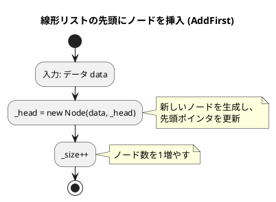
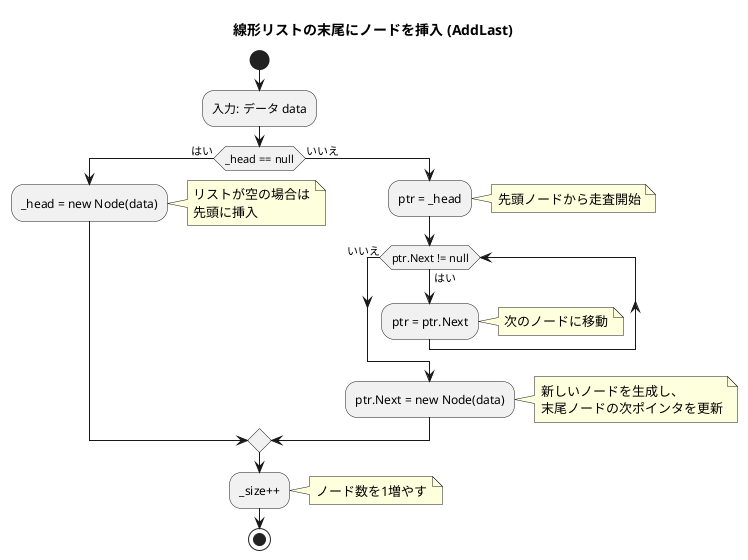
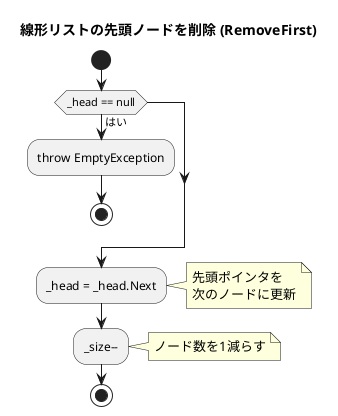
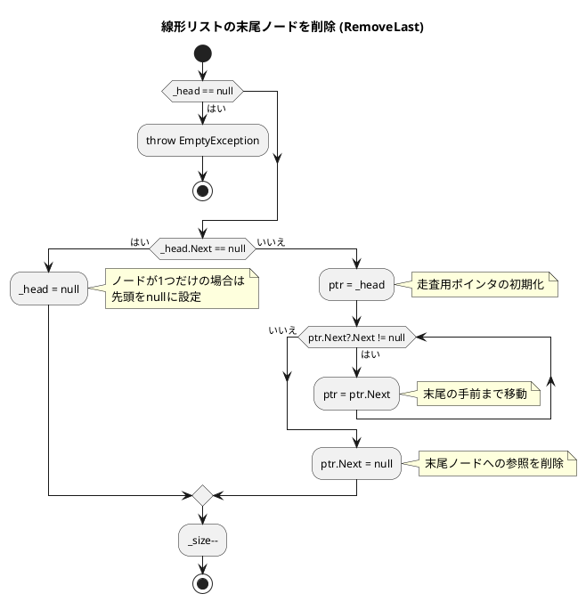
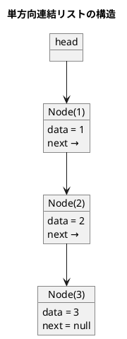

# 第 8 章 リスト

## はじめに

前章までで、配列や探索アルゴリズム、スタック、キュー、再帰、ソートアルゴリズム、文字列処理などを学んできました。この章では、データ構造の基本である「**リスト（連結リスト）**」を TDD で実装します。

配列と異なり、連結リストはメモリ上に不連続に配置されたノードをポインタで繋ぎます。要素の挿入・削除が O(1) ですが、ランダムアクセスは O(n) です。

### 目次

1. [リストとは](#リストとは)
2. [線形リスト（単方向連結リスト）](#1-線形リスト単方向連結リスト)
3. [カーソルによる線形リスト](#3-カーソルによる線形リスト)
4. [双方向連結リスト](#2-双方向連結リスト)

---

## リストとは

リストとは、データを順序付けて格納するデータ構造です。配列と似ていますが、リストは要素の追加や削除が容易であるという特徴があります。

リストには様々な種類があります：

- **線形リスト**：最も基本的なリスト構造で、各要素が一方向に連結されています。
- **連結リスト**：各要素（ノード）が次の要素へのポインタを持つリスト構造です。
- **循環リスト**：最後の要素が最初の要素を指す連結リストです。
- **双方向リスト**：各要素が前後の要素へのポインタを持つリスト構造です。

それでは、これらのリスト構造を順に実装していきましょう。

---

## 1. 線形リスト（単方向連結リスト）

各ノードが次のノードへの参照を持ちます。

### Red — 失敗するテストを書く

```csharp
// Algorithm.Tests/LinkedListTest.cs
public class SinglyLinkedListTest
{
    private readonly SinglyLinkedList<int> _lst = new();

    [Fact] public void 初期状態は空() { Assert.Equal(0, _lst.Size()); Assert.True(_lst.IsEmpty()); }
    [Fact] public void addLast() { _lst.AddLast(1); _lst.AddLast(2); Assert.Equal(2, _lst.Size()); }
    [Fact] public void 探索_見つかる() { _lst.AddLast(10); _lst.AddLast(20); _lst.AddLast(30); Assert.True(_lst.Contains(20)); }
}
```

### Green — テストを通す実装

```csharp
// Algorithm/SinglyLinkedList.cs
public class SinglyLinkedList<T>
{
    public class EmptyException() : Exception("リストは空です");

    private class Node(T data, Node? next = null)
    {
        public T Data = data;
        public Node? Next = next;
    }

    private Node? _head;
    private int _size;

    public int Size() => _size;
    public bool IsEmpty() => _head == null;
    public bool Contains(T data) => Search(data) != null;

    private Node? Search(T data)
    {
        var ptr = _head;
        while (ptr != null)
        {
            if (ptr.Data!.Equals(data)) return ptr;
            ptr = ptr.Next;
        }
        return null;
    }

    public void AddLast(T data)
    {
        if (_head == null) { _head = new Node(data); }
        else
        {
            var ptr = _head;
            while (ptr.Next != null) ptr = ptr.Next;
            ptr.Next = new Node(data);
        }
        _size++;
    }
}
```

### Refactor — 設計を改善する

テストが通った状態で、コードの意図を明確にします。先頭への挿入 `AddFirst` と各種削除メソッドも追加します。

```csharp
public class SinglyLinkedList<T>
{
    public class EmptyException() : Exception("リストは空です");

    private class Node(T data, Node? next = null)
    {
        public T Data = data;
        public Node? Next = next;
    }

    private Node? _head;
    private int _size;

    public int Size() => _size;
    public bool IsEmpty() => _head == null;
    public bool Contains(T data) => Search(data) != null;

    private Node? Search(T data)
    {
        var ptr = _head;
        while (ptr != null)
        {
            if (ptr.Data!.Equals(data)) return ptr;
            ptr = ptr.Next;
        }
        return null;
    }

    public void AddFirst(T data) { _head = new Node(data, _head); _size++; }

    public void AddLast(T data)
    {
        if (_head == null) { _head = new Node(data); }
        else
        {
            var ptr = _head;
            while (ptr.Next != null) ptr = ptr.Next;
            ptr.Next = new Node(data);
        }
        _size++;
    }

    public void RemoveFirst()
    {
        if (_head == null) throw new EmptyException();
        _head = _head.Next;
        _size--;
    }

    public void RemoveLast()
    {
        if (_head == null) throw new EmptyException();
        if (_head.Next == null) { _head = null; }
        else
        {
            var ptr = _head;
            while (ptr.Next?.Next != null) ptr = ptr.Next;
            ptr.Next = null;
        }
        _size--;
    }

    public bool Remove(T data)
    {
        if (_head == null) return false;
        if (_head.Data!.Equals(data)) { _head = _head.Next; _size--; return true; }
        var ptr = _head;
        while (ptr.Next != null)
        {
            if (ptr.Next.Data!.Equals(data))
            {
                ptr.Next = ptr.Next.Next;
                _size--;
                return true;
            }
            ptr = ptr.Next;
        }
        return false;
    }

    public void Clear() { _head = null; _size = 0; }

    public List<T> ToList()
    {
        var result = new List<T>();
        var ptr = _head;
        while (ptr != null) { result.Add(ptr.Data); ptr = ptr.Next; }
        return result;
    }
}
```

### フローチャート

#### 先頭にノードを挿入（AddFirst）



アルゴリズムの流れ：
1. データ data を入力として受け取ります
2. 新しいノードを生成し、その次ポインタに現在の先頭ノード（_head）を設定します
3. 先頭ポインタ（_head）を新しいノードに更新します
4. ノード数（_size）を 1 増やします

この操作は、新しいノードを生成して現在の先頭ノードの前に挿入し、先頭ポインタを更新します。時間計算量は O(1) です。

#### 末尾にノードを挿入（AddLast）



アルゴリズムの流れ：
1. データ data を入力として受け取ります
2. リストが空かどうかをチェックします
   - リストが空の場合（_head が null）：新しいノードを生成して先頭に設定し、終了します
3. 変数 ptr に先頭ノード（_head）を代入します
4. ptr.Next が null でない間、次のノードに移動します
5. 新しいノードを生成し、末尾ノードの次ポインタ（ptr.Next）に設定します
6. ノード数（_size）を 1 増やします

この操作は、リストの末尾までたどってから新しいノードを追加します。リストの長さに比例した時間がかかるため、時間計算量は O(n) です。

#### 先頭ノードを削除（RemoveFirst）



この操作は、先頭ノードへの参照を削除し、次のノードを新しい先頭ノードとします。時間計算量は O(1) です。

#### 末尾ノードを削除（RemoveLast）



この操作は、リストの末尾までたどってから末尾ノードへの参照を削除します。時間計算量は O(n) です。

### 解説

線形リストは、各ノードが次のノードへのポインタを持つデータ構造です。この実装では、以下の特徴があります：

1. **ノードクラス**：データと次のノードへのポインタを持ちます。
2. **リストクラス**：先頭ノードとノードの数を管理します。
3. **要素の追加**：先頭または末尾に要素を追加できます。
4. **要素の削除**：先頭または末尾の要素を削除できます。
5. **要素の探索**：指定した値を持つノードを探索できます。
6. **イテレーション**：`ToList()` でリストの要素を順に取得できます。

線形リストは、要素の追加や削除が容易であるという特徴があります。特に、先頭への追加や削除は O(1) の時間で行えます。一方、末尾への追加や削除、要素の探索は O(n) の時間がかかります。

### アルゴリズムの考え方



**主な操作の計算量**:

| 操作 | 先頭 | 末尾 | 中間 |
|------|------|------|------|
| 挿入 | O(1) | O(n) | O(n) |
| 削除 | O(1) | O(n) | O(n) |
| 探索 | O(n) | O(n) | O(n) |

---

## 3. カーソルによる線形リスト

前節では、ポインタを使って線形リストを実装しました。しかし、配列を使って線形リストを実装することもできます。この方法を「カーソルによる線形リスト」と呼びます。

### Red — 失敗するテストを書く

```csharp
public class ArrayLinkedListTest
{
    [Fact] public void 初期化() => Assert.Equal(0, new ArrayLinkedList(100).Size());
    [Fact]
    public void addFirst()
    {
        var al = new ArrayLinkedList(100);
        al.AddFirst(1);
        al.AddFirst(2);
        Assert.Equal(2, al.Size());
    }
}
```

### Green — テストを通す実装

```csharp
// Algorithm/ArrayLinkedList.cs
public class ArrayLinkedList
{
    private const int Null = -1;

    private struct ArrayNode { public int Data; public int Next; public int Dnext; }

    private int _head, _max, _deleted;
    private readonly int _capacity;
    private readonly ArrayNode[] _n;
    private int _size;

    public ArrayLinkedList(int capacity)
    {
        _capacity = capacity;
        _head = Null;
        _max = Null;
        _deleted = Null;
        _n = new ArrayNode[capacity];
        for (int i = 0; i < capacity; i++)
        {
            _n[i].Next = Null;
            _n[i].Dnext = Null;
        }
    }

    public int Size() => _size;

    private int GetInsertIndex()
    {
        if (_deleted == Null)
        {
            if (_max + 1 < _capacity) { _max++; return _max; }
            return Null;
        }
        int rec = _deleted;
        _deleted = _n[rec].Dnext;
        return rec;
    }

    public void AddFirst(int data)
    {
        int ptr = _head, rec = GetInsertIndex();
        if (rec != Null)
        {
            _head = rec;
            _n[_head] = new ArrayNode { Data = data, Next = ptr, Dnext = Null };
            _size++;
        }
    }

    public void AddLast(int data)
    {
        if (_head == Null) { AddFirst(data); return; }
        int ptr = _head;
        while (_n[ptr].Next != Null) ptr = _n[ptr].Next;
        int rec = GetInsertIndex();
        if (rec != Null)
        {
            _n[ptr].Next = rec;
            _n[rec] = new ArrayNode { Data = data, Next = Null, Dnext = Null };
            _size++;
        }
    }

    public int Search(int data)
    {
        int ptr = _head;
        while (ptr != Null)
        {
            if (_n[ptr].Data == data) return ptr;
            ptr = _n[ptr].Next;
        }
        return Null;
    }

    public void RemoveFirst()
    {
        if (_head == Null) return;
        int ptr = _head;
        _head = _n[ptr].Next;
        _n[ptr].Dnext = _deleted;
        _deleted = ptr;
        _size--;
    }

    public int GetHeadData()
    {
        if (_head == Null) throw new IndexOutOfRangeException("empty");
        return _n[_head].Data;
    }
}
```

### 解説

カーソルによる線形リストは、配列を使って線形リストを実装する方法です。この実装では、以下の特徴があります：

1. **ノード構造体**：データ、次のノードへのインデックス、削除リストの次のノードへのインデックスを持ちます。
2. **リストクラス**：先頭ノードのインデックス、利用中の末尾レコードのインデックス、削除リストの先頭ノードのインデックス、リストの容量、ノードの配列、ノードの数を管理します。
3. **フリーリスト**：削除されたレコードを再利用するための仕組みです。

カーソルによる線形リストは、ポインタを使った線形リストと同様の機能を持ちますが、配列を使って実装するため、メモリの使用効率が良いという特徴があります。

---

## 4. 双方向連結リスト

各ノードが前後両方のノードへの参照を持ちます。番兵ノード（ダミー）を使い、先頭・末尾の特殊処理を不要にします。循環リストとしても機能し、最後のノードが番兵ノードを経由して先頭ノードに繋がります。

### Red — 失敗するテストを書く

```csharp
public class DoublyLinkedListTest
{
    private readonly DoublyLinkedList<int> _lst = new();

    [Fact]
    public void addLast()
    {
        _lst.AddLast(1);
        _lst.AddLast(2);
        Assert.Equal(2, _lst.Size());
    }

    [Fact]
    public void remove()
    {
        _lst.AddLast(1);
        _lst.AddLast(2);
        _lst.AddLast(3);
        Assert.True(_lst.Remove(2));
        Assert.False(_lst.Contains(2));
    }
}
```

### Green — テストを通す実装

```csharp
// Algorithm/DoublyLinkedList.cs
public class DoublyLinkedList<T>
{
    private class DNode(T? data)
    {
        public T? Data = data;
        public DNode? Prev;
        public DNode? Next;
    }

    private readonly DNode _sentinel;
    private int _size;

    public DoublyLinkedList()
    {
        _sentinel = new DNode(default);
        _sentinel.Prev = _sentinel;
        _sentinel.Next = _sentinel;
    }

    public int Size() => _size;
    public bool IsEmpty() => _size == 0;

    public bool Contains(T data)
    {
        var ptr = _sentinel.Next;
        while (ptr != _sentinel)
        {
            if (ptr!.Data!.Equals(data)) return true;
            ptr = ptr.Next;
        }
        return false;
    }

    public void AddFirst(T data)
    {
        var node = new DNode(data) { Prev = _sentinel, Next = _sentinel.Next };
        _sentinel.Next!.Prev = node;
        _sentinel.Next = node;
        _size++;
    }

    public void AddLast(T data)
    {
        var node = new DNode(data) { Prev = _sentinel.Prev, Next = _sentinel };
        _sentinel.Prev!.Next = node;
        _sentinel.Prev = node;
        _size++;
    }

    public bool Remove(T data)
    {
        if (IsEmpty()) return false;
        var ptr = _sentinel.Next;
        while (ptr != _sentinel)
        {
            if (ptr!.Data!.Equals(data))
            {
                ptr.Prev!.Next = ptr.Next;
                ptr.Next!.Prev = ptr.Prev;
                _size--;
                return true;
            }
            ptr = ptr.Next;
        }
        return false;
    }

    public void Clear()
    {
        _sentinel.Prev = _sentinel;
        _sentinel.Next = _sentinel;
        _size = 0;
    }

    public List<T> ToList()
    {
        var result = new List<T>();
        var ptr = _sentinel.Next;
        while (ptr != _sentinel)
        {
            result.Add(ptr!.Data!);
            ptr = ptr.Next;
        }
        return result;
    }
}
```

### 解説

循環・双方向連結リストは、各ノードが前後のノードへのポインタを持ち、最後のノードが番兵ノードを経由して最初のノードを指すリスト構造です。この実装では、以下の特徴があります：

1. **ノードクラス**：データ、前のノードへのポインタ、次のノードへのポインタを持ちます。
2. **番兵ノード（ダミーノード）**：先頭と末尾の特殊処理を不要にし、コードを簡潔にします。
3. **要素の追加**：先頭または末尾に O(1) で要素を追加できます。
4. **要素の削除**：ノードへの参照があれば O(1) で要素を削除できます。
5. **双方向走査**：現在着目しているノードから前後に移動できます。

---

## テスト実行結果

```bash
$ dotnet test --filter "LinkedListTest" --verbosity normal

...（30 テスト全パス）...

テスト実行に成功しました。
```

---

## 配列 vs 連結リスト

| 項目 | 配列 | 連結リスト |
|------|------|-----------|
| ランダムアクセス | O(1) | O(n) |
| 先頭への挿入 | O(n) | O(1) |
| 末尾への挿入 | O(1) | O(1)※単方向は O(n) |
| 途中への挿入 | O(n) | O(1)（ポインタ取得後） |
| メモリ使用 | 連続領域 | 不連続、ポインタ分余分 |

## まとめ

この章では、様々なリスト構造について学びました：

1. **線形リスト**：ポインタを使った実装。各ノードが次のノードへの参照を持つ基本的な連結リスト。
2. **カーソルによる線形リスト**：配列を使った実装。メモリ使用効率が良い。
3. **循環・双方向リスト**：各ノードが前後のノードへのポインタを持ち、番兵ノードにより先頭・末尾の操作が統一的に行える。

これらのリスト構造は、データを順序付けて格納するための基本的なデータ構造です。用途に応じて適切なリスト構造を選択することが重要です。

次の章では、木構造について学びます。

## 参考文献

- 『新・明解 C# で学ぶアルゴリズムとデータ構造』 — 柴田望洋
- 『テスト駆動開発』 — Kent Beck
