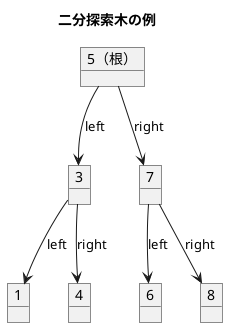
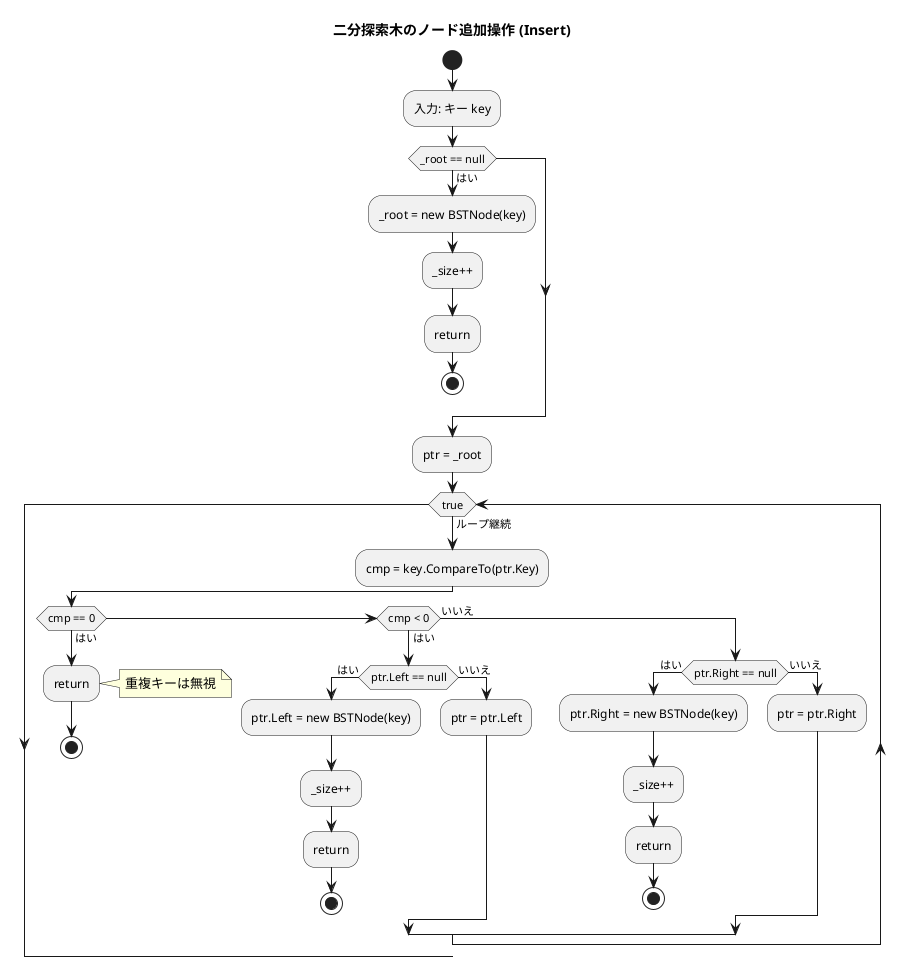
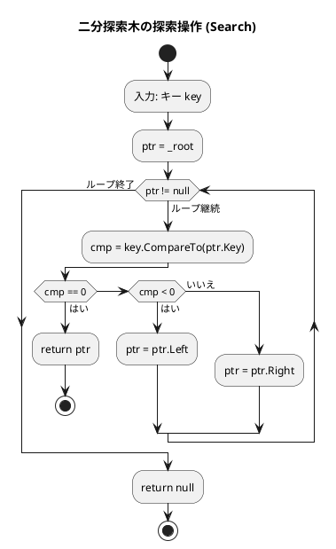
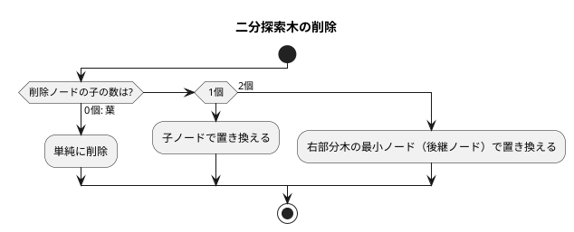
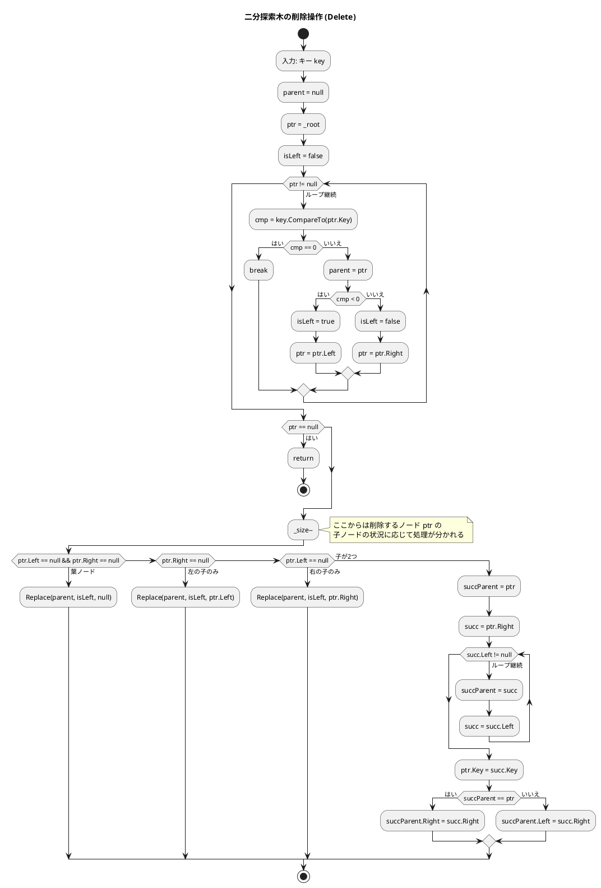
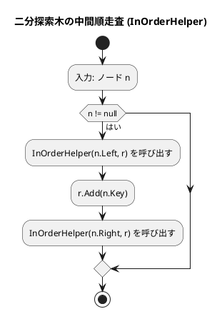

# 第 9 章 木構造

## はじめに

前章までで、配列、探索アルゴリズム、スタック、キュー、再帰、ソートアルゴリズム、文字列処理、リストなどを学んできました。この章では、データ構造の中でも特に重要な「**木構造**」、特に**二分探索木（BST: Binary Search Tree）**を TDD で実装します。

木構造はノードが親子関係で繋がった非線形データ構造です。二分探索木は左の子 < 親 < 右の子という性質を持ち、効率的な探索・挿入・削除を実現します。

### 目次

1. [木構造とは](#木構造とは)
2. [二分木](#二分木)
3. [二分探索木の性質](#二分探索木の性質)
4. [Red — 失敗するテストを書く](#red--失敗するテストを書く)
5. [Green — テストを通す実装](#green--テストを通す実装)
6. [ノードの削除](#ノードの削除)
7. [木の走査](#木の走査)
8. [ヒープ](#ヒープ)

---

## 木構造とは

木構造とは、データを階層的に表現するデータ構造です。木構造は、以下の要素から構成されます：

- **ノード**：データを格納する要素
- **エッジ**：ノード間の関係を表す線
- **ルート**：木の最上位に位置するノード
- **親ノード**：あるノードの上位に位置するノード
- **子ノード**：あるノードの下位に位置するノード
- **葉ノード**：子ノードを持たないノード

木構造は、以下のような特徴を持ちます：

1. 一つのルートノードから始まる
2. 各ノードは 0 個以上の子ノードを持つ
3. 循環構造を持たない（サイクルがない）

### 順序木と無順序木

木構造は、子ノードの順序に意味があるかどうかによって、「順序木」と「無順序木」に分類されます。

- **順序木**：子ノードの順序に意味がある木構造
- **無順序木**：子ノードの順序に意味がない木構造

### 順序木の探索

順序木を探索する方法には、主に以下の 3 つがあります：

1. **先行順（行きがけ順）探索**：ノード自身 → 左部分木 → 右部分木の順に探索
2. **中間順（通りがけ順）探索**：左部分木 → ノード自身 → 右部分木の順に探索
3. **後行順（帰りがけ順）探索**：左部分木 → 右部分木 → ノード自身の順に探索

これらの探索方法は、再帰を用いて実装することができます。

---

## 二分木

二分木は、各ノードが最大 2 つの子ノード（左の子と右の子）を持つ木構造です。二分木は、以下のような特徴を持ちます：

1. 各ノードは最大 2 つの子ノードを持つ
2. 左の子と右の子が明確に区別される
3. 空の二分木も存在する

二分木は、様々なアルゴリズムやデータ構造の基礎となります。例えば、二分探索木、ヒープ、ハフマン木などは、二分木の一種です。

---

## 二分探索木の性質



**性質**:
- 左部分木のすべてのキー < ルートのキー
- 右部分木のすべてのキー > ルートのキー
- 中順探索（left → root → right）は昇順になる

---

## Red — 失敗するテストを書く

```csharp
// Algorithm.Tests/TreeTest.cs
public class BinarySearchTreeTest
{
    private readonly BinarySearchTree<int> _bst = new();

    [Fact] public void 初期状態は空() => Assert.True(_bst.IsEmpty());

    [Fact]
    public void insertしてcontains()
    {
        _bst.Insert(5);
        Assert.True(_bst.Contains(5));
    }

    [Fact]
    public void 中順探索は昇順()
    {
        foreach (int v in new[] { 5, 3, 7, 1, 4, 6, 8 }) _bst.Insert(v);
        Assert.Equal([1, 3, 4, 5, 6, 7, 8], _bst.InOrder());
    }

    [Fact]
    public void 子が2つのノードの削除()
    {
        foreach (int v in new[] { 5, 3, 7, 1, 4 }) _bst.Insert(v);
        _bst.Delete(3);
        Assert.False(_bst.Contains(3));
    }
}
```

---

## Green — テストを通す実装

```csharp
// Algorithm/BinarySearchTree.cs
public class BinarySearchTree<T> where T : IComparable<T>
{
    public class EmptyException() : Exception("木は空です");

    private class BSTNode(T key)
    {
        public T Key = key;
        public BSTNode? Left, Right;
    }

    private BSTNode? _root;
    private int _size;

    public int Size() => _size;
    public bool IsEmpty() => _root == null;
    public bool Contains(T key) => Search(key) != null;

    private BSTNode? Search(T key)
    {
        var ptr = _root;
        while (ptr != null)
        {
            int cmp = key.CompareTo(ptr.Key);
            if (cmp == 0) return ptr;
            ptr = cmp < 0 ? ptr.Left : ptr.Right;
        }
        return null;
    }

    public void Insert(T key)
    {
        if (_root == null) { _root = new BSTNode(key); _size++; return; }
        var ptr = _root;
        while (true)
        {
            int cmp = key.CompareTo(ptr.Key);
            if (cmp == 0) return; // 重複キーは無視
            if (cmp < 0)
            {
                if (ptr.Left == null) { ptr.Left = new BSTNode(key); _size++; return; }
                ptr = ptr.Left;
            }
            else
            {
                if (ptr.Right == null) { ptr.Right = new BSTNode(key); _size++; return; }
                ptr = ptr.Right;
            }
        }
    }
}
```

### フローチャート

#### ノード追加操作



アルゴリズムの流れ：
1. **Insert メソッド**: 根ノード _root が null の場合は新しいノードを作成して _root に設定します。
2. キーを比較しながら木をたどり、適切な位置に新しいノードを挿入します。重複キーは無視されます。

この操作により、二分探索木の性質（左の子のキーは親より小さく、右の子のキーは親より大きい）が維持されます。

#### 探索操作



この操作は、二分探索木の性質を利用して効率的に探索を行います。平均的な場合、時間計算量は O(log n) となります。

---

## ノードの削除

削除は 3 つのケースに分かれます：



```csharp
public void Delete(T key)
{
    BSTNode? parent = null;
    var ptr = _root;
    bool isLeft = false;

    // 削除対象ノードを探索
    while (ptr != null)
    {
        int cmp = key.CompareTo(ptr.Key);
        if (cmp == 0) break;
        parent = ptr;
        if (cmp < 0) { isLeft = true; ptr = ptr.Left; }
        else { isLeft = false; ptr = ptr.Right; }
    }
    if (ptr == null) return; // 見つからない場合
    _size--;

    if (ptr.Left == null && ptr.Right == null)
        Replace(parent, isLeft, null);               // 葉ノード
    else if (ptr.Right == null)
        Replace(parent, isLeft, ptr.Left);            // 左の子のみ
    else if (ptr.Left == null)
        Replace(parent, isLeft, ptr.Right);           // 右の子のみ
    else
    {
        // 子が2つ: 右部分木の最小ノードで置き換え
        var succParent = ptr;
        var succ = ptr.Right;
        while (succ.Left != null) { succParent = succ; succ = succ.Left; }
        ptr.Key = succ.Key;
        if (succParent == ptr) succParent.Right = succ.Right;
        else succParent.Left = succ.Right;
        _size++; // Replace で減算されないため調整
    }
}

private void Replace(BSTNode? parent, bool isLeft, BSTNode? node)
{
    if (parent == null) _root = node;
    else if (isLeft) parent.Left = node;
    else parent.Right = node;
}
```

### フローチャート



アルゴリズムの流れ：
1. 削除するノードを探索します
2. 削除するノードの子ノードの状況に応じて処理を分けます：
   - **葉ノード（子なし）**：単純に削除します
   - **右の子がない場合**：左の子で置き換えます
   - **左の子がない場合**：右の子で置き換えます
   - **両方の子がある場合**：右部分木の中から最小のノード（後継ノード）を探し、そのキーで置き換えてから、後継ノードを削除します

---

## 木の走査

| 走査方法 | 順序 | 用途 |
|---------|------|------|
| 前順（preorder） | 根→左→右 | ツリーのコピー |
| 中順（inorder） | 左→根→右 | ソート済みリスト取得 |
| 後順（postorder） | 左→右→根 | ツリーの削除 |

### 走査の実装

```csharp
public List<T> InOrder()
{
    var r = new List<T>();
    InOrderHelper(_root, r);
    return r;
}

private void InOrderHelper(BSTNode? n, List<T> r)
{
    if (n == null) return;
    InOrderHelper(n.Left, r);
    r.Add(n.Key);
    InOrderHelper(n.Right, r);
}

public List<T> PreOrder()
{
    var r = new List<T>();
    PreOrderHelper(_root, r);
    return r;
}

private void PreOrderHelper(BSTNode? n, List<T> r)
{
    if (n == null) return;
    r.Add(n.Key);
    PreOrderHelper(n.Left, r);
    PreOrderHelper(n.Right, r);
}

public List<T> PostOrder()
{
    var r = new List<T>();
    PostOrderHelper(_root, r);
    return r;
}

private void PostOrderHelper(BSTNode? n, List<T> r)
{
    if (n == null) return;
    PostOrderHelper(n.Left, r);
    PostOrderHelper(n.Right, r);
    r.Add(n.Key);
}
```

### フローチャート



中間順走査では、左部分木 → ノード自身 → 右部分木の順に処理するため、二分探索木のノードをキーの昇順に取得することができます。

### 最小キー・最大キーの取得

```csharp
public T Min()
{
    if (_root == null) throw new EmptyException();
    var p = _root;
    while (p.Left != null) p = p.Left;
    return p.Key;
}

public T Max()
{
    if (_root == null) throw new EmptyException();
    var p = _root;
    while (p.Right != null) p = p.Right;
    return p.Key;
}
```

### 解説

二分探索木は、各ノードが左右の子ノードを持ち、左の子ノードのキーは親ノードのキーより小さく、右の子ノードのキーは親ノードのキーより大きいという性質を持つデータ構造です。

この性質により、二分探索木は効率的な探索が可能になります。平均的な場合、探索、挿入、削除の操作の時間計算量は O(log n) となります（n はノードの数）。

ただし、最悪の場合（例えば、すべてのノードが右の子ノードしか持たない場合）、時間計算量は O(n) となります。このような偏りを防ぐために、AVL 木や赤黒木などの自己平衡二分探索木が考案されています。

C# の実装では、ジェネリック型パラメータに `IComparable<T>` 制約を付けることで、任意の比較可能な型に対応しています。`CompareTo` メソッドにより型安全な比較が実現されています。

---

## テスト実行結果

```bash
$ dotnet test --filter "TreeTest" --verbosity normal

...（22 テスト全パス）...

テスト実行に成功しました。
```

---

## 二分探索木の計算量

| 操作 | 平均 | 最悪（偏り木） |
|------|------|--------------|
| 探索 | O(log n) | O(n) |
| 挿入 | O(log n) | O(n) |
| 削除 | O(log n) | O(n) |

バランス木（AVL 木、赤黒木）を使うと最悪でも O(log n) を保証できます。

---

## ヒープ

ヒープは、完全二分木の一種で、以下の性質を持ちます：

1. 各ノードの値は、その子ノードの値以上（または以下）である
2. 木は可能な限り左から右へ、上から下へ詰めて構築される

ヒープには、最大ヒープと最小ヒープの 2 種類があります：

- **最大ヒープ**：各ノードの値は、その子ノードの値以上である
- **最小ヒープ**：各ノードの値は、その子ノードの値以下である

### ヒープの実装

ヒープは、通常、配列を用いて実装されます。完全二分木の性質を利用すると、配列のインデックスを用いて親子関係を表現することができます：

- インデックス i のノードの左の子ノードのインデックスは 2i + 1
- インデックス i のノードの右の子ノードのインデックスは 2i + 2
- インデックス i のノードの親ノードのインデックスは (i - 1) / 2

C# の標準ライブラリには、.NET 6 以降 `PriorityQueue<TElement, TPriority>` クラスが用意されており、ヒープベースの優先度付きキューを利用できます：

```csharp
var heap = new PriorityQueue<int, int>();
heap.Enqueue(3, 3);
heap.Enqueue(1, 1);
heap.Enqueue(4, 4);
heap.Enqueue(2, 2);

Console.WriteLine(heap.Dequeue());  // 1
Console.WriteLine(heap.Dequeue());  // 2
Console.WriteLine(heap.Dequeue());  // 3
Console.WriteLine(heap.Dequeue());  // 4
```

### 解説

ヒープは、最大値または最小値を効率的に取得できるデータ構造です。要素の追加と削除の時間計算量は O(log n) となります（n は要素の数）。

ヒープは、優先度付きキューの実装や、ヒープソートなどのアルゴリズムに利用されます。また、ダイクストラのアルゴリズムなど、グラフアルゴリズムでも利用されます。

---

## まとめ

この章では、木構造について学びました：

1. **木構造**：データを階層的に表現するデータ構造。ノード、エッジ、ルートなどの基本要素から構成される。
2. **二分木**：各ノードが最大 2 つの子ノードを持つ木構造。
3. **二分探索木**：効率的な探索を可能にする二分木。平均 O(log n) で探索・挿入・削除が可能。
4. **ヒープ**：完全二分木の一種で、優先度付きキューの実装などに利用される。

これらの木構造は、様々なアルゴリズムやデータ構造の基礎となります。用途に応じて適切な木構造を選択することが重要です。

## 参考文献

- 『新・明解 C# で学ぶアルゴリズムとデータ構造』 — 柴田望洋
- 『テスト駆動開発』 — Kent Beck
