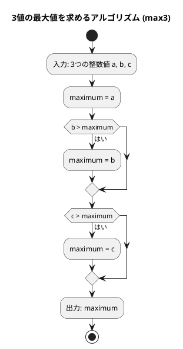
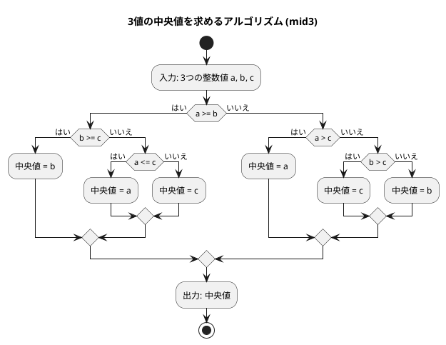

# 第 1 章 基本的なアルゴリズム

## はじめに

プログラミングを学ぶ上で、アルゴリズムの理解は非常に重要です。アルゴリズムとは、問題を解決するための手順や方法のことです。この章では、Elixir を使って基本的なアルゴリズムを学びながら、テスト駆動開発（TDD）の手法を用いて実装していきます。

テスト駆動開発とは、コードを書く前にまずテストを書き、そのテストが通るようにコードを実装していく開発手法です。Red-Green-Refactor というサイクルを繰り返しながら、確実に動作するコードを段階的に作り上げます。

## 準備

### 環境構築

```bash
# Nix 環境に入る（Elixir + Erlang が利用可能になる）
nix develop .#elixir

# プロジェクトディレクトリへ移動
cd apps/elixir

# テスト実行
mix test
```

### プロジェクト構成

```
apps/elixir/
├── mix.exs                           # プロジェクト設定
├── lib/
│   └── algorithm/
│       └── basic_algorithms.ex       # 実装ファイル
└── test/
    ├── test_helper.exs               # テストヘルパー
    └── algorithm/
        └── basic_algorithms_test.exs # テストファイル
```

### テスト実行コマンド

```bash
# 全テスト実行
mix test

# 特定ファイルのテスト実行
mix test test/algorithm/basic_algorithms_test.exs

# 詳細出力
mix test --trace
```

---

## 1. アルゴリズムとは

アルゴリズムとは、問題を解決するための明確な手順のことです。コンピュータプログラムは、アルゴリズムを実行可能な形で表現したものと言えます。

良いアルゴリズムは以下の特徴を持ちます：

- 入力と出力が明確である
- 各ステップが明確である
- 有限のステップで終了する
- 効率的である

---

## 2. 3 値の最大値

3 つの整数値の中から最大値を求めるアルゴリズムを TDD で実装します。

### Red -- 失敗するテストを書く

```elixir
# test/algorithm/basic_algorithms_test.exs
defmodule Algorithm.BasicAlgorithmsTest do
  use ExUnit.Case
  alias Algorithm.BasicAlgorithms

  describe "max3/3" do
    test "3 つの値のうち最大値を返す（全 13 パターン）" do
      cases = [
        {3, 2, 1, 3},  # a > b > c
        {3, 2, 2, 3},  # a > b = c
        {3, 1, 2, 3},  # a > c > b
        {3, 2, 3, 3},  # a = c > b
        {2, 1, 3, 3},  # c > a > b
        {3, 3, 2, 3},  # a = b > c
        {3, 3, 3, 3},  # a = b = c
        {2, 2, 3, 3},  # c > a = b
        {2, 3, 1, 3},  # b > a > c
        {2, 3, 2, 3},  # b > a = c
        {1, 3, 2, 3},  # b > c > a
        {2, 3, 3, 3},  # b = c > a
        {1, 2, 3, 3}   # c > b > a
      ]

      for {a, b, c, expected} <- cases do
        assert BasicAlgorithms.max3(a, b, c) == expected,
               "max3(#{a}, #{b}, #{c}) should be #{expected}"
      end
    end
  end
end
```

3 つの値の大小関係の全パターン（13 通り）を網羅したテストです。Elixir ではリスト内包表記 `for` を使ってパラメタライズドテストを簡潔に書けます。

### Green -- テストを通す最小限の実装

```elixir
# lib/algorithm/basic_algorithms.ex
defmodule Algorithm.BasicAlgorithms do
  @moduledoc "基本的なアルゴリズム"

  @doc "3 つの値のうち最大値を返す"
  def max3(a, b, c) do
    a |> max(b) |> max(c)
  end
end
```

### Refactor -- パイプ演算子の活用

Elixir ではパイプ演算子 `|>` を使うことで、データの流れを左から右へと読みやすく表現できます。`max/2` は Elixir の組み込み関数で、2 つの値のうち大きい方を返します。パイプでつなぐことで、「a と b の大きい方」と「c」をさらに比較する、という意図が明確になります。

### アルゴリズムの考え方



1. 最初の値を最大値候補とする
2. `max/2` で次の値と比較し、大きい方を残す
3. パイプ演算子 `|>` で結果をチェーンする

---

## 3. 3 値の中央値

3 つの整数値の中央値（3 つの値を大きさの順に並べたときに真ん中に来る値）を求めます。

### Red -- 失敗するテストを書く

```elixir
describe "mid3/3" do
  test "3 つの値のうち中央値を返す（全 13 パターン）" do
    cases = [
      {3, 2, 1, 2},  # a > b > c
      {3, 2, 2, 2},  # a > b = c
      {3, 1, 2, 2},  # a > c > b
      {3, 2, 3, 3},  # a = c > b
      {2, 1, 3, 2},  # c > a > b
      {3, 3, 2, 3},  # a = b > c
      {3, 3, 3, 3},  # a = b = c
      {2, 2, 3, 2},  # c > a = b
      {2, 3, 1, 2},  # b > a > c
      {2, 3, 2, 2},  # b > a = c
      {1, 3, 2, 2},  # b > c > a
      {2, 3, 3, 3},  # b = c > a
      {1, 2, 3, 2}   # c > b > a
    ]

    for {a, b, c, expected} <- cases do
      assert BasicAlgorithms.mid3(a, b, c) == expected,
             "mid3(#{a}, #{b}, #{c}) should be #{expected}"
    end
  end
end
```

### Green -- テストを通す最小限の実装

```elixir
@doc "3 つの値のうち中央値を返す"
def mid3(a, b, c) do
  [a, b, c] |> Enum.sort() |> Enum.at(1)
end
```

### Refactor -- Elixir らしい実装

Elixir ではリストの操作が非常に簡潔です。`Enum.sort/1` でリストをソートし、`Enum.at/2` でインデックス 1（2 番目の要素 = 中央値）を取得します。パイプ演算子 `|>` でつなぐことで、「リストを作り → ソートし → 真ん中を取る」というデータの流れが一目で分かります。

### アルゴリズムの考え方



中央値を求めるアルゴリズムは、最大値よりも複雑です。Python では条件分岐で場合分けしますが、Elixir では `Enum.sort/1` を使うことで宣言的に表現できます。

| 条件 | 中央値 |
|------|--------|
| a >= b かつ b >= c | b |
| a >= b かつ a <= c | a |
| a >= b（それ以外、a > c > b） | c |
| a < b かつ a > c | a |
| a < b かつ b > c | c |
| a < b（それ以外、c >= b > a） | b |

1. 3 つの値をリストにまとめる
2. `Enum.sort/1` で昇順にソートする
3. `Enum.at(1)` でソート後のリストの 2 番目の要素（中央値）を取得する

---

## 4. 条件判定と分岐

プログラミングでは、条件に応じて処理を分岐させることが頻繁にあります。

### Red -- 失敗するテストを書く

```elixir
describe "judge_sign/1" do
  test "正の値" do
    assert BasicAlgorithms.judge_sign(17) == "その値は正です。"
  end

  test "負の値" do
    assert BasicAlgorithms.judge_sign(-5) == "その値は負です。"
  end

  test "ゼロ" do
    assert BasicAlgorithms.judge_sign(0) == "その値は0です。"
  end
end
```

### Green -- テストを通す最小限の実装

```elixir
@doc "整数値の符号を判定する"
def judge_sign(n) when n > 0, do: "その値は正です。"
def judge_sign(n) when n < 0, do: "その値は負です。"
def judge_sign(0), do: "その値は0です。"
```

### Refactor -- ガード節によるパターンマッチ

Elixir では `if/else` の代わりに、関数定義のガード節（`when`）を使って条件分岐を表現します。各ケースが独立した関数句になるため、それぞれの条件と結果の対応が一目で分かります。これは Elixir の関数型スタイルにおける自然なパターンです。

Python の `if/elif/else` と比較すると、Elixir のガード節はより宣言的です。

---

## 5. 繰り返し処理

プログラミングでは、同じ処理を繰り返し実行することがよくあります。Elixir では `while` 文は存在せず、再帰や `Enum` モジュールを使って繰り返し処理を実現します。

### 5-1. 1 から n までの総和

#### Red -- 失敗するテストを書く

```elixir
describe "sum_1_to_n/1" do
  test "再帰で 1 から n までの総和を返す" do
    assert BasicAlgorithms.sum_1_to_n(5) == 15
    assert BasicAlgorithms.sum_1_to_n(1) == 1
    assert BasicAlgorithms.sum_1_to_n(10) == 55
  end
end

describe "sum_1_to_n_enum/1" do
  test "Enum で 1 から n までの総和を返す" do
    assert BasicAlgorithms.sum_1_to_n_enum(5) == 15
    assert BasicAlgorithms.sum_1_to_n_enum(1) == 1
    assert BasicAlgorithms.sum_1_to_n_enum(10) == 55
  end
end
```

#### Green -- テストを通す実装

```elixir
@doc "再帰で 1 から n までの総和を求める"
def sum_1_to_n(1), do: 1
def sum_1_to_n(n) when n > 1, do: n + sum_1_to_n(n - 1)

@doc "Enum で 1 から n までの総和を求める"
def sum_1_to_n_enum(n) do
  1..n |> Enum.sum()
end
```

#### Refactor -- 再帰 vs Enum

Elixir には `while` 文や `for` ループ（Python の `for i in range(...)` のような命令型ループ）がありません。代わりに 2 つの手法を使います：

1. **再帰**（`sum_1_to_n/1`）: ベースケース `n == 1` とパターンマッチで繰り返しを表現
2. **Enum モジュール**（`sum_1_to_n_enum/1`）: `1..n |> Enum.sum()` でパイプラインとして簡潔に記述

### 5-2. 記号文字の交互表示

`+` と `-` を交互に表示します。

#### Red -- 失敗するテストを書く

```elixir
describe "alternative/1" do
  test "偶数個の記号を交互に表示する" do
    assert BasicAlgorithms.alternative(12) == "+-+-+-+-+-+-"
  end

  test "奇数個の記号を交互に表示する" do
    assert BasicAlgorithms.alternative(5) == "+-+-+"
  end
end
```

#### Green -- テストを通す実装

```elixir
@doc "記号文字 '+' と '-' を交互に表示する"
def alternative(n) do
  0..(n - 1)
  |> Enum.map(fn i -> if rem(i, 2) == 0, do: "+", else: "-" end)
  |> Enum.join()
end
```

`Enum.map/2` と `Enum.join/1` をパイプでつなぐことで、「0 から n-1 の範囲を → 偶奇で +/- に変換し → 結合する」という意図が明確です。`rem/2` は剰余を返す関数で、Python の `%` 演算子に相当します。

### 5-3. 長方形の辺の長さを列挙

面積が指定された長方形の辺の長さをすべて列挙します。

#### Red -- 失敗するテストを書く

```elixir
describe "rectangle/1" do
  test "面積が area の長方形の辺の長さを列挙する" do
    assert BasicAlgorithms.rectangle(32) == "1x32 2x16 4x8 "
  end
end
```

#### Green -- テストを通す実装

```elixir
@doc "縦横が整数で面積が area の長方形の辺の長さを列挙する"
def rectangle(area) do
  1..area
  |> Enum.reduce_while("", fn i, acc ->
    cond do
      i * i > area -> {:halt, acc}
      rem(area, i) == 0 -> {:cont, acc <> "#{i}x#{div(area, i)} "}
      true -> {:cont, acc}
    end
  end)
end
```

Python の `break`/`continue` に相当する処理を、Elixir では `Enum.reduce_while/3` で実現します。`{:halt, acc}` がループの中断（`break`）、`{:cont, acc}` が継続（`continue`）に対応します。`cond` は Elixir の多分岐構文で、最初に真となる条件の結果を返します。

---

## 6. 多重ループ

ループの中にループを重ねることで、2 次元的な処理を実現できます。

### 6-1. 九九の表

#### Red -- 失敗するテストを書く

```elixir
describe "multiplication_table/0" do
  test "九九の表を返す" do
    expected =
      "---------------------------\n" <>
      "  1  2  3  4  5  6  7  8  9\n" <>
      "  2  4  6  8 10 12 14 16 18\n" <>
      "  3  6  9 12 15 18 21 24 27\n" <>
      "  4  8 12 16 20 24 28 32 36\n" <>
      "  5 10 15 20 25 30 35 40 45\n" <>
      "  6 12 18 24 30 36 42 48 54\n" <>
      "  7 14 21 28 35 42 49 56 63\n" <>
      "  8 16 24 32 40 48 56 64 72\n" <>
      "  9 18 27 36 45 54 63 72 81\n" <>
      "---------------------------"

    assert BasicAlgorithms.multiplication_table() == expected
  end
end
```

#### Green -- テストを通す実装

```elixir
@doc "九九の表を返す"
def multiplication_table do
  header = String.duplicate("-", 27) <> "\n"

  body =
    for i <- 1..9, into: "" do
      row = for j <- 1..9, into: "", do: String.pad_leading("#{i * j}", 3)
      row <> "\n"
    end

  footer = String.duplicate("-", 27)
  header <> body <> footer
end
```

Elixir の `for` 内包表記は Python のリスト内包表記に似ていますが、`into: ""` を指定すると結果を文字列に直接集約できます。外側の `for` が行（`i`）、内側の `for` が列（`j`）を担当します。`String.pad_leading/2` は右揃え（左側をパディング）で、Python の `f"{value:3}"` に相当します。

### 6-2. 直角三角形の表示

#### Red -- 失敗するテストを書く

```elixir
describe "triangle_lb/1" do
  test "左下側が直角の二等辺三角形を返す" do
    expected = "*\n**\n***\n****\n*****\n"
    assert BasicAlgorithms.triangle_lb(5) == expected
  end
end
```

#### Green -- テストを通す実装

```elixir
@doc "左下側が直角の二等辺三角形を返す"
def triangle_lb(n) do
  for i <- 1..n, into: "" do
    String.duplicate("*", i) <> "\n"
  end
end
```

`String.duplicate/2` で文字列を繰り返し、`for` 内包表記で各行を生成します。Python の `"*" * (i + 1)` に相当しますが、Elixir では 1 始まりのインデックスを使うため `i + 1` の調整が不要です。

---

## テスト実行結果

```bash
$ mix test test/algorithm/basic_algorithms_test.exs --trace

Algorithm.BasicAlgorithmsTest
  * test max3/3 3 つの値のうち最大値を返す（全 13 パターン） (passed)
  * test mid3/3 3 つの値のうち中央値を返す（全 13 パターン） (passed)
  * test judge_sign/1 正の値 (passed)
  * test judge_sign/1 負の値 (passed)
  * test judge_sign/1 ゼロ (passed)
  * test sum_1_to_n/1 再帰で 1 から n までの総和を返す (passed)
  * test sum_1_to_n_enum/1 Enum で 1 から n までの総和を返す (passed)
  * test alternative/1 偶数個の記号を交互に表示する (passed)
  * test alternative/1 奇数個の記号を交互に表示する (passed)
  * test rectangle/1 面積が area の長方形の辺の長さを列挙する (passed)
  * test multiplication_table/0 九九の表を返す (passed)
  * test triangle_lb/1 左下側が直角の二等辺三角形を返す (passed)

12 tests, 0 failures
```

---

## Python との比較

| 概念 | Python | Elixir |
|------|--------|--------|
| 条件分岐 | `if/elif/else` | ガード節 `when` + 複数関数句 |
| while ループ | `while i <= n:` | 再帰 or `Enum.reduce` |
| for ループ | `for i in range(n):` | `Enum.map/2` or `for` 内包表記 |
| break/continue | `break` / `continue` | `Enum.reduce_while` + `{:halt, acc}` / `{:cont, acc}` |
| 文字列フォーマット | `f"{value:3}"` | `String.pad_leading("#{value}", 3)` |
| 文字列繰り返し | `"*" * n` | `String.duplicate("*", n)` |
| 剰余 | `n % 2` | `rem(n, 2)` |
| 整数除算 | `n // 2` | `div(n, 2)` |
| リスト結合 | `"".join(list)` | `Enum.join(list)` |
| パイプライン | なし（メソッドチェーン） | `\|>` パイプ演算子 |

Elixir では、Python の命令型ループ（`while`/`for`）に相当する構文がありません。代わりに再帰や `Enum` モジュールの高階関数を使って宣言的にデータ変換を記述します。これは関数型プログラミングの基本的なアプローチです。

---

## まとめ

この章では、以下の基本的なアルゴリズムを TDD で実装しました：

| アルゴリズム | 関数 | キーポイント |
|-------------|------|------------|
| 3 値の最大値 | `max3/3` | パイプ演算子 + 組み込み `max/2` |
| 3 値の中央値 | `mid3/3` | `Enum.sort` + `Enum.at` |
| 符号判定 | `judge_sign/1` | ガード節による条件分岐 |
| 総和（再帰） | `sum_1_to_n/1` | パターンマッチ + 再帰 |
| 総和（Enum） | `sum_1_to_n_enum/1` | `Enum.sum` + Range |
| 交互表示 | `alternative/1` | `Enum.map` + `Enum.join` |
| 長方形列挙 | `rectangle/1` | `Enum.reduce_while` |
| 九九の表 | `multiplication_table/0` | `for` 内包表記のネスト |
| 直角三角形 | `triangle_lb/1` | `for` 内包表記 + `String.duplicate` |

Elixir では、データを変換するパイプラインとして処理を記述するスタイルが自然です。Python の命令型ループを関数型スタイルに読み替える練習として、この章の各関数を見比べてみてください。

## 参考文献

- 『新・明解 Python で学ぶアルゴリズムとデータ構造』 — 柴田望洋
- 『テスト駆動開発』 — Kent Beck
- 『プログラミング Elixir（第 2 版）』 — Dave Thomas
