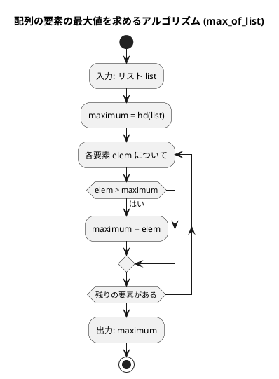
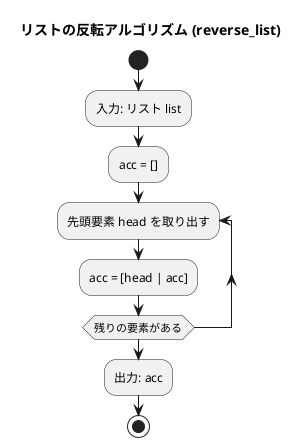
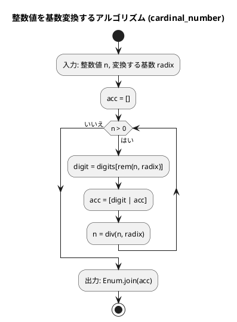
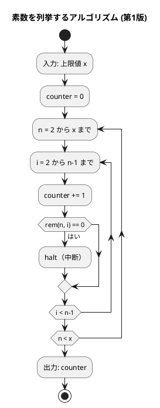
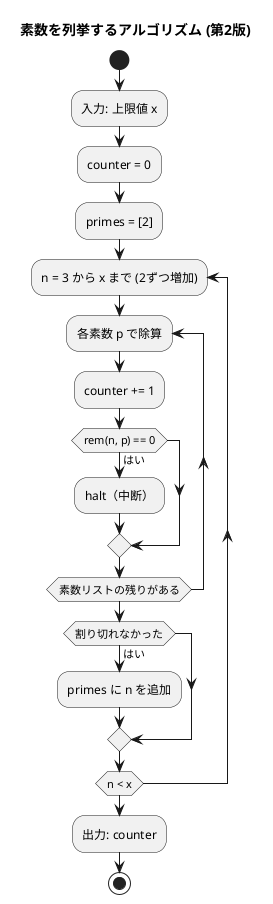
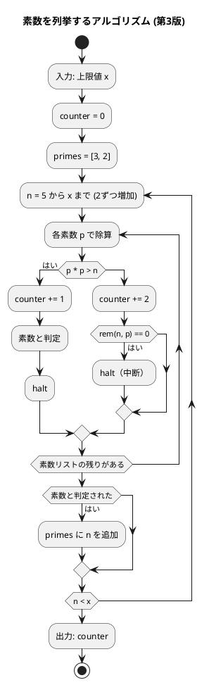

# 第 2 章 配列

## はじめに

前章では基本的なアルゴリズムについて学びました。この章では、プログラミングにおいて非常に重要なデータ構造である「配列」について学んでいきます。配列は、同じ型のデータを連続して格納するためのデータ構造で、多くのアルゴリズムの基礎となります。

Elixir では、配列に相当するデータ構造として「リスト」と「タプル」があります。

---

## 1. データ構造と配列

### データ構造とは

データ構造とは、データ単位とデータ自身との間の物理的または論理的な関係を表したものです。適切なデータ構造を選ぶことで、効率的なアルゴリズムを実装することができます。

### 配列の必要性

まず、配列がなぜ必要なのかを考えてみましょう。例えば、5 人の学生の点数を読み込んで合計点と平均点を求めるプログラムを考えます。

配列を使わない場合、以下のようなコードになります：

```elixir
tensu1 = 85
tensu2 = 72
tensu3 = 90
tensu4 = 68
tensu5 = 95

total = tensu1 + tensu2 + tensu3 + tensu4 + tensu5
average = total / 5
```

このコードでは、5 人分の変数を個別に用意しています。しかし、100 人や 1000 人の点数を扱う場合、このアプローチは現実的ではありません。

リストを使うことで簡潔に記述できます：

```elixir
scores = [85, 72, 90, 68, 95]
total = Enum.sum(scores)
average = total / length(scores)
```

### Elixir における配列：リストとタプル

**リスト**（連結リスト、先頭への追加が O(1)）

```elixir
x = [11, 22, 33, 44, 55, 66, 77]     # 整数のリスト
names = ["John", "Paul", "George", "Ringo"]  # 文字列のリスト
```

**タプル**（固定サイズ、インデックスアクセスが O(1)）

```elixir
t = {4, 7, 5.6, 2, 3.14, 1}  # 数値のタプル
elem(t, 0)  # => 4
```

### パターンマッチによる分解

Elixir では、Python のアンパックに相当する「パターンマッチ」でリストの要素を個別の変数に束縛できます。

```elixir
[a, b, c] = [1, 2, 3]   # a=1, b=2, c=3
[head | tail] = [1, 2, 3]  # head=1, tail=[2, 3]
```

`[head | tail]` はリストの先頭要素と残りを分解する Elixir 特有のパターンで、再帰処理の基本形です。

### インデックスによるアクセス

```elixir
x = [11, 22, 33, 44, 55, 66, 77]
Enum.at(x, 2)     # => 33（3 番目の要素）
Enum.at(x, -3)    # => 55（後ろから 3 番目の要素）
```

Elixir のリストは連結リストのため、インデックスアクセスは O(n) です。頻繁なランダムアクセスが必要な場合はタプルや `:array` モジュールを検討します。

### スライス的なアクセス

```elixir
x = [11, 22, 33, 44, 55, 66, 77]
Enum.slice(x, 0, 6)           # => [11, 22, 33, 44, 55, 66]
Enum.take_every(x, 2)         # => [11, 33, 55, 77]（2 つおきの要素）
Enum.slice(x, -4..-3//1)      # => [44, 55]
```

### リストの走査

```elixir
# Enum.with_index で走査（Python の enumerate に相当）
x = ["John", "George", "Paul", "Ringo"]
Enum.with_index(x, fn name, i -> "x[#{i}] = #{name}" end)

# 直接走査
Enum.each(x, fn name -> IO.puts(name) end)
```

---

## 2. 配列の要素の最大値

### Red -- 失敗するテストを書く

```elixir
# test/algorithm/arrays_test.exs
defmodule Algorithm.ArraysTest do
  use ExUnit.Case
  alias Algorithm.Arrays

  describe "max_of_list/1" do
    test "リストの最大値を返す" do
      assert Arrays.max_of_list([172, 153, 192, 140, 165]) == 192
    end

    test "要素が 1 つのリスト" do
      assert Arrays.max_of_list([42]) == 42
    end

    test "全要素が同じ" do
      assert Arrays.max_of_list([5, 5, 5]) == 5
    end
  end
end
```

### Green -- テストを通す最小限の実装

```elixir
# lib/algorithm/arrays.ex
defmodule Algorithm.Arrays do
  @moduledoc "配列操作"

  @doc "リストの最大値を返す"
  def max_of_list(list), do: Enum.max(list)
end
```

### Refactor

`Enum.max/1` は Elixir の標準ライブラリで、リスト内の最大値を効率的に返します。計算量は O(n) です。

### アルゴリズムの考え方



1. リストの最初の要素を最大値と仮定する
2. 残りの要素を順に比較し、より大きい値があれば最大値を更新する
3. 全要素の比較が終わったら最大値を返す

---

## 3. 配列の要素の並びを反転

### Red -- 失敗するテストを書く

```elixir
describe "reverse_list/1" do
  test "リストの要素の並びを反転する" do
    assert Arrays.reverse_list([2, 5, 1, 3, 9, 6, 7]) == [7, 6, 9, 3, 1, 5, 2]
  end

  test "偶数個のリストを反転する" do
    assert Arrays.reverse_list([1, 2, 3, 4]) == [4, 3, 2, 1]
  end

  test "要素が 1 つのリスト" do
    assert Arrays.reverse_list([42]) == [42]
  end
end
```

### Green -- テストを通す最小限の実装

```elixir
@doc "リストの要素の並びを反転する"
def reverse_list(list), do: Enum.reverse(list)
```

### Refactor

Python ではインデックスを使って前半と後半を交換（ミュータブルな操作）しますが、Elixir のリストはイミュータブルなため、`Enum.reverse/1` で新しいリストを生成します。内部的には末尾再帰でアキュムレータに先頭から要素を積み上げていく実装です。

```
[2, 5, 1, 3, 9, 6, 7]
→ Enum.reverse/1
→ [7, 6, 9, 3, 1, 5, 2]
```

計算量は O(n) です。

### フローチャート



---

## 4. 基数変換

10 進数を指定した基数（2 進数、8 進数、16 進数など）に変換するアルゴリズムです。

### Red -- 失敗するテストを書く

```elixir
describe "cardinal_number/2" do
  test "2 進数に変換する" do
    assert Arrays.cardinal_number(29, 2) == "11101"
  end

  test "8 進数に変換する" do
    assert Arrays.cardinal_number(29, 8) == "35"
  end

  test "16 進数に変換する" do
    assert Arrays.cardinal_number(255, 16) == "FF"
  end
end
```

### Green -- テストを通す最小限の実装

```elixir
@doc "10 進数を指定基数に変換した文字列を返す"
def cardinal_number(n, radix) do
  digits = ~w(0 1 2 3 4 5 6 7 8 9 A B C D E F G H I J K L M N O P Q R S T U V W X Y Z)
  do_convert(n, radix, digits, [])
end

defp do_convert(0, _radix, _digits, acc), do: Enum.join(acc)

defp do_convert(n, radix, digits, acc) do
  digit = Enum.at(digits, rem(n, radix))
  do_convert(div(n, radix), radix, digits, [digit | acc])
end
```

### Refactor -- パターンマッチと再帰

Elixir では再帰とパターンマッチを組み合わせてループを表現します。`do_convert/4` は末尾再帰で、基数で割った余りを繰り返し取得し、アキュムレータ `acc` の先頭に追加していきます。`n` が 0 になったときにパターンマッチで再帰を終了します。

Python では `while x > 0` ループで文字列を逆順に構築してから反転しますが、Elixir ではアキュムレータの先頭に追加することで自然に正しい順序になります。

### アルゴリズムの考え方



29 を 2 進数に変換する例：

| n | rem(n, 2) | 文字 | acc |
|---|-----------|------|-----|
| 29 | 1 | "1" | ["1"] |
| 14 | 0 | "0" | ["0", "1"] |
| 7  | 1 | "1" | ["1", "0", "1"] |
| 3  | 1 | "1" | ["1", "1", "0", "1"] |
| 1  | 1 | "1" | ["1", "1", "1", "0", "1"] |

`Enum.join(acc)` で `"11101"`。

---

## 5. 素数の列挙

素数を列挙するアルゴリズムを複数実装し、効率を比較します。

### エラトステネスの篩

#### Red -- 失敗するテストを書く

```elixir
describe "prime_numbers/1" do
  test "n 以下の素数リストを返す" do
    assert Arrays.prime_numbers(20) == [2, 3, 5, 7, 11, 13, 17, 19]
  end
end
```

#### Green -- テストを通す最小限の実装

```elixir
@doc "n 以下の素数リストを返す（エラトステネスの篩）"
def prime_numbers(n) do
  sieve = Enum.into(2..n, MapSet.new())
  do_sieve(sieve, 2, n)
end

defp do_sieve(sieve, p, n) when p * p > n,
  do: MapSet.to_list(sieve) |> Enum.sort()

defp do_sieve(sieve, p, n) do
  if MapSet.member?(sieve, p) do
    composites =
      (p * p)..n//p
      |> Enum.into(MapSet.new())

    new_sieve = MapSet.difference(sieve, composites)
    do_sieve(new_sieve, p + 1, n)
  else
    do_sieve(sieve, p + 1, n)
  end
end
```

Elixir の `MapSet` は集合操作（差集合 `difference`、包含チェック `member?`）を効率的に行えるデータ構造です。エラトステネスの篩では、合成数を集合から除去していく操作が自然に表現できます。

### 除算回数の比較（3 バージョン）

Python 版と同様に、除算回数を計測する 3 バージョンを実装します。

#### Red -- 失敗するテストを書く

```elixir
describe "prime1/1" do
  test "素直な素数列挙の除算回数を返す" do
    assert Arrays.prime1(1000) == 78022
  end
end

describe "prime2/1" do
  test "奇数 + 素数リスト活用の除算回数を返す" do
    assert Arrays.prime2(1000) == 14622
  end
end

describe "prime3/1" do
  test "平方根以下のみ確認の除算回数を返す" do
    assert Arrays.prime3(1000) == 3774
  end
end
```

#### Green -- テストを通す実装

##### 第 1 版：素直な実装

```elixir
@doc "x 以下の素数を列挙する（第 1 版）— 除算回数を返す"
def prime1(x) do
  Enum.reduce(2..x, 0, fn n, counter ->
    Enum.reduce_while(2..(n - 1)//1, counter, fn i, acc ->
      new_acc = acc + 1

      if rem(n, i) == 0 do
        {:halt, new_acc}
      else
        {:cont, new_acc}
      end
    end)
  end)
end
```

##### 第 2 版：奇数のみ + 素数リスト活用

```elixir
@doc "x 以下の素数を列挙する（第 2 版）— 除算回数を返す"
def prime2(x) do
  {counter, _primes} =
    Enum.reduce(3..x//2, {0, [2]}, fn n, {counter, primes} ->
      divisors = primes |> Enum.reverse() |> tl()

      {new_counter, is_prime} =
        Enum.reduce_while(divisors, {counter, true}, fn p, {acc, _} ->
          new_acc = acc + 1

          if rem(n, p) == 0 do
            {:halt, {new_acc, false}}
          else
            {:cont, {new_acc, true}}
          end
        end)

      if is_prime do
        {new_counter, [n | primes]}
      else
        {new_counter, primes}
      end
    end)

  counter
end
```

##### 第 3 版：平方根以下のみ確認

```elixir
@doc "x 以下の素数を列挙する（第 3 版）— 除算回数を返す"
def prime3(x) do
  {counter, _primes} =
    Enum.reduce(5..x//2, {0, [3, 2]}, fn n, {counter, primes} ->
      sorted_primes = Enum.reverse(primes)
      divisors = sorted_primes |> tl()

      {new_counter, is_prime} =
        Enum.reduce_while(divisors, {counter, true}, fn p, {acc, _} ->
          if p * p > n do
            {:halt, {acc + 1, true}}
          else
            new_acc = acc + 2

            if rem(n, p) == 0 do
              {:halt, {new_acc, false}}
            else
              {:cont, {new_acc, true}}
            end
          end
        end)

      if is_prime do
        {new_counter, [n | primes]}
      else
        {new_counter, primes}
      end
    end)

  counter
end
```

#### フローチャート（第 1 版）



第 1 版は単純ですが、効率が悪いです。n が素数でない場合でも、割り切れる数が見つかるまで全ての数で除算を試みます。

#### フローチャート（第 2 版）



第 2 版の最適化：偶数はチェックしない（2 以外の偶数は素数ではないため）、すでに見つけた素数だけで割り切れるかをチェックする。

#### フローチャート（第 3 版）



第 3 版の最適化：各数 n について、その平方根以下の素数でのみ割り切れるかをチェックする（それ以上の数でチェックする必要はない）。

### 効率の比較

| バージョン | 除算回数 | 改善率 |
|-----------|---------|--------|
| 第 1 版（素直な実装） | 78,022 | -- |
| 第 2 版（奇数 + 素数リスト） | 14,622 | 約 81% 削減 |
| 第 3 版（平方根以下） | 3,774 | 約 95% 削減 |

アルゴリズムの改善で計算量が大幅に削減されることがわかります。

---

## テスト実行結果

```bash
$ mix test test/algorithm/arrays_test.exs --trace

Algorithm.ArraysTest
  * test max_of_list/1 リストの最大値を返す (passed)
  * test max_of_list/1 要素が 1 つのリスト (passed)
  * test max_of_list/1 全要素が同じ (passed)
  * test reverse_list/1 リストの要素の並びを反転する (passed)
  * test reverse_list/1 偶数個のリストを反転する (passed)
  * test reverse_list/1 要素が 1 つのリスト (passed)
  * test cardinal_number/2 2 進数に変換する (passed)
  * test cardinal_number/2 8 進数に変換する (passed)
  * test cardinal_number/2 16 進数に変換する (passed)
  * test prime_numbers/1 n 以下の素数リストを返す (passed)
  * test prime1/1 素直な素数列挙の除算回数を返す (passed)
  * test prime2/1 奇数 + 素数リスト活用の除算回数を返す (passed)
  * test prime3/1 平方根以下のみ確認の除算回数を返す (passed)

13 tests, 0 failures
```

---

## リストのイミュータブル性とコピー

Python のリストは可変（mutable）であるため、浅いコピー（shallow copy）と深いコピー（deep copy）の区別が重要でした。

```python
# Python: 浅いコピーでは内部リストが共有される
x = [[1, 2, 3], [4, 5, 6]]
y = x.copy()
x[0][1] = 9  # y も変更される
```

Elixir では、すべてのデータがイミュータブル（不変）であるため、このような問題は存在しません：

```elixir
x = [[1, 2, 3], [4, 5, 6]]
y = x

# x の内部リストを「変更」しても、実際には新しいリストが作られる
new_inner = List.replace_at(hd(x), 1, 9)
new_x = List.replace_at(x, 0, new_inner)
# new_x => [[1, 9, 3], [4, 5, 6]]
# y は変更されない => [[1, 2, 3], [4, 5, 6]]
```

Elixir ではデータの「変更」は常に新しいデータ構造の生成を意味します。Erlang VM の構造共有（structural sharing）により、変更されていない部分はメモリ上で共有されるため、効率的です。

また、Elixir のリストは異なる型の要素を混在させることができます：

```elixir
x = [15, 64, 7, 3.14, [32, 55], "ABC"]
```

---

## Python との比較

| 概念 | Python | Elixir |
|------|--------|--------|
| 配列型 | `list`（可変）、`tuple`（不変） | `list`（連結リスト、不変）、`tuple`（固定サイズ） |
| 要素アクセス | `a[i]` O(1) | `Enum.at(a, i)` O(n) |
| スライス | `a[0:3]` | `Enum.slice(a, 0, 3)` |
| 最大値 | `max(a)` | `Enum.max(a)` |
| 反転 | `a.reverse()`（破壊的） | `Enum.reverse(a)`（新リスト生成） |
| リスト内包表記 | `[x*2 for x in a]` | `for x <- a, do: x * 2` |
| 分解代入 | `a, b, c = [1,2,3]` | `[a, b, c] = [1,2,3]` |
| 先頭/残り | `a[0]` / `a[1:]` | `hd(a)` / `tl(a)` or `[h\|t] = a` |
| ミュータブル性 | リストは可変 | すべてイミュータブル |
| ループ | `for i in range(n):` | `Enum.reduce` / 再帰 |
| 集合 | `set()` | `MapSet.new()` |

Elixir のリストは連結リストのため、Python のリスト（配列）とは性能特性が異なります。先頭への追加は O(1) ですが、末尾への追加やインデックスアクセスは O(n) です。このため、Elixir では先頭への追加（`[elem | list]`）とアキュムレータパターンが頻繁に使われます。

---

## まとめ

この章では、Elixir のリスト操作に関するアルゴリズムを TDD で実装しました。

| アルゴリズム | 関数 | 計算量 |
|-------------|------|-------|
| リストの最大値 | `max_of_list/1` | O(n) |
| リストの反転 | `reverse_list/1` | O(n) |
| 基数変換 | `cardinal_number/2` | O(log x) |
| 素数の列挙（篩） | `prime_numbers/1` | O(n log log n) |
| 素数の列挙 v1 | `prime1/1` | O(n^2) |
| 素数の列挙 v2 | `prime2/1` | O(n sqrt(n)) |
| 素数の列挙 v3 | `prime3/1` | O(n sqrt(n) / log n) |

この章で学んだ内容：

1. Elixir のリストとタプルの特徴（連結リスト vs 固定サイズ配列）
2. パターンマッチによるリストの分解
3. `Enum` モジュールによるリスト操作
4. 再帰 + アキュムレータパターン
5. `MapSet` を使ったエラトステネスの篩
6. アルゴリズム改善による効率化

## 参考文献

- 『新・明解 Python で学ぶアルゴリズムとデータ構造』 — 柴田望洋
- 『テスト駆動開発』 — Kent Beck
- 『プログラミング Elixir（第 2 版）』 — Dave Thomas
