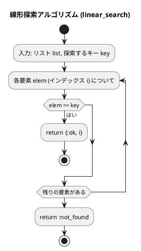
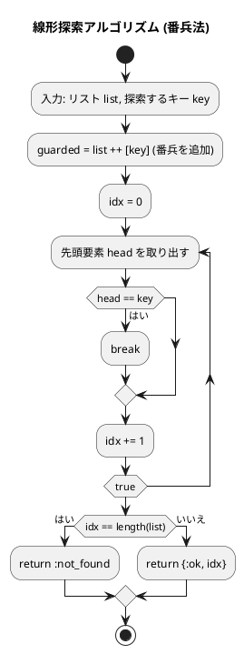
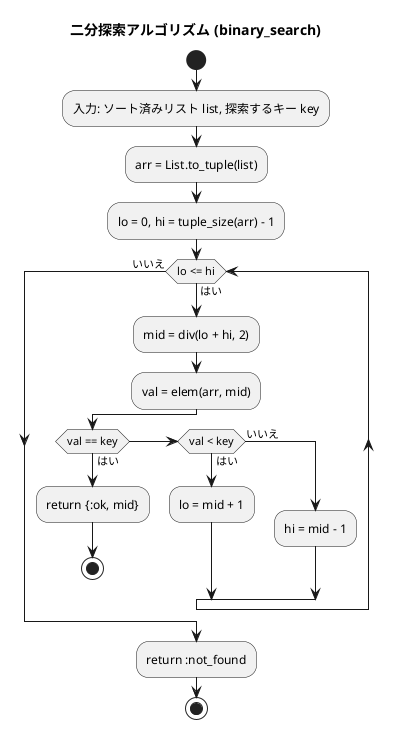

# 第 3 章 探索アルゴリズム

## はじめに

前章では配列とデータ構造について学びました。この章では、データの中から特定の値を見つけ出す「探索アルゴリズム」について学んでいきます。

主に以下の 3 つの方法を TDD で実装します：

1. 線形探索（シーケンシャルサーチ）
2. 二分探索（バイナリサーチ）
3. ハッシュ法

Elixir では、探索結果を `{:ok, value}` / `:not_found` のタプルで表現するのが慣例的です。これにより、見つかった場合と見つからなかった場合を明確に区別できます。

---

## 探索アルゴリズムとは

探索アルゴリズムとは、データの集合から特定の条件を満たす要素を見つけ出すための手順です。探索の対象となるデータは「キー」と呼ばれ、探索の結果は通常、キーが見つかった位置（インデックス）または見つからなかったことを示す値となります。

Python では見つからない場合に `-1` を返しますが、Elixir では `:not_found` アトムを返すのが自然です。

探索アルゴリズムの性能は、主に以下の要素によって評価されます：

- 時間効率（計算量）：探索にかかる時間
- 空間効率：使用するメモリ量
- 前提条件：データが整列されている必要があるかなど

---

## 1. 線形探索

リストの先頭から順に各要素を調べ、目的のキーと一致する要素を探します。

### Red -- 失敗するテストを書く

```elixir
# test/algorithm/search_algorithms_test.exs
defmodule Algorithm.SearchAlgorithmsTest do
  use ExUnit.Case
  alias Algorithm.SearchAlgorithms

  describe "linear_search/2" do
    test "値が見つかった場合にインデックスを返す" do
      assert SearchAlgorithms.linear_search([6, 4, 3, 2, 1, 2, 8], 2) == {:ok, 3}
    end

    test "先頭の値を見つける" do
      assert SearchAlgorithms.linear_search(["DTS", "AAC", "FLAC"], "DTS") == {:ok, 0}
    end

    test "値が見つからない場合に :not_found を返す" do
      assert SearchAlgorithms.linear_search([1, 2, 3], 99) == :not_found
    end
  end
end
```

### Green -- テストを通す最小限の実装

```elixir
# lib/algorithm/search_algorithms.ex
defmodule Algorithm.SearchAlgorithms do
  @moduledoc "探索アルゴリズム"

  @doc "線形探索"
  def linear_search(list, key) do
    case Enum.find_index(list, &(&1 == key)) do
      nil -> :not_found
      idx -> {:ok, idx}
    end
  end
end
```

### Refactor

`Enum.find_index/2` は要素が見つかればインデックスを、見つからなければ `nil` を返します。`case` 式でパターンマッチすることで、結果を `{:ok, idx}` / `:not_found` に変換しています。

### アルゴリズムの考え方



計算量：
- 最良の場合：O(1)（最初の要素がキーと一致する場合）
- 最悪の場合：O(n)（キーが見つからないか、最後の要素である場合）
- 平均の場合：O(n/2) = O(n)

### 番兵法

末尾にキーを追加（番兵）することで、ループ内の終了判定を省略します。

#### Red -- 失敗するテストを書く

```elixir
describe "linear_search_sentinel/2" do
  test "番兵法で値を見つける" do
    assert SearchAlgorithms.linear_search_sentinel([6, 4, 3, 2, 1, 2, 8], 2) == {:ok, 3}
  end

  test "番兵法で値が見つからない場合" do
    assert SearchAlgorithms.linear_search_sentinel([1, 2, 3], 99) == :not_found
  end
end
```

#### Green -- テストを通す実装

```elixir
@doc "線形探索（番兵法）"
def linear_search_sentinel(list, key) do
  guarded = list ++ [key]
  idx = do_sentinel_search(guarded, key, 0)

  if idx == length(list) do
    :not_found
  else
    {:ok, idx}
  end
end

defp do_sentinel_search([head | _tail], key, idx) when head == key, do: idx
defp do_sentinel_search([_head | tail], key, idx), do: do_sentinel_search(tail, key, idx + 1)
```

番兵法では、探索対象のリストの末尾に探索するキーを追加（番兵として配置）することで、再帰のパターンマッチを簡略化します。番兵に到達した場合は必ず `head == key` が真になるため、空リストのケースを考慮する必要がありません。



---

## 2. 二分探索

**前提**: リストが整列されていること。

中央の要素とキーを比較し、探索範囲を半分に絞り込むことを繰り返します。

### Red -- 失敗するテストを書く

```elixir
describe "binary_search/2" do
  test "ソート済みリストから値を二分探索する" do
    assert SearchAlgorithms.binary_search([1, 2, 3, 5, 7, 8, 9], 5) == {:ok, 3}
  end

  test "先頭の値を見つける" do
    assert SearchAlgorithms.binary_search([1, 2, 3, 5, 7, 8, 9], 1) == {:ok, 0}
  end

  test "末尾の値を見つける" do
    assert SearchAlgorithms.binary_search([1, 2, 3, 5, 7, 8, 9], 9) == {:ok, 6}
  end

  test "値が見つからない場合に :not_found を返す" do
    assert SearchAlgorithms.binary_search([1, 2, 3, 5, 7, 8, 9], 4) == :not_found
  end
end
```

### Green -- テストを通す最小限の実装

```elixir
@doc "二分探索（ソート済みリストに対して）"
def binary_search(list, key) do
  arr = List.to_tuple(list)
  do_binary(arr, key, 0, tuple_size(arr) - 1)
end

defp do_binary(_arr, _key, lo, hi) when lo > hi, do: :not_found

defp do_binary(arr, key, lo, hi) do
  mid = div(lo + hi, 2)
  val = elem(arr, mid)

  cond do
    val == key -> {:ok, mid}
    val < key  -> do_binary(arr, key, mid + 1, hi)
    true       -> do_binary(arr, key, lo, mid - 1)
  end
end
```

### Refactor -- タプルへの変換

Elixir のリストは連結リストであるため、インデックスアクセスは O(n) です。二分探索ではランダムアクセスが必要なので、`List.to_tuple/1` でタプルに変換してから探索します。タプルの `elem/2` は O(1) でアクセスできます。

`cond` 式は、複数の条件を上から順に評価し、最初に `true` になった節の本体を実行します。ガード節 `when lo > hi` で再帰の終了条件をパターンマッチで表現しています。

### アルゴリズムの考え方



**計算量**: O(log n)

| 要素数 | 線形探索（最悪） | 二分探索（最悪） |
|--------|--------------|--------------|
| 100 | 100 回 | 7 回 |
| 1,000 | 1,000 回 | 10 回 |
| 1,000,000 | 1,000,000 回 | 20 回 |

---

## 3. ハッシュ法

キーからハッシュ関数でアドレスを求め、直接要素にアクセスします。理想的な場合 O(1) で探索できます。

Elixir では `Map` がハッシュテーブルとして機能しますが、ここではアルゴリズムの理解のためにチェイン法とオープンアドレス法を自前で実装します。

### Map を使った基本的なハッシュ探索

#### Red -- 失敗するテストを書く

```elixir
describe "hash_search/2" do
  test "ハッシュマップから値を検索する" do
    map = %{1 => "a", 2 => "b", 3 => "c"}
    assert SearchAlgorithms.hash_search(map, 2) == {:ok, "b"}
    assert SearchAlgorithms.hash_search(map, 4) == :not_found
  end
end
```

#### Green -- テストを通す実装

```elixir
@doc "ハッシュ法による探索"
def hash_search(map, key) do
  case Map.get(map, key) do
    nil   -> :not_found
    value -> {:ok, value}
  end
end
```

### チェイン法

同じハッシュ値を持つ要素を連結リストで管理します。衝突が発生した場合、同じバケットにリストとして格納します。

#### Red -- 失敗するテストを書く

```elixir
alias Algorithm.SearchAlgorithms.ChainedHash

describe "ChainedHash" do
  test "値を追加して検索する" do
    hash = ChainedHash.new(13)
    hash = ChainedHash.add(hash, 1, "赤尾")
    hash = ChainedHash.add(hash, 14, "神崎")  # 1%13=1, 14%13=1 → 衝突

    assert ChainedHash.search(hash, 1) == {:ok, "赤尾"}
    assert ChainedHash.search(hash, 14) == {:ok, "神崎"}
  end

  test "存在しないキーを検索すると :not_found を返す" do
    hash = ChainedHash.new(13)
    assert ChainedHash.search(hash, 100) == :not_found
  end

  test "重複キーの追加は既存値を保持する" do
    hash = ChainedHash.new(13)
    hash = ChainedHash.add(hash, 1, "赤尾")
    hash = ChainedHash.add(hash, 1, "重複")
    assert ChainedHash.search(hash, 1) == {:ok, "赤尾"}
  end

  test "キーを削除できる" do
    hash = ChainedHash.new(13)
    hash = ChainedHash.add(hash, 1, "赤尾")
    hash = ChainedHash.remove(hash, 1)
    assert ChainedHash.search(hash, 1) == :not_found
  end
end
```

#### Green -- テストを通す実装

```elixir
defmodule ChainedHash do
  @moduledoc "チェイン法を実現するハッシュテーブル"

  defstruct [:capacity, :table]

  def new(capacity) do
    %__MODULE__{
      capacity: capacity,
      table: :erlang.make_tuple(capacity, [])
    }
  end

  def search(%__MODULE__{capacity: cap, table: table}, key) do
    h = rem(key, cap)
    chain = elem(table, h)

    case Enum.find(chain, fn {k, _v} -> k == key end) do
      nil -> :not_found
      {_k, v} -> {:ok, v}
    end
  end

  def add(%__MODULE__{capacity: cap, table: table} = hash, key, value) do
    h = rem(key, cap)
    chain = elem(table, h)

    if Enum.any?(chain, fn {k, _v} -> k == key end) do
      hash
    else
      new_chain = [{key, value} | chain]
      %{hash | table: put_elem(table, h, new_chain)}
    end
  end

  def remove(%__MODULE__{capacity: cap, table: table} = hash, key) do
    h = rem(key, cap)
    chain = elem(table, h)
    new_chain = Enum.reject(chain, fn {k, _v} -> k == key end)
    %{hash | table: put_elem(table, h, new_chain)}
  end
end
```

#### Refactor -- イミュータブルなハッシュテーブル

Python のチェイン法ではクラスのインスタンスを直接変更（ミュータブル操作）しますが、Elixir ではすべてがイミュータブルです。各操作は新しい構造体を返します。内部的にはタプル（`:erlang.make_tuple/2`）をバケット配列として使用し、`put_elem/3` で要素を更新した新しいタプルを生成します。

チェイン（同じハッシュ値の要素リスト）はキーワードリスト `[{key, value} | chain]` として表現しています。

### オープンアドレス法

衝突時に空きスロットを探して要素を格納します。

#### Red -- 失敗するテストを書く

```elixir
alias Algorithm.SearchAlgorithms.OpenHash

describe "OpenHash" do
  test "値を追加して検索する" do
    hash = OpenHash.new(13)
    hash = OpenHash.add(hash, 1, "赤尾")
    hash = OpenHash.add(hash, 14, "神崎")  # 衝突

    assert OpenHash.search(hash, 1) == {:ok, "赤尾"}
    assert OpenHash.search(hash, 14) == {:ok, "神崎"}
  end

  test "存在しないキーを検索すると :not_found を返す" do
    hash = OpenHash.new(13)
    assert OpenHash.search(hash, 100) == :not_found
  end

  test "キーを削除できる" do
    hash = OpenHash.new(13)
    hash = OpenHash.add(hash, 1, "赤尾")
    hash = OpenHash.remove(hash, 1)
    assert OpenHash.search(hash, 1) == :not_found
  end

  test "削除後も衝突したキーを検索できる" do
    hash = OpenHash.new(13)
    hash = OpenHash.add(hash, 1, "赤尾")
    hash = OpenHash.add(hash, 14, "神崎")
    hash = OpenHash.remove(hash, 1)
    assert OpenHash.search(hash, 14) == {:ok, "神崎"}
  end
end
```

#### Green -- テストを通す実装

```elixir
defmodule OpenHash do
  @moduledoc "オープンアドレス法（線形探索法）を実現するハッシュテーブル"

  @empty :empty
  @deleted :deleted

  defstruct [:capacity, :table]

  def new(capacity) do
    %__MODULE__{
      capacity: capacity,
      table: :erlang.make_tuple(capacity, @empty)
    }
  end

  def search(%__MODULE__{capacity: cap, table: table}, key) do
    h = rem(key, cap)
    do_search(table, key, h, cap, 0)
  end

  defp do_search(_table, _key, _h, cap, count) when count >= cap, do: :not_found

  defp do_search(table, key, h, cap, count) do
    case elem(table, h) do
      @empty -> :not_found
      @deleted -> do_search(table, key, rem(h + 1, cap), cap, count + 1)
      {k, v} when k == key -> {:ok, v}
      _other -> do_search(table, key, rem(h + 1, cap), cap, count + 1)
    end
  end

  def add(%__MODULE__{capacity: cap, table: table} = hash, key, value) do
    h = rem(key, cap)
    do_add(hash, table, key, value, h, cap, 0)
  end

  defp do_add(hash, _table, _key, _value, _h, cap, count) when count >= cap, do: hash

  defp do_add(hash, table, key, value, h, cap, count) do
    case elem(table, h) do
      slot when slot == @empty or slot == @deleted ->
        %{hash | table: put_elem(table, h, {key, value})}
      {k, _v} when k == key -> hash
      _other -> do_add(hash, table, key, value, rem(h + 1, cap), cap, count + 1)
    end
  end

  def remove(%__MODULE__{capacity: cap, table: table} = hash, key) do
    h = rem(key, cap)
    do_remove(hash, table, key, h, cap, 0)
  end

  defp do_remove(hash, _table, _key, _h, cap, count) when count >= cap, do: hash

  defp do_remove(hash, table, key, h, cap, count) do
    case elem(table, h) do
      @empty -> hash
      {k, _v} when k == key -> %{hash | table: put_elem(table, h, @deleted)}
      _other -> do_remove(hash, table, key, rem(h + 1, cap), cap, count + 1)
    end
  end
end
```

バケットの状態は `:empty`（空）、`:deleted`（削除済み）、`{key, value}`（データ格納）の 3 種類で管理します。Python の `Enum` クラスによる状態管理に対し、Elixir ではアトム（`:empty`、`:deleted`）とタプル（`{key, value}`）のパターンマッチで状態を区別します。

---

## テスト実行結果

```bash
$ mix test test/algorithm/search_algorithms_test.exs --trace

Algorithm.SearchAlgorithmsTest
  * test linear_search/2 値が見つかった場合にインデックスを返す (passed)
  * test linear_search/2 先頭の値を見つける (passed)
  * test linear_search/2 値が見つからない場合に :not_found を返す (passed)
  * test linear_search_sentinel/2 番兵法で値を見つける (passed)
  * test linear_search_sentinel/2 番兵法で値が見つからない場合 (passed)
  * test binary_search/2 ソート済みリストから値を二分探索する (passed)
  * test binary_search/2 先頭の値を見つける (passed)
  * test binary_search/2 末尾の値を見つける (passed)
  * test binary_search/2 値が見つからない場合に :not_found を返す (passed)
  * test hash_search/2 ハッシュマップから値を検索する (passed)
  * test ChainedHash 値を追加して検索する (passed)
  * test ChainedHash 存在しないキーを検索すると :not_found を返す (passed)
  * test ChainedHash 重複キーの追加は既存値を保持する (passed)
  * test ChainedHash キーを削除できる (passed)
  * test OpenHash 値を追加して検索する (passed)
  * test OpenHash 存在しないキーを検索すると :not_found を返す (passed)
  * test OpenHash キーを削除できる (passed)
  * test OpenHash 削除後も衝突したキーを検索できる (passed)

18 tests, 0 failures
```

---

## Python との比較

| 概念 | Python | Elixir |
|------|--------|--------|
| 探索結果（見つかった） | インデックスを返す | `{:ok, index}` タプル |
| 探索結果（見つからない） | `-1` を返す | `:not_found` アトム |
| 線形探索 | `for i in range(len(a)):` | `Enum.find_index/2` |
| 二分探索のランダムアクセス | `a[pc]` O(1) | `elem(arr, mid)` O(1)（タプル変換が必要） |
| ハッシュテーブル | `dict` / カスタムクラス | `Map` / カスタム構造体 |
| 衝突解決（チェイン） | 連結リスト（Node クラス） | キーワードリスト `[{key, value}]` |
| 衝突解決（オープン） | `_Status` Enum + `_Bucket` クラス | `:empty`/`:deleted` アトム + パターンマッチ |
| 状態管理 | クラスのインスタンス変数（ミュータブル） | 構造体（イミュータブル、毎回新しい値を返す） |
| ノード参照 | `node.next`（ポインタ） | リストの先頭追加 `[elem \| list]` |

Elixir ではすべてのデータがイミュータブルなため、ハッシュテーブルの操作（追加・削除）は新しい構造体を返します。これはメモリ効率の面で一見不利に思えますが、Erlang VM の構造共有（structural sharing）により、変更されたバケットのみがコピーされます。

---

## 探索アルゴリズムの比較

| アルゴリズム | 事前条件 | 計算量 | 適用場面 |
|-------------|---------|--------|---------|
| 線形探索 | なし | O(n) | 小規模・未整列データ |
| 二分探索 | 整列済み | O(log n) | 大規模・整列データ |
| ハッシュ法 | なし | O(1) 平均 | 高速な挿入・削除・探索 |

## まとめ

この章では、3 つの主要な探索アルゴリズムについて学びました：

| アルゴリズム | 関数 | キーポイント |
|-------------|------|------------|
| 線形探索 | `linear_search/2` | `Enum.find_index/2` + パターンマッチ |
| 線形探索（番兵法） | `linear_search_sentinel/2` | リスト末尾に番兵を追加 |
| 二分探索 | `binary_search/2` | タプル変換 + 再帰 + `cond` 式 |
| ハッシュ探索 | `hash_search/2` | `Map` の O(1) アクセス |
| チェイン法 | `ChainedHash` | イミュータブル構造体 + キーワードリスト |
| オープンアドレス法 | `OpenHash` | アトムによる状態管理 + パターンマッチ |

Elixir では、結果を `{:ok, value}` / `:not_found` のタプルで返すパターンが一般的です。これは Erlang/OTP の伝統を受け継いだ、エラーハンドリングの基本パターンです。

## 参考文献

- 『新・明解 Python で学ぶアルゴリズムとデータ構造』 — 柴田望洋
- 『テスト駆動開発』 — Kent Beck
- 『プログラミング Elixir（第 2 版）』 — Dave Thomas
