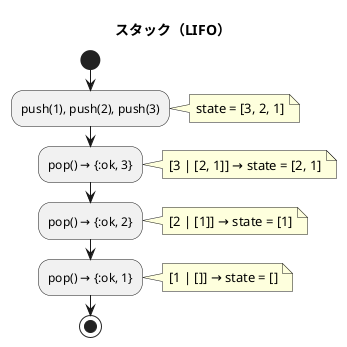
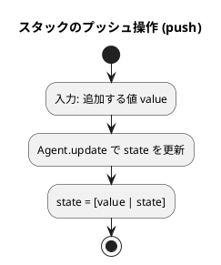
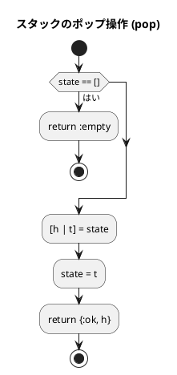
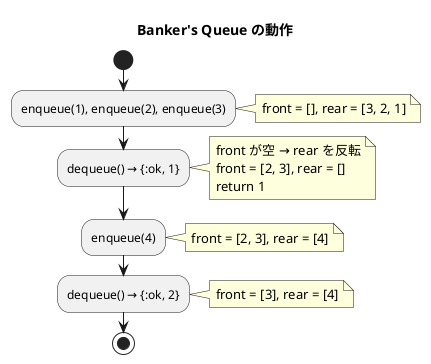
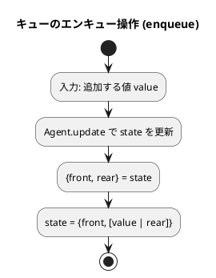
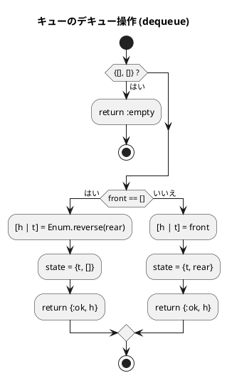

# 第 4 章 スタックとキュー

## はじめに

前章では探索アルゴリズムを学びました。この章では、データを特定の順序で格納・取り出すための基本的なデータ構造である「スタック」と「キュー」について TDD で実装します。

スタックとキューは、多くのアルゴリズムやプログラムの基礎となる重要なデータ構造です。これらの構造は、データの追加と削除の方法が異なり、それぞれ特定の問題に対して効率的な解決策を提供します。

Elixir はすべてのデータが不変（イミュータブル）であるため、可変状態が必要な場合はプロセスを使います。`Agent` は、状態の読み書きを行うためのシンプルなプロセス抽象化です。

---

## 1. スタック（LIFO）

スタックは **LIFO（Last In First Out）** -- 後から入れたものを最初に取り出す -- データ構造です。

皿を積み重ねるのに似ています。新しい皿は常に一番上に置かれ（プッシュ）、皿を取るときも一番上から取ります（ポップ）。

スタックの主な操作は以下の通りです：

- **プッシュ（Push）**: スタックの一番上にデータを追加する
- **ポップ（Pop）**: スタックの一番上からデータを取り出す
- **ピーク（Peek）**: スタックの一番上のデータを参照する（取り出さない）

スタックは、関数呼び出し、式の評価、構文解析、バックトラッキングなど、多くのアルゴリズムで使用されます。

### Red -- 失敗するテストを書く

```elixir
# test/algorithm/stacks_and_queues_test.exs
defmodule Algorithm.StacksAndQueuesTest do
  use ExUnit.Case
  alias Algorithm.Stack

  describe "Stack" do
    test "初期状態は空である" do
      {:ok, stack} = Stack.new()
      assert Stack.empty?(stack) == true
    end

    test "push と pop が正しく動作する（LIFO）" do
      {:ok, stack} = Stack.new()
      Stack.push(stack, 1)
      Stack.push(stack, 2)
      Stack.push(stack, 3)
      assert Stack.pop(stack) == {:ok, 3}
      assert Stack.pop(stack) == {:ok, 2}
      assert Stack.pop(stack) == {:ok, 1}
    end

    test "空スタックの pop は :empty を返す" do
      {:ok, stack} = Stack.new()
      assert Stack.pop(stack) == :empty
    end

    test "peek は頂上の値を参照するが取り出さない" do
      {:ok, stack} = Stack.new()
      Stack.push(stack, 1)
      Stack.push(stack, 2)
      assert Stack.peek(stack) == {:ok, 2}
      assert Stack.peek(stack) == {:ok, 2}
    end

    test "空スタックの peek は :empty を返す" do
      {:ok, stack} = Stack.new()
      assert Stack.peek(stack) == :empty
    end

    test "push 後は空でない" do
      {:ok, stack} = Stack.new()
      Stack.push(stack, 42)
      assert Stack.empty?(stack) == false
    end
  end
end
```

### Green -- テストを通す最小限の実装

```elixir
# lib/algorithm/stacks_and_queues.ex
defmodule Algorithm.Stack do
  @moduledoc "Agent ベースのスタック"

  def new, do: Agent.start_link(fn -> [] end)

  def push(pid, value),
    do: Agent.update(pid, fn s -> [value | s] end)

  def pop(pid) do
    Agent.get_and_update(pid, fn
      []       -> {:empty, []}
      [h | t]  -> {{:ok, h}, t}
    end)
  end

  def peek(pid) do
    Agent.get(pid, fn
      []      -> :empty
      [h | _] -> {:ok, h}
    end)
  end

  def empty?(pid), do: Agent.get(pid, &(&1 == []))
end
```

### Refactor -- Agent とパターンマッチ

`Agent.start_link/1` で空リスト `[]` を初期状態としたプロセスを起動します。スタックの状態はリストで表現し、先頭要素が最上部（top）に対応します。

`Agent.get_and_update/2` は、状態の読み取りと更新を 1 回のアトミック操作で行います。無名関数の中でパターンマッチを使い、空リストの場合と要素がある場合を分岐します。

Python ではクラスのインスタンス変数（`self.ptr`、`self.stk`）でスタックの状態を管理しますが、Elixir ではプロセスの内部状態として管理します。これにより、並行アクセスに対しても安全です。

### アルゴリズムの考え方



**主な操作**:

| 操作 | 関数 | 計算量 | 説明 |
|------|------|--------|------|
| プッシュ | `push/2` | O(1) | 頂上に追加 |
| ポップ | `pop/1` | O(1) | 頂上から取り出す |
| ピーク | `peek/1` | O(1) | 頂上を参照（取り出さない） |
| 空判定 | `empty?/1` | O(1) | スタックが空か判定 |

### フローチャート

#### スタックのプッシュ操作



Elixir のリストは先頭への要素追加が O(1) なので、Python の配列ベースのスタック（`ptr` ポインタ管理）と異なり、容量制限がなく、常に O(1) で push できます。

#### スタックのポップ操作



---

## 2. キュー（FIFO）

キューは **FIFO（First In First Out）** -- 最初に入れたものを最初に取り出す -- データ構造です。

銀行の行列をイメージすると分かりやすいです。新しい人は列の最後尾に並び（エンキュー）、サービスを受けるのは列の先頭の人からです（デキュー）。

キューの主な操作は以下の通りです：

- **エンキュー（Enqueue）**: キューの末尾にデータを追加する
- **デキュー（Dequeue）**: キューの先頭からデータを取り出す

キューは、幅優先探索、プリンタのスプーリング、プロセススケジューリングなど、多くのアルゴリズムやシステムで使用されます。

### Banker's Queue（2 リスト方式）

Python ではリングバッファを使って固定長配列でキューを実装しますが、Elixir では **Banker's Queue** と呼ばれる 2 つのリストによるキュー実装が一般的です。

- `front` リスト：取り出し用（先頭から dequeue）
- `rear` リスト：追加用（先頭に enqueue）

`front` が空になったとき、`rear` を反転して `front` にします。この操作は償却 O(1) です。

### Red -- 失敗するテストを書く

```elixir
alias Algorithm.Queue

describe "Queue" do
  test "初期状態は空である" do
    {:ok, q} = Queue.new()
    assert Queue.empty?(q) == true
  end

  test "enqueue と dequeue が正しく動作する（FIFO）" do
    {:ok, q} = Queue.new()
    Queue.enqueue(q, 1)
    Queue.enqueue(q, 2)
    Queue.enqueue(q, 3)
    assert Queue.dequeue(q) == {:ok, 1}
    assert Queue.dequeue(q) == {:ok, 2}
    assert Queue.dequeue(q) == {:ok, 3}
  end

  test "空キューの dequeue は :empty を返す" do
    {:ok, q} = Queue.new()
    assert Queue.dequeue(q) == :empty
  end

  test "enqueue 後は空でない" do
    {:ok, q} = Queue.new()
    Queue.enqueue(q, 42)
    assert Queue.empty?(q) == false
  end

  test "dequeue と enqueue を交互に実行できる" do
    {:ok, q} = Queue.new()
    Queue.enqueue(q, 1)
    Queue.enqueue(q, 2)
    assert Queue.dequeue(q) == {:ok, 1}
    Queue.enqueue(q, 3)
    assert Queue.dequeue(q) == {:ok, 2}
    assert Queue.dequeue(q) == {:ok, 3}
  end
end
```

### Green -- テストを通す最小限の実装

```elixir
defmodule Algorithm.Queue do
  @moduledoc "Agent ベースのキュー（front/rear リスト方式）"

  def new, do: Agent.start_link(fn -> {[], []} end)

  def enqueue(pid, value),
    do: Agent.update(pid, fn {front, rear} -> {front, [value | rear]} end)

  def dequeue(pid) do
    Agent.get_and_update(pid, fn
      {[], []} ->
        {:empty, {[], []}}

      {[], rear} ->
        [h | t] = Enum.reverse(rear)
        {{:ok, h}, {t, []}}

      {[h | t], rear} ->
        {{:ok, h}, {t, rear}}
    end)
  end

  def empty?(pid),
    do: Agent.get(pid, fn {f, r} -> f == [] and r == [] end)
end
```

### Refactor -- Banker's Queue の仕組み

キューの内部状態を `{front, rear}` の 2 つのリストで管理しています。



単純なリストの末尾追加は O(n) ですが、2 つのリストを使うことで各操作を償却 O(1) に保てます。Python のリングバッファ方式と比べると、容量制限がなく、動的にサイズが変わる点が利点です。

### フローチャート

#### キューのエンキュー操作



#### キューのデキュー操作



---

## テスト実行結果

```bash
$ mix test test/algorithm/stacks_and_queues_test.exs --trace

Algorithm.StacksAndQueuesTest
  * test Stack 初期状態は空である (passed)
  * test Stack push と pop が正しく動作する（LIFO） (passed)
  * test Stack 空スタックの pop は :empty を返す (passed)
  * test Stack peek は頂上の値を参照するが取り出さない (passed)
  * test Stack 空スタックの peek は :empty を返す (passed)
  * test Stack push 後は空でない (passed)
  * test Queue 初期状態は空である (passed)
  * test Queue enqueue と dequeue が正しく動作する（FIFO） (passed)
  * test Queue 空キューの dequeue は :empty を返す (passed)
  * test Queue enqueue 後は空でない (passed)
  * test Queue dequeue と enqueue を交互に実行できる (passed)

11 tests, 0 failures
```

---

## Python との比較

| 概念 | Python | Elixir |
|------|--------|--------|
| スタック実装 | クラス + 配列 + ポインタ（`ptr`） | `Agent` + リスト（先頭が top） |
| キュー実装 | クラス + リングバッファ（`front`/`rear` ポインタ） | `Agent` + Banker's Queue（2 リスト） |
| 状態管理 | インスタンス変数（ミュータブル） | プロセス内部状態（イミュータブル） |
| 容量制限 | 固定長（`FixedStack`/`FixedQueue`） | 制限なし（動的） |
| 空スタック/キュー | 例外を発生（`raise Empty`） | `:empty` アトムを返す |
| 満杯 | 例外を発生（`raise Full`） | 該当なし（容量制限なし） |
| 並行安全性 | スレッドセーフではない | `Agent` により並行安全 |
| push の計算量 | O(1)（配列末尾追加） | O(1)（リスト先頭追加） |
| dequeue の計算量 | O(1)（リングバッファ） | 償却 O(1)（Banker's Queue） |

Python ではクラスのインスタンス変数を直接変更しますが、Elixir ではプロセス（`Agent`）を通じて状態を管理します。これにより、Elixir の実装は並行アクセスに対して安全です。

---

## スタックとキューの比較

| 項目 | スタック | キュー |
|------|---------|--------|
| 取り出し順序 | LIFO（後入れ先出し） | FIFO（先入れ先出し） |
| 追加操作 | `push/2` | `enqueue/2` |
| 取り出し操作 | `pop/1` | `dequeue/1` |
| 主な用途 | 関数呼び出し、DFS | タスクキュー、BFS |
| 計算量（追加/取り出し） | O(1) | 償却 O(1) |
| Elixir の内部表現 | リスト `[top \| rest]` | 2 リスト `{front, rear}` |

## まとめ

この章では、スタックとキューを Elixir の `Agent` を使って TDD で実装しました。

| データ構造 | モジュール | キーポイント |
|-----------|-----------|------------|
| スタック | `Algorithm.Stack` | `Agent` + リスト + パターンマッチ |
| キュー | `Algorithm.Queue` | `Agent` + Banker's Queue（2 リスト方式） |

- **`Agent`**: イミュータブルな Elixir で可変状態を扱うためのプロセス抽象化
- **パターンマッチ**: `fn` の中で複数のパターンを分岐
- **Banker's Queue**: 2 つのリストによる効率的なキュー実装
- **タプル `{:ok, value}` / `:empty`**: 結果の明示的な表現

Elixir のプロセスモデルは、並行プログラミングの基盤でもあります。`Agent` は最もシンプルなプロセス抽象化で、`GenServer` のより高度な機能を必要としない場合に適しています。

## 参考文献

- 『新・明解 Python で学ぶアルゴリズムとデータ構造』 — 柴田望洋
- 『テスト駆動開発』 — Kent Beck
- 『プログラミング Elixir（第 2 版）』 — Dave Thomas
