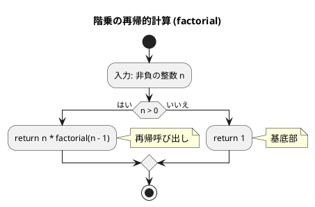
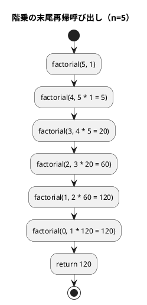
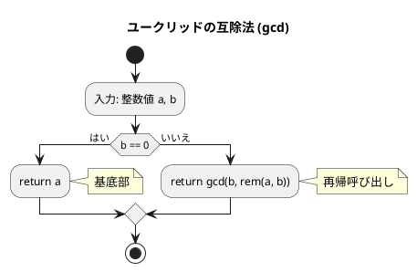
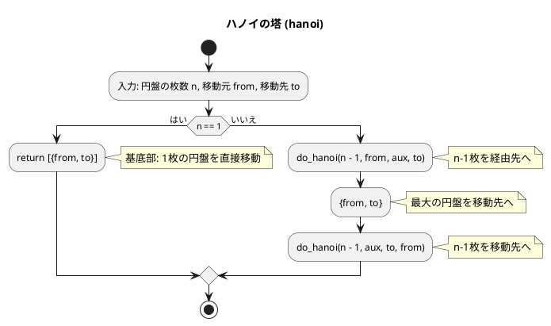
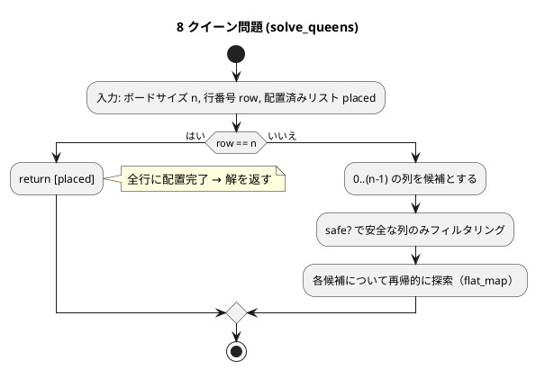

# 第 5 章 再帰アルゴリズム

## はじめに

前章ではスタックとキューというデータ構造を学びました。この章では「**再帰（Recursion）**」というアルゴリズム設計手法を TDD で実装します。

再帰とは、**ある関数が自分自身を呼び出す**ことで問題を解く手法です。大きな問題を同じ構造の小さな問題に分解し、最終的に自明な基底ケースに到達したら戻り始めます。

Elixir は関数型言語であり、ループ構文（`for`/`while`）の代わりに再帰を多用します。特に BEAM VM は末尾再帰最適化（TCO: Tail Call Optimization）をサポートしているため、適切に書けばスタックオーバーフローを起こしません。

再帰アルゴリズムは、一般的に以下の 2 つの部分から構成されます：

1. **基底部（base case）**: 再帰呼び出しを終了する条件
2. **再帰部（recursive case）**: 問題を小さくして自分自身を呼び出す部分

---

## 1. 階乗

`n! = n x (n-1) x ... x 1` を再帰で実装します。

### Red -- 失敗するテストを書く

```elixir
# test/algorithm/recursion_test.exs
defmodule Algorithm.RecursionTest do
  use ExUnit.Case
  alias Algorithm.Recursion

  describe "factorial/1" do
    test "0 の階乗は 1" do
      assert Recursion.factorial(0) == 1
    end

    test "5 の階乗は 120" do
      assert Recursion.factorial(5) == 120
    end
  end
end
```

### Green -- テストを通す最小限の実装

```elixir
# lib/algorithm/recursion.ex
defmodule Algorithm.Recursion do
  @moduledoc "再帰アルゴリズム"

  @doc "階乗（末尾再帰）"
  def factorial(n), do: factorial(n, 1)
  defp factorial(0, acc), do: acc
  defp factorial(n, acc), do: factorial(n - 1, n * acc)
end
```

### Refactor -- 末尾再帰最適化（TCO）

通常の再帰版と末尾再帰版を比較します：

```elixir
# 通常の再帰（非末尾再帰）
def factorial_naive(0), do: 1
def factorial_naive(n), do: n * factorial_naive(n - 1)
# 呼び出し後に「n *」の計算が残るため、スタックフレームを保持する必要がある

# 末尾再帰（TCO 対象）
def factorial(n), do: factorial(n, 1)
defp factorial(0, acc), do: acc
defp factorial(n, acc), do: factorial(n - 1, n * acc)
# 再帰呼び出しが関数の最後の操作 → スタックフレームを再利用
```

末尾再帰版では、アキュムレータ `acc` に途中結果を蓄積し、再帰呼び出しが関数の最後の操作になるようにしています。BEAM VM はこのパターンを検出してスタックフレームを再利用するため、大きな `n` でもスタックオーバーフローしません。

Python にはこのような最適化がないため、`sys.setrecursionlimit` で再帰制限を変更する必要があることがあります。

### アルゴリズムの考え方

#### フローチャート



#### 再帰呼び出しの展開



**計算量**: O(n)

---

## 2. 最大公約数（ユークリッドの互除法）

`gcd(a, b) = gcd(b, rem(a, b))` という関係を再帰で実装します。

### Red -- 失敗するテストを書く

```elixir
describe "gcd/2" do
  test "最大公約数を求める" do
    assert Recursion.gcd(22, 8) == 2
    assert Recursion.gcd(15, 10) == 5
  end

  test "互いに素な場合は 1" do
    assert Recursion.gcd(7, 11) == 1
  end
end
```

### Green -- テストを通す最小限の実装

```elixir
@doc "最大公約数（ユークリッドの互除法）"
def gcd(a, 0), do: a
def gcd(a, b), do: gcd(b, rem(a, b))
```

### Refactor -- パターンマッチの活用

ユークリッドの互除法は、パターンマッチによる再帰で非常に簡潔に表現できます。第 2 引数が 0 になったときが基底条件（base case）で、そうでなければ `b` と `a` を `b` で割った余りで再帰します。

この実装は末尾再帰であり、かつ Elixir のパターンマッチの美しさを示す典型的な例です。

### アルゴリズムの考え方



gcd(22, 8) の計算過程：
1. gcd(22, 8) → b=8, rem(22, 8)=6 → gcd(8, 6)
2. gcd(8, 6) → b=6, rem(8, 6)=2 → gcd(6, 2)
3. gcd(6, 2) → b=2, rem(6, 2)=0 → gcd(2, 0)
4. gcd(2, 0) → b=0 → return 2

**計算量**: O(log min(a, b))

---

## 3. ハノイの塔

n 枚の円盤を A から C へ B を経由して移動する問題です。

```
ルール:
1. 一度に 1 枚しか移動できない
2. 大きい円盤を小さい円盤の上に置けない
```

### Red -- 失敗するテストを書く

```elixir
describe "hanoi/3" do
  test "1 枚の場合は 1 手" do
    result = Recursion.hanoi(1, "A", "C")
    assert result == [{"A", "C"}]
  end

  test "n 枚の移動回数は 2^n - 1" do
    for n <- 1..5 do
      result = Recursion.hanoi(n, "A", "C")
      assert length(result) == Integer.pow(2, n) - 1
    end
  end
end
```

### Green -- テストを通す最小限の実装

```elixir
@doc "ハノイの塔"
def hanoi(n, from, to) do
  aux = determine_aux(from, to)
  do_hanoi(n, from, to, aux)
end

defp determine_aux(from, to) do
  ["A", "B", "C"]
  |> Enum.reject(&(&1 == from or &1 == to))
  |> hd()
end

defp do_hanoi(1, from, to, _aux), do: [{from, to}]

defp do_hanoi(n, from, to, aux) do
  do_hanoi(n - 1, from, aux, to) ++
    [{from, to}] ++
    do_hanoi(n - 1, aux, to, from)
end
```

### Refactor

ハノイの塔のアルゴリズムは 3 つのステップで構成されます：

1. n-1 枚のディスクを `from` から `aux` へ移動
2. 最大のディスクを `from` から `to` へ移動
3. n-1 枚のディスクを `aux` から `to` へ移動

### アルゴリズムの考え方



**計算量**: O(2^n)（移動回数 2^n - 1 回）

---

## 4. 再帰アルゴリズムの解析

### 真に再帰的な関数

「真に再帰的な関数」とは、複数の再帰呼び出しを含む関数のことです。

#### Red -- 失敗するテストを書く

```elixir
describe "recure/1" do
  test "真に再帰的な関数の結果を返す" do
    assert Recursion.recure(4) == [1, 2, 3, 1, 4, 1, 2]
  end
end
```

#### Green -- テストを通す実装

```elixir
@doc "真に再帰的な関数"
def recure(n), do: do_recure(n, []) |> Enum.reverse()

defp do_recure(n, acc) when n <= 0, do: acc

defp do_recure(n, acc) do
  acc = do_recure(n - 1, acc)
  acc = [n | acc]
  do_recure(n - 2, acc)
end
```

#### Refactor

Python ではリストへの `append` でミュータブルに値を追加しますが、Elixir ではイミュータブルなアキュムレータを使い、先頭に追加（`[n | acc]`）して最後に反転します。

recure(4) の展開：
- recure(4) → recure(3) を呼び、4 を追加し、recure(2) を呼ぶ
- recure(3) → recure(2) を呼び、3 を追加し、recure(1) を呼ぶ
- ...
- 結果: [1, 2, 3, 1, 4, 1, 2]

---

## 5. 8 クイーン問題

8x8 のチェスボード上に 8 個のクイーンを、互いに攻撃し合わないように配置する問題です。

### Red -- 失敗するテストを書く

```elixir
describe "eight_queens/0" do
  test "8 クイーン問題の解が 92 通りある" do
    solutions = Recursion.eight_queens()
    assert length(solutions) == 92
  end
end
```

### Green -- テストを通す最小限の実装

```elixir
@doc "8 クイーン問題"
def eight_queens do
  solve_queens(8, 0, [])
end

defp solve_queens(n, row, placed) when row == n, do: [placed]

defp solve_queens(n, row, placed) do
  0..(n - 1)
  |> Enum.filter(&safe?(&1, row, placed))
  |> Enum.flat_map(&solve_queens(n, row + 1, placed ++ [{row, &1}]))
end

defp safe?(col, row, placed) do
  Enum.all?(placed, fn {r, c} ->
    c != col and abs(c - col) != abs(r - row)
  end)
end
```

### Refactor -- バックトラッキングの関数型表現

`Enum.filter` で安全な列を絞り込み、`Enum.flat_map` で各候補について再帰的に探索します。これはバックトラッキングの関数型スタイルでの実装です。

Python ではフラグ配列（`__flag_a`、`__flag_b`、`__flag_c`）をミュータブルに操作してバックトラッキングを実現しますが、Elixir では `Enum.filter` + `Enum.flat_map` パイプラインで宣言的に表現します。



---

## 6. 迷路探索（バックトラッキング）

再帰的バックトラッキングで迷路を解きます。行き止まりに達したら戻り、別の経路を試みます。

### Red -- 失敗するテストを書く

```elixir
describe "maze_solve/5" do
  test "解ける迷路は true を返す" do
    maze = [
      [1, 1, 1, 1, 1],
      [1, 0, 0, 0, 1],
      [1, 0, 1, 0, 1],
      [1, 0, 0, 0, 1],
      [1, 1, 1, 1, 1]
    ]

    assert Recursion.maze_solve(maze, {1, 1}, {3, 3}) == true
  end

  test "解けない迷路は false を返す" do
    maze = [
      [1, 1, 1, 1, 1],
      [1, 0, 1, 0, 1],
      [1, 0, 1, 0, 1],
      [1, 0, 1, 0, 1],
      [1, 1, 1, 1, 1]
    ]

    assert Recursion.maze_solve(maze, {1, 1}, {3, 3}) == false
  end
end
```

### Green -- テストを通す実装

```elixir
@doc "迷路探索（バックトラッキング）"
def maze_solve(maze, start, goal) do
  do_maze_solve(maze, start, goal, MapSet.new())
end

defp do_maze_solve(_maze, pos, goal, _visited) when pos == goal, do: true

defp do_maze_solve(maze, {row, col}, goal, visited) do
  visited = MapSet.put(visited, {row, col})

  [{-1, 0}, {1, 0}, {0, -1}, {0, 1}]
  |> Enum.any?(fn {dr, dc} ->
    nr = row + dr
    nc = col + dc

    nr >= 0 and nr < length(maze) and
      nc >= 0 and nc < length(hd(maze)) and
      Enum.at(Enum.at(maze, nr), nc) == 0 and
      not MapSet.member?(visited, {nr, nc}) and
      do_maze_solve(maze, {nr, nc}, goal, visited)
  end)
end
```

### Refactor

Python では `set` に訪問済み座標を追加し、`for` ループで 4 方向を探索します。Elixir では `MapSet` と `Enum.any?/2` で同じロジックを表現します。`Enum.any?/2` は短絡評価（最初に `true` になった時点で終了）するため、Python の `for` + `return True` と同じ効率です。

---

## テスト実行結果

```bash
$ mix test test/algorithm/recursion_test.exs --trace

Algorithm.RecursionTest
  * test factorial/1 0 の階乗は 1 (passed)
  * test factorial/1 5 の階乗は 120 (passed)
  * test gcd/2 最大公約数を求める (passed)
  * test gcd/2 互いに素な場合は 1 (passed)
  * test hanoi/3 1 枚の場合は 1 手 (passed)
  * test hanoi/3 n 枚の移動回数は 2^n - 1 (passed)
  * test recure/1 真に再帰的な関数の結果を返す (passed)
  * test maze_solve/5 解ける迷路は true を返す (passed)
  * test maze_solve/5 解けない迷路は false を返す (passed)
  * test eight_queens/0 8 クイーン問題の解が 92 通りある (passed)

10 tests, 0 failures
```

---

## Python との比較

| 概念 | Python | Elixir |
|------|--------|--------|
| ループ | `while`/`for` | 再帰 + パターンマッチ |
| 末尾再帰最適化 | なし（スタックオーバーフローのリスク） | BEAM VM が TCO をサポート |
| 基底条件 | `if n <= 0: return 1` | `def factorial(0, acc), do: acc`（パターンマッチ） |
| アキュムレータ | 関数引数 or ループ変数 | `defp` プライベート関数の引数 |
| バックトラッキング | フラグ配列のミュータブル操作 | `Enum.filter` + `Enum.flat_map` |
| 訪問済み集合 | `set()` + `add()` | `MapSet.new()` + `MapSet.put()` |
| リスト追加 | `list.append(n)`（ミュータブル） | `[n \| acc]`（イミュータブル、先頭追加） |
| 再帰制限 | `sys.setrecursionlimit()`（デフォルト 1000） | 末尾再帰なら制限なし |

Elixir では再帰が「当たり前の道具」です。Python の `for`/`while` ループに相当する処理は、すべて再帰で表現します。末尾再帰最適化により、ループと同等のパフォーマンスと安全性を実現できます。

---

## 再帰アルゴリズムの比較

| アルゴリズム | 関数 | 計算量 | 特徴 |
|-------------|------|--------|------|
| 階乗 | `factorial/1` | O(n) | 末尾再帰 + アキュムレータ |
| GCD | `gcd/2` | O(log min(a,b)) | パターンマッチ + 末尾再帰 |
| ハノイの塔 | `hanoi/3` | O(2^n) | 二重再帰 |
| 真に再帰的な関数 | `recure/1` | -- | 複数再帰呼び出し |
| 8 クイーン | `eight_queens/0` | O(n!) | `filter` + `flat_map` バックトラッキング |
| 迷路探索 | `maze_solve/3` | O(行数 x 列数) | `MapSet` + `Enum.any?` |

## まとめ

この章では、再帰アルゴリズムを TDD で実装しました。

- **末尾再帰最適化**: アキュムレータパターンによる効率的な再帰
- **パターンマッチ**: 基底条件と再帰条件の明確な分離
- **`Enum.filter` + `Enum.flat_map`**: バックトラッキングの関数型表現
- **`MapSet`**: イミュータブルな訪問済み集合
- **ガード節 `when`**: 条件による関数の分岐

## 参考文献

- 『新・明解 Python で学ぶアルゴリズムとデータ構造』 — 柴田望洋
- 『テスト駆動開発』 — Kent Beck
- 『プログラミング Elixir（第 2 版）』 — Dave Thomas
