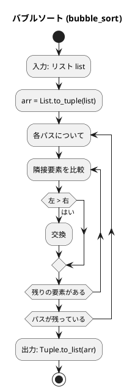
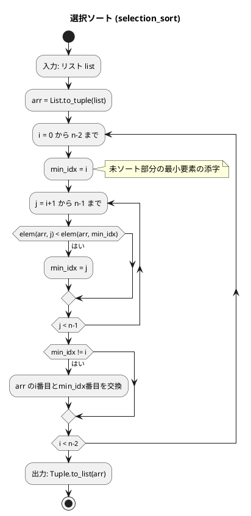
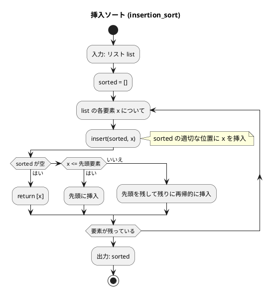
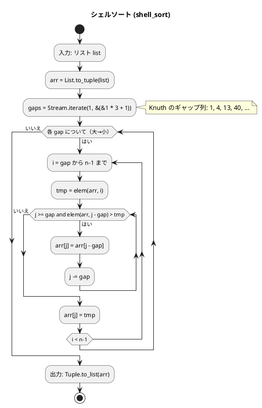
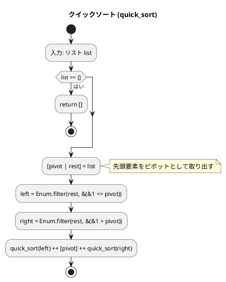
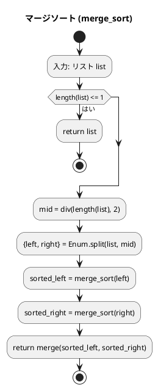
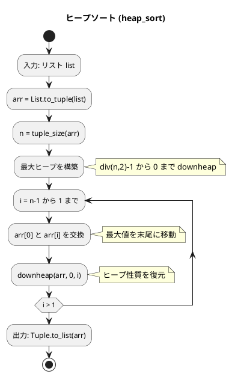
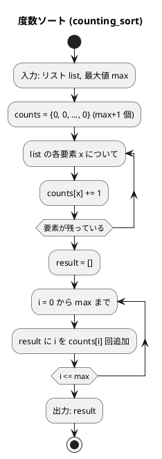

# 第 6 章 ソートアルゴリズム

## はじめに

前章では再帰アルゴリズムを学びました。この章では、データを特定の順序に並べ替える「ソートアルゴリズム」を TDD で実装します。

ソートは、コンピュータサイエンスにおける最も基本的かつ重要な操作の一つです。データが整列されていると、検索や他の操作が効率的に行えるようになります。

Elixir のリストは不変であるため、ソートは常に新しいリストを返します。Python のように配列をインプレース（破壊的）にソートすることはできません。一部のアルゴリズムでは、ランダムアクセスが必要なためタプルに変換して処理しています。

### 目次

1. [バブルソート](#1-バブルソート)
2. [選択ソート](#2-選択ソート)
3. [挿入ソート](#3-挿入ソート)
4. [シェルソート](#4-シェルソート)
5. [クイックソート](#5-クイックソート)
6. [マージソート](#6-マージソート)
7. [ヒープソート](#7-ヒープソート)
8. [度数ソート（計数ソート）](#8-度数ソート計数ソート)

---

## ソートとは

ソートとは、データを特定の順序（通常は昇順または降順）に並べ替える操作です。ソートアルゴリズムは、以下のような特性によって評価されます：

- **時間計算量**: アルゴリズムの実行に必要な時間
- **空間計算量**: アルゴリズムが使用するメモリ量
- **安定性**: 同じ値を持つ要素の相対的な順序が保存されるか
- **適応性**: 既にある程度ソートされているデータに対する効率性

それでは、具体的なソートアルゴリズムを見ていきましょう。

---

## 1. バブルソート

隣接する要素を比較・交換し、最大値を末尾へ「浮き上がらせる」アルゴリズムです。

### Red -- 失敗するテストを書く

```elixir
# test/algorithm/sort_algorithms_test.exs
defmodule Algorithm.SortAlgorithmsTest do
  use ExUnit.Case
  alias Algorithm.SortAlgorithms

  @sorted [1, 2, 3, 4, 5, 6, 7, 8]
  @unsorted [5, 3, 8, 1, 4, 7, 2, 6]

  describe "bubble_sort/1" do
    test "未ソートリストをソートする" do
      assert SortAlgorithms.bubble_sort(@unsorted) == @sorted
    end

    test "ソート済みリストはそのまま" do
      assert SortAlgorithms.bubble_sort(@sorted) == @sorted
    end
  end
end
```

### Green -- テストを通す最小限の実装

```elixir
def bubble_sort(list) do
  n = length(list)
  arr = List.to_tuple(list)

  result =
    Enum.reduce(1..n, arr, fn _, acc ->
      Enum.reduce(0..(n - 2), acc, fn i, a ->
        x = elem(a, i)
        y = elem(a, i + 1)
        if x > y, do: a |> put_elem(i, y) |> put_elem(i + 1, x), else: a
      end)
    end)

  Tuple.to_list(result)
end
```

### Refactor

Python では配列をインプレースに操作しますが、Elixir ではリストをタプルに変換し、`put_elem/3` で新しいタプルを生成しながら交換を行います。`Enum.reduce` のネストで二重ループを表現しています。

### アルゴリズムの考え方



この図は、バブルソートのアルゴリズムのフローチャートです。

アルゴリズムの流れ：
1. リストをタプルに変換します（ランダムアクセスのため）
2. 各パスについて、隣接する要素を比較します
   - 左の要素が右の要素より大きい場合、`put_elem/3` で交換します
3. 各パスが終わるごとに、最大の要素がタプルの末尾に移動します
4. 最後にタプルをリストに戻します

#### 動作ステップの例

`[5, 3, 8, 1]` をバブルソートする場合：

```
パス 1: [5, 3, 8, 1] → [3, 5, 8, 1] → [3, 5, 8, 1] → [3, 5, 1, 8]
パス 2: [3, 5, 1, 8] → [3, 5, 1, 8] → [3, 1, 5, 8]
パス 3: [3, 1, 5, 8] → [1, 3, 5, 8]
完了:   [1, 3, 5, 8]
```

### バブルソートの最適化

Python 版では交換回数による打ち切りや走査範囲の限定を行う最適化版が紹介されています。Elixir でも同様の最適化が可能です。

```elixir
@doc "バブルソート（最適化版：交換なしで打ち切り）"
def bubble_sort_optimized(list) do
  n = length(list)
  arr = List.to_tuple(list)

  do_bubble_optimized(arr, n)
  |> Tuple.to_list()
end

defp do_bubble_optimized(arr, n) when n <= 1, do: arr

defp do_bubble_optimized(arr, n) do
  {new_arr, swapped} =
    Enum.reduce(0..(n - 2), {arr, false}, fn i, {a, sw} ->
      x = elem(a, i)
      y = elem(a, i + 1)
      if x > y do
        {a |> put_elem(i, y) |> put_elem(i + 1, x), true}
      else
        {a, sw}
      end
    end)

  if swapped, do: do_bubble_optimized(new_arr, n - 1), else: new_arr
end
```

交換が一度も行われなければ、配列は既にソート済みであるため処理を打ち切ります。

- 計算量: 最悪 O(n^2)、最良 O(n)（整列済みの場合、最適化版）
- 安定: Yes

---

## 2. 選択ソート

未ソート部分から最小値を見つけ、先頭と交換する操作を繰り返します。

### Red -- 失敗するテストを書く

```elixir
describe "selection_sort/1" do
  test "未ソートリストをソートする" do
    assert SortAlgorithms.selection_sort(@unsorted) == @sorted
  end
end
```

### Green -- テストを通す実装

```elixir
def selection_sort(list) do
  n = length(list)
  arr = List.to_tuple(list)

  result =
    Enum.reduce(0..(n - 2), arr, fn i, acc ->
      {_min_val, min_idx} =
        Enum.reduce((i + 1)..(n - 1), {elem(acc, i), i}, fn j, {mv, mi} ->
          v = elem(acc, j)
          if v < mv, do: {v, j}, else: {mv, mi}
        end)

      if min_idx != i do
        vi = elem(acc, i)
        vm = elem(acc, min_idx)
        acc |> put_elem(i, vm) |> put_elem(min_idx, vi)
      else
        acc
      end
    end)

  Tuple.to_list(result)
end
```

### 解説

#### 動作ステップの例

`[5, 3, 8, 1]` を選択ソートする場合：

```
パス 1: [5, 3, 8, 1] → 最小値 1（index=3）→ 5 と交換 → [1, 3, 8, 5]
パス 2: [1, 3, 8, 5] → 最小値 3（index=1）→ 交換不要 → [1, 3, 8, 5]
パス 3: [1, 3, 8, 5] → 最小値 5（index=3）→ 8 と交換 → [1, 3, 5, 8]
完了:   [1, 3, 5, 8]
```

#### フローチャート



バブルソートと比較すると、選択ソートは交換回数が少ないという利点があります。各パスで最大でも 1 回の交換しか行われません。

- 計算量: O(n^2)（整列済みでも改善されない）
- 安定: No
- 特徴: 交換回数が最大 n-1 回と少ない

---

## 3. 挿入ソート

ソート済み部分に新しい要素を適切な位置に挿入していきます。

### Red -- 失敗するテストを書く

```elixir
describe "insertion_sort/1" do
  test "未ソートリストをソートする" do
    assert SortAlgorithms.insertion_sort(@unsorted) == @sorted
  end
end
```

### Green -- テストを通す実装

```elixir
def insertion_sort(list) do
  Enum.reduce(list, [], fn x, sorted -> insert(sorted, x) end)
end

defp insert([], x), do: [x]
defp insert([h | t], x) when x <= h, do: [x, h | t]
defp insert([h | t], x), do: [h | insert(t, x)]
```

### Refactor

この実装は Elixir のリスト操作を最大限に活用しています。`insert/2` はパターンマッチで 3 つのケースを処理します：

1. 空リスト → 要素のみのリストを返す
2. 先頭より小さい → 先頭に挿入
3. そうでなければ → 先頭を残して残りに再帰的に挿入

Python ではインデックスを使ってシフト操作を行いますが、Elixir ではリストのパターンマッチで自然に表現できます。

### 解説

#### 動作ステップの例

`[5, 3, 8, 1]` を挿入ソートする場合：

```
初期:    sorted = []
挿入 5:  sorted = [5]
挿入 3:  3 <= 5 → 先頭に挿入 → sorted = [3, 5]
挿入 8:  8 > 5 → 末尾に挿入 → sorted = [3, 5, 8]
挿入 1:  1 <= 3 → 先頭に挿入 → sorted = [1, 3, 5, 8]
完了:    [1, 3, 5, 8]
```

#### フローチャート



Python ではインデックスを使ったシフト操作で挿入位置を確保しますが、Elixir ではリストのパターンマッチで 3 つのケースを自然に分岐します。リスト操作と再帰の組み合わせが Elixir らしい実装です。

- 計算量: 最悪 O(n^2)、最良 O(n)（整列済みの場合）
- 安定: Yes
- 特徴: ほぼソート済みのデータに対して効率的

---

## 4. シェルソート

挿入ソートを改良したアルゴリズムで、離れた要素同士を比較・交換します。

### Red -- 失敗するテストを書く

```elixir
describe "shell_sort/1" do
  test "未ソートリストをソートする" do
    assert SortAlgorithms.shell_sort(@unsorted) == @sorted
  end
end
```

### Green -- テストを通す実装

```elixir
def shell_sort(list) do
  n = length(list)
  gaps = Stream.iterate(1, &(&1 * 3 + 1)) |> Enum.take_while(&(&1 < n)) |> Enum.reverse()
  arr = List.to_tuple(list)

  result =
    Enum.reduce(gaps, arr, fn gap, a ->
      Enum.reduce(gap..(n - 1), a, fn i, b ->
        tmp = elem(b, i)
        do_shell_inner(b, i, gap, tmp)
      end)
    end)

  Tuple.to_list(result)
end

defp do_shell_inner(arr, j, gap, tmp) when j >= gap and elem(arr, j - gap) > tmp do
  new_arr = put_elem(arr, j, elem(arr, j - gap))
  do_shell_inner(new_arr, j - gap, gap, tmp)
end

defp do_shell_inner(arr, j, _gap, tmp), do: put_elem(arr, j, tmp)
```

### Refactor

`Stream.iterate(1, &(&1 * 3 + 1))` でギャップ列（1, 4, 13, 40, ...）を遅延生成します。ガード節 `when j >= gap and elem(arr, j - gap) > tmp` でシフト条件をパターンマッチで表現しています。

### 解説

#### フローチャート



シェルソートの性能は、間隔の選び方に大きく依存します。`Stream.iterate(1, &(&1 * 3 + 1))` で Knuth のギャップ列（1, 4, 13, 40, ...）を遅延生成します。最初は大きな間隔で要素を比較し、徐々に間隔を小さくしていきます。最終的に間隔が 1 になると通常の挿入ソートと同じ処理になりますが、その時点で配列はほぼソートされているため効率的に動作します。

- 計算量: O(n^1.5)（ギャップ列に依存）
- 安定: No

---

## 5. クイックソート

ピボットを選び、それより小さい要素と大きい要素に分割して再帰的にソートします。

### Red -- 失敗するテストを書く

```elixir
describe "quick_sort/1" do
  test "未ソートリストをソートする" do
    assert SortAlgorithms.quick_sort(@unsorted) == @sorted
  end

  test "空リスト" do
    assert SortAlgorithms.quick_sort([]) == []
  end
end
```

### Green -- テストを通す実装

```elixir
def quick_sort([]), do: []
def quick_sort([pivot | rest]) do
  left  = Enum.filter(rest, &(&1 <= pivot))
  right = Enum.filter(rest, &(&1 > pivot))
  quick_sort(left) ++ [pivot] ++ quick_sort(right)
end
```

### Refactor

Elixir のパターンマッチでリストの先頭をピボットとして取り出し、`Enum.filter` で分割します。関数型言語ならではの簡潔なクイックソートです。

Python ではインプレースのパーティション操作が主流ですが、Elixir では新しいリストを生成するスタイルが自然です。3 行で完全なクイックソートが書けるのは Elixir の強みです。

### 解説

#### 動作ステップの例

`[5, 3, 8, 1, 4]` をクイックソートする場合：

```
quick_sort([5, 3, 8, 1, 4])
  pivot = 5
  left  = [3, 1, 4]  （5 以下）
  right = [8]         （5 より大きい）

  quick_sort([3, 1, 4])
    pivot = 3
    left  = [1]
    right = [4]
    → [1] ++ [3] ++ [4] = [1, 3, 4]

  quick_sort([8])
    → [8]

  → [1, 3, 4] ++ [5] ++ [8] = [1, 3, 4, 5, 8]
```

#### フローチャート



Python ではインプレースのパーティション操作（左右カーソルの交差）が主流ですが、Elixir ではパターンマッチと `Enum.filter` による宣言的な分割が自然です。3 行で完全なクイックソートが書けるのは Elixir の強みです。

- 平均計算量: O(n log n)
- 最悪計算量: O(n^2)（すでにソート済みの場合）
- 安定: No

---

## 6. マージソート

リストを半分に分割し、再帰的にソートした後、マージします。

### Red -- 失敗するテストを書く

```elixir
describe "merge_sort/1" do
  test "未ソートリストをソートする" do
    assert SortAlgorithms.merge_sort(@unsorted) == @sorted
  end

  test "空リスト" do
    assert SortAlgorithms.merge_sort([]) == []
  end

  test "要素が 1 つ" do
    assert SortAlgorithms.merge_sort([42]) == [42]
  end
end
```

### Green -- テストを通す実装

```elixir
def merge_sort([]), do: []
def merge_sort([x]), do: [x]
def merge_sort(list) do
  mid = div(length(list), 2)
  {left, right} = Enum.split(list, mid)
  merge(merge_sort(left), merge_sort(right))
end

defp merge([], right), do: right
defp merge(left, []), do: left
defp merge([lh | lt], [rh | rt]) when lh <= rh, do: [lh | merge(lt, [rh | rt])]
defp merge([lh | lt], [rh | rt]), do: [rh | merge([lh | lt], rt)]
```

### Refactor

`merge/2` のパターンマッチは 4 つのケースを網羅しています。`when lh <= rh` のガード節で安定ソートを保証しています。

`Enum.split/2` でリストを前半と後半に分割し、再帰的にソートした後にマージします。連結リストの分割と結合は自然な操作です。

### 解説

#### 動作ステップの例

`[5, 3, 8, 1]` をマージソートする場合：

```
merge_sort([5, 3, 8, 1])
  分割: [5, 3] と [8, 1]

  merge_sort([5, 3])
    分割: [5] と [3]
    マージ: [3, 5]

  merge_sort([8, 1])
    分割: [8] と [1]
    マージ: [1, 8]

  マージ: [3, 5] と [1, 8]
    1 < 3 → [1, ...]
    3 < 8 → [1, 3, ...]
    5 < 8 → [1, 3, 5, ...]
    残り  → [1, 3, 5, 8]
```

#### フローチャート



`merge/2` のパターンマッチは 4 つのケースを網羅しています：
1. 左が空 → 右をそのまま返す
2. 右が空 → 左をそのまま返す
3. 左の先頭 <= 右の先頭 → 左の先頭を採用し、残りを再帰マージ
4. そうでなければ → 右の先頭を採用し、残りを再帰マージ

`when lh <= rh` のガード節で安定ソートを保証しています。

- 計算量: O(n log n)
- 安定: Yes
- 特徴: 常に O(n log n) を保証

---

## 7. ヒープソート

ヒープ構造を利用してソートします。最大ヒープを構築し、最大値を末尾に移動する操作を繰り返します。

### Red -- 失敗するテストを書く

```elixir
describe "heap_sort/1" do
  test "未ソートリストをソートする" do
    assert SortAlgorithms.heap_sort(@unsorted) == @sorted
  end
end
```

### Green -- テストを通す実装

```elixir
def heap_sort(list) do
  arr = List.to_tuple(list)
  n = tuple_size(arr)
  arr2 = Enum.reduce((div(n, 2) - 1)..0//-1, arr, fn i, a -> downheap(a, i, n) end)

  Enum.reduce((n - 1)..1//-1, arr2, fn i, a ->
    swapped = a |> put_elem(0, elem(a, i)) |> put_elem(i, elem(a, 0))
    downheap(swapped, 0, i)
  end)
  |> Tuple.to_list()
end

defp downheap(arr, i, n) do
  left = 2 * i + 1
  right = 2 * i + 2
  largest = if left < n and elem(arr, left) > elem(arr, i), do: left, else: i
  largest = if right < n and elem(arr, right) > elem(arr, largest), do: right, else: largest

  if largest != i do
    swapped = arr |> put_elem(i, elem(arr, largest)) |> put_elem(largest, elem(arr, i))
    downheap(swapped, largest, n)
  else
    arr
  end
end
```

### Refactor

タプルをヒープの配列表現として使用しています。`downheap/3` は再帰的にヒープ性質を復元します。`(div(n, 2) - 1)..0//-1` はステップ付きレンジで、Python の `range(n//2 - 1, -1, -1)` に相当します。

### 解説

#### フローチャート



`downheap/3` は再帰的にヒープ性質を復元します。タプルをヒープの配列表現として使用し、`put_elem/3` で交換を行います。`(div(n, 2) - 1)..0//-1` はステップ付きレンジで、Python の `range(n//2 - 1, -1, -1)` に相当します。

- 計算量: O(n log n)
- 安定: No
- 特徴: 追加メモリが不要（in-place）

---

## 8. 度数ソート（計数ソート）

要素の出現回数を数えてソートします。比較を使わないため、条件が合えば O(n) で動作します。

### Red -- 失敗するテストを書く

```elixir
describe "counting_sort/2" do
  test "重複あり要素をソートする" do
    assert SortAlgorithms.counting_sort([3, 1, 4, 1, 5, 9, 2, 6], 9) ==
             [1, 1, 2, 3, 4, 5, 6, 9]
  end
end
```

### Green -- テストを通す実装

```elixir
def counting_sort(list, max) do
  counts =
    Enum.reduce(list, List.to_tuple(List.duplicate(0, max + 1)), fn x, acc ->
      put_elem(acc, x, elem(acc, x) + 1)
    end)

  Enum.reduce(0..max, [], fn i, acc ->
    acc ++ List.duplicate(i, elem(counts, i))
  end)
end
```

### 解説

#### 動作ステップの例

`[3, 1, 4, 1, 5]` を計数ソートする場合（max = 5）：

```
カウント: counts[0]=0, counts[1]=2, counts[2]=0, counts[3]=1, counts[4]=1, counts[5]=1
展開:     0 を 0 回、1 を 2 回、2 を 0 回、3 を 1 回、4 を 1 回、5 を 1 回
結果:     [1, 1, 3, 4, 5]
```

#### フローチャート



比較を使わないソートアルゴリズムです。要素の出現回数を数えることで O(n + k) の時間計算量を実現します。ただし、値の範囲（max）が既知である必要があります。

- 計算量: O(n + k)（k は最大値）
- 安定: Yes
- 特徴: 比較を使わない、値の範囲が既知の場合に使用

---

## テスト実行結果

```bash
$ mix test test/algorithm/sort_algorithms_test.exs --trace

Algorithm.SortAlgorithmsTest
  * test bubble_sort/1 未ソートリストをソートする (passed)
  * test bubble_sort/1 ソート済みリストはそのまま (passed)
  * test selection_sort/1 未ソートリストをソートする (passed)
  * test insertion_sort/1 未ソートリストをソートする (passed)
  * test shell_sort/1 未ソートリストをソートする (passed)
  * test quick_sort/1 未ソートリストをソートする (passed)
  * test quick_sort/1 空リスト (passed)
  * test merge_sort/1 未ソートリストをソートする (passed)
  * test merge_sort/1 空リスト (passed)
  * test merge_sort/1 要素が 1 つ (passed)
  * test heap_sort/1 未ソートリストをソートする (passed)
  * test counting_sort/2 重複あり要素をソートする (passed)

12 tests, 0 failures
```

---

## Python との比較

| 概念 | Python | Elixir |
|------|--------|--------|
| ソート方式 | インプレース（破壊的） | 新しいリストを返す（非破壊的） |
| 配列操作 | `a[i], a[j] = a[j], a[i]` | `put_elem(arr, i, ...)` でタプル操作 |
| ループ | `for`/`while` | `Enum.reduce` + ネスト |
| クイックソート | パーティション操作 + 再帰 | パターンマッチ + `Enum.filter`（3 行） |
| マージソート | `merge` 関数 + インデックス操作 | パターンマッチ + 再帰（4 句） |
| 挿入ソート | シフト操作（インプレース） | リストのパターンマッチ + 再帰 |
| ギャップ列生成 | `while` ループ | `Stream.iterate` + `Enum.take_while` |
| 組み込みソート | `sorted()` / `list.sort()` | `Enum.sort/1` |

Elixir では、クイックソートとマージソートが特に関数型スタイルで美しく書けます。パターンマッチとリスト操作を活用することで、命令型言語よりも簡潔に表現できるケースが多いです。

一方、バブルソートやヒープソートなどインプレース操作が前提のアルゴリズムは、タプル変換が必要になるため Python より冗長になる傾向があります。

---

## ソートアルゴリズムの比較

| アルゴリズム | 関数 | 平均 | 最悪 | 安定 | 備考 |
|-------------|------|------|------|------|------|
| バブルソート | `bubble_sort/1` | O(n^2) | O(n^2) | Yes | 教育用 |
| 選択ソート | `selection_sort/1` | O(n^2) | O(n^2) | No | 交換回数が少ない |
| 挿入ソート | `insertion_sort/1` | O(n^2) | O(n^2) | Yes | ほぼソート済みに強い |
| シェルソート | `shell_sort/1` | O(n^1.5) | -- | No | 挿入ソートの改良 |
| クイックソート | `quick_sort/1` | O(n log n) | O(n^2) | No | 実用的に最速 |
| マージソート | `merge_sort/1` | O(n log n) | O(n log n) | Yes | 安定かつ高速 |
| ヒープソート | `heap_sort/1` | O(n log n) | O(n log n) | No | 追加メモリ不要 |
| 度数ソート | `counting_sort/2` | O(n + k) | O(n + k) | Yes | 値の範囲が既知の場合 |

## まとめ

この章では、8 種類のソートアルゴリズムを Elixir で TDD 実装しました。

- **関数型クイックソート**: パターンマッチ + `Enum.filter` による最も Elixir らしい実装
- **挿入ソート**: リストのパターンマッチを活用した自然な実装
- **マージソート**: パターンマッチ 4 句による簡潔な merge 関数
- **タプル変換**: ランダムアクセスが必要なアルゴリズムでは `List.to_tuple` で変換

## 参考文献

- 『新・明解 Python で学ぶアルゴリズムとデータ構造』 — 柴田望洋
- 『テスト駆動開発』 — Kent Beck
- 『プログラミング Elixir（第 2 版）』 — Dave Thomas
