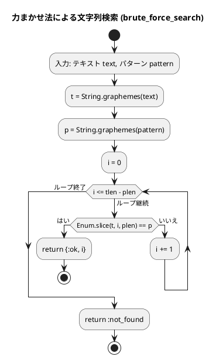
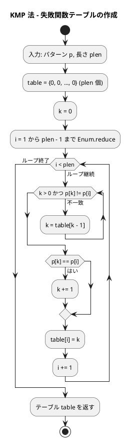
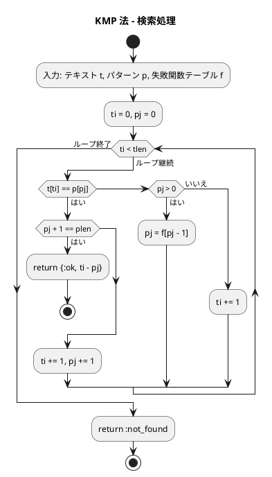
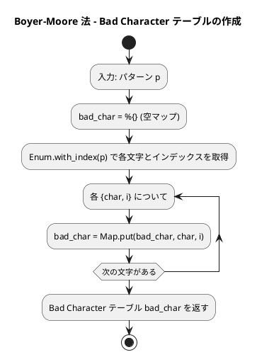
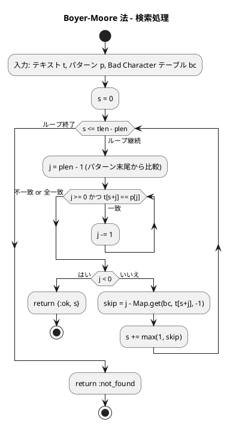

# 第 7 章 文字列処理

## はじめに

前章ではソートアルゴリズムを学びました。この章では、プログラミングにおいて非常に重要な「文字列処理」について TDD で実装します。

文字列処理は、テキストデータの操作や解析に欠かせない技術です。特に、テキスト検索、パターンマッチング、データ抽出などの処理は、多くのアプリケーションで必要とされます。

この章では、まず Elixir における基本的な文字列操作について学び、その後、テスト駆動開発の手法を用いて、効率的な文字列検索アルゴリズムを実装していきます。

### 目次

1. [Elixir の文字列基本操作](#elixir-の文字列基本操作)
2. [ブルートフォース文字列探索（力まかせ法）](#1-ブルートフォース文字列探索)
3. [KMP 法](#2-kmp-法knuth-morris-pratt)
4. [Boyer-Moore 法](#3-boyer-moore-法)
5. [文字カウント・逆順・回文判定](#4-文字数カウント)

---

## Elixir の文字列基本操作

Elixir の文字列は UTF-8 エンコードされたバイナリです。`String.graphemes/1` で書記素クラスタ（ユーザーが認識する「1 文字」）のリストに変換して操作します。

### 文字列の生成と基本操作

```elixir
# 文字列の生成
s1 = "Hello"
s2 = "World"
s3 = """
This is a
multiline string
"""

# 文字列の連結
s = s1 <> " " <> s2  # "Hello World"

# 文字列の繰り返し
s = String.duplicate(s1, 3)  # "HelloHelloHello"

# 文字列の長さ
length = String.length(s1)  # 5

# 文字へのアクセス
first_char = String.at(s1, 0)   # "H"
last_char = String.at(s1, -1)   # "o"

# スライス
substring = String.slice(s1, 1, 3)  # "ell"
```

### 文字列のメソッド

Elixir の `String` モジュールには、多くの便利な関数が用意されています。

```elixir
s = "Hello, World!"

# 検索
String.contains?(s, "World")  # true
String.contains?(s, "Python")  # false

# 置換
new_s = String.replace(s, "World", "Elixir")  # "Hello, Elixir!"

# 分割
parts = String.split(s, ", ")  # ["Hello", "World!"]

# 結合
joined = Enum.join(["Hello", "World"], ", ")  # "Hello, World"

# 大文字・小文字変換
upper = String.upcase(s)    # "HELLO, WORLD!"
lower = String.downcase(s)  # "hello, world!"

# 先頭・末尾の処理
stripped = String.trim("  Hello  ")         # "Hello"
starts = String.starts_with?(s, "Hello")    # true
ends = String.ends_with?(s, "World!")       # true
```

### 文字列のフォーマット

Elixir では、文字列補間が主要なフォーマット方法です。

```elixir
name = "Alice"
age = 30

# 文字列補間
s = "Name: #{name}, Age: #{age}"  # "Name: Alice, Age: 30"

# :io_lib.format（Erlang の機能）
s = :io_lib.format("Name: ~s, Age: ~B", [name, age]) |> to_string()
```

これらの基本的な文字列操作を理解した上で、より高度な文字列検索アルゴリズムを見ていきましょう。

---

## 1. ブルートフォース文字列探索

テキスト内でパターン文字列を先頭から順に探索する最も基本的なアルゴリズムです。

### Red -- 失敗するテストを書く

```elixir
# test/algorithm/strings_test.exs
defmodule Algorithm.StringsTest do
  use ExUnit.Case
  alias Algorithm.Strings

  describe "brute_force_search/2" do
    test "文字列内のパターンを検索する" do
      assert Strings.brute_force_search("ABCABC", "CAB") == {:ok, 2}
    end

    test "パターンが見つからない場合 :not_found を返す" do
      assert Strings.brute_force_search("ABCABC", "XYZ") == :not_found
    end
  end
end
```

### Green -- テストを通す最小限の実装

```elixir
# lib/algorithm/strings.ex
defmodule Algorithm.Strings do
  @moduledoc "文字列処理"

  @doc "ブルートフォース文字列探索"
  def brute_force_search(text, pattern) do
    t = String.graphemes(text)
    p = String.graphemes(pattern)
    tlen = length(t)
    plen = length(p)

    result =
      Enum.find(0..(tlen - plen), fn i ->
        Enum.slice(t, i, plen) == p
      end)

    case result do
      nil -> :not_found
      idx -> {:ok, idx}
    end
  end
end
```

### Refactor

`String.graphemes/1` で文字列を書記素クラスタのリストに分解し、`Enum.slice/3` でスライスを取得して比較します。`Enum.find/2` は条件を満たす最初の要素を返すので、最初に一致する位置が見つかります。

### 解説

力まかせ法（ブルートフォース法）のアルゴリズムは以下の通りです。

1. テキスト内の各位置から順にパターンとの一致を調べる
2. 一致しない文字が見つかったら、テキストのカーソルを 1 つ進めて再度パターンの先頭から比較を始める
3. パターン全体が一致したら、その位置を返す

**計算量**:
- 最良の場合: O(m)（m はパターンの長さ）
- 最悪の場合: O(n * m)（n はテキストの長さ）
- 平均の場合: O(n * m)

力まかせ法は単純で理解しやすいですが、テキストとパターンが長い場合には効率が悪くなります。そこで、より効率的なアルゴリズムが開発されました。

### フローチャート



---

## 2. KMP 法（Knuth-Morris-Pratt）

パターンの内部構造を事前解析し、不一致時に無駄な比較をスキップする効率的な文字列探索アルゴリズムです。

### Red -- 失敗するテストを書く

```elixir
describe "kmp_search/2" do
  test "KMP 法で文字列を検索する" do
    assert Strings.kmp_search("ABCABC", "CAB") == {:ok, 2}
  end

  test "パターンが見つからない場合 :not_found を返す" do
    assert Strings.kmp_search("ABCABC", "XYZ") == :not_found
  end
end
```

### Green -- テストを通す最小限の実装

```elixir
@doc "KMP 法による文字列探索"
def kmp_search(text, pattern) do
  t = String.graphemes(text)
  p = String.graphemes(pattern)
  plen = length(p)

  if plen == 0 do
    {:ok, 0}
  else
    failure = build_failure_table(p, plen)
    do_kmp_search(t, p, failure, 0, 0, length(t), plen)
  end
end
```

### Refactor -- 失敗関数テーブル

KMP 法の核心は「失敗関数テーブル」の構築です。パターン内の接頭辞と接尾辞の一致情報を事前計算しておくことで、不一致時にパターンの比較位置を効率的に戻せます。

Elixir では `Enum.reduce/3` を使ってテーブルを構築し、タプルで保持します。`elem/2` と `put_elem/3` でタプルの要素にアクセス・更新します。

```elixir
defp build_failure_table(p, plen) do
  table = List.to_tuple(List.duplicate(0, plen))

  if plen <= 1 do
    table
  else
    {table, _} =
      Enum.reduce(1..(plen - 1), {table, 0}, fn i, {tbl, k} ->
        k = retreat(p, tbl, k, i)
        k = if Enum.at(p, k) == Enum.at(p, i), do: k + 1, else: k
        {put_elem(tbl, i, k), k}
      end)

    table
  end
end
```

### 解説

KMP 法の特徴は以下の通りです。

1. パターン内の情報を利用して「失敗関数テーブル」を作成する
2. 不一致が発生した場合、テーブルを参照してパターンのカーソルを効率的に移動させる
3. すでに比較した文字を再度比較する必要がなくなる

**計算量**:
- 最良の場合: O(m)（m はパターンの長さ）
- 最悪の場合: O(n + m)（n はテキストの長さ）
- 平均の場合: O(n + m)

### フローチャート

#### 失敗関数テーブルの作成



#### 検索処理



---

## 3. Boyer-Moore 法

Boyer-Moore 法は、さらに効率的な文字列検索アルゴリズムです。パターンを右から左へ比較し、不一致が発生した場合に大きくスキップすることで、多くの比較を省略します。

### Red -- 失敗するテストを書く

```elixir
describe "bm_search/2" do
  test "BM 法で文字列を検索する" do
    assert Strings.bm_search("ABCABC", "CAB") == {:ok, 2}
  end

  test "パターンが見つからない場合 :not_found を返す" do
    assert Strings.bm_search("ABCABC", "XYZ") == :not_found
  end

  test "先頭のパターンを見つける" do
    assert Strings.bm_search("ABCDEF", "ABC") == {:ok, 0}
  end
end
```

### Green -- テストを通す最小限の実装

```elixir
@doc "Boyer-Moore 法による文字列探索（Bad Character ルール）"
def bm_search(text, pattern) do
  t = String.graphemes(text)
  p = String.graphemes(pattern)
  tlen = length(t)
  plen = length(p)

  if plen == 0 do
    {:ok, 0}
  else
    bad_char = build_bad_char_table(p, plen)
    do_bm_search(t, p, bad_char, 0, tlen, plen)
  end
end

defp build_bad_char_table(p, _plen) do
  Enum.reduce(Enum.with_index(p), %{}, fn {char, i}, acc ->
    Map.put(acc, char, i)
  end)
end

defp do_bm_search(_t, _p, _bc, s, tlen, plen) when s > tlen - plen, do: :not_found

defp do_bm_search(t, p, bc, s, tlen, plen) do
  j = match_from_right(t, p, s, plen - 1)

  if j < 0 do
    {:ok, s}
  else
    skip = j - Map.get(bc, Enum.at(t, s + j), -1)
    do_bm_search(t, p, bc, s + max(1, skip), tlen, plen)
  end
end

defp match_from_right(_t, _p, _s, j) when j < 0, do: j

defp match_from_right(t, p, s, j) do
  if Enum.at(p, j) == Enum.at(t, s + j) do
    match_from_right(t, p, s, j - 1)
  else
    j
  end
end
```

### Refactor

Boyer-Moore 法の Elixir 実装では、Bad Character テーブルをマップ（`%{}`）で表現しています。`Enum.reduce/3` と `Enum.with_index/1` を組み合わせてテーブルを構築し、`Map.get/3` でデフォルト値を指定して検索します。

`match_from_right/4` はパターンの末尾から先頭に向かって比較する再帰関数です。パターンマッチのガード節 `when j < 0` で再帰の終了条件を明示的に表現しています。

### 解説

Boyer-Moore 法の特徴は以下の通りです。

1. パターンを右から左へ比較する
2. 不一致が発生した場合、以下のルールに基づいてスキップする:
   - 不一致文字ルール（Bad Character Rule）: テキスト内の不一致文字がパターン内に存在するかどうかに基づいてスキップ
   - 一致接尾辞ルール（Good Suffix Rule）: パターン内の部分文字列の一致に基づいてスキップ

**計算量**:
- 最良の場合: O(n / m)（n はテキストの長さ、m はパターンの長さ）
- 最悪の場合: O(n * m)
- 平均の場合: O(n)

Boyer-Moore 法は、実用的な文字列検索アルゴリズムとして広く使用されています。特に、パターンが長い場合や、アルファベットの種類が多い場合に効率的です。

### フローチャート

#### Bad Character テーブルの作成



#### 検索処理



---

## 4. 文字数カウント

### Red -- 失敗するテストを書く

```elixir
describe "char_count/1" do
  test "各文字の出現回数を返す" do
    assert Strings.char_count("hello") == %{"h" => 1, "e" => 1, "l" => 2, "o" => 1}
  end
end
```

### Green -- テストを通す最小限の実装

```elixir
@doc "各文字の出現回数を返す"
def char_count(str) do
  str
  |> String.graphemes()
  |> Enum.frequencies()
end
```

### Refactor

`Enum.frequencies/1` は Elixir 1.10 で追加された関数で、リストの各要素の出現回数をマップで返します。パイプ演算子と組み合わせることで、「文字列を分解し -> 頻度を数える」という処理が 1 行で表現できます。

---

## 5. 文字列の反転

### Red -- 失敗するテストを書く

```elixir
describe "reverse_string/1" do
  test "文字列を逆順にする" do
    assert Strings.reverse_string("hello") == "olleh"
  end
end
```

### Green -- テストを通す最小限の実装

```elixir
@doc "文字列を逆順にする"
def reverse_string(str) do
  str |> String.graphemes() |> Enum.reverse() |> Enum.join()
end
```

### Refactor

`String.reverse/1` という組み込み関数もありますが、ここではアルゴリズムの理解のために `String.graphemes` + `Enum.reverse` + `Enum.join` のパイプラインで実装しています。

---

## 6. 回文判定

### Red -- 失敗するテストを書く

```elixir
describe "palindrome?/1" do
  test "回文の場合 true を返す" do
    assert Strings.palindrome?("racecar") == true
  end

  test "回文でない場合 false を返す" do
    assert Strings.palindrome?("hello") == false
  end
end
```

### Green -- テストを通す最小限の実装

```elixir
@doc "回文判定"
def palindrome?(str) do
  str == reverse_string(str)
end
```

### Refactor

既に実装した `reverse_string/1` を再利用して、元の文字列と反転した文字列が等しいかどうかで回文を判定しています。関数の再利用による DRY 原則の実践です。

---

## 文字列探索アルゴリズムの比較

| アルゴリズム | 計算量 | 特徴 |
|-------------|--------|------|
| ブルートフォース | O(n * m) | シンプル、小規模に有効 |
| KMP 法 | O(n + m) | 最悪でも線形、前処理が必要 |
| Boyer-Moore 法 | O(n / m) 平均 | 大規模テキストで最速 |

---

## Python との比較

| 操作 | Python | Elixir |
|------|--------|--------|
| 文字列検索 | `str.find("pattern")` | `String.contains?/2`, カスタム実装 |
| スライス | `s[1:4]` | `String.slice(s, 1, 3)` |
| 文字列長 | `len(s)` | `String.length(s)` |
| 連結 | `s1 + s2` | `s1 <> s2` |
| 繰り返し | `s * 3` | `String.duplicate(s, 3)` |
| 大文字化 | `s.upper()` | `String.upcase(s)` |
| 小文字化 | `s.lower()` | `String.downcase(s)` |
| 分割 | `s.split(", ")` | `String.split(s, ", ")` |
| 結合 | `", ".join(list)` | `Enum.join(list, ", ")` |
| 先頭判定 | `s.startswith("A")` | `String.starts_with?(s, "A")` |
| 末尾判定 | `s.endswith("Z")` | `String.ends_with?(s, "Z")` |
| トリム | `s.strip()` | `String.trim(s)` |
| 置換 | `s.replace("a", "b")` | `String.replace(s, "a", "b")` |
| フォーマット | `f"Name: {name}"` | `"Name: #{name}"` |
| 文字列型 | 不変シーケンス | UTF-8 バイナリ |
| 文字アクセス | `s[0]` | `String.at(s, 0)` |
| 返り値（検索） | インデックス or -1 | `{:ok, idx}` or `:not_found` |

**主な違い**:
- Python は文字列をシーケンス型として扱い、インデックスアクセスが直接可能です
- Elixir は文字列を UTF-8 バイナリとして扱い、`String.graphemes/1` で書記素クラスタに分解して操作します
- Elixir の検索結果は `{:ok, value}` / `:not_found` のタプル形式で、パターンマッチで安全に処理できます

---

## まとめ

この章では、文字列処理アルゴリズムを TDD で実装しました。

- **`String.graphemes/1`**: UTF-8 文字列を書記素クラスタのリストに分解
- **`Enum.frequencies/1`**: 要素の出現頻度を 1 行でカウント
- **パイプ演算子 `|>`**: 文字列操作のチェーンを読みやすく表現
- **KMP 法**: 失敗関数テーブルによる効率的な文字列探索
- **Boyer-Moore 法**: Bad Character ルールによる高速な文字列探索

Elixir の文字列は UTF-8 バイナリであるため、マルチバイト文字も正しく扱えます。`String.graphemes/1` を使うことで、絵文字や結合文字を含む文字列でも正確な操作が可能です。

次の章では、リストについて学んでいきましょう。

## 参考文献

- 『新・明解 Python で学ぶアルゴリズムとデータ構造』 -- 柴田望洋
- 『テスト駆動開発』 -- Kent Beck
