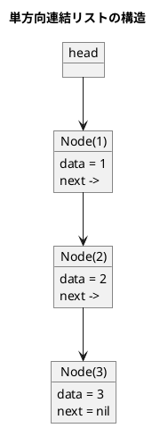
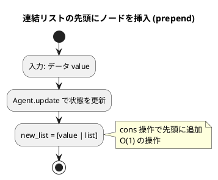
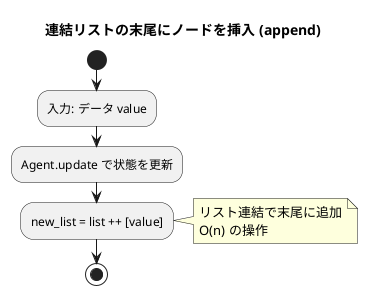

# 第 8 章 リスト

## はじめに

前章までで、配列や探索アルゴリズム、スタック、キュー、再帰、ソートアルゴリズム、文字列処理などを学んできました。この章では、データ構造の基本である「**リスト（連結リスト）**」を TDD で実装します。

配列と異なり、連結リストはメモリ上に不連続に配置されたノードをポインタで繋ぎます。要素の挿入・削除が O(1) ですが、ランダムアクセスは O(n) です。

### 目次

1. [リストとは](#リストとは)
2. [単方向連結リスト](#1-単方向連結リスト)
3. [カーソルによる線形リスト](#2-カーソルによる線形リスト)
4. [双方向連結リスト](#3-双方向連結リスト)
5. [Elixir のリスト操作パターン](#4-elixir-のリスト操作パターン)

---

## リストとは

リストとは、データを順序付けて格納するデータ構造です。配列と似ていますが、リストは要素の追加や削除が容易であるという特徴があります。

リストには様々な種類があります。

- **線形リスト**: 最も基本的なリスト構造で、各要素が一方向に連結されています。
- **連結リスト**: 各要素（ノード）が次の要素へのポインタを持つリスト構造です。
- **循環リスト**: 最後の要素が最初の要素を指す連結リストです。
- **双方向リスト**: 各要素が前後の要素へのポインタを持つリスト構造です。

### ノードとポインタ

連結リストの基本的な構成要素は**ノード**です。各ノードは以下の情報を持ちます。

- **データ**: ノードに格納する値
- **ポインタ（参照）**: 次のノード（および前のノード）への参照



それでは、これらのリスト構造を順に実装していきましょう。

---

## 1. 単方向連結リスト

各ノードがデータと次のノードへの参照を持つ、最も基本的な連結リストです。Elixir では `Agent` を使って可変状態を持つリスト操作を明示的に実装し、データ構造の概念を学びます。

### Red -- 失敗するテストを書く

```elixir
# test/algorithm/linked_lists_test.exs
defmodule Algorithm.LinkedListsTest do
  use ExUnit.Case
  alias Algorithm.LinkedList

  describe "LinkedList" do
    test "append と to_list が正しく動作する" do
      {:ok, list} = LinkedList.new()
      LinkedList.append(list, 1)
      LinkedList.append(list, 2)
      LinkedList.append(list, 3)
      assert LinkedList.to_list(list) == [1, 2, 3]
    end

    test "remove で要素を削除できる" do
      {:ok, list} = LinkedList.new()
      LinkedList.append(list, 1)
      LinkedList.append(list, 2)
      LinkedList.append(list, 3)
      LinkedList.remove(list, 2)
      assert LinkedList.to_list(list) == [1, 3]
    end

    test "prepend で先頭に追加できる" do
      {:ok, list} = LinkedList.new()
      LinkedList.append(list, 2)
      LinkedList.append(list, 3)
      LinkedList.prepend(list, 1)
      assert LinkedList.to_list(list) == [1, 2, 3]
    end

    test "search で要素を検索できる" do
      {:ok, list} = LinkedList.new()
      LinkedList.append(list, 10)
      LinkedList.append(list, 20)
      assert LinkedList.search(list, 20) == {:ok, 1}
    end

    test "search で見つからない場合 :not_found を返す" do
      {:ok, list} = LinkedList.new()
      LinkedList.append(list, 10)
      assert LinkedList.search(list, 99) == :not_found
    end
  end
end
```

### Green -- テストを通す最小限の実装

```elixir
# lib/algorithm/linked_lists.ex
defmodule Algorithm.LinkedList do
  @moduledoc "Agent ベースの単方向連結リスト"

  def new, do: Agent.start_link(fn -> [] end)

  def append(pid, value),
    do: Agent.update(pid, fn list -> list ++ [value] end)

  def prepend(pid, value),
    do: Agent.update(pid, fn list -> [value | list] end)

  def remove(pid, value),
    do: Agent.update(pid, fn list -> List.delete(list, value) end)

  def search(pid, value) do
    Agent.get(pid, fn list ->
      case Enum.find_index(list, &(&1 == value)) do
        nil -> :not_found
        idx -> {:ok, idx}
      end
    end)
  end

  def to_list(pid), do: Agent.get(pid, & &1)
end
```

### Refactor -- Agent による状態管理

`Agent` プロセスが内部状態としてリストを保持し、各操作は `Agent.update/2` や `Agent.get/2` を通じて状態を変更・取得します。

- **`append`**: `list ++ [value]` で末尾に追加（O(n)）
- **`prepend`**: `[value | list]` で先頭に追加（O(1)）
- **`remove`**: `List.delete/2` で最初に一致する要素を削除

### フローチャート

#### 先頭にノードを挿入（prepend）



#### 末尾にノードを挿入（append）



### 計算量

| 操作 | 計算量 |
|------|--------|
| prepend | O(1) |
| append | O(n) |
| remove | O(n) |
| search | O(n) |

---

## 2. カーソルによる線形リスト

ポインタ（参照）を使わず、配列のインデックスを「カーソル」として利用してリスト構造を実現する方法です。Elixir ではマップをノードの配列として使い、イミュータブルなカーソルリストを実装します。

### Red -- 失敗するテストを書く

```elixir
alias Algorithm.CursorList

describe "CursorList" do
  test "新しいカーソルリストを作成できる" do
    cl = CursorList.new(10)
    assert CursorList.to_list(cl) == []
  end

  test "insert で先頭に要素を追加できる" do
    cl = CursorList.new(10) |> CursorList.insert(1) |> CursorList.insert(2)
    assert CursorList.to_list(cl) == [2, 1]
  end

  test "append で末尾に要素を追加できる" do
    cl = CursorList.new(10) |> CursorList.append(1) |> CursorList.append(2)
    assert CursorList.to_list(cl) == [1, 2]
  end

  test "delete で要素を削除できる" do
    cl =
      CursorList.new(10)
      |> CursorList.append(1)
      |> CursorList.append(2)
      |> CursorList.append(3)
      |> CursorList.delete(2)

    assert CursorList.to_list(cl) == [1, 3]
  end

  test "search で要素を検索できる" do
    cl = CursorList.new(10) |> CursorList.append(10) |> CursorList.append(20)
    assert CursorList.search(cl, 20) == {:ok, 1}
  end

  test "search で見つからない場合 :not_found を返す" do
    cl = CursorList.new(10) |> CursorList.append(10)
    assert CursorList.search(cl, 99) == :not_found
  end
end
```

### Green -- テストを通す最小限の実装

```elixir
defmodule Algorithm.CursorList do
  @moduledoc "配列カーソルによるリスト実装（イミュータブル）"

  defstruct data: %{}, next: %{}, head: -1, size: 0, max: 0, deleted: []

  def new(_capacity) do
    %__MODULE__{}
  end

  def insert(%__MODULE__{} = cl, value) do
    idx = alloc_index(cl)

    %{cl |
      data: Map.put(cl.data, idx, value),
      next: Map.put(cl.next, idx, cl.head),
      head: idx,
      size: cl.size + 1,
      max: max(cl.max, idx + 1),
      deleted: tl_or_empty(cl.deleted)
    }
  end

  def append(%__MODULE__{head: -1} = cl, value) do
    insert(cl, value)
  end

  def append(%__MODULE__{} = cl, value) do
    idx = alloc_index(cl)
    last = find_last(cl, cl.head)

    %{cl |
      data: Map.put(cl.data, idx, value),
      next: Map.put(cl.next, idx, -1) |> Map.put(last, idx),
      size: cl.size + 1,
      max: max(cl.max, idx + 1),
      deleted: tl_or_empty(cl.deleted)
    }
  end

  def delete(%__MODULE__{} = cl, value) do
    do_delete(cl, cl.head, -1, value)
  end

  def search(%__MODULE__{} = cl, value) do
    do_search(cl, cl.head, 0, value)
  end

  def to_list(%__MODULE__{head: -1}), do: []

  def to_list(%__MODULE__{} = cl) do
    collect(cl, cl.head, []) |> Enum.reverse()
  end

  # --- private ---

  defp alloc_index(%__MODULE__{deleted: [idx | _]}), do: idx
  defp alloc_index(%__MODULE__{max: max}), do: max

  defp tl_or_empty([_ | rest]), do: rest
  defp tl_or_empty([]), do: []

  defp find_last(cl, idx) do
    next = Map.get(cl.next, idx, -1)
    if next == -1, do: idx, else: find_last(cl, next)
  end

  defp collect(_cl, -1, acc), do: acc

  defp collect(cl, idx, acc) do
    collect(cl, Map.get(cl.next, idx, -1), [Map.get(cl.data, idx) | acc])
  end

  defp do_delete(cl, -1, _prev, _value), do: cl

  defp do_delete(cl, idx, prev, value) do
    if Map.get(cl.data, idx) == value do
      next_idx = Map.get(cl.next, idx, -1)

      cl =
        if prev == -1 do
          %{cl | head: next_idx}
        else
          %{cl | next: Map.put(cl.next, prev, next_idx)}
        end

      %{cl | size: cl.size - 1, deleted: [idx | cl.deleted]}
    else
      do_delete(cl, Map.get(cl.next, idx, -1), idx, value)
    end
  end

  defp do_search(_cl, -1, _pos, _value), do: :not_found

  defp do_search(cl, idx, pos, value) do
    if Map.get(cl.data, idx) == value do
      {:ok, pos}
    else
      do_search(cl, Map.get(cl.next, idx, -1), pos + 1, value)
    end
  end
end
```

### Refactor -- イミュータブルなカーソルリスト

Elixir 版のカーソルリストは、Python 版のクラスベース実装と異なり、完全にイミュータブルです。

- **`defstruct`** でリストの状態を構造体として定義
- **`data` マップ**: インデックスからデータへの対応
- **`next` マップ**: インデックスから次のインデックスへの対応
- **`deleted` リスト**: 削除済みインデックスのフリーリスト（再利用可能）
- 各操作は新しい構造体を返す（パイプ演算子 `|>` でチェーン可能）

### 解説

カーソルによる線形リストは、配列を使って線形リストを実装する方法です。この実装では、以下の特徴があります。

1. **データマップ**: インデックスをキーとし、格納値を値とするマップ
2. **ネクストマップ**: インデックスをキーとし、次のノードのインデックスを値とするマップ
3. **フリーリスト**: 削除されたインデックスを再利用するための仕組み
4. **head**: リストの先頭ノードのインデックス（-1 は空リストを表す）

---

## 3. 双方向連結リスト

各ノードが前後両方のノードへの参照を持つリストです。

### Red -- 失敗するテストを書く

```elixir
alias Algorithm.DoublyLinkedList

describe "DoublyLinkedList" do
  test "append と to_list が正しく動作する" do
    {:ok, dll} = DoublyLinkedList.new()
    DoublyLinkedList.append(dll, 1)
    DoublyLinkedList.append(dll, 2)
    DoublyLinkedList.append(dll, 3)
    assert DoublyLinkedList.to_list(dll) == [1, 2, 3]
  end

  test "prepend で先頭に追加できる" do
    {:ok, dll} = DoublyLinkedList.new()
    DoublyLinkedList.append(dll, 2)
    DoublyLinkedList.append(dll, 3)
    DoublyLinkedList.prepend(dll, 1)
    assert DoublyLinkedList.to_list(dll) == [1, 2, 3]
  end
end
```

### Green -- テストを通す最小限の実装

```elixir
defmodule Algorithm.DoublyLinkedList do
  @moduledoc "Agent ベースの双方向連結リスト（内部はリストで表現）"

  def new, do: Agent.start_link(fn -> [] end)

  def append(pid, value),
    do: Agent.update(pid, fn list -> list ++ [value] end)

  def prepend(pid, value),
    do: Agent.update(pid, fn list -> [value | list] end)

  def remove(pid, value),
    do: Agent.update(pid, fn list -> List.delete(list, value) end)

  def to_list(pid), do: Agent.get(pid, & &1)
end
```

### Refactor -- Elixir での連結リストの考え方

Elixir の組み込みリストは既に単方向連結リストとして実装されています。双方向連結リストは、命令型言語のようにポインタ操作で実装するのではなく、`Agent` + リストの抽象化で表現しています。

実際の Elixir アプリケーションでは、双方向の走査が必要な場合は `:queue` モジュール（Erlang 標準ライブラリ）を使うか、リストの反転を組み合わせて対応します。

---

## 4. Elixir のリスト操作パターン

Elixir の組み込みリストで使える主要な操作をまとめます。

```elixir
# 先頭への追加（O(1)）
[0 | [1, 2, 3]]
# => [0, 1, 2, 3]

# パターンマッチによる分解
[head | tail] = [1, 2, 3]
# head => 1, tail => [2, 3]

# Enum モジュールによる操作
Enum.map([1, 2, 3], &(&1 * 2))     # => [2, 4, 6]
Enum.filter([1, 2, 3], &(&1 > 1))  # => [2, 3]
Enum.reduce([1, 2, 3], 0, &+/2)    # => 6

# リスト内包表記
for x <- [1, 2, 3], x > 1, do: x * 2
# => [4, 6]
```

---

## 配列 vs 連結リスト

| 項目 | 配列 | 連結リスト |
|------|------|-----------|
| ランダムアクセス | O(1) | O(n) |
| 先頭への挿入 | O(n) | O(1) |
| 末尾への挿入 | O(1) | O(1) ※単方向は O(n) |
| 途中への挿入 | O(n) | O(1)（ポインタ取得後） |
| メモリ使用 | 連続領域 | 不連続、ポインタ分余分 |

---

## Python との比較

| 項目 | Python | Elixir |
|------|--------|--------|
| ノード定義 | `class _Node` | `Agent` 内部状態 / `defstruct` |
| 状態管理 | インスタンス変数 | `Agent` プロセス / イミュータブル構造体 |
| 先頭追加 | `node.next = self.head` | `[value \| list]` |
| 末尾追加 | `while ptr.next: ptr = ptr.next` | `list ++ [value]` |
| 削除 | ポインタの付け替え | `List.delete/2` |
| カーソルリスト | `class ArrayLinkedList` + 配列 | `defstruct` + マップ |
| フリーリスト | `dnext` フィールド | `deleted` リスト |
| 双方向リスト | `_DNode` (prev/next) | `Agent` + リスト抽象化 |
| イテレータ | `__iter__` / `__next__` | `Enum` モジュール |
| ミュータブル | Yes（直接変更） | No（新しい値を返す） |

**主な違い**:
- Python ではクラスのインスタンス変数でノードの参照を直接操作します
- Elixir ではイミュータブルなデータ構造を基本とし、`Agent` で可変状態をラップするか、構造体の更新で新しい値を返します
- Elixir の組み込みリストは既に単方向連結リストとして最適化されているため、多くの場合は組み込みリストをそのまま使います

---

## まとめ

この章では、連結リストのデータ構造を TDD で実装しました。

1. **単方向連結リスト**: `Agent` ベースの実装。各操作は `Agent.update/2` や `Agent.get/2` を通じて状態を変更・取得します。
2. **カーソルによる線形リスト**: `defstruct` + マップによるイミュータブルな実装。パイプ演算子でチェーン可能です。
3. **双方向連結リスト**: `Agent` + リストの抽象化で表現。実用的には `:queue` モジュールを使用します。

- **`Agent`**: 可変状態の管理に使用
- **`[value | list]`**: リストの先頭への追加（cons 操作、O(1)）
- **`list ++ [value]`**: リストの末尾への追加（O(n)）
- **`List.delete/2`**: 要素の削除

Elixir では、リスト操作は先頭への追加が最も効率的です。パフォーマンスが重要な場合は、先頭への追加を使い、最後に `Enum.reverse/1` で反転するパターンがよく使われます。

次の章では、木構造について学びます。

## 参考文献

- 『新・明解 Python で学ぶアルゴリズムとデータ構造』 -- 柴田望洋
- 『テスト駆動開発』 -- Kent Beck
