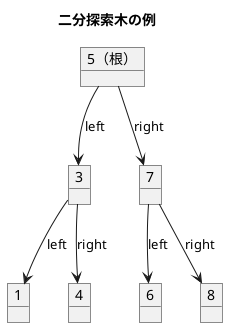
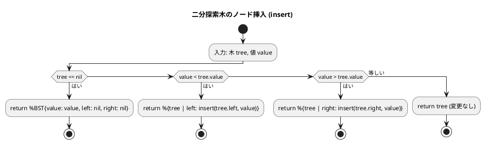
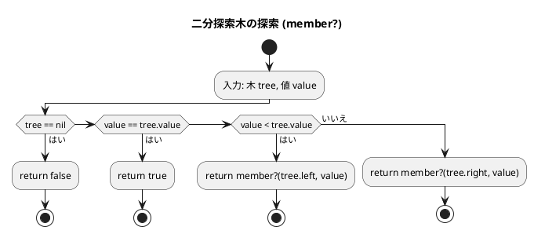
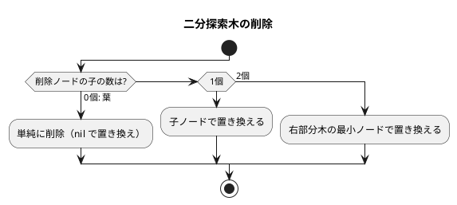
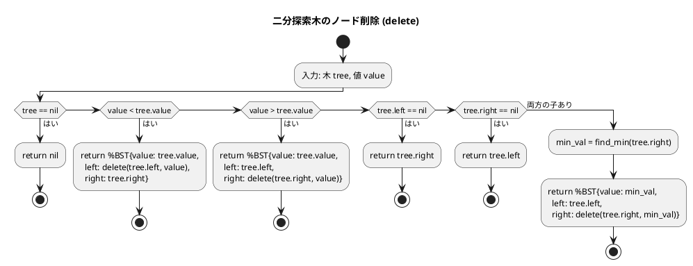

# 第 9 章 木構造

## はじめに

前章までで、配列、探索アルゴリズム、スタック、キュー、再帰、ソートアルゴリズム、文字列処理、リストなどを学んできました。この章では、データ構造の中でも特に重要な「**木構造**」、特に**二分探索木（BST: Binary Search Tree）**を TDD で実装します。

木構造はノードが親子関係で繋がった非線形データ構造です。二分探索木は左の子 < 親 < 右の子という性質を持ち、効率的な探索・挿入・削除を実現します。

Elixir のイミュータブルなデータ構造と再帰・パターンマッチを活用して、木構造の操作を簡潔に表現します。

### 目次

1. [木構造とは](#木構造とは)
2. [二分木](#二分木)
3. [二分探索木の定義](#1-二分探索木の定義)
4. [挿入](#2-挿入)
5. [存在確認](#3-存在確認)
6. [ノードの削除](#4-ノードの削除)
7. [走査（Traversal）](#5-走査traversal)
8. [ヒープ](#6-ヒープ)

---

## 木構造とは

木構造とは、データを階層的に表現するデータ構造です。木構造は、以下の要素から構成されます。

- **ノード**: データを格納する要素
- **エッジ**: ノード間の関係を表す線
- **ルート（根）**: 木の最上位に位置するノード
- **親ノード**: あるノードの上位に位置するノード
- **子ノード**: あるノードの下位に位置するノード
- **葉ノード（リーフ）**: 子ノードを持たないノード
- **高さ（height）**: ルートから最も深い葉ノードまでのエッジの数
- **深さ（depth）**: ルートからあるノードまでのエッジの数

木構造は、以下のような特徴を持ちます。

1. 一つのルートノードから始まる
2. 各ノードは 0 個以上の子ノードを持つ
3. 循環構造を持たない（サイクルがない）

### 順序木と無順序木

木構造は、子ノードの順序に意味があるかどうかによって、「順序木」と「無順序木」に分類されます。

- **順序木**: 子ノードの順序に意味がある木構造
- **無順序木**: 子ノードの順序に意味がない木構造

### 順序木の探索

順序木を探索する方法には、主に以下の 3 つがあります。

1. **先行順（行きがけ順）探索**: ノード自身 -> 左部分木 -> 右部分木の順に探索
2. **中間順（通りがけ順）探索**: 左部分木 -> ノード自身 -> 右部分木の順に探索
3. **後行順（帰りがけ順）探索**: 左部分木 -> 右部分木 -> ノード自身の順に探索

これらの探索方法は、再帰を用いて実装することができます。

---

## 二分木

二分木は、各ノードが最大 2 つの子ノード（左の子と右の子）を持つ木構造です。二分木は、以下のような特徴を持ちます。

1. 各ノードは最大 2 つの子ノードを持つ
2. 左の子と右の子が明確に区別される
3. 空の二分木も存在する

二分木は、様々なアルゴリズムやデータ構造の基礎となります。例えば、二分探索木、ヒープ、ハフマン木などは、二分木の一種です。

### 二分探索木の性質



**性質**:
- 左部分木のすべてのキー < ルートのキー
- 右部分木のすべてのキー > ルートのキー
- 中順探索（left -> root -> right）は昇順になる

---

## 1. 二分探索木の定義

### Elixir の構造体（defstruct）で定義

```elixir
# lib/algorithm/trees.ex
defmodule Algorithm.BinarySearchTree do
  @moduledoc "二分探索木（イミュータブル実装）"

  defstruct [:value, :left, :right]

  @doc "空の BST を作成"
  def new, do: nil
end
```

`defstruct` で `value`、`left`、`right` の 3 つのフィールドを持つ構造体を定義します。空の木は `nil` で表現します。

---

## 2. 挿入

### Red -- 失敗するテストを書く

```elixir
# test/algorithm/trees_test.exs
defmodule Algorithm.TreesTest do
  use ExUnit.Case
  alias Algorithm.BinarySearchTree, as: BST

  describe "BinarySearchTree" do
    test "insert と member? が正しく動作する" do
      tree = BST.new() |> BST.insert(5) |> BST.insert(3) |> BST.insert(7)
      assert BST.member?(tree, 3) == true
      assert BST.member?(tree, 4) == false
    end
  end
end
```

### Green -- テストを通す最小限の実装

```elixir
@doc "値を挿入"
def insert(nil, value),
  do: %__MODULE__{value: value, left: nil, right: nil}

def insert(%__MODULE__{value: v} = tree, value) when value < v,
  do: %{tree | left: insert(tree.left, value)}

def insert(%__MODULE__{value: v} = tree, value) when value > v,
  do: %{tree | right: insert(tree.right, value)}

def insert(tree, _value), do: tree
```

### Refactor -- イミュータブルな木操作

Elixir のデータはすべてイミュータブルであるため、`insert` は既存の木を変更せず、新しい木を返します。`%{tree | left: ...}` は構造体の更新構文で、指定したフィールドだけが変更された新しい構造体を作成します。

パターンマッチの活用:

1. `nil` への挿入: 新しい葉ノードを作成
2. 値が小さい場合: 左部分木に再帰的に挿入
3. 値が大きい場合: 右部分木に再帰的に挿入
4. 値が等しい場合: 変更なし（重複を許さない）

### フローチャート



---

## 3. 存在確認

```elixir
@doc "値の存在確認"
def member?(nil, _value), do: false
def member?(%__MODULE__{value: v}, value) when v == value, do: true
def member?(%__MODULE__{value: v, left: left}, value) when value < v,
  do: member?(left, value)
def member?(%__MODULE__{right: right}, value),
  do: member?(right, value)
```

関数頭部のパターンマッチとガード節で、4 つのケースを明確に分岐しています。

### フローチャート



---

## 4. ノードの削除

削除は 3 つのケースに分かれます。



### Red -- 失敗するテストを書く

```elixir
test "delete で葉ノードを削除できる" do
  tree = BST.new() |> BST.insert(5) |> BST.insert(3) |> BST.insert(7)
  tree = BST.delete(tree, 3)
  assert BST.member?(tree, 3) == false
  assert BST.in_order(tree) == [5, 7]
end

test "delete で子が 1 つのノードを削除できる" do
  tree = BST.new() |> BST.insert(5) |> BST.insert(3) |> BST.insert(7) |> BST.insert(1)
  tree = BST.delete(tree, 3)
  assert BST.member?(tree, 3) == false
  assert BST.in_order(tree) == [1, 5, 7]
end

test "delete で子が 2 つのノードを削除できる" do
  tree =
    BST.new()
    |> BST.insert(5)
    |> BST.insert(3)
    |> BST.insert(7)
    |> BST.insert(1)
    |> BST.insert(4)

  tree = BST.delete(tree, 3)
  assert BST.member?(tree, 3) == false
  assert BST.in_order(tree) == [1, 4, 5, 7]
end

test "delete でルートノードを削除できる" do
  tree = BST.new() |> BST.insert(5) |> BST.insert(3) |> BST.insert(7)
  tree = BST.delete(tree, 5)
  assert BST.member?(tree, 5) == false
  assert BST.in_order(tree) == [3, 7]
end

test "delete で存在しない値を指定すると木は変わらない" do
  tree = BST.new() |> BST.insert(5) |> BST.insert(3)
  tree = BST.delete(tree, 99)
  assert BST.in_order(tree) == [3, 5]
end
```

### Green -- テストを通す最小限の実装

```elixir
@doc "ノードの削除"
def delete(nil, _value), do: nil

def delete(%__MODULE__{value: v, left: l, right: r}, value) when value < v,
  do: %__MODULE__{value: v, left: delete(l, value), right: r}

def delete(%__MODULE__{value: v, left: l, right: r}, value) when value > v,
  do: %__MODULE__{value: v, left: l, right: delete(r, value)}

def delete(%__MODULE__{value: _v, left: nil, right: r}, _value), do: r
def delete(%__MODULE__{value: _v, left: l, right: nil}, _value), do: l

def delete(%__MODULE__{value: _v, left: l, right: r}, _value) do
  min_val = find_min(r)
  %__MODULE__{value: min_val, left: l, right: delete(r, min_val)}
end
```

### Refactor -- パターンマッチによる削除の表現

Elixir の削除操作は、パターンマッチで 6 つの関数節に分けて表現します。

1. `nil` の削除: そのまま `nil` を返す（存在しない値の削除）
2. 値が小さい場合: 左部分木で再帰的に削除
3. 値が大きい場合: 右部分木で再帰的に削除
4. 左の子がない場合: 右の子で置き換え
5. 右の子がない場合: 左の子で置き換え
6. 両方の子がある場合: 右部分木の最小値で置き換え、その最小値を右部分木から削除

Python 版では `while` ループとポインタ操作で実装していますが、Elixir 版では再帰とパターンマッチで宣言的に表現できます。

### フローチャート



### 最小キー・最大キーの取得

```elixir
@doc "最小値を取得"
def find_min(nil), do: nil
def find_min(%__MODULE__{left: nil, value: v}), do: v
def find_min(%__MODULE__{left: l}), do: find_min(l)

@doc "最大値を取得"
def find_max(nil), do: nil
def find_max(%__MODULE__{right: nil, value: v}), do: v
def find_max(%__MODULE__{right: r}), do: find_max(r)
```

二分探索木の性質を利用すると、最小値は左端のノード、最大値は右端のノードに存在します。パターンマッチで `left: nil` を検出することで、それ以上左に進めない（= 最小値）ことを判定しています。

---

## 5. 走査（Traversal）

木構造の全ノードを訪問する方法には、中順（in-order）、前順（pre-order）、後順（post-order）の 3 種類があります。

### Red -- 失敗するテストを書く

```elixir
test "in_order で昇順に走査する" do
  tree =
    BST.new()
    |> BST.insert(5)
    |> BST.insert(3)
    |> BST.insert(7)
    |> BST.insert(1)
    |> BST.insert(4)

  assert BST.in_order(tree) == [1, 3, 4, 5, 7]
end

test "pre_order で前順に走査する" do
  tree = BST.new() |> BST.insert(5) |> BST.insert(3) |> BST.insert(7)
  assert BST.pre_order(tree) == [5, 3, 7]
end

test "post_order で後順に走査する" do
  tree = BST.new() |> BST.insert(5) |> BST.insert(3) |> BST.insert(7)
  assert BST.post_order(tree) == [3, 7, 5]
end
```

### Green -- テストを通す最小限の実装

```elixir
@doc "中順走査（昇順）"
def in_order(nil), do: []
def in_order(%__MODULE__{value: v, left: l, right: r}),
  do: in_order(l) ++ [v] ++ in_order(r)

@doc "前順走査"
def pre_order(nil), do: []
def pre_order(%__MODULE__{value: v, left: l, right: r}),
  do: [v] ++ pre_order(l) ++ pre_order(r)

@doc "後順走査"
def post_order(nil), do: []
def post_order(%__MODULE__{value: v, left: l, right: r}),
  do: post_order(l) ++ post_order(r) ++ [v]
```

### Refactor -- 走査の違い

3 種類の走査は、現在のノードの値 `v` をリストに追加するタイミングだけが異なります。

| 走査 | 順序 | 用途 |
|------|------|------|
| 中順（in-order） | 左 -> 自分 -> 右 | BST の値を昇順に取得 |
| 前順（pre-order） | 自分 -> 左 -> 右 | 木のコピー |
| 後順（post-order） | 左 -> 右 -> 自分 | 木の削除（子を先に処理） |

BST の中順走査は必ず昇順になるため、ソートされたデータの取得に使えます。

---

## 6. パイプ演算子による木の構築

Elixir のパイプ演算子 `|>` を使うと、木の構築が非常に読みやすくなります。

```elixir
tree =
  BST.new()
  |> BST.insert(5)
  |> BST.insert(3)
  |> BST.insert(7)
  |> BST.insert(1)
  |> BST.insert(4)
```

各 `insert` は新しい木を返すので、パイプで次の `insert` に渡せます。これはイミュータブルデータとパイプ演算子の組み合わせの美しい例です。

---

## 7. ヒープ

ヒープは、完全二分木の一種で、以下の性質を持ちます。

1. 各ノードの値は、その子ノードの値以上（または以下）である
2. 木は可能な限り左から右へ、上から下へ詰めて構築される

ヒープには、最大ヒープと最小ヒープの 2 種類があります。

- **最大ヒープ**: 各ノードの値は、その子ノードの値以上である
- **最小ヒープ**: 各ノードの値は、その子ノードの値以下である

### ヒープの実装

ヒープは、通常、配列（リスト）を用いて実装されます。完全二分木の性質を利用すると、配列のインデックスを用いて親子関係を表現することができます。

- インデックス i のノードの左の子ノードのインデックスは 2i + 1
- インデックス i のノードの右の子ノードのインデックスは 2i + 2
- インデックス i のノードの親ノードのインデックスは div(i - 1, 2)

Erlang/Elixir の標準ライブラリには `:gb_trees` モジュール（汎用平衡木）が用意されています。

```elixir
# :gb_trees を使った例
tree = :gb_trees.empty()
tree = :gb_trees.insert(3, "three", tree)
tree = :gb_trees.insert(1, "one", tree)
tree = :gb_trees.insert(4, "four", tree)
tree = :gb_trees.insert(2, "two", tree)

{1, "one"} = :gb_trees.smallest(tree)
{4, "four"} = :gb_trees.largest(tree)
```

### 解説

ヒープは、最大値または最小値を効率的に取得できるデータ構造です。要素の追加と削除の時間計算量は O(log n) となります。

ヒープは、優先度付きキューの実装や、ヒープソートなどのアルゴリズムに利用されます。また、ダイクストラのアルゴリズムなど、グラフアルゴリズムでも利用されます。

---

## 計算量

| 操作 | 平均 | 最悪（偏った木） |
|------|------|-----------------|
| 挿入 | O(log n) | O(n) |
| 検索 | O(log n) | O(n) |
| 削除 | O(log n) | O(n) |
| 走査 | O(n) | O(n) |

最悪ケースは、挿入順がソート済みの場合に発生し、木が偏ってリスト状になります。平衡二分木（AVL 木、赤黒木）を使えば最悪でも O(log n) を保証できます。

---

## Python との比較

| 項目 | Python | Elixir |
|------|--------|--------|
| ノード定義 | `class _BSTNode` | `defstruct [:value, :left, :right]` |
| 空の木 | `None` | `nil` |
| 挿入 | `while` ループ + ポインタ操作 | パターンマッチ + 再帰 |
| 探索 | `while` ループ | パターンマッチ + ガード節 |
| 削除 | `while` ループ + 左部分木の最大値 | パターンマッチ + 右部分木の最小値 |
| 走査 | 内部関数 `print_subtree` | 関数節の分岐 |
| 状態管理 | ミュータブル（直接変更） | イミュータブル（新しい木を返す） |
| 構築 | `bst.insert(5)` | `BST.new() \|> BST.insert(5)` |
| ヒープ | `heapq` モジュール | `:gb_trees`（Erlang 標準） |

**主な違い**:
- Python ではクラスのインスタンスを直接変更しますが、Elixir では各操作が新しい木を返します
- Elixir のパターンマッチにより、削除操作の 6 つのケースを明確な関数節で表現できます
- Python の `while` ループによる探索は、Elixir では再帰とガード節で表現されます
- Elixir のパイプ演算子により、木の構築が宣言的で読みやすくなります

---

## まとめ

この章では、木構造について学びました。

1. **木構造の基本概念**: ノード、エッジ、ルート、葉、高さ、深さ
2. **二分木**: 各ノードが最大 2 つの子ノードを持つ木構造
3. **二分探索木**: 効率的な探索・挿入・削除を可能にする二分木。平均 O(log n) で操作可能
4. **ノードの削除**: 3 つのケース（葉、子 1 つ、子 2 つ）をパターンマッチで表現
5. **ヒープ**: 完全二分木の一種で、優先度付きキューの実装に利用

- **`defstruct`**: 木のノードを構造体で定義
- **パターンマッチ**: `nil`（空の木）と `%__MODULE__{}` の分岐
- **イミュータブルな木操作**: `%{tree | left: ...}` による構造体更新
- **パイプ演算子 `|>`**: 木の構築を読みやすく表現
- **3 種類の走査**: 再帰とリスト連結による簡潔な実装

Elixir の関数型スタイルは、木構造のような再帰的なデータ構造と非常に相性が良いことがわかります。パターンマッチと再帰の組み合わせで、木の操作を宣言的に記述できます。

## 参考文献

- 『新・明解 Python で学ぶアルゴリズムとデータ構造』 -- 柴田望洋
- 『テスト駆動開発』 -- Kent Beck
