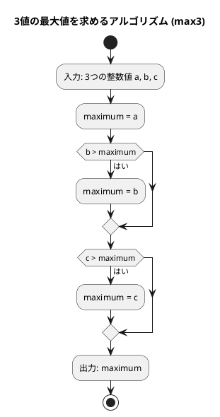

# 第 1 章 基本的なアルゴリズム

## はじめに

この章では、F# を使って基本的なアルゴリズムを TDD（テスト駆動開発）で実装します。F# は .NET 上で動く関数型ファーストの言語で、不変性、パターンマッチ、パイプライン演算子などの特徴を持ちます。

## アルゴリズムとは

アルゴリズムとは、問題を解決するための明確な手順のことです。コンピュータプログラムは、アルゴリズムを実行可能な形で表現したものと言えます。

良いアルゴリズムは以下の特徴を持ちます：

- 入力と出力が明確である
- 各ステップが明確である
- 有限のステップで終了する
- 効率的である

---

## 準備

```bash
nix develop .#dotnet
cd apps/fsharp
dotnet test Chapter01.Tests/
```

---

## 1. 3 値の最大値

### Red — 失敗するテストを書く

```fsharp
// Chapter01.Tests/Tests.fs
module Max3Tests =
    [<Fact>]
    let ``a > b > c``() = Assert.Equal(3, max3 3 2 1)
    [<Fact>]
    let ``b > a > c``() = Assert.Equal(3, max3 2 3 1)
    [<Fact>]
    let ``c > b > a``() = Assert.Equal(3, max3 1 2 3)
```

### Green — 最小限の実装

```fsharp
// Chapter01/BasicAlgorithms.fs
/// 3 値の最大値を返す
let max3 a b c =
    let mutable maximum = a
    if b > maximum then maximum <- b
    if c > maximum then maximum <- c
    maximum
```

F# では変数はデフォルトで不変です。値を更新するには `mutable` と `<-` 演算子を使います。

### アルゴリズムの考え方



1. 最初の値を最大値と仮定する
2. 残りの値と比較し、より大きい値があれば最大値を更新する
3. すべての値との比較が終わったら、最大値を返す

---

## 2. 3 値の中央値

### Green — 実装

```fsharp
/// 3 値の中央値を返す
let med3 a b c =
    if a >= b then
        if b >= c then b
        elif a <= c then a
        else c
    elif a > c then a
    elif b > c then c
    else b
```

F# では `if/elif/else` が式（値を返す）として機能します。

### アルゴリズムの考え方

中央値を求めるアルゴリズムは、最大値よりも複雑です。すべての場合分けを考える必要があります：

| 条件 | 中央値 |
|------|--------|
| a >= b かつ b >= c | b |
| a >= b かつ a <= c | a |
| a >= b（それ以外、a > c > b） | c |
| a < b かつ a > c | a |
| a < b かつ b > c | c |
| a < b（それ以外、c >= b > a） | b |

---

## 3. 条件判定と分岐

### Green — 実装

```fsharp
/// 整数値の符号を判定する
let judgeSign n =
    if n > 0 then "その値は正です。"
    elif n < 0 then "その値は負です。"
    else "その値は0です。"
```

---

## 4. 繰り返し処理

### while 文による実装

```fsharp
/// while 文で 1 から n までの総和を求める
let sum1ToNWhile n =
    let mutable total = 0
    let mutable i = 1
    while i <= n do
        total <- total + i
        i <- i + 1
    total
```

### for 文による実装

```fsharp
/// for 文で 1 から n までの総和を求める
let sum1ToNFor n =
    let mutable total = 0
    for i in 1..n do
        total <- total + i
    total
```

F# の `for i in 1..n` は Python の `for i in range(1, n+1)` に相当します。

---

## 5. 記号文字の交互表示

```fsharp
/// '+' と '-' を交互に n 文字生成する（剰余判定方式）
let alternative1 n =
    let sb = System.Text.StringBuilder()
    for i in 0..n-1 do
        sb.Append(if i % 2 = 0 then '+' else '-') |> ignore
    sb.ToString()

/// '+' と '-' を交互に n 文字生成する（パターン繰り返し方式）
let alternative2 n =
    let base' = String.replicate (n / 2) "+-"
    if n % 2 = 1 then base' + "+" else base'
```

`String.replicate` は F# の文字列繰り返し関数です。

---

## 6. 多重ループ

### 九九の表

```fsharp
/// 九九の表を文字列で返す
let multiplicationTable () =
    let sb = System.Text.StringBuilder()
    sb.Append(String.replicate 27 "-") |> ignore
    for i in 1..9 do
        sb.Append("\n") |> ignore
        for j in 1..9 do
            sb.Append(sprintf "%3d" (i * j)) |> ignore
    sb.Append("\n" + String.replicate 27 "-") |> ignore
    sb.ToString()
```

---

## テスト実行結果

```
成功!   -失敗: 0、合格: 13、スキップ: 0、合計: 13
```

## まとめ

この章では、以下の基本的なアルゴリズムを TDD で実装しました：

| アルゴリズム | 関数 | 計算量 | F# の特徴 |
|-------------|------|--------|-----------|
| 3 値の最大値 | `max3` | O(1) | `mutable` と `<-` による更新 |
| 3 値の中央値 | `med3` | O(1) | `if/elif/else` は式 |
| 符号判定 | `judgeSign` | O(1) | 関数型スタイルの条件分岐 |
| 総和（while） | `sum1ToNWhile` | O(n) | `while` ループと `mutable` |
| 総和（for） | `sum1ToNFor` | O(n) | `for i in 1..n` の範囲構文 |
| 交互表示 | `alternative1/2` | O(n) | `String.replicate` |
| 九九の表 | `multiplicationTable` | O(n^2) | `sprintf` でのフォーマット |

TDD の Red-Green-Refactor サイクルを通じて、テストが仕様の役割を果たし、確実に動作するコードを構築できることを確認しました。

## 参考文献

- 『新・明解アルゴリズムとデータ構造』 -- 柴田望洋
- 『テスト駆動開発』 -- Kent Beck
