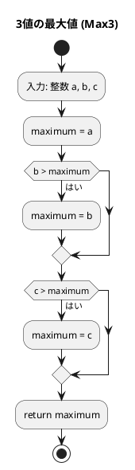
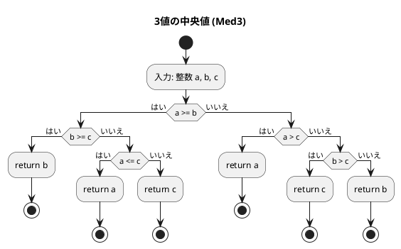
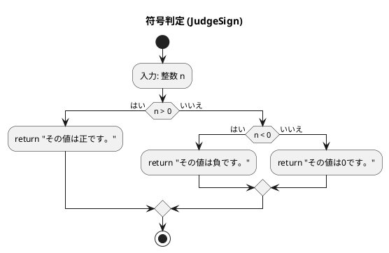
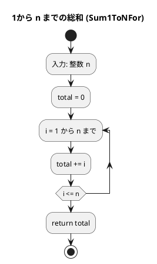
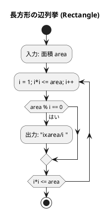

# 第 1 章 基本的なアルゴリズム

## はじめに

この章では、アルゴリズムの基本的な概念と、Go でのテスト駆動開発（TDD）の手法を学びます。

**アルゴリズム（Algorithm）** とは、問題を解決するための明確に定義された手順・計算方法です。同じ問題でも、複数のアルゴリズムが存在することがあり、それぞれに異なる効率や特性があります。

Go では、Python の `def` に相当する関数は `func` で定義し、型は明示的に宣言します。テストは `testing` パッケージを使い、テーブル駆動テスト（table-driven test）スタイルが慣用的です。

### 目次

1. [3 値の最大値](#1-3-値の最大値)
2. [3 値の中央値](#2-3-値の中央値)
3. [条件判定（符号判定）](#3-条件判定符号判定)
4. [1 から n までの総和](#4-1-から-n-までの総和)
5. [繰り返し処理](#5-繰り返し処理)

---

## 1. 3 値の最大値

3 つの整数 `a`, `b`, `c` の最大値を求めるアルゴリズムです。

### Red — 失敗するテストを書く

```go
// apps/go/chapter01/basic_algorithms_test.go
package chapter01_test

import (
    "testing"
    "github.com/k2works/getting-started-algorithm/go/chapter01"
)

func TestMax3(t *testing.T) {
    tests := []struct {
        a, b, c  int
        expected int
    }{
        {3, 2, 1, 3},
        {3, 2, 2, 3},
        {3, 1, 2, 3},
        {3, 2, 3, 3},
        {2, 1, 3, 3},
        {3, 3, 2, 3},
        {3, 3, 3, 3},
        {2, 2, 3, 3},
        {2, 3, 1, 3},
        {2, 3, 2, 3},
        {1, 3, 2, 3},
        {2, 3, 3, 3},
        {1, 2, 3, 3},
    }
    for _, tt := range tests {
        got := chapter01.Max3(tt.a, tt.b, tt.c)
        if got != tt.expected {
            t.Errorf("Max3(%d,%d,%d) = %d; want %d", tt.a, tt.b, tt.c, got, tt.expected)
        }
    }
}
```

### Green — テストを通す実装

```go
// apps/go/chapter01/basic_algorithms.go
package chapter01

// Max3 3つの整数値の最大値を返す
func Max3(a, b, c int) int {
    maximum := a
    if b > maximum {
        maximum = b
    }
    if c > maximum {
        maximum = c
    }
    return maximum
}
```

### アルゴリズムの考え方

#### 3 値の大小関係（13 パターン）

`a`、`b`、`c` の大小関係には以下の 13 パターンがあります。テストはこれらを網羅しています。

| a と b | a と c | b と c | 最大値 |
|--------|--------|--------|--------|
| a > b  | a > c  | b > c  | a      |
| a > b  | a > c  | b = c  | a      |
| a > b  | a > c  | b < c  | a      |
| a > b  | a = c  | b < c  | a (= c)|
| a > b  | a < c  | b < c  | c      |
| a = b  | a > c  | b > c  | a (= b)|
| a = b  | a = c  | b = c  | a (= b = c) |
| a = b  | a < c  | b < c  | c      |
| a < b  | a > c  | b > c  | b      |
| a < b  | a = c  | b > c  | b      |
| a < b  | a < c  | b > c  | b      |
| a < b  | a < c  | b = c  | b (= c)|
| a < b  | a < c  | b < c  | c      |

#### フローチャート



アルゴリズムの流れ：

1. 最大値の仮置きとして `maximum = a` とする
2. `b > maximum` なら `maximum = b` に更新する
3. `c > maximum` なら `maximum = c` に更新する
4. `maximum` を返す

**計算量**: O(1)（入力サイズに依存しない定数時間）

---

## 2. 3 値の中央値

3 つの整数 `a`, `b`, `c` の中央値（中間の値）を求めます。

### Red — 失敗するテストを書く

```go
func TestMed3(t *testing.T) {
    tests := []struct {
        a, b, c  int
        expected int
    }{
        {3, 2, 1, 2},
        {3, 2, 2, 2},
        {3, 1, 2, 2},
        {3, 2, 3, 3},
        {2, 1, 3, 2},
        {3, 3, 2, 3},
        {3, 3, 3, 3},
        {2, 2, 3, 2},
        {2, 3, 1, 2},
        {2, 3, 2, 2},
        {1, 3, 2, 2},
        {2, 3, 3, 3},
        {1, 2, 3, 2},
    }
    for _, tt := range tests {
        got := chapter01.Med3(tt.a, tt.b, tt.c)
        if got != tt.expected {
            t.Errorf("Med3(%d,%d,%d) = %d; want %d", tt.a, tt.b, tt.c, got, tt.expected)
        }
    }
}
```

### Green — テストを通す実装

```go
// Med3 3つの整数値の中央値を返す
func Med3(a, b, c int) int {
    if a >= b {
        if b >= c {
            return b
        } else if a <= c {
            return a
        } else {
            return c
        }
    } else if a > c {
        return a
    } else if b > c {
        return c
    } else {
        return b
    }
}
```

### アルゴリズムの考え方

#### フローチャート



中央値は「最大でも最小でもない値」です。`a`, `b`, `c` の大小関係を条件分岐で網羅することで求めます。

**計算量**: O(1)

---

## 3. 条件判定（符号判定）

整数が正・負・ゼロのいずれかを判定します。

### Red — 失敗するテストを書く

```go
func TestJudgeSign(t *testing.T) {
    tests := []struct {
        n        int
        expected string
    }{
        {17, "その値は正です。"},
        {-5, "その値は負です。"},
        {0, "その値は0です。"},
    }
    for _, tt := range tests {
        got := chapter01.JudgeSign(tt.n)
        if got != tt.expected {
            t.Errorf("JudgeSign(%d) = %q; want %q", tt.n, got, tt.expected)
        }
    }
}
```

### Green — テストを通す実装

```go
// JudgeSign 整数値の符号を判定する
func JudgeSign(n int) string {
    if n > 0 {
        return "その値は正です。"
    } else if n < 0 {
        return "その値は負です。"
    } else {
        return "その値は0です。"
    }
}
```

### アルゴリズムの考え方

#### フローチャート



3 分岐の条件判定です。`n > 0`, `n < 0`, `n == 0` の 3 つのケースを順に確認します。

---

## 4. 1 から n までの総和

1 から n までの整数の和を求めるアルゴリズムです。`for` ループを使った 2 種類の実装を示します。

### Red — 失敗するテストを書く

```go
func TestSum1ToNWhile(t *testing.T) {
    got := chapter01.Sum1ToNWhile(5)
    if got != 15 {
        t.Errorf("Sum1ToNWhile(5) = %d; want 15", got)
    }
}

func TestSum1ToNFor(t *testing.T) {
    got := chapter01.Sum1ToNFor(5)
    if got != 15 {
        t.Errorf("Sum1ToNFor(5) = %d; want 15", got)
    }
}
```

### Green — テストを通す実装

Go には `while` 文がなく、条件のみの `for` 文で代替します。

```go
// Sum1ToNWhile while ループ相当: 条件のみの for で 1 から n までの総和を求める
func Sum1ToNWhile(n int) int {
    total := 0
    i := 1
    for i <= n {  // Go の while ループ相当
        total += i
        i++
    }
    return total
}

// Sum1ToNFor for ループで 1 から n までの総和を求める
func Sum1ToNFor(n int) int {
    total := 0
    for i := 1; i <= n; i++ {
        total += i
    }
    return total
}
```

### アルゴリズムの考え方

#### フローチャート（for ループ版）



#### Python との対応

| Python | Go |
|--------|-----|
| `while i <= n:` | `for i <= n {` |
| `for i in range(1, n+1):` | `for i := 1; i <= n; i++ {` |

Go では `while` キーワードが存在せず、すべてのループは `for` で表現します。

**計算量**: O(n)

---

## 5. 繰り返し処理

### 交互記号出力

`+` と `-` を交互に表示する 2 種類の実装です。

#### Red — 失敗するテストを書く

```go
func TestAlternative1(t *testing.T) {
    tests := []struct {
        n        int
        expected string
    }{
        {12, "+-+-+-+-+-+-"},
        {5, "+-+-+"},
    }
    for _, tt := range tests {
        got := chapter01.Alternative1(tt.n)
        if got != tt.expected {
            t.Errorf("Alternative1(%d) = %q; want %q", tt.n, got, tt.expected)
        }
    }
}
```

#### Green — テストを通す実装

```go
import (
    "fmt"
    "strings"
)

// Alternative1 記号文字 '+' と '-' を交互に表示する（剰余判定方式）
func Alternative1(n int) string {
    var result strings.Builder
    for i := 0; i < n; i++ {
        if i%2 == 0 {
            result.WriteByte('+')
        } else {
            result.WriteByte('-')
        }
    }
    return result.String()
}

// Alternative2 記号文字 '+' と '-' を交互に表示する（パターン繰り返し方式）
func Alternative2(n int) string {
    result := strings.Repeat("+-", n/2)
    if n%2 != 0 {
        result += "+"
    }
    return result
}
```

Go では文字列を効率よく構築するために `strings.Builder` を使います。Python の `str += ...` よりも効率的です。

### 長方形の辺列挙

面積が `area` の長方形の辺の長さを列挙します（1 辺が `i`、他辺が `area/i`）。

#### Red — 失敗するテストを書く

```go
func TestRectangle(t *testing.T) {
    got := chapter01.Rectangle(32)
    if got != "1x32 2x16 4x8 " {
        t.Errorf("Rectangle(32) = %q; want %q", got, "1x32 2x16 4x8 ")
    }
}
```

#### Green — テストを通す実装

```go
// Rectangle 縦横が整数で面積が area の長方形の辺の長さを列挙する
func Rectangle(area int) string {
    var result strings.Builder
    for i := 1; i*i <= area; i++ {
        if area%i == 0 {
            result.WriteString(fmt.Sprintf("%dx%d ", i, area/i))
        }
    }
    return result.String()
}
```

#### フローチャート



`i*i <= area` という条件で、対称な組み合わせの重複を避けています。

### 九九の表

```go
// MultiplicationTable 九九の表を返す
func MultiplicationTable() string {
    var result strings.Builder
    result.WriteString(strings.Repeat("-", 27) + "\n")
    for i := 1; i <= 9; i++ {
        for j := 1; j <= 9; j++ {
            result.WriteString(fmt.Sprintf("%3d", i*j))
        }
        result.WriteByte('\n')
    }
    result.WriteString(strings.Repeat("-", 27))
    return result.String()
}
```

### 二重ループと三角形

```go
// TriangleLb 左下側が直角の二等辺三角形を返す
func TriangleLb(n int) string {
    var result strings.Builder
    for i := 1; i <= n; i++ {
        result.WriteString(strings.Repeat("*", i) + "\n")
    }
    return result.String()
}
```

---

## テスト実行結果

```bash
$ go test ./chapter01/ -v -cover
=== RUN   TestMax3
--- PASS: TestMax3 (0.00s)
=== RUN   TestMed3
--- PASS: TestMed3 (0.00s)
=== RUN   TestJudgeSign
--- PASS: TestJudgeSign (0.00s)
=== RUN   TestSum1ToNWhile
--- PASS: TestSum1ToNWhile (0.00s)
=== RUN   TestSum1ToNFor
--- PASS: TestSum1ToNFor (0.00s)
=== RUN   TestAlternative1
--- PASS: TestAlternative1 (0.00s)
=== RUN   TestAlternative2
--- PASS: TestAlternative2 (0.00s)
=== RUN   TestRectangle
--- PASS: TestRectangle (0.00s)
=== RUN   TestMultiplicationTable
--- PASS: TestMultiplicationTable (0.00s)
=== RUN   TestTriangleLb
--- PASS: TestTriangleLb (0.00s)
PASS
coverage: 100.0% of statements in ./chapter01/
ok      github.com/k2works/getting-started-algorithm/go/chapter01
```

13 パターンのテストケース（Max3・Med3）を含む全テストが通過し、カバレッジ 100% を達成しました。

---

## まとめ

| 関数 | 概要 | 計算量 | Go の特徴 |
|------|------|--------|-----------|
| `Max3` | 3 値の最大値 | O(1) | 連続 if で変数更新 |
| `Med3` | 3 値の中央値 | O(1) | 多分岐条件分岐 |
| `JudgeSign` | 符号判定 | O(1) | if-else if-else |
| `Sum1ToNWhile` | 総和（while 相当） | O(n) | `for 条件 {}` |
| `Sum1ToNFor` | 総和（for） | O(n) | `for i := 1; i <= n; i++` |
| `Alternative1` | 交互記号（剰余） | O(n) | `strings.Builder` |
| `Alternative2` | 交互記号（繰り返し） | O(n) | `strings.Repeat` |
| `Rectangle` | 長方形辺列挙 | O(√n) | `i*i <= area` |
| `MultiplicationTable` | 九九 | O(1) | 二重 for ループ |
| `TriangleLb` | 三角形 | O(n²) | `strings.Repeat` |

### Python との主な違い

| 機能 | Python | Go |
|------|--------|-----|
| ループ | `while`, `for in` | `for`（すべて） |
| 文字列構築 | `str +=` | `strings.Builder` |
| 文字列繰り返し | `"s" * n` | `strings.Repeat("s", n)` |
| フォーマット | `f"{x}"` | `fmt.Sprintf("%d", x)` |
| 型宣言 | 不要 | 明示的（`int`, `string`） |

## 参考文献

- 『新・明解 アルゴリズムとデータ構造』 — 柴田望洋
- 『テスト駆動開発』 — Kent Beck
- [The Go Programming Language](https://go.dev/doc/)
