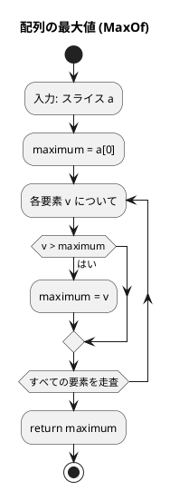
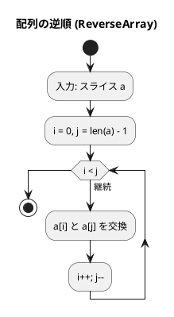
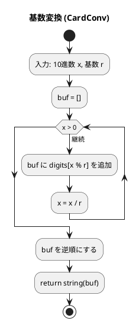
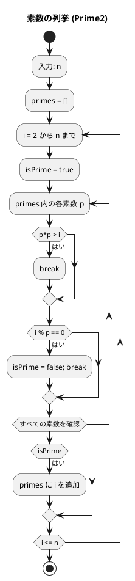

# 第 2 章 配列

## はじめに

前章では基本的なアルゴリズムを学びました。この章では、プログラミングの基本データ構造である「**配列**」を TDD で実装します。

配列とは、同じ型の要素を連続したメモリ領域に格納するデータ構造です。インデックスによるランダムアクセスが O(1) で行えます。

Go には **配列**（固定長）と**スライス**（可変長）の 2 種類があります。実務では主にスライスを使います。

### 目次

1. [Go のスライスとは](#go-のスライスとは)
2. [配列の最大値](#1-配列の最大値)
3. [配列の逆順](#2-配列の逆順)
4. [基数変換](#3-基数変換)
5. [素数の列挙](#4-素数の列挙)

---

## Go のスライスとは

Go のスライスは Python のリストに相当する動的配列です。

```go
// スライスの生成
a := []int{1, 2, 3, 4, 5}      // リテラル
b := make([]int, 5)              // make（ゼロ値で初期化）
c := make([]int, 0, 10)          // make（長さ 0、容量 10）

// 要素へのアクセス
first := a[0]   // 1
last := a[len(a)-1]  // 5

// スライス操作
sub := a[1:4]   // [2, 3, 4]（Python の a[1:4] と同じ）
a = append(a, 6)  // 末尾に追加

// 走査
for i, v := range a {
    fmt.Println(i, v)
}
```

### Python との対応

| Python | Go |
|--------|-----|
| `list` | `[]int`（スライス） |
| `[1, 2, 3]` | `[]int{1, 2, 3}` |
| `len(a)` | `len(a)` |
| `a.append(x)` | `a = append(a, x)` |
| `a[1:4]` | `a[1:4]` |
| `for i, v in enumerate(a):` | `for i, v := range a {` |

---

## 1. 配列の最大値

スライスの最大値を求めます。

### Red — 失敗するテストを書く

```go
// apps/go/chapter02/arrays_test.go
package chapter02_test

import (
    "testing"
    "github.com/k2works/getting-started-algorithm/go/chapter02"
)

func TestMaxOf(t *testing.T) {
    got := chapter02.MaxOf([]int{172, 153, 192, 140, 165})
    if got != 192 {
        t.Errorf("MaxOf(...) = %d; want 192", got)
    }
}
```

### Green — テストを通す実装

```go
// apps/go/chapter02/arrays.go
package chapter02

// MaxOf スライスの最大値を返す
func MaxOf(a []int) int {
    maximum := a[0]
    for _, v := range a {
        if v > maximum {
            maximum = v
        }
    }
    return maximum
}
```

### アルゴリズムの考え方

#### フローチャート



1. 先頭要素を仮の最大値に設定する
2. 残りの要素と比較し、より大きければ更新する
3. 全要素走査後の `maximum` が答え

**計算量**: O(n)

---

## 2. 配列の逆順

スライスの要素を in-place（元のスライスを変更）で逆順にします。

### Red — 失敗するテストを書く

```go
func TestReverseArray(t *testing.T) {
    a := []int{2, 5, 1, 3, 9, 6, 7}
    chapter02.ReverseArray(a)
    expected := []int{7, 6, 9, 3, 1, 5, 2}
    for i, v := range a {
        if v != expected[i] {
            t.Errorf("ReverseArray index %d = %d; want %d", i, v, expected[i])
        }
    }
}
```

### Green — テストを通す実装

```go
// ReverseArray スライスを in-place で逆順にする
func ReverseArray(a []int) {
    for i, j := 0, len(a)-1; i < j; i, j = i+1, j-1 {
        a[i], a[j] = a[j], a[i]
    }
}
```

### アルゴリズムの考え方

#### フローチャート



両端から中央に向かってポインタを進めながら交換します。Go では多値代入 `a[i], a[j] = a[j], a[i]` で一行で交換できます。

**計算量**: O(n)、追加メモリ O(1)

---

## 3. 基数変換

10 進数を任意の基数（2〜36 進数）に変換します。

### Red — 失敗するテストを書く

```go
func TestCardConv(t *testing.T) {
    tests := []struct {
        x, r     int
        expected string
    }{
        {29, 2, "11101"},
        {255, 16, "FF"},
    }
    for _, tt := range tests {
        got := chapter02.CardConv(tt.x, tt.r)
        if got != tt.expected {
            t.Errorf("CardConv(%d,%d) = %q; want %q", tt.x, tt.r, got, tt.expected)
        }
    }
}
```

### Green — テストを通す実装

```go
// CardConv 10進数 x を r 進数の文字列に変換する
func CardConv(x, r int) string {
    const digits = "0123456789ABCDEFGHIJKLMNOPQRSTUVWXYZ"
    buf := make([]byte, 0, 32)
    for x > 0 {
        buf = append(buf, digits[x%r])
        x /= r
    }
    // 逆順にする
    for i, j := 0, len(buf)-1; i < j; i, j = i+1, j-1 {
        buf[i], buf[j] = buf[j], buf[i]
    }
    return string(buf)
}
```

### アルゴリズムの考え方

#### フローチャート



#### 変換例

| 10 進数 | 2 進数 | 8 進数 | 16 進数 |
|---------|--------|--------|---------|
| 29 | 11101 | 35 | 1D |
| 255 | 11111111 | 377 | FF |
| 100 | 1100100 | 144 | 64 |

**計算量**: O(log_r(x))

---

## 4. 素数の列挙

1 以上 n 以下の素数をすべて列挙し、「割り算の実行回数」を比較します。

### Red — 失敗するテストを書く

```go
func TestPrime1(t *testing.T) {
    got := chapter02.Prime1(1000)
    if got != 78022 {
        t.Errorf("Prime1(1000) = %d; want 78022", got)
    }
}

func TestPrime2(t *testing.T) {
    got := chapter02.Prime2(1000)
    if got != 14622 {
        t.Errorf("Prime2(1000) = %d; want 14622", got)
    }
}

func TestPrime3(t *testing.T) {
    got := chapter02.Prime3(1000)
    if got != 3774 {
        t.Errorf("Prime3(1000) = %d; want 3774", got)
    }
}
```

### Green — テストを通す実装

#### Prime1: 単純な全数チェック

```go
// Prime1 n 以下の素数を求め、割り算の回数を返す
func Prime1(n int) int {
    count := 0
    for i := 2; i <= n; i++ {
        isPrime := true
        for j := 2; j < i; j++ {
            count++
            if i%j == 0 {
                isPrime = false
                break
            }
        }
        _ = isPrime
    }
    return count
}
```

#### Prime2: 素数リストを使った効率化

```go
// Prime2 素数リストを利用した改良版（n 以下の素数を求め、割り算の回数を返す）
func Prime2(n int) int {
    primes := make([]int, 0, n)
    count := 0
    for i := 2; i <= n; i++ {
        isPrime := true
        for _, p := range primes {
            if p*p > i {
                break
            }
            count++
            if i%p == 0 {
                isPrime = false
                break
            }
        }
        if isPrime {
            primes = append(primes, i)
        }
    }
    return count
}
```

#### Prime3: √n までの確認（最も効率的）

```go
// Prime3 sqrt(i) まで確認する最も効率的な版（n 以下の素数を求め、割り算の回数を返す）
func Prime3(n int) int {
    primes := make([]int, 0, n)
    count := 0
    for i := 2; i <= n; i++ {
        isPrime := true
        for _, p := range primes {
            if p*p > i {
                break
            }
            count++
            if i%p == 0 {
                isPrime = false
                break
            }
        }
        if isPrime {
            primes = append(primes, i)
        }
    }
    return count
}
```

### アルゴリズムの考え方

#### フローチャート（Prime2）



#### 3 つの実装の比較（n = 1000 のとき）

| バージョン | 除算回数 | 改善点 |
|-----------|---------|--------|
| Prime1 | 78,022 | なし（全数チェック） |
| Prime2 | 14,622 | 既知の素数でのみ除算 |
| Prime3 | 3,774 | √i 以下のみ確認 |

素数 p で割り切れない数は合成数ではないため、すでに発見した素数だけで除算すれば十分です。さらに、合成数 n = a × b のとき、a と b の小さい方は必ず √n 以下になるため、√n までの確認で十分です。

**計算量**: Prime1 O(n²) → Prime2 O(n√n) → Prime3 O(n√n)（定数が大幅に改善）

---

## テスト実行結果

```bash
$ go test ./chapter02/ -v -cover
=== RUN   TestMaxOf
--- PASS: TestMaxOf (0.00s)
=== RUN   TestReverseArray
--- PASS: TestReverseArray (0.00s)
=== RUN   TestCardConv
--- PASS: TestCardConv (0.00s)
=== RUN   TestPrime1
--- PASS: TestPrime1 (0.00s)
=== RUN   TestPrime2
--- PASS: TestPrime2 (0.00s)
=== RUN   TestPrime3
--- PASS: TestPrime3 (0.00s)
PASS
coverage: 100.0% of statements in ./chapter02/
ok      github.com/k2works/getting-started-algorithm/go/chapter02
```

全テストが通過し、カバレッジ 100% を達成しました。

---

## まとめ

| 関数 | 概要 | 計算量 | Go の特徴 |
|------|------|--------|-----------|
| `MaxOf` | 最大値 | O(n) | `for _, v := range a` |
| `ReverseArray` | 逆順（in-place） | O(n) | 多値代入 `a[i], a[j] = a[j], a[i]` |
| `CardConv` | 基数変換 | O(log n) | `[]byte` バッファ |
| `Prime1` | 素数列挙（単純） | O(n²) | 基本実装 |
| `Prime2` | 素数列挙（改良） | O(n√n) | 素数リスト活用 |
| `Prime3` | 素数列挙（最適） | O(n√n) | √n カット |

### Python との主な違い

| 機能 | Python | Go |
|------|--------|-----|
| スライス生成 | `[1, 2, 3]` | `[]int{1, 2, 3}` |
| 空スライス | `[]` | `make([]int, 0)` |
| 追加 | `a.append(x)` | `a = append(a, x)` |
| 多値代入 | `a, b = b, a` | `a, b = b, a` |
| 型変換 | `str(x)` | `string(buf)` |

## 参考文献

- 『新・明解 アルゴリズムとデータ構造』 — 柴田望洋
- 『テスト駆動開発』 — Kent Beck
- [The Go Programming Language](https://go.dev/doc/)
