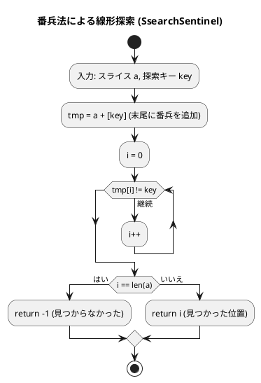
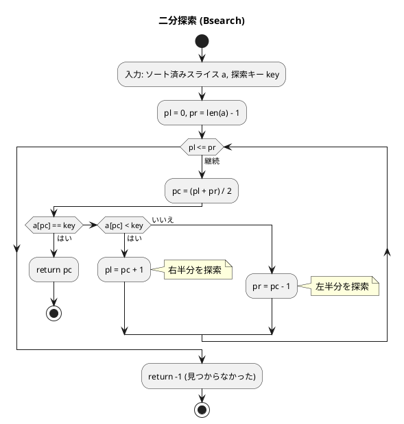
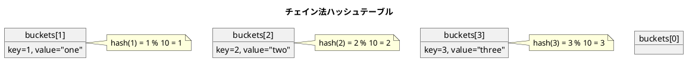

# 第 3 章 探索アルゴリズム

## はじめに

前章では配列（スライス）を学びました。この章では、データの集合から目的の要素を見つける「**探索アルゴリズム**」を TDD で実装します。

探索アルゴリズムは、データベース、ファイルシステム、ネットワーク検索など、あらゆる場面で使われる基本的なアルゴリズムです。

この章では以下の探索手法を学びます：

1. **線形探索**（3 種類）: 順番に調べる最もシンプルな方法
2. **二分探索**: ソート済み配列で対数時間での検索
3. **ハッシュ法**: キーから位置を計算する高速検索

### 目次

1. [線形探索](#1-線形探索)
2. [二分探索](#2-二分探索)
3. [ハッシュ法（チェイン法）](#3-ハッシュ法チェイン法)
4. [オープンアドレス法](#4-オープンアドレス法)

---

## 1. 線形探索

線形探索（Sequential Search）は、配列の先頭から末尾へと順に調べる最も単純な探索方法です。データがソートされていなくても使えます。

### 1-1. while 版（SsearchWhile）

#### Red — 失敗するテストを書く

```go
// apps/go/chapter03/search_test.go
package chapter03_test

import (
    "testing"
    "github.com/k2works/getting-started-algorithm/go/chapter03"
)

func TestSsearchWhile(t *testing.T) {
    a := []int{6, 4, 3, 2, 1, 2, 8}
    got := chapter03.SsearchWhile(a, 2)
    if got != 3 {
        t.Errorf("SsearchWhile(..., 2) = %d; want 3", got)
    }
    got = chapter03.SsearchWhile(a, 99)
    if got != -1 {
        t.Errorf("SsearchWhile(..., 99) = %d; want -1", got)
    }
}
```

#### Green — テストを通す実装

```go
// apps/go/chapter03/search.go
package chapter03

// SsearchWhile シーケンスaからkeyと等価な要素を線形探索（while相当）
func SsearchWhile(a []int, key int) int {
    i := 0
    for {
        if i == len(a) {
            return -1
        }
        if a[i] == key {
            return i
        }
        i++
    }
}
```

Go には `while` がないため、`for {}` の無限ループと内部での `return` で代替します。

### 1-2. for 版（SsearchFor）

#### Red — 失敗するテストを書く

```go
func TestSsearchFor(t *testing.T) {
    a := []int{6, 4, 3, 2, 1, 2, 8}
    got := chapter03.SsearchFor(a, 2)
    if got != 3 {
        t.Errorf("SsearchFor(..., 2) = %d; want 3", got)
    }
}
```

#### Green — テストを通す実装

```go
// SsearchFor シーケンスaからkeyと等価な要素を線形探索（for文）
func SsearchFor(a []int, key int) int {
    for i := 0; i < len(a); i++ {
        if a[i] == key {
            return i
        }
    }
    return -1
}
```

### 1-3. 番兵法（SsearchSentinel）

番兵法（sentinel）は、探索の終了条件チェックを省略するための手法です。探索対象の末尾にキー値を追加（番兵）することで、「末尾チェック」と「値一致チェック」を一本化します。

#### Red — 失敗するテストを書く

```go
func TestSsearchSentinel(t *testing.T) {
    a := []int{6, 4, 3, 2, 1, 2, 8}
    got := chapter03.SsearchSentinel(a, 2)
    if got != 3 {
        t.Errorf("SsearchSentinel(..., 2) = %d; want 3", got)
    }
    got = chapter03.SsearchSentinel(a, 99)
    if got != -1 {
        t.Errorf("SsearchSentinel(..., 99) = %d; want -1", got)
    }
}
```

#### Green — テストを通す実装

```go
// SsearchSentinel シーケンスaからkeyと等価な要素を線形探索（番兵法）
func SsearchSentinel(a []int, key int) int {
    n := len(a)
    tmp := make([]int, n+1)
    copy(tmp, a)
    tmp[n] = key // 末尾に番兵を追加
    i := 0
    for tmp[i] != key {
        i++
    }
    if i == n {
        return -1 // 番兵の位置 → 見つからなかった
    }
    return i
}
```

#### フローチャート（番兵法）



### 3 種類の線形探索の比較

| 実装 | ループ内の判定 | 特徴 |
|------|--------------|------|
| while 版 | 終端チェック + 値比較（2 回） | 最も明快 |
| for 版 | 終端チェック + 値比較（2 回） | Go の慣用スタイル |
| 番兵法 | 値比較（1 回） | 判定回数を半減 |

**計算量**: O(n)（平均 n/2 回の比較）

---

## 2. 二分探索

二分探索（Binary Search）は、**ソート済み**配列に対して使える探索法です。中央要素と比較し、探索範囲を半分に絞り込むことを繰り返します。

### Red — 失敗するテストを書く

```go
func TestBsearch(t *testing.T) {
    a := []int{1, 2, 3, 5, 7, 8, 9}
    got := chapter03.Bsearch(a, 5)
    if got != 3 {
        t.Errorf("Bsearch(..., 5) = %d; want 3", got)
    }
    got = chapter03.Bsearch(a, 99)
    if got != -1 {
        t.Errorf("Bsearch(..., 99) = %d; want -1", got)
    }
}
```

### Green — テストを通す実装

```go
// Bsearch シーケンスaからkeyと一致する要素を二分探索
func Bsearch(a []int, key int) int {
    pl := 0
    pr := len(a) - 1
    for pl <= pr {
        pc := (pl + pr) / 2
        if a[pc] == key {
            return pc
        } else if a[pc] < key {
            pl = pc + 1
        } else {
            pr = pc - 1
        }
    }
    return -1
}
```

### アルゴリズムの考え方

#### フローチャート



#### 線形探索 vs 二分探索の比較

n 要素の配列から最悪ケースで何回の比較が必要か：

| 要素数 n | 線形探索（最悪） | 二分探索（最悪） |
|---------|---------------|---------------|
| 100 | 100 回 | 7 回 |
| 1,000 | 1,000 回 | 10 回 |
| 1,000,000 | 1,000,000 回 | 20 回 |
| 1,000,000,000 | 1,000,000,000 回 | 30 回 |

二分探索は「毎回範囲を半分にする」ため、最悪でも ⌈log₂n⌉ 回の比較で済みます。

**計算量**: O(log n)（ただしソート済みであること前提）

---

## 3. ハッシュ法（チェイン法）

ハッシュ法は、キーを**ハッシュ関数**で変換してインデックスを求め、O(1) に近い速度で検索する手法です。

**チェイン法（Chaining）** は、衝突が発生した場合に同じバケツのスライスに追加していく方法です。

### Red — 失敗するテストを書く

```go
func TestHashTable(t *testing.T) {
    ht := chapter03.NewHashTable(10)
    ht.Add(1, "one")
    ht.Add(2, "two")
    ht.Add(3, "three")

    val, ok := ht.Search(2)
    if !ok || val != "two" {
        t.Errorf("HashTable.Search(2) = %v, %v; want two, true", val, ok)
    }

    _, ok = ht.Search(99)
    if ok {
        t.Error("HashTable.Search(99) should not be found")
    }

    ht.Remove(2)
    _, ok = ht.Search(2)
    if ok {
        t.Error("HashTable.Search(2) should not be found after Remove")
    }
}
```

### Green — テストを通す実装

```go
// HashTable チェイン法によるハッシュテーブル
type HashTable struct {
    buckets [][]entry
    size    int
}

type entry struct {
    key   int
    value string
}

// NewHashTable ハッシュテーブルを生成する
func NewHashTable(size int) *HashTable {
    return &HashTable{
        buckets: make([][]entry, size),
        size:    size,
    }
}

func (ht *HashTable) hash(key int) int {
    if key < 0 {
        return (-key) % ht.size
    }
    return key % ht.size
}

// Add キーと値をハッシュテーブルに追加する
func (ht *HashTable) Add(key int, value string) {
    h := ht.hash(key)
    ht.buckets[h] = append(ht.buckets[h], entry{key, value})
}

// Search キーに対応する値を検索する
func (ht *HashTable) Search(key int) (string, bool) {
    h := ht.hash(key)
    for _, e := range ht.buckets[h] {
        if e.key == key {
            return e.value, true
        }
    }
    return "", false
}

// Remove キーに対応するエントリを削除する
func (ht *HashTable) Remove(key int) bool {
    h := ht.hash(key)
    for i, e := range ht.buckets[h] {
        if e.key == key {
            ht.buckets[h] = append(ht.buckets[h][:i], ht.buckets[h][i+1:]...)
            return true
        }
    }
    return false
}
```

### アルゴリズムの考え方

#### チェイン法のデータ構造



**計算量**:
- 平均: O(1)（衝突が少ない場合）
- 最悪: O(n)（全要素が同一バケツに集中）

---

## 4. オープンアドレス法

オープンアドレス法（Open Addressing）は、衝突が発生した場合に次のバケツを探して格納する方法です。削除後も探索チェーンを維持するため、削除済みフラグ（Deleted）が必要です。

### Red — 失敗するテストを書く

```go
func TestOpenHash(t *testing.T) {
    oh := chapter03.NewOpenHash(10)
    oh.Add(1, "one")
    oh.Add(2, "two")
    oh.Add(3, "three")

    val, ok := oh.Search(2)
    if !ok || val != "two" {
        t.Errorf("OpenHash.Search(2) = %v, %v; want two, true", val, ok)
    }

    _, ok = oh.Search(99)
    if ok {
        t.Error("OpenHash.Search(99) should not be found")
    }

    oh.Remove(2)
    _, ok = oh.Search(2)
    if ok {
        t.Error("OpenHash.Search(2) should not be found after Remove")
    }

    added := oh.Add(1, "one_dup")
    if added {
        t.Error("OpenHash.Add with duplicate key should return false")
    }
}
```

### Green — テストを通す実装

```go
type bucketStatus int

const (
    bucketEmpty    bucketStatus = iota // 空
    bucketOccupied                     // 占有
    bucketDeleted                      // 削除済み
)

type openBucket struct {
    key   int
    value string
    stat  bucketStatus
}

// OpenHash オープンアドレス法（線形探索法）によるハッシュテーブル
type OpenHash struct {
    table []openBucket
    size  int
}

// NewOpenHash オープンアドレス法ハッシュテーブルを生成する
func NewOpenHash(size int) *OpenHash {
    return &OpenHash{
        table: make([]openBucket, size),
        size:  size,
    }
}

// Search キーに対応する値を検索する
func (oh *OpenHash) Search(key int) (string, bool) {
    h := oh.hashVal(key)
    for range oh.size {
        b := oh.table[h]
        if b.stat == bucketEmpty {
            break
        }
        if b.stat == bucketOccupied && b.key == key {
            return b.value, true
        }
        h = (h + 1) % oh.size  // 線形探索（次のバケツへ）
    }
    return "", false
}

// Add キーと値をハッシュテーブルに追加する
func (oh *OpenHash) Add(key int, value string) bool {
    if _, ok := oh.Search(key); ok {
        return false // 重複キーは追加しない
    }
    h := oh.hashVal(key)
    for range oh.size {
        b := oh.table[h]
        if b.stat == bucketEmpty || b.stat == bucketDeleted {
            oh.table[h] = openBucket{key, value, bucketOccupied}
            return true
        }
        h = (h + 1) % oh.size
    }
    return false
}

// Remove キーに対応するエントリを削除する
func (oh *OpenHash) Remove(key int) bool {
    h := oh.hashVal(key)
    for range oh.size {
        b := oh.table[h]
        if b.stat == bucketEmpty {
            return false
        }
        if b.stat == bucketOccupied && b.key == key {
            oh.table[h].stat = bucketDeleted  // フラグのみ更新
            return true
        }
        h = (h + 1) % oh.size
    }
    return false
}
```

### アルゴリズムの考え方

オープンアドレス法では、バケツの状態が 3 種類あります：

| 状態 | 意味 | 探索時の動作 |
|------|------|------------|
| `Empty` | 一度も使われていない | 探索終了（存在しない） |
| `Occupied` | 使用中 | キー比較する |
| `Deleted` | 削除済み | スキップして次のバケツへ |

削除時に `Empty` にしてしまうと、その後に追加されたエントリの探索チェーンが切断されてしまいます。`Deleted` フラグを使うことでこれを防ぎます。

---

## テスト実行結果

```bash
$ go test ./chapter03/ -v -cover
=== RUN   TestSsearchWhile
--- PASS: TestSsearchWhile (0.00s)
=== RUN   TestSsearchFor
--- PASS: TestSsearchFor (0.00s)
=== RUN   TestBsearch
--- PASS: TestBsearch (0.00s)
=== RUN   TestSsearchSentinel
--- PASS: TestSsearchSentinel (0.00s)
=== RUN   TestHashTable
--- PASS: TestHashTable (0.00s)
=== RUN   TestOpenHash
--- PASS: TestOpenHash (0.00s)
PASS
coverage: 100.0% of statements in ./chapter03/
ok      github.com/k2works/getting-started-algorithm/go/chapter03
```

全テストが通過し、カバレッジ 100% を達成しました。

---

## まとめ

| アルゴリズム | 計算量（平均） | 計算量（最悪） | 条件 |
|------------|-------------|-------------|------|
| 線形探索 | O(n) | O(n) | なし |
| 番兵法 | O(n) | O(n) | なし（判定を半減） |
| 二分探索 | O(log n) | O(log n) | ソート済み配列 |
| ハッシュ（チェイン） | O(1) | O(n) | ハッシュ衝突次第 |
| ハッシュ（オープン） | O(1) | O(n) | 負荷率 < 1 |

### Python との主な違い

| 機能 | Python | Go |
|------|--------|-----|
| 複数戻り値 | `return None` / raise | `return "", false` |
| 辞書 | `dict` | `struct` + スライス（手動実装） |
| インターフェース | duck typing | 明示的 interface |
| `iota` 定数 | `Enum` | `const ( ... iota )` |

## 参考文献

- 『新・明解 アルゴリズムとデータ構造』 — 柴田望洋
- 『テスト駆動開発』 — Kent Beck
- [The Go Programming Language](https://go.dev/doc/)
