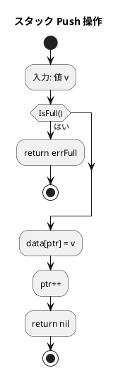
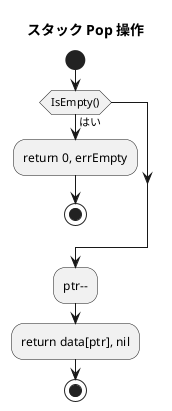
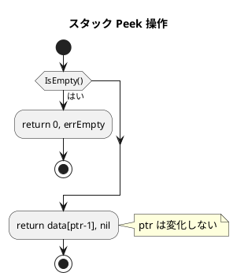
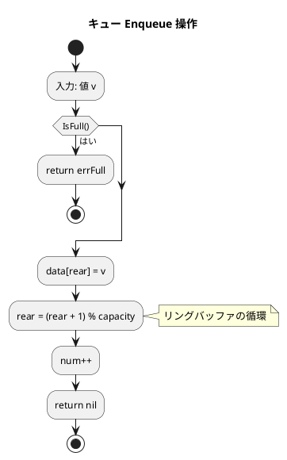
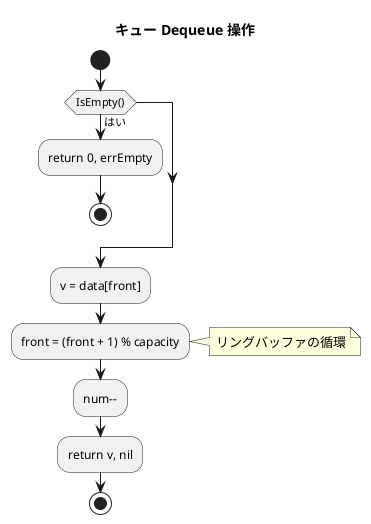

# 第 4 章 スタックとキュー

## はじめに

前章では探索アルゴリズムを学びました。この章では、データの追加・取り出し順序が異なる基本的なデータ構造「**スタック**」と「**キュー**」を TDD で実装します。

- **スタック（Stack）**: **LIFO**（Last In First Out — 後入れ先出し）。最後に追加したものを最初に取り出す
- **キュー（Queue）**: **FIFO**（First In First Out — 先入れ先出し）。最初に追加したものを最初に取り出す

スタックは関数の呼び出し管理や式の評価に、キューはジョブスケジューリングやBFS（幅優先探索）に使われます。

Go での実装では、**エラー処理** を `error` 型で行います。Python の例外に相当しますが、戻り値で明示的に伝えます。

### 目次

1. [スタック（Stack）](#1-スタックstack)
2. [キュー（Queue）— リングバッファ](#2-キューqueue--リングバッファ)

---

## 1. スタック（Stack）

スタックは LIFO 構造のデータ構造です。本の山を想像してください。積んだ本は上から順に取り出します。

主な操作：

- **Push**: 要素をスタックに積む（上に載せる）
- **Pop**: 最上部の要素を取り出す（取り除く）
- **Peek**: 最上部の要素を確認する（取り除かない）

### Red — 失敗するテストを書く

```go
// apps/go/chapter04/stack_queue_test.go
package chapter04_test

import (
    "testing"
    "github.com/k2works/getting-started-algorithm/go/chapter04"
)

func TestStack(t *testing.T) {
    s := chapter04.NewStack(5)

    if !s.IsEmpty() {
        t.Error("new stack should be empty")
    }

    s.Push(1)
    s.Push(2)
    s.Push(3)

    val, err := s.Peek()
    if err != nil || val != 3 {
        t.Errorf("Peek() = %v, %v; want 3, nil", val, err)
    }

    val, err = s.Pop()
    if err != nil || val != 3 {
        t.Errorf("Pop() = %v, %v; want 3, nil", val, err)
    }

    if s.Len() != 2 {
        t.Errorf("Len() = %d; want 2", s.Len())
    }

    if !s.Contains(2) {
        t.Error("Contains(2) should be true")
    }
}

func TestStackEmpty(t *testing.T) {
    s := chapter04.NewStack(3)
    _, err := s.Pop()
    if err == nil {
        t.Error("Pop on empty stack should return error")
    }
}

func TestStackFull(t *testing.T) {
    s := chapter04.NewStack(2)
    s.Push(1)
    s.Push(2)
    err := s.Push(3)
    if err == nil {
        t.Error("Push on full stack should return error")
    }
}
```

### Green — テストを通す実装

```go
// apps/go/chapter04/stack_queue.go
package chapter04

import "errors"

var (
    errEmpty = errors.New("stack/queue is empty")
    errFull  = errors.New("stack is full")
)

// Stack 固定長スタック
type Stack struct {
    data     []int
    capacity int
    ptr      int
}

// NewStack 指定した容量のスタックを生成する
func NewStack(capacity int) *Stack {
    return &Stack{data: make([]int, capacity), capacity: capacity}
}

// Len スタックに積まれた要素数を返す
func (s *Stack) Len() int { return s.ptr }

// IsEmpty スタックが空かどうかを判定する
func (s *Stack) IsEmpty() bool { return s.ptr == 0 }

// IsFull スタックが満杯かどうかを判定する
func (s *Stack) IsFull() bool { return s.ptr == s.capacity }

// Push スタックに値をプッシュする
func (s *Stack) Push(v int) error {
    if s.IsFull() {
        return errFull
    }
    s.data[s.ptr] = v
    s.ptr++
    return nil
}

// Pop スタックからポップする
func (s *Stack) Pop() (int, error) {
    if s.IsEmpty() {
        return 0, errEmpty
    }
    s.ptr--
    return s.data[s.ptr], nil
}

// Peek スタックの先頭要素を参照する（取り出さない）
func (s *Stack) Peek() (int, error) {
    if s.IsEmpty() {
        return 0, errEmpty
    }
    return s.data[s.ptr-1], nil
}
```

### アルゴリズムの考え方

#### Push のフローチャート



#### Pop のフローチャート



#### Peek のフローチャート



#### スタックの状態遷移

```
初期状態:  [ _ | _ | _ | _ | _ ]  ptr=0
Push(1):   [ 1 | _ | _ | _ | _ ]  ptr=1
Push(2):   [ 1 | 2 | _ | _ | _ ]  ptr=2
Push(3):   [ 1 | 2 | 3 | _ | _ ]  ptr=3
Peek():    [ 1 | 2 | 3 | _ | _ ]  ptr=3  → 3
Pop():     [ 1 | 2 | _ | _ | _ ]  ptr=2  → 3
```

### 追加操作（Find / Count / Clear）

```go
// Contains スタック内に値が含まれるかを確認する
func (s *Stack) Contains(v int) bool {
    for i := 0; i < s.ptr; i++ {
        if s.data[i] == v {
            return true
        }
    }
    return false
}

// Find スタック内のvを探索してインデックスを返す（底からのインデックス、見つからなければ-1）
func (s *Stack) Find(v int) int {
    for i := s.ptr - 1; i >= 0; i-- {
        if s.data[i] == v {
            return i
        }
    }
    return -1
}

// Count スタック内のvの個数を返す
func (s *Stack) Count(v int) int {
    c := 0
    for i := 0; i < s.ptr; i++ {
        if s.data[i] == v {
            c++
        }
    }
    return c
}

// Clear スタックを空にする
func (s *Stack) Clear() { s.ptr = 0 }
```

### Python との比較

| Python | Go |
|--------|-----|
| `raise StackEmptyError` | `return 0, errEmpty` |
| `raise StackFullError` | `return errFull` |
| `try: ... except: ...` | `val, err := s.Pop(); if err != nil { ... }` |

---

## 2. キュー（Queue）— リングバッファ

キューは FIFO 構造のデータ構造です。スーパーのレジ列を想像してください。最初に並んだ人が最初に処理されます。

### リングバッファとは

配列でキューを実装する際、単純にポインタを前に進めると空き領域が無駄になります。**リングバッファ（Ring Buffer）** は配列を循環させることでこの問題を解決します。

```
capacity = 5 のリングバッファ

        front         rear
          ↓             ↓
[ _ | 2 | 3 | 4 | _ ]
  0   1   2   3   4

rear が末尾に達したら先頭に戻る:
rear = (rear + 1) % capacity
```

### Red — 失敗するテストを書く

```go
func TestQueue(t *testing.T) {
    q := chapter04.NewQueue(5)

    if !q.IsEmpty() {
        t.Error("new queue should be empty")
    }

    q.Enqueue(1)
    q.Enqueue(2)
    q.Enqueue(3)

    val, err := q.Dequeue()
    if err != nil || val != 1 {
        t.Errorf("Dequeue() = %v, %v; want 1, nil", val, err)
    }

    if q.Len() != 2 {
        t.Errorf("Len() = %d; want 2", q.Len())
    }
}

func TestQueueEmpty(t *testing.T) {
    q := chapter04.NewQueue(3)
    _, err := q.Dequeue()
    if err == nil {
        t.Error("Dequeue on empty queue should return error")
    }
}
```

### Green — テストを通す実装

```go
// Queue 固定長キュー（リングバッファ）
type Queue struct {
    data     []int
    capacity int
    front    int  // 取り出し位置
    rear     int  // 追加位置
    num      int  // 要素数
}

// NewQueue 指定した容量のキューを生成する
func NewQueue(capacity int) *Queue {
    return &Queue{data: make([]int, capacity), capacity: capacity}
}

// Len キュー内の要素数を返す
func (q *Queue) Len() int { return q.num }

// IsEmpty キューが空かどうかを判定する
func (q *Queue) IsEmpty() bool { return q.num == 0 }

// Enqueue キューに値を追加する
func (q *Queue) Enqueue(v int) error {
    if q.IsFull() {
        return errFull
    }
    q.data[q.rear] = v
    q.rear = (q.rear + 1) % q.capacity  // リングバッファの循環
    q.num++
    return nil
}

// Dequeue キューから値を取り出す
func (q *Queue) Dequeue() (int, error) {
    if q.IsEmpty() {
        return 0, errEmpty
    }
    v := q.data[q.front]
    q.front = (q.front + 1) % q.capacity  // リングバッファの循環
    q.num--
    return v, nil
}

// Peek キューの先頭要素を参照する（取り出さない）
func (q *Queue) Peek() (int, error) {
    if q.IsEmpty() {
        return 0, errEmpty
    }
    return q.data[q.front], nil
}
```

### アルゴリズムの考え方

#### Enqueue のフローチャート



#### Dequeue のフローチャート



#### リングバッファの状態遷移

```
capacity = 5
初期:     front=0, rear=0, num=0
Enqueue(1): data=[1,_,_,_,_], front=0, rear=1, num=1
Enqueue(2): data=[1,2,_,_,_], front=0, rear=2, num=2
Enqueue(3): data=[1,2,3,_,_], front=0, rear=3, num=3
Dequeue():  data=[_,2,3,_,_], front=1, rear=3, num=2  → 1
Dequeue():  data=[_,_,3,_,_], front=2, rear=3, num=1  → 2
Enqueue(4): data=[_,_,3,4,_], front=2, rear=4, num=2
Enqueue(5): data=[_,_,3,4,5], front=2, rear=0, num=3  ← rear が先頭に戻る
```

`rear = (rear + 1) % capacity` により、末尾に達した後は先頭インデックス 0 に戻ります。

### 追加操作（Find / Count / Clear）

```go
// Find キュー内のvを探索して先頭からのインデックスを返す（見つからなければ-1）
func (q *Queue) Find(v int) int {
    for i := 0; i < q.num; i++ {
        idx := (i + q.front) % q.capacity  // リングバッファを考慮したインデックス変換
        if q.data[idx] == v {
            return i
        }
    }
    return -1
}

// Count キュー内のvの個数を返す
func (q *Queue) Count(v int) int {
    c := 0
    for i := 0; i < q.num; i++ {
        idx := (i + q.front) % q.capacity
        if q.data[idx] == v {
            c++
        }
    }
    return c
}

// Clear キューを空にする
func (q *Queue) Clear() { q.front, q.rear, q.num = 0, 0, 0 }
```

---

## テスト実行結果

```bash
$ go test ./chapter04/ -v -cover
=== RUN   TestStack
--- PASS: TestStack (0.00s)
=== RUN   TestStackEmpty
--- PASS: TestStackEmpty (0.00s)
=== RUN   TestStackFull
--- PASS: TestStackFull (0.00s)
=== RUN   TestQueue
--- PASS: TestQueue (0.00s)
=== RUN   TestQueueEmpty
--- PASS: TestQueueEmpty (0.00s)
=== RUN   TestStackFindCountClear
--- PASS: TestStackFindCountClear (0.00s)
=== RUN   TestQueuePeekFindCountClear
--- PASS: TestQueuePeekFindCountClear (0.00s)
PASS
coverage: 100.0% of statements in ./chapter04/
ok      github.com/k2works/getting-started-algorithm/go/chapter04
```

空スタックへの Pop、満杯スタックへの Push のエラー処理を含む全テストが通過しました。

---

## まとめ

| データ構造 | 操作 | 計算量 | Go の特徴 |
|-----------|------|--------|-----------|
| スタック | Push | O(1) | `s.ptr++` でポインタ管理 |
| スタック | Pop | O(1) | `(int, error)` 複数戻り値 |
| スタック | Peek | O(1) | `s.data[s.ptr-1]` |
| キュー | Enqueue | O(1) | `rear = (rear+1) % cap` |
| キュー | Dequeue | O(1) | `front = (front+1) % cap` |
| キュー | Peek | O(1) | `data[front]` |

### Python との主な違い

| 機能 | Python | Go |
|------|--------|-----|
| 例外 | `raise StackEmptyError` | `return 0, errEmpty` |
| エラーハンドリング | `try/except` | `if err != nil` |
| スタック実装 | `list` をラップ | `struct` + スライス |
| キュー実装 | `collections.deque` | リングバッファ（配列） |

Go ではエラーを戻り値として返すのが慣用的です。これにより呼び出し元でエラーを明示的に処理する必要があります。

## 参考文献

- 『新・明解 アルゴリズムとデータ構造』 — 柴田望洋
- 『テスト駆動開発』 — Kent Beck
- [The Go Programming Language](https://go.dev/doc/)
