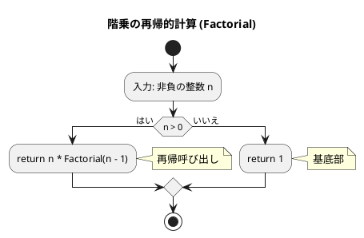
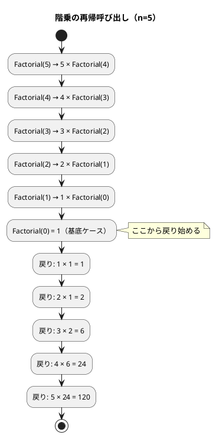
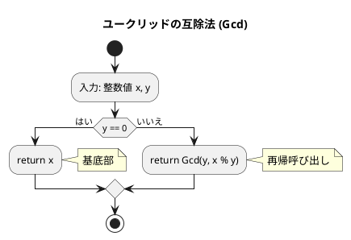
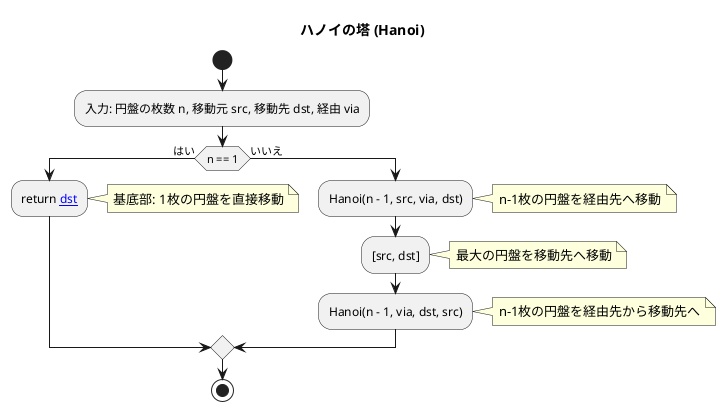
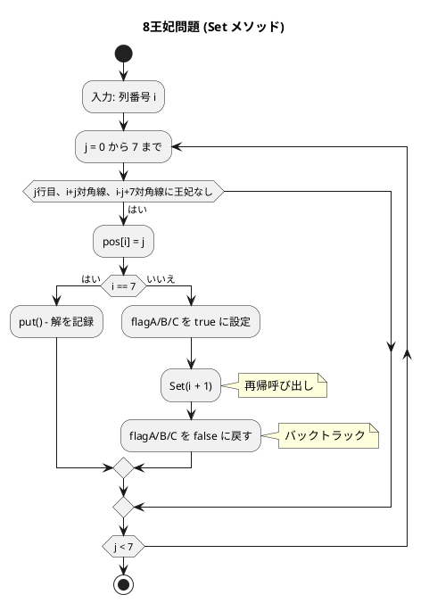

# 第 5 章 再帰アルゴリズム

## はじめに

前章ではスタックとキューというデータ構造を学びました。この章では「**再帰（Recursion）**」というアルゴリズム設計手法を TDD で実装します。

再帰とは、**ある関数が自分自身を呼び出す**ことで問題を解く手法です。大きな問題を同じ構造の小さな問題に分解し、最終的に自明な基底ケースに到達したら戻り始めます。

Go でも再帰は自然に表現できます。Python と異なり、再帰の深さに制限（スタックサイズ）がありますが、実用的な問題では問題ありません。

再帰アルゴリズムは、一般的に以下の 2 つの部分から構成されます：

1. **基底部（base case）**: 再帰呼び出しを終了する条件
2. **再帰部（recursive case）**: 問題を小さくして自分自身を呼び出す部分

### 目次

1. [階乗](#1-階乗)
2. [最大公約数（ユークリッドの互除法）](#2-最大公約数ユークリッドの互除法)
3. [1 から n までの和（再帰版）](#3-1-から-n-までの和再帰版)
4. [ハノイの塔](#4-ハノイの塔)
5. [8 王妃問題](#5-8-王妃問題)
6. [迷路探索（バックトラッキング）](#6-迷路探索バックトラッキング)

---

## 1. 階乗

`n! = n × (n-1) × ... × 1` を再帰で実装します。

### Red — 失敗するテストを書く

```go
// apps/go/chapter05/recursion_test.go
package chapter05_test

import (
    "testing"
    "github.com/k2works/getting-started-algorithm/go/chapter05"
)

func TestFactorial(t *testing.T) {
    got := chapter05.Factorial(5)
    if got != 120 {
        t.Errorf("Factorial(5) = %d; want 120", got)
    }
}
```

### Green — テストを通す実装

```go
// apps/go/chapter05/recursion.go
package chapter05

// Factorial n の階乗を再帰的に計算する
func Factorial(n int) int {
    if n <= 0 {
        return 1
    }
    return n * Factorial(n-1)
}
```

### アルゴリズムの考え方

#### フローチャート



#### 再帰呼び出しの展開



**計算量**: O(n)（n 回の再帰呼び出し）

---

## 2. 最大公約数（ユークリッドの互除法）

`gcd(a, b) = gcd(b, a % b)` という関係を再帰で実装します。

### Red — 失敗するテストを書く

```go
func TestGcd(t *testing.T) {
    got := chapter05.Gcd(22, 8)
    if got != 2 {
        t.Errorf("Gcd(22,8) = %d; want 2", got)
    }
}
```

### Green — テストを通す実装

```go
// Gcd ユークリッドの互除法で最大公約数を求める
func Gcd(x, y int) int {
    if y == 0 {
        return x
    }
    return Gcd(y, x%y)
}
```

### アルゴリズムの考え方

#### フローチャート



gcd(22, 8) の計算:

1. y=8 ≠ 0 → Gcd(8, 22%8) = Gcd(8, 6)
2. y=6 ≠ 0 → Gcd(6, 8%6) = Gcd(6, 2)
3. y=2 ≠ 0 → Gcd(2, 6%2) = Gcd(2, 0)
4. y=0 → return x = 2

よって gcd(22, 8) = 2 となります。

**計算量**: O(log min(x, y))

---

## 3. 1 から n までの和（再帰版）

繰り返し処理を再帰で表現します。

### Red — 失敗するテストを書く

```go
func TestRecursiveSum(t *testing.T) {
    got := chapter05.RecursiveSum(5)
    if got != 15 {
        t.Errorf("RecursiveSum(5) = %d; want 15", got)
    }
}
```

### Green — テストを通す実装

```go
// RecursiveSum 1 から n までの和を再帰的に計算する
func RecursiveSum(n int) int {
    if n <= 0 {
        return 0
    }
    return n + RecursiveSum(n-1)
}
```

`RecursiveSum(5) = 5 + RecursiveSum(4) = 5 + 4 + 3 + 2 + 1 + 0 = 15`

---

## 4. ハノイの塔

n 枚の円盤を A から C へ B を経由して移動する問題です。

```
ルール:
1. 一度に 1 枚しか移動できない
2. 大きい円盤を小さい円盤の上に置けない
```

### Red — 失敗するテストを書く

```go
func TestHanoi(t *testing.T) {
    moves := chapter05.Hanoi(1, "A", "C", "B")
    if len(moves) != 1 || moves[0][0] != "A" || moves[0][1] != "C" {
        t.Errorf("Hanoi(1,A,C,B) = %v; want [[A C]]", moves)
    }

    moves3 := chapter05.Hanoi(3, "A", "C", "B")
    if len(moves3) != 7 {
        t.Errorf("Hanoi(3,...) len = %d; want 7", len(moves3))
    }
}
```

### Green — テストを通す実装

```go
// Hanoi ハノイの塔: n 枚の円盤を src から dst へ via を経由して移動する手順を返す
func Hanoi(n int, src, dst, via string) [][2]string {
    if n == 1 {
        return [][2]string{{src, dst}}
    }
    moves := Hanoi(n-1, src, via, dst)    // n-1 枚を via へ
    moves = append(moves, [2]string{src, dst})  // 最大の円盤を dst へ
    moves = append(moves, Hanoi(n-1, via, dst, src)...)  // n-1 枚を dst へ
    return moves
}
```

Go では Python のタプル `(src, dst)` の代わりに `[2]string{src, dst}` を使います。

### アルゴリズムの考え方

#### フローチャート



n=3 の実行（7 手）:

| 手順 | 移動 |
|------|------|
| 1 | A → C |
| 2 | A → B |
| 3 | C → B |
| 4 | A → C |
| 5 | B → A |
| 6 | B → C |
| 7 | A → C |

n 枚のハノイの塔は 2^n - 1 回の移動が必要です。

**計算量**: O(2^n)

---

## 5. 8 王妃問題

8x8 のチェス盤上に 8 個の王妃を互いに攻撃できないように配置する問題です。王妃は同じ行・列・対角線上の相手を攻撃できます。

### 段階 1: 全組み合わせ（EightQueen）

各列に 1 個ずつ王妃を配置する 8^8 = 16,777,216 通りを列挙します。

```go
// EightQueen 8 王妃問題（全組み合わせ列挙）
type EightQueen struct {
    Result [][]int
    pos    [8]int
}

func (q *EightQueen) put() {
    tmp := make([]int, 8)
    copy(tmp, q.pos[:])
    q.Result = append(q.Result, tmp)
}

func (q *EightQueen) Set(i int) {
    for j := 0; j < 8; j++ {
        q.pos[i] = j
        if i == 7 {
            q.put()
        } else {
            q.Set(i + 1)
        }
    }
}
```

### 段階 2: 行制約あり（EightQueen2）

各行にも 1 個ずつ配置する制約を追加。8! = 40,320 通りに絞り込みます。

```go
// EightQueen2 8 王妃問題（行制約あり）
type EightQueen2 struct {
    Result [][]int
    pos    [8]int
    flag   [8]bool  // 各行に配置済みかのフラグ
}

func (q *EightQueen2) Set(i int) {
    for j := 0; j < 8; j++ {
        if !q.flag[j] {
            q.pos[i] = j
            if i == 7 {
                q.put()
            } else {
                q.flag[j] = true   // 行をロック
                q.Set(i + 1)
                q.flag[j] = false  // バックトラック
            }
        }
    }
}
```

### 段階 3: 対角線制約あり（EightQueen3）

行・列・対角線すべての制約を適用。92 通りの解が得られます。

```go
// EightQueen3 8 王妃問題（行・対角線制約あり）
type EightQueen3 struct {
    Result [][]int
    pos    [8]int
    flagA  [8]bool   // 各行
    flagB  [15]bool  // 右上がり対角線
    flagC  [15]bool  // 右下がり対角線
}

func (q *EightQueen3) Set(i int) {
    for j := 0; j < 8; j++ {
        if !q.flagA[j] && !q.flagB[i+j] && !q.flagC[i-j+7] {
            q.pos[i] = j
            if i == 7 {
                q.put()
            } else {
                q.flagA[j] = true
                q.flagB[i+j] = true
                q.flagC[i-j+7] = true
                q.Set(i + 1)
                q.flagA[j] = false    // バックトラック
                q.flagB[i+j] = false
                q.flagC[i-j+7] = false
            }
        }
    }
}
```

### アルゴリズムの考え方

#### フローチャート（EightQueen3）



#### 3 段階の比較

| バージョン | 制約 | 解の数 |
|-----------|------|--------|
| EightQueen | なし | 8^8 = 16,777,216 |
| EightQueen2 | 行制約 | 8! = 40,320 |
| EightQueen3 | 行・対角線制約 | 92（正解のみ） |

---

## 6. 迷路探索（バックトラッキング）

再帰的バックトラッキングで迷路を解きます。行き止まりに達したら戻り、別の経路を試みます。

### Red — 失敗するテストを書く

```go
func TestMazeSolve(t *testing.T) {
    maze := [][]int{
        {1, 1, 1},
        {1, 0, 1},
        {1, 1, 1},
    }
    got := chapter05.MazeSolve(maze, 1, 1, 1, 1, nil)
    if !got {
        t.Error("MazeSolve should return true for start==goal")
    }
}
```

### Green — テストを通す実装

```go
// MazeSolve 迷路をバックトラッキングで解く
func MazeSolve(maze [][]int, row, col, goalRow, goalCol int, visited map[[2]int]bool) bool {
    if visited == nil {
        visited = make(map[[2]int]bool)
    }
    if row == goalRow && col == goalCol {
        return true  // ゴール到達
    }
    rows := len(maze)
    cols := len(maze[0])
    visited[[2]int{row, col}] = true

    dirs := [4][2]int{{-1, 0}, {1, 0}, {0, -1}, {0, 1}}
    for _, d := range dirs {
        nr, nc := row+d[0], col+d[1]
        if nr >= 0 && nr < rows && nc >= 0 && nc < cols &&
            maze[nr][nc] == 0 && !visited[[2]int{nr, nc}] {
            if MazeSolve(maze, nr, nc, goalRow, goalCol, visited) {
                return true
            }
        }
    }
    return false  // すべての方向が行き止まり → バックトラック
}
```

Go では Python の `set` の代わりに `map[[2]int]bool` を使って訪問済みセルを管理します。

---

## テスト実行結果

```bash
$ go test ./chapter05/ -v -cover
=== RUN   TestFactorial
--- PASS: TestFactorial (0.00s)
=== RUN   TestGcd
--- PASS: TestGcd (0.00s)
=== RUN   TestRecursiveSum
--- PASS: TestRecursiveSum (0.00s)
=== RUN   TestHanoi
--- PASS: TestHanoi (0.00s)
=== RUN   TestMazeSolve
--- PASS: TestMazeSolve (0.00s)
=== RUN   TestEightQueen
--- PASS: TestEightQueen (0.00s)
=== RUN   TestEightQueen2
--- PASS: TestEightQueen2 (0.00s)
=== RUN   TestEightQueen3
--- PASS: TestEightQueen3 (0.00s)
PASS
coverage: 100.0% of statements in ./chapter05/
ok      github.com/k2works/getting-started-algorithm/go/chapter05
```

全テストが通過し、カバレッジ 100% を達成しました。

---

## 再帰アルゴリズムの比較

| アルゴリズム | 計算量 | 特徴 |
|------------|--------|------|
| 階乗 | O(n) | 単純な線形再帰 |
| GCD（ユークリッド） | O(log min(x,y)) | 対数的収束 |
| 1〜n の和 | O(n) | 繰り返しの再帰表現 |
| ハノイの塔 | O(2^n) | 指数的成長 |
| 8 王妃問題 | O(n!) | バックトラッキングによる枝刈り |
| 迷路探索 | O(行数 × 列数) | バックトラッキング |

### Python との主な違い

| 機能 | Python | Go |
|------|--------|-----|
| タプル配列 | `[(src, dst)]` | `[][2]string{{src, dst}}` |
| 集合 | `set()` | `map[[2]int]bool{}` |
| スプレッド | `list.extend(...)` | `append(slice, other...)` |
| 型 | 動的型付け | 静的型付け（`[2]string`） |

## 参考文献

- 『新・明解 アルゴリズムとデータ構造』 — 柴田望洋
- 『テスト駆動開発』 — Kent Beck
- [The Go Programming Language](https://go.dev/doc/)
