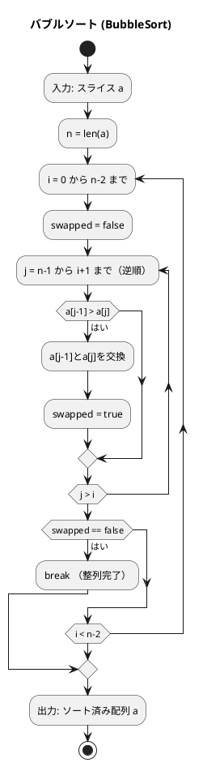
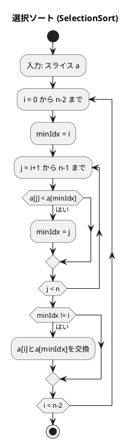
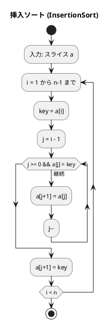
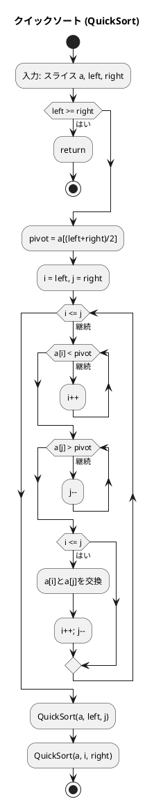

# 第 6 章 ソートアルゴリズム

## はじめに

前章では再帰アルゴリズムを学びました。この章では、データを特定の順序に並べ替える「**ソートアルゴリズム**」を TDD で実装します。

ソートは、コンピュータサイエンスにおける最も基本的かつ重要な操作の一つです。データが整列されていると、検索や他の操作が効率的に行えるようになります。

## ソートとは

ソートとは、データを特定の順序（通常は昇順または降順）に並べ替える操作です。ソートアルゴリズムは以下の特性で評価されます：

- **時間計算量**: アルゴリズムの実行に必要な時間
- **空間計算量**: アルゴリズムが使用するメモリ量
- **安定性**: 同じ値を持つ要素の相対的な順序が保存されるか
- **適応性**: 既にある程度ソートされているデータに対する効率性

### 目次

1. [バブルソート](#1-バブルソート)
2. [選択ソート](#2-選択ソート)
3. [挿入ソート](#3-挿入ソート)
4. [シェルソート](#4-シェルソート)
5. [クイックソート](#5-クイックソート)
6. [マージソート](#6-マージソート)
7. [ヒープソート](#7-ヒープソート)
8. [度数ソート（計数ソート）](#8-度数ソート計数ソート)

---

## テストの共通設定

```go
// apps/go/chapter06/sort_test.go
package chapter06_test

import (
    "reflect"
    "testing"
    "github.com/k2works/getting-started-algorithm/go/chapter06"
)

var sortInput = []int{6, 4, 3, 7, 1, 9, 8}
var sortExpected = []int{1, 3, 4, 6, 7, 8, 9}

func copySlice(a []int) []int {
    b := make([]int, len(a))
    copy(b, a)
    return b
}
```

in-place ソートはスライスを変更するため、テストごとにコピーを作成します。

---

## 1. バブルソート

隣接する要素を比較・交換し、最大値を末尾へ「浮き上がらせる」アルゴリズムです。

### Red — 失敗するテストを書く

```go
func TestBubbleSort(t *testing.T) {
    a := copySlice(sortInput)
    chapter06.BubbleSort(a)
    if !reflect.DeepEqual(a, sortExpected) {
        t.Errorf("BubbleSort = %v; want %v", a, sortExpected)
    }
}
```

### Green — テストを通す実装

```go
// BubbleSort バブルソート（in-place）
func BubbleSort(a []int) {
    n := len(a)
    for i := 0; i < n-1; i++ {
        swapped := false
        for j := n - 1; j > i; j-- {
            if a[j-1] > a[j] {
                a[j-1], a[j] = a[j], a[j-1]
                swapped = true
            }
        }
        if !swapped {
            break  // 交換なし → 整列完了
        }
    }
}
```

### アルゴリズムの考え方

#### フローチャート



交換が 1 回も発生しないパスで早期終了します（最良ケース O(n)）。

**計算量**: O(n²)（平均・最悪）、O(n)（最良 — 既ソート時）

---

## 2. 選択ソート

未整列部分から最小値を選択して先頭に移動するアルゴリズムです。

### Red — 失敗するテストを書く

```go
func TestSelectionSort(t *testing.T) {
    a := copySlice(sortInput)
    chapter06.SelectionSort(a)
    if !reflect.DeepEqual(a, sortExpected) {
        t.Errorf("SelectionSort = %v; want %v", a, sortExpected)
    }
}
```

### Green — テストを通す実装

```go
// SelectionSort 選択ソート（in-place）
func SelectionSort(a []int) {
    n := len(a)
    for i := 0; i < n-1; i++ {
        minIdx := i
        for j := i + 1; j < n; j++ {
            if a[j] < a[minIdx] {
                minIdx = j
            }
        }
        if minIdx != i {
            a[i], a[minIdx] = a[minIdx], a[i]
        }
    }
}
```

### アルゴリズムの考え方



**計算量**: O(n²)（常に）。交換回数は O(n) と少ない。

---

## 3. 挿入ソート

未整列部分から要素を取り出し、整列済み部分の適切な位置に挿入するアルゴリズムです。

### Red — 失敗するテストを書く

```go
func TestInsertionSort(t *testing.T) {
    a := copySlice(sortInput)
    chapter06.InsertionSort(a)
    if !reflect.DeepEqual(a, sortExpected) {
        t.Errorf("InsertionSort = %v; want %v", a, sortExpected)
    }
}
```

### Green — テストを通す実装

```go
// InsertionSort 挿入ソート（in-place）
func InsertionSort(a []int) {
    n := len(a)
    for i := 1; i < n; i++ {
        key := a[i]
        j := i - 1
        for j >= 0 && a[j] > key {
            a[j+1] = a[j]
            j--
        }
        a[j+1] = key
    }
}
```

### アルゴリズムの考え方



**計算量**: O(n²)（平均・最悪）、O(n)（最良 — 既ソート時）。少量データや部分ソート済みデータに有効。

---

## 4. シェルソート

挿入ソートを改良し、離れた要素間での比較・交換を行うアルゴリズムです。

### Red — 失敗するテストを書く

```go
func TestShellSort(t *testing.T) {
    a := copySlice(sortInput)
    chapter06.ShellSort(a)
    if !reflect.DeepEqual(a, sortExpected) {
        t.Errorf("ShellSort = %v; want %v", a, sortExpected)
    }
}
```

### Green — テストを通す実装

```go
// ShellSort シェルソート（in-place）— Knuth 数列（1, 4, 13, 40, ...）を使用
func ShellSort(a []int) {
    n := len(a)
    gap := 1
    for gap*3+1 < n {
        gap = gap*3 + 1
    }
    for gap > 0 {
        for i := gap; i < n; i++ {
            key := a[i]
            j := i - gap
            for j >= 0 && a[j] > key {
                a[j+gap] = a[j]
                j -= gap
            }
            a[j+gap] = key
        }
        gap /= 3
    }
}
```

Knuth 数列（1, 4, 13, 40, ...）を使うことで効率が向上します。

**計算量**: O(n log² n)（Knuth 数列使用時）

---

## 5. クイックソート

分割統治法を使い、ピボットを基準に配列を分割して再帰的にソートするアルゴリズムです。

### Red — 失敗するテストを書く

```go
func TestQuickSort(t *testing.T) {
    a := copySlice(sortInput)
    chapter06.QuickSort(a, 0, len(a)-1)
    if !reflect.DeepEqual(a, sortExpected) {
        t.Errorf("QuickSort = %v; want %v", a, sortExpected)
    }
}
```

### Green — テストを通す実装

```go
// QuickSort クイックソート（in-place）
func QuickSort(a []int, left, right int) {
    if left >= right {
        return
    }
    pivot := a[(left+right)/2]
    i, j := left, right
    for i <= j {
        for a[i] < pivot {
            i++
        }
        for a[j] > pivot {
            j--
        }
        if i <= j {
            a[i], a[j] = a[j], a[i]
            i++
            j--
        }
    }
    QuickSort(a, left, j)
    QuickSort(a, i, right)
}
```

### アルゴリズムの考え方



**計算量**: O(n log n)（平均）、O(n²)（最悪 — 既ソート時）

---

## 6. マージソート

分割統治法を使い、配列を分割して再帰的にソートし、整列済みの部分をマージするアルゴリズムです。

### Red — 失敗するテストを書く

```go
func TestMergeSort(t *testing.T) {
    a := copySlice(sortInput)
    chapter06.MergeSort(a, 0, len(a)-1)
    if !reflect.DeepEqual(a, sortExpected) {
        t.Errorf("MergeSort = %v; want %v", a, sortExpected)
    }
}
```

### Green — テストを通す実装

```go
// MergeSort マージソート
func MergeSort(a []int, left, right int) {
    if left >= right {
        return
    }
    mid := (left + right) / 2
    MergeSort(a, left, mid)
    MergeSort(a, mid+1, right)
    merge(a, left, mid, right)
}

func merge(a []int, left, mid, right int) {
    tmp := make([]int, right-left+1)
    i, j, k := left, mid+1, 0
    for i <= mid && j <= right {
        if a[i] <= a[j] {
            tmp[k] = a[i]
            i++
        } else {
            tmp[k] = a[j]
            j++
        }
        k++
    }
    for i <= mid {
        tmp[k] = a[i]
        i++
        k++
    }
    for j <= right {
        tmp[k] = a[j]
        j++
        k++
    }
    copy(a[left:], tmp)
}
```

**計算量**: O(n log n)（常に）、追加メモリ O(n)

---

## 7. ヒープソート

最大ヒープ（max-heap）を使ってソートするアルゴリズムです。

### Red — 失敗するテストを書く

```go
func TestHeapSort(t *testing.T) {
    a := copySlice(sortInput)
    chapter06.HeapSort(a)
    if !reflect.DeepEqual(a, sortExpected) {
        t.Errorf("HeapSort = %v; want %v", a, sortExpected)
    }
}
```

### Green — テストを通す実装

```go
// HeapSort ヒープソート（in-place）
func HeapSort(a []int) {
    n := len(a)
    // ヒープの構築（最大ヒープ化）
    for i := (n-1)/2 - 1 + 1; i >= 0; i-- {
        downHeap(a, i, n-1)
    }
    // 最大値を末尾に移動してヒープを再構築
    for i := n - 1; i > 0; i-- {
        a[0], a[i] = a[i], a[0]
        downHeap(a, 0, i-1)
    }
}

func downHeap(a []int, left, right int) {
    temp := a[left]
    parent := left
    for parent < (right+1)/2 {
        cl := parent*2 + 1
        cr := cl + 1
        child := cl
        if cr <= right && a[cr] > a[cl] {
            child = cr
        }
        if temp >= a[child] {
            break
        }
        a[parent] = a[child]
        parent = child
    }
    a[parent] = temp
}
```

**計算量**: O(n log n)（常に）、追加メモリ O(1)

---

## 8. 度数ソート（計数ソート）

値の出現回数を数えてソートするアルゴリズムです。比較を使わないため、特定の条件下で O(n) で動作します。

### Red — 失敗するテストを書く

```go
func TestCountingSort(t *testing.T) {
    got := chapter06.CountingSort(sortInput)
    if !reflect.DeepEqual(got, sortExpected) {
        t.Errorf("CountingSort = %v; want %v", got, sortExpected)
    }
}
```

### Green — テストを通す実装

```go
// CountingSort 度数ソート（計数ソート）— 新しいスライスを返す
func CountingSort(a []int) []int {
    if len(a) == 0 {
        return []int{}
    }
    maxVal := a[0]
    for _, v := range a {
        if v > maxVal {
            maxVal = v
        }
    }
    // 度数テーブル
    freq := make([]int, maxVal+1)
    for _, v := range a {
        freq[v]++
    }
    // 累積度数
    for i := 1; i < len(freq); i++ {
        freq[i] += freq[i-1]
    }
    // 結果を構築（安定ソートのため後ろから）
    result := make([]int, len(a))
    for i := len(a) - 1; i >= 0; i-- {
        freq[a[i]]--
        result[freq[a[i]]] = a[i]
    }
    return result
}
```

**計算量**: O(n + k)（k は値の最大値）。非負整数かつ値の範囲が狭い場合に有効。

---

## テスト実行結果

```bash
$ go test ./chapter06/ -v -cover
=== RUN   TestBubbleSort
--- PASS: TestBubbleSort (0.00s)
=== RUN   TestSelectionSort
--- PASS: TestSelectionSort (0.00s)
=== RUN   TestInsertionSort
--- PASS: TestInsertionSort (0.00s)
=== RUN   TestQuickSort
--- PASS: TestQuickSort (0.00s)
=== RUN   TestMergeSort
--- PASS: TestMergeSort (0.00s)
=== RUN   TestShellSort
--- PASS: TestShellSort (0.00s)
=== RUN   TestHeapSort
--- PASS: TestHeapSort (0.00s)
=== RUN   TestCountingSort
--- PASS: TestCountingSort (0.00s)
PASS
coverage: 100.0% of statements in ./chapter06/
ok      github.com/k2works/getting-started-algorithm/go/chapter06
```

全テストが通過し、カバレッジ 100% を達成しました。

---

## まとめ

| アルゴリズム | 平均 | 最悪 | 安定 | 追加メモリ | 特徴 |
|------------|------|------|------|-----------|------|
| バブルソート | O(n²) | O(n²) | ◯ | O(1) | 実装が最もシンプル |
| 選択ソート | O(n²) | O(n²) | ✗ | O(1) | 交換回数が少ない |
| 挿入ソート | O(n²) | O(n²) | ◯ | O(1) | 部分ソート済みに有効 |
| シェルソート | O(n log² n) | O(n²) | ✗ | O(1) | 挿入ソートの改良 |
| クイックソート | O(n log n) | O(n²) | ✗ | O(log n) | 実用最速 |
| マージソート | O(n log n) | O(n log n) | ◯ | O(n) | 安定・最悪も保証 |
| ヒープソート | O(n log n) | O(n log n) | ✗ | O(1) | 追加メモリなし |
| 度数ソート | O(n + k) | O(n + k) | ◯ | O(k) | 比較なし、整数限定 |

### Python との主な違い

| 機能 | Python | Go |
|------|--------|-----|
| in-place ソート | `a.sort()` | 自前実装（`a[i], a[j] = a[j], a[i]`） |
| 多値代入 | `a, b = b, a` | `a, b = b, a` |
| コピー | `a.copy()` | `copy(b, a)` |
| 比較 | `==` | `reflect.DeepEqual(a, b)` |

## 参考文献

- 『新・明解 アルゴリズムとデータ構造』 — 柴田望洋
- 『テスト駆動開発』 — Kent Beck
- [The Go Programming Language](https://go.dev/doc/)
