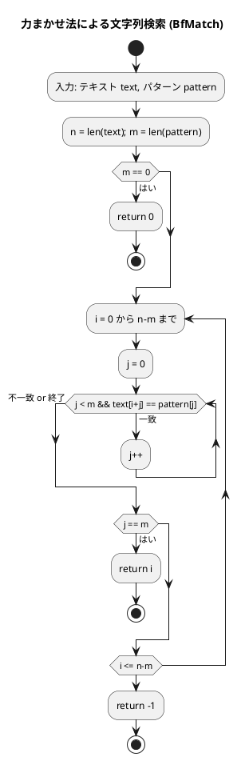
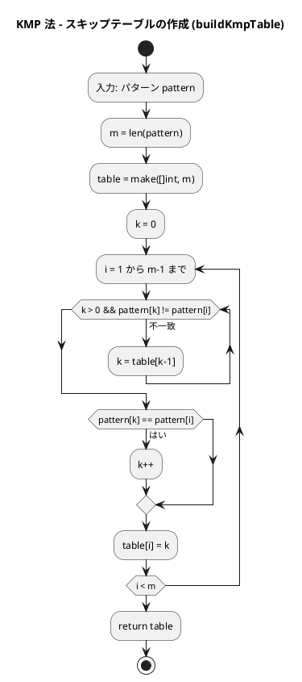
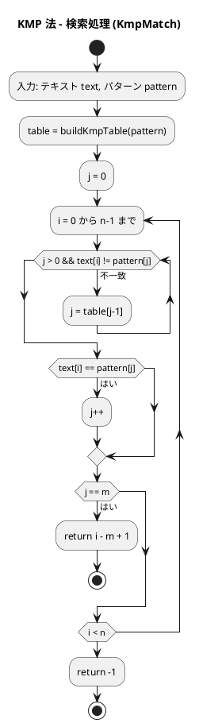
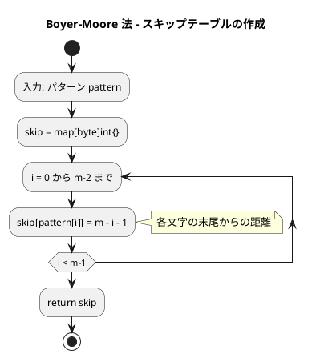
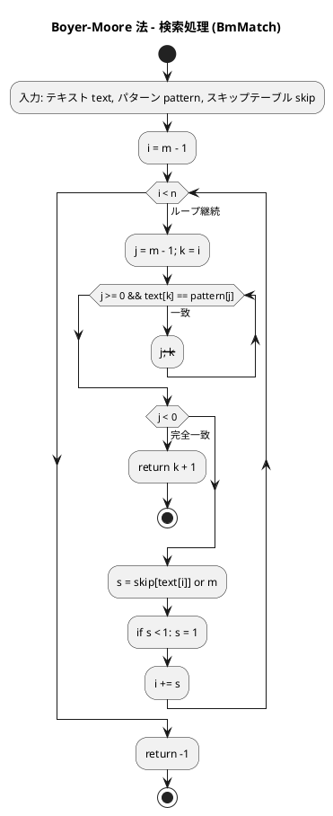
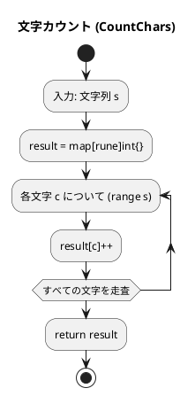
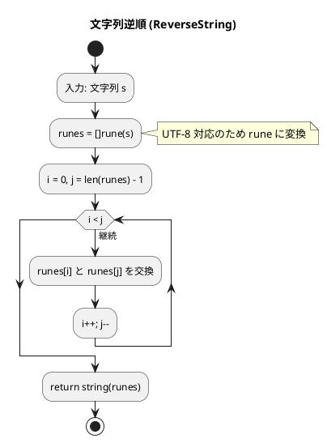

# 第 7 章 文字列処理

## はじめに

前章ではソートアルゴリズムを学びました。この章では、プログラミングにおいて非常に重要な「文字列処理」について TDD で実装します。

文字列処理は、テキストデータの操作や解析に欠かせない技術です。特に、テキスト検索、パターンマッチング、データ抽出などの処理は、多くのアプリケーションで必要とされます。

Go の文字列は **UTF-8 バイト列** として扱われます。`string` 型はイミュータブル（不変）であり、文字単位のアクセスには `[]rune` への変換が必要です。

### 目次

1. [Go の文字列基本操作](#go-の文字列基本操作)
2. [ブルートフォース文字列探索（力まかせ法）](#1-ブルートフォース文字列探索)
3. [KMP 法](#2-kmp-法)
4. [Boyer-Moore 法](#3-boyer-moore-法)
5. [文字カウント・逆順・回文判定](#4-文字カウント逆順回文判定)

---

## Go の文字列基本操作

Go の `string` 型は Python と似た操作が可能ですが、イミュータブルという点と、UTF-8 バイト列として扱われる点が重要です。

### 文字列の生成と基本操作

```go
// 文字列の生成
s1 := "Hello"
s2 := "World"

// 文字列の連結
s := s1 + " " + s2  // "Hello World"

// 文字列の長さ（バイト数）
length := len(s1)   // 5

// 文字列へのアクセス（バイト単位）
firstByte := s1[0]  // 72 ('H' の ASCII コード)

// rune（Unicode コードポイント）でのアクセス
runes := []rune(s1)
firstChar := runes[0]  // 'H'

// スライス（バイト単位）
sub := s1[1:4]  // "ell"

// 走査（rune 単位 — 日本語など多バイト文字に対応）
for i, c := range s1 {
    fmt.Printf("%d: %c\n", i, c)
}
```

### 文字列の操作（strings パッケージ）

```go
import "strings"

s := "Hello, World!"

// 検索
pos := strings.Index(s, "World")     // 7
pos = strings.Index(s, "Python")     // -1

// 置換
newS := strings.Replace(s, "World", "Go", 1)  // "Hello, Go!"

// 分割
parts := strings.Split(s, ", ")  // ["Hello", "World!"]

// 結合
joined := strings.Join([]string{"Hello", "World"}, ", ")  // "Hello, World"

// 大文字・小文字変換
upper := strings.ToUpper(s)  // "HELLO, WORLD!"
lower := strings.ToLower(s)  // "hello, world!"

// 先頭・末尾の処理
stripped := strings.TrimSpace("  Hello  ")  // "Hello"
starts := strings.HasPrefix(s, "Hello")     // true
ends := strings.HasSuffix(s, "World!")      // true
```

### 文字列フォーマット（fmt.Sprintf）

```go
import "fmt"

name := "Alice"
age := 30

// fmt.Sprintf（Python の % や format に相当）
s := fmt.Sprintf("Name: %s, Age: %d", name, age)  // "Name: Alice, Age: 30"
```

### Python との対応

| Python | Go |
|--------|-----|
| `str` | `string` |
| `"hello"` | `"hello"` |
| `len(s)` | `len(s)` |
| `s[1:4]` | `s[1:4]`（バイト単位） |
| `for c in s:` | `for _, c := range s {`（rune 単位） |
| `s.find("x")` | `strings.Index(s, "x")` |
| `s.replace("a","b")` | `strings.Replace(s, "a", "b", -1)` |
| `s.split(",")` | `strings.Split(s, ",")` |
| `s.upper()` | `strings.ToUpper(s)` |
| `f"Name: {name}"` | `fmt.Sprintf("Name: %s", name)` |

---

## 1. ブルートフォース文字列探索

テキストを左から順にパターンと比較する最もシンプルな方法です。

### Red — 失敗するテストを書く

```go
// apps/go/chapter07/strings_test.go
package chapter07_test

import (
    "testing"
    "github.com/k2works/getting-started-algorithm/go/chapter07"
)

func TestBfMatch(t *testing.T) {
    got := chapter07.BfMatch("ABCXDEZCABACABAB", "ABAB")
    if got != 12 {
        t.Errorf("BfMatch(...) = %d; want 12", got)
    }
    got = chapter07.BfMatch("ABCXDEZCABACABAB", "XYZ")
    if got != -1 {
        t.Errorf("BfMatch(no match) = %d; want -1", got)
    }
}
```

### Green — テストを通す実装

```go
// apps/go/chapter07/strings.go
package chapter07

// BfMatch ブルートフォース文字列探索
func BfMatch(text, pattern string) int {
    n, m := len(text), len(pattern)
    if m == 0 {
        return 0
    }
    for i := 0; i <= n-m; i++ {
        j := 0
        for j < m && text[i+j] == pattern[j] {
            j++
        }
        if j == m {
            return i
        }
    }
    return -1
}
```

### 解説

力まかせ法（ブルートフォース法）のアルゴリズムは以下の通りです：

1. テキスト内の各位置から順にパターンとの一致を調べる
2. 一致しない文字が見つかったら、テキストのカーソルを 1 つ進めて再度パターンの先頭から比較を始める
3. パターン全体が一致したら、その位置を返す

**計算量**:
- 最良の場合：O(m)（m はパターンの長さ）
- 最悪の場合：O(n × m)（n はテキストの長さ）

力まかせ法は単純で理解しやすいですが、テキストとパターンが長い場合には効率が悪くなります。そこで、より効率的なアルゴリズムが開発されました。

### フローチャート



アルゴリズムの流れ：
1. テキスト `text` とパターン `pattern` を入力として受け取ります
2. 外側のループで、テキストの各位置 `i` を先頭として比較を試みます
3. 内側のループで、パターンの各文字 `pattern[j]` と `text[i+j]` を比較します
4. パターン全体が一致したら（`j == m`）、その位置 `i` を返します
5. すべての位置で一致しなければ `-1` を返します

---

## 2. KMP 法

KMP 法（Knuth-Morris-Pratt 法）は、力まかせ法を改良した効率的な文字列検索アルゴリズムです。失敗関数テーブル（スキップテーブル）を使い、不一致が発生した際にスキップ量を最適化します。

### Red — 失敗するテストを書く

```go
func TestKmpMatch(t *testing.T) {
    got := chapter07.KmpMatch("ABCXDEZCABACABAB", "ABAB")
    if got != 12 {
        t.Errorf("KmpMatch(...) = %d; want 12", got)
    }
}
```

### Green — テストを通す実装

```go
// KmpMatch KMP 法による文字列探索
func KmpMatch(text, pattern string) int {
    n, m := len(text), len(pattern)
    if m == 0 {
        return 0
    }
    table := buildKmpTable(pattern)
    j := 0
    for i := 0; i < n; i++ {
        for j > 0 && text[i] != pattern[j] {
            j = table[j-1]
        }
        if text[i] == pattern[j] {
            j++
        }
        if j == m {
            return i - m + 1
        }
    }
    return -1
}

func buildKmpTable(pattern string) []int {
    m := len(pattern)
    table := make([]int, m)
    k := 0
    for i := 1; i < m; i++ {
        for k > 0 && pattern[k] != pattern[i] {
            k = table[k-1]
        }
        if pattern[k] == pattern[i] {
            k++
        }
        table[i] = k
    }
    return table
}
```

### 解説

KMP 法の核心は、パターン内の情報を利用して「スキップテーブル」を作成し、不一致が発生した場合に効率的にカーソルを移動させることです。

スキップテーブルは、パターン内の部分文字列が一致する場合に、どこまで戻ればよいかを示します。これにより、すでに比較した文字を再度比較する必要がなくなります。

**計算量**:
- 最悪の場合：O(n + m)（n はテキストの長さ、m はパターンの長さ）
- 力まかせ法の O(n × m) より格段に速い

### フローチャート

KMP 法は 2 つの主要なステップから成ります：スキップテーブルの作成と実際の検索です。

#### スキップテーブルの作成



#### 検索処理



アルゴリズムの流れ：

1. **スキップテーブルの作成**:
   - パターン内の接頭辞と接尾辞の一致を調べます
   - 一致する最長の接頭辞の長さをスキップテーブルに格納します
   - 不一致時にどこまで戻れば良いかを事前計算します

2. **検索処理**:
   - テキストとパターンを先頭から比較します
   - 不一致が発生した場合、スキップテーブルを使ってパターンのカーソルを移動させます
   - テキストのカーソルは後戻りしません（これが速さの秘密）

---

## 3. Boyer-Moore 法

Boyer-Moore 法は、さらに効率的な文字列検索アルゴリズムです。パターンを右から左へ比較し、不一致が発生した場合に大きくスキップすることで、多くの比較を省略します。

### Red — 失敗するテストを書く

```go
func TestBmMatch(t *testing.T) {
    got := chapter07.BmMatch("ABCXDEZCABACABAB", "ABAB")
    if got != 12 {
        t.Errorf("BmMatch(...) = %d; want 12", got)
    }
}
```

### Green — テストを通す実装

```go
// BmMatch Boyer-Moore 法による文字列探索
func BmMatch(text, pattern string) int {
    n, m := len(text), len(pattern)
    if m == 0 {
        return 0
    }
    // スキップテーブル（Bad Character ルール）
    skip := make(map[byte]int)
    for i := 0; i < m-1; i++ {
        skip[pattern[i]] = m - i - 1
    }
    i := m - 1
    for i < n {
        j := m - 1
        k := i
        for j >= 0 && text[k] == pattern[j] {
            j--
            k--
        }
        if j < 0 {
            return k + 1
        }
        s, ok := skip[text[i]]
        if !ok {
            s = m
        }
        if s < 1 {
            s = 1
        }
        i += s
    }
    return -1
}
```

### 解説

Boyer-Moore 法の特徴は以下の通りです：

1. パターンを右から左へ比較する
2. 不一致が発生した場合、Bad Character ルールに基づいて大きくスキップする
3. テキスト内の不一致文字がパターン内に存在しない場合、パターン全体をスキップできる

**計算量**:
- 最良の場合：O(n / m)（大きなスキップが頻発する場合）
- 最悪の場合：O(n × m)
- 実用的な文字列検索として広く使われている

### フローチャート

#### スキップテーブルの作成



#### 検索処理



アルゴリズムの流れ：

1. **スキップテーブルの作成**: パターン内の各文字について、末尾からの距離をスキップ量として記録します（パターン内にない文字はパターン全体の長さ分スキップ）

2. **検索処理**: パターンの右端をテキストの各位置に合わせ、右から左へ比較します。不一致時はスキップテーブルを使って大きくジャンプします

---

## 4. 文字カウント・逆順・回文判定

### Red — 失敗するテストを書く

```go
func TestCountChars(t *testing.T) {
    got := chapter07.CountChars("hello")
    expected := map[rune]int{'h': 1, 'e': 1, 'l': 2, 'o': 1}
    for k, v := range expected {
        if got[k] != v {
            t.Errorf("CountChars('hello')[%c] = %d; want %d", k, got[k], v)
        }
    }
}

func TestReverseString(t *testing.T) {
    got := chapter07.ReverseString("hello")
    if got != "olleh" {
        t.Errorf("ReverseString('hello') = %q; want 'olleh'", got)
    }
}

func TestIsPalindrome(t *testing.T) {
    if !chapter07.IsPalindrome("racecar") {
        t.Error("IsPalindrome('racecar') should be true")
    }
    if chapter07.IsPalindrome("hello") {
        t.Error("IsPalindrome('hello') should be false")
    }
}
```

### Green — テストを通す実装

```go
// CountChars 文字列中の各文字の出現回数を map で返す
func CountChars(s string) map[rune]int {
    result := make(map[rune]int)
    for _, c := range s {
        result[c]++
    }
    return result
}

// ReverseString 文字列を逆順にして返す
func ReverseString(s string) string {
    runes := []rune(s)
    for i, j := 0, len(runes)-1; i < j; i, j = i+1, j-1 {
        runes[i], runes[j] = runes[j], runes[i]
    }
    return string(runes)
}

// IsPalindrome 文字列が回文かどうかを判定する
func IsPalindrome(s string) bool {
    return s == ReverseString(s)
}
```

### アルゴリズムの考え方

#### CountChars のフローチャート



#### ReverseString のフローチャート



### Python との比較

| 機能 | Python | Go |
|------|--------|-----|
| 文字カウント | `dict` に `get(c, 0) + 1` | `map[rune]int` に `result[c]++` |
| 文字列逆順 | `s[::-1]` | `[]rune` 変換後に両端交換 |
| 回文判定 | `s == s[::-1]` | `s == ReverseString(s)` |
| 文字単位アクセス | `for c in s:` | `for _, c := range s {`（rune） |

Go では `string` がバイト列のため、日本語などのマルチバイト文字を扱う際は `[]rune` への変換が必要です。

---

## テスト実行結果

```bash
$ go test ./chapter07/ -v -cover
=== RUN   TestBfMatch
--- PASS: TestBfMatch (0.00s)
=== RUN   TestKmpMatch
--- PASS: TestKmpMatch (0.00s)
=== RUN   TestBmMatch
--- PASS: TestBmMatch (0.00s)
=== RUN   TestCountChars
--- PASS: TestCountChars (0.00s)
=== RUN   TestReverseString
--- PASS: TestReverseString (0.00s)
=== RUN   TestIsPalindrome
--- PASS: TestIsPalindrome (0.00s)
PASS
coverage: 100.0% of statements in ./chapter07/
ok      github.com/k2works/getting-started-algorithm/go/chapter07
```

全テストが通過し、カバレッジ 100% を達成しました。

---

## 文字列探索アルゴリズムの比較

| アルゴリズム | 計算量（最悪） | 計算量（最良） | 特徴 |
|-------------|--------------|--------------|------|
| ブルートフォース | O(n × m) | O(m) | シンプル、小規模テキストに有効 |
| KMP 法 | O(n + m) | O(n + m) | 最悪でも線形、前処理が必要 |
| Boyer-Moore 法 | O(n × m) | O(n / m) | 大規模テキストで平均的に最速 |

## まとめ

| 関数 | 概要 | 計算量 | Go の特徴 |
|------|------|--------|-----------|
| `BfMatch` | ブルートフォース探索 | O(n×m) | `text[i+j] == pattern[j]` で比較 |
| `KmpMatch` | KMP 法探索 | O(n+m) | スキップテーブル `[]int` で最適化 |
| `BmMatch` | BM 法探索 | O(n/m) 平均 | `map[byte]int` でスキップ管理 |
| `CountChars` | 文字カウント | O(n) | `map[rune]int`、`range` で rune 走査 |
| `ReverseString` | 文字列逆順 | O(n) | `[]rune` 変換で UTF-8 対応 |
| `IsPalindrome` | 回文判定 | O(n) | `ReverseString` を再利用 |

### Python との主な違い

| 機能 | Python | Go |
|------|--------|-----|
| 文字列型 | `str`（Unicode） | `string`（UTF-8 バイト列） |
| 文字単位アクセス | `s[i]`（文字） | `s[i]`（バイト）/ `[]rune(s)[i]`（文字） |
| 逆順 | `s[::-1]` | `[]rune` 変換 + 両端交換 |
| 文字カウント | `dict.get()` | `map[rune]int`（ゼロ値が 0） |
| 文字列検索 | `s.find()` | `strings.Index()` |

Go では `string` のゼロ値（`""`）と `map` のゼロ値（`nil`）を使ったコードが慣用的です。

## 参考文献

- 『新・明解 アルゴリズムとデータ構造』 — 柴田望洋
- 『テスト駆動開発』 — Kent Beck
- [The Go Programming Language](https://go.dev/doc/)
