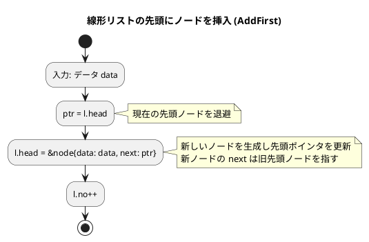
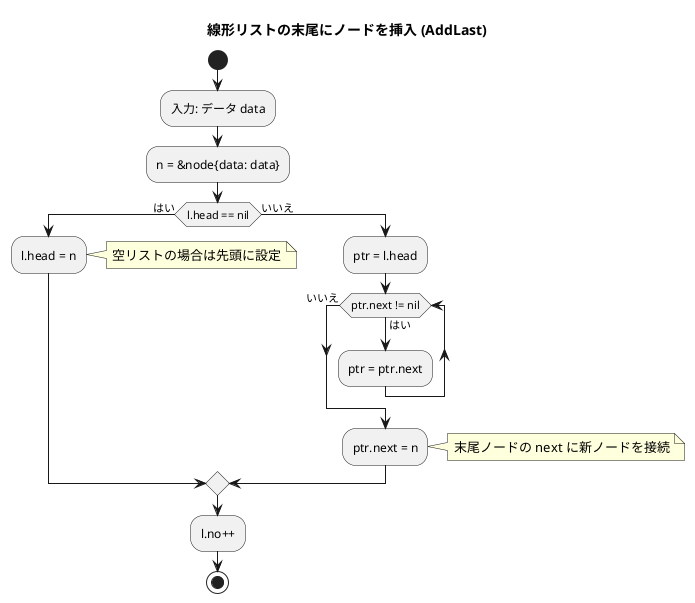
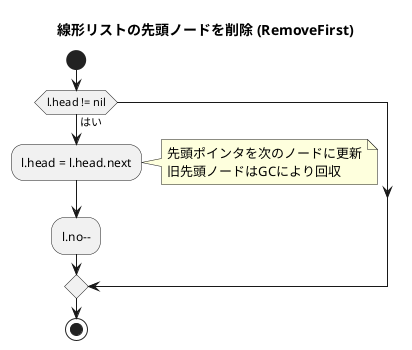
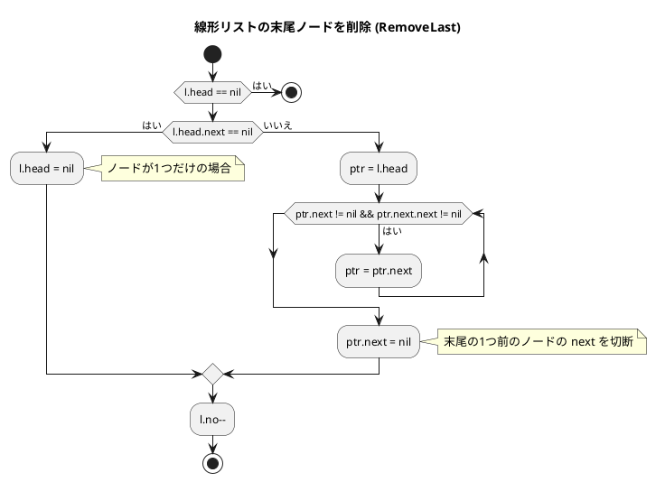
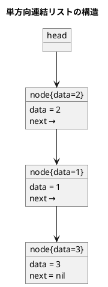
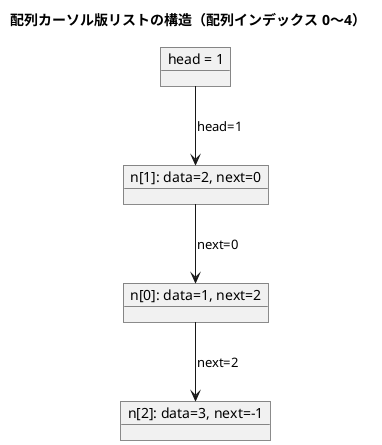
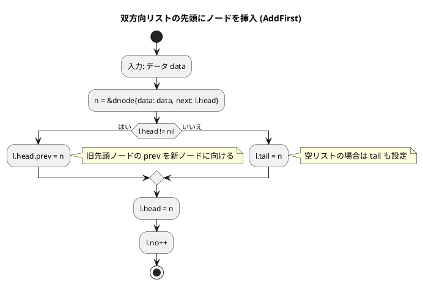
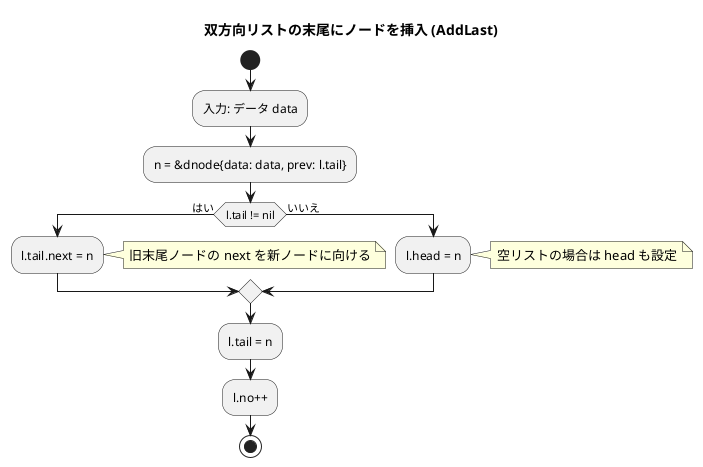
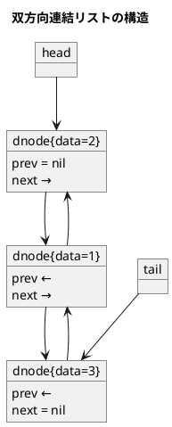

# 第 8 章 リスト

## はじめに

前章までで、配列や探索アルゴリズム、スタック、キュー、再帰、ソートアルゴリズム、文字列処理などを学んできました。この章では、データ構造の基本である「**リスト（連結リスト）**」を TDD で実装します。

配列と異なり、連結リストはメモリ上に不連続に配置されたノードをポインタで繋ぎます。要素の挿入・削除が O(1) ですが、ランダムアクセスは O(n) です。

Go ではポインタを使って連結リストを実装します。ガベージコレクションがあるためメモリ管理は自動です。

### 目次

1. [リストとは](#リストとは)
2. [線形リスト（単方向連結リスト）](#1-線形リスト単方向連結リスト)
3. [カーソルによる線形リスト](#2-カーソルによる線形リスト)
4. [双方向連結リスト](#3-双方向連結リスト)

---

## リストとは

リストとは、データを順序付けて格納するデータ構造です。配列と似ていますが、リストは要素の追加や削除が容易であるという特徴があります。

リストには様々な種類があります：

- **線形リスト（単方向連結リスト）**: 各ノードが一方向（次のノード）へのポインタを持つ基本的なリスト構造
- **双方向連結リスト**: 各ノードが前後両方のノードへのポインタを持つリスト構造
- **循環リスト**: 最後のノードが最初のノードを指す連結リスト
- **カーソルによる線形リスト**: 配列を使ってポインタの代わりにインデックス（カーソル）を使うリスト

それでは、これらのリスト構造を順に実装していきましょう。

---

## 1. 線形リスト（単方向連結リスト）

各ノードが次のノードへの参照（ポインタ）を持ちます。

### Red — 失敗するテストを書く

```go
// apps/go/chapter08/linked_list_test.go
package chapter08_test

import (
    "testing"
    "github.com/k2works/getting-started-algorithm/go/chapter08"
)

func TestLinkedList(t *testing.T) {
    ll := chapter08.NewLinkedList()

    if ll.Len() != 0 {
        t.Errorf("new list Len() = %d; want 0", ll.Len())
    }

    ll.AddFirst(1)
    ll.AddFirst(2)
    ll.AddLast(3)

    // 2 -> 1 -> 3
    if ll.Len() != 3 {
        t.Errorf("Len() = %d; want 3", ll.Len())
    }

    if !ll.Contains(1) {
        t.Error("Contains(1) should be true")
    }
    if ll.Contains(99) {
        t.Error("Contains(99) should be false")
    }

    ll.RemoveFirst()
    if ll.Len() != 2 {
        t.Errorf("after RemoveFirst Len() = %d; want 2", ll.Len())
    }

    ll.RemoveLast()
    if ll.Len() != 1 {
        t.Errorf("after RemoveLast Len() = %d; want 1", ll.Len())
    }
}
```

### Green — テストを通す実装

```go
// apps/go/chapter08/linked_list.go
package chapter08

// node 単方向連結リストのノード
type node struct {
    data int
    next *node
}

// LinkedList 単方向連結リスト
type LinkedList struct {
    head *node
    no   int
}

// NewLinkedList 新しい連結リストを生成する
func NewLinkedList() *LinkedList {
    return &LinkedList{}
}

// Len リストの要素数を返す
func (l *LinkedList) Len() int { return l.no }

// AddFirst 先頭にノードを挿入する
func (l *LinkedList) AddFirst(data int) {
    l.head = &node{data: data, next: l.head}
    l.no++
}

// AddLast 末尾にノードを挿入する
func (l *LinkedList) AddLast(data int) {
    n := &node{data: data}
    if l.head == nil {
        l.head = n
    } else {
        ptr := l.head
        for ptr.next != nil {
            ptr = ptr.next
        }
        ptr.next = n
    }
    l.no++
}

// Contains リストにdataが含まれるかを確認する
func (l *LinkedList) Contains(data int) bool {
    ptr := l.head
    for ptr != nil {
        if ptr.data == data {
            return true
        }
        ptr = ptr.next
    }
    return false
}

// RemoveFirst 先頭ノードを削除する
func (l *LinkedList) RemoveFirst() {
    if l.head != nil {
        l.head = l.head.next
        l.no--
    }
}

// RemoveLast 末尾ノードを削除する
func (l *LinkedList) RemoveLast() {
    if l.head == nil {
        return
    }
    if l.head.next == nil {
        l.head = nil
    } else {
        ptr := l.head
        for ptr.next != nil && ptr.next.next != nil {
            ptr = ptr.next
        }
        ptr.next = nil
    }
    l.no--
}

// Clear 全ノードを削除する
func (l *LinkedList) Clear() {
    l.head = nil
    l.no = 0
}
```

### フローチャート

#### 先頭にノードを挿入（AddFirst）



#### 末尾にノードを挿入（AddLast）



#### 先頭ノードを削除（RemoveFirst）



#### 末尾ノードを削除（RemoveLast）



### 解説

線形リストは、各ノードが次のノードへのポインタを持つデータ構造です：

1. **ノード構造体**: `data`（値）と `next`（次ノードへのポインタ）を持つ
2. **リスト構造体**: 先頭ノードへのポインタ `head` とノード数 `no` を管理
3. **先頭への挿入**: 新ノードを作成し `next` を旧先頭に向ける — O(1)
4. **末尾への挿入**: 末尾まで走査してから接続 — O(n)
5. **先頭削除**: `head` を次ノードに更新するだけ — O(1)
6. **末尾削除**: 末尾の 1 つ前まで走査 — O(n)

### アルゴリズムの考え方



**主な操作の計算量**:

| 操作 | 先頭 | 末尾 | 中間 |
|------|------|------|------|
| 挿入 | O(1) | O(n) | O(n) |
| 削除 | O(1) | O(n) | O(n) |
| 探索 | O(n) | O(n) | O(n) |

---

## 2. カーソルによる線形リスト

前節では、ポインタを使って線形リストを実装しました。しかし、**配列とインデックス（カーソル）** を使って線形リストを実装することもできます。削除されたノードは「フリーリスト」として再利用します。

### Red — 失敗するテストを書く

```go
func TestArrayLinkedList(t *testing.T) {
    al := chapter08.NewArrayLinkedList(10)

    al.AddFirst(1)
    al.AddFirst(2)
    al.AddLast(3)

    // 2 -> 1 -> 3
    if al.Len() != 3 {
        t.Errorf("ArrayLinkedList Len() = %d; want 3", al.Len())
    }

    idx := al.Search(1)
    if idx == -1 {
        t.Error("Search(1) should find node")
    }

    idx = al.Search(99)
    if idx != -1 {
        t.Error("Search(99) should return -1")
    }

    al.RemoveFirst()
    if al.Len() != 2 {
        t.Errorf("after RemoveFirst Len() = %d; want 2", al.Len())
    }
}
```

### Green — テストを通す実装

```go
const nullIdx = -1

type arrayNode struct {
    data  int
    next  int
    dnext int // 削除済みリストの次インデックス
}

// ArrayLinkedList 配列カーソル版線形リスト
type ArrayLinkedList struct {
    n        []arrayNode
    head     int
    deleted  int
    max      int
    capacity int
    no       int
}

// NewArrayLinkedList 指定容量の配列カーソル版リストを生成する
func NewArrayLinkedList(capacity int) *ArrayLinkedList {
    nodes := make([]arrayNode, capacity)
    for i := range nodes {
        nodes[i] = arrayNode{next: nullIdx, dnext: nullIdx}
    }
    return &ArrayLinkedList{
        n:        nodes,
        head:     nullIdx,
        deleted:  nullIdx,
        max:      nullIdx,
        capacity: capacity,
    }
}

// Len リストの要素数を返す
func (al *ArrayLinkedList) Len() int { return al.no }

func (al *ArrayLinkedList) getInsertIndex() int {
    if al.deleted != nullIdx {
        rec := al.deleted
        al.deleted = al.n[rec].dnext
        return rec
    }
    if al.max+1 < al.capacity {
        al.max++
        return al.max
    }
    return nullIdx
}

// AddFirst 先頭にノードを挿入する
func (al *ArrayLinkedList) AddFirst(data int) {
    ptr := al.head
    rec := al.getInsertIndex()
    if rec == nullIdx {
        return
    }
    al.head = rec
    al.n[rec] = arrayNode{data: data, next: ptr}
    al.no++
}

// AddLast 末尾にノードを挿入する
func (al *ArrayLinkedList) AddLast(data int) {
    if al.head == nullIdx {
        al.AddFirst(data)
        return
    }
    ptr := al.head
    for al.n[ptr].next != nullIdx {
        ptr = al.n[ptr].next
    }
    rec := al.getInsertIndex()
    if rec == nullIdx {
        return
    }
    al.n[ptr].next = rec
    al.n[rec] = arrayNode{data: data, next: nullIdx}
    al.no++
}

// Search dataと等しいノードを探索してインデックスを返す（見つからなければ -1）
func (al *ArrayLinkedList) Search(data int) int {
    ptr := al.head
    for ptr != nullIdx {
        if al.n[ptr].data == data {
            return ptr
        }
        ptr = al.n[ptr].next
    }
    return nullIdx
}

// RemoveFirst 先頭ノードを削除する
func (al *ArrayLinkedList) RemoveFirst() {
    if al.head == nullIdx {
        return
    }
    ptr := al.head
    al.head = al.n[ptr].next
    al.n[ptr].dnext = al.deleted
    al.deleted = ptr
    al.no--
}
```

### 解説

カーソルによる線形リストの特徴：

1. **ノード**: `data`（値）、`next`（次ノードのインデックス）、`dnext`（フリーリストの次インデックス）
2. **フリーリスト**: 削除されたノードのインデックスを `deleted` → `n[i].dnext` の連鎖で管理
3. **挿入時**: フリーリストに空きがあれば再利用、なければ `max` を進める
4. **削除時**: インデックスをフリーリストに追加（GC 不要な言語で有効）



---

## 3. 双方向連結リスト

各ノードが前後両方のノードへの参照を持ちます。先頭・末尾への挿入・削除がいずれも O(1) で行えます。

### Red — 失敗するテストを書く

```go
func TestDoublyLinkedList(t *testing.T) {
    dll := chapter08.NewDoublyLinkedList()

    dll.AddFirst(1)
    dll.AddFirst(2)
    dll.AddLast(3)

    if dll.Len() != 3 {
        t.Errorf("DoublyLinkedList Len() = %d; want 3", dll.Len())
    }

    if !dll.Contains(3) {
        t.Error("DoublyLinkedList Contains(3) should be true")
    }

    dll.RemoveFirst()
    if dll.Len() != 2 {
        t.Errorf("after RemoveFirst Len() = %d; want 2", dll.Len())
    }
}
```

### Green — テストを通す実装

```go
// dnode 双方向連結リストのノード
type dnode struct {
    data int
    prev *dnode
    next *dnode
}

// DoublyLinkedList 双方向連結リスト
type DoublyLinkedList struct {
    head *dnode
    tail *dnode
    no   int
}

// NewDoublyLinkedList 新しい双方向連結リストを生成する
func NewDoublyLinkedList() *DoublyLinkedList {
    return &DoublyLinkedList{}
}

// Len リストの要素数を返す
func (l *DoublyLinkedList) Len() int { return l.no }

// Contains リストにdataが含まれるかを確認する
func (l *DoublyLinkedList) Contains(data int) bool {
    ptr := l.head
    for ptr != nil {
        if ptr.data == data {
            return true
        }
        ptr = ptr.next
    }
    return false
}

// AddFirst 先頭にノードを挿入する
func (l *DoublyLinkedList) AddFirst(data int) {
    n := &dnode{data: data, next: l.head}
    if l.head != nil {
        l.head.prev = n
    } else {
        l.tail = n
    }
    l.head = n
    l.no++
}

// AddLast 末尾にノードを挿入する
func (l *DoublyLinkedList) AddLast(data int) {
    n := &dnode{data: data, prev: l.tail}
    if l.tail != nil {
        l.tail.next = n
    } else {
        l.head = n
    }
    l.tail = n
    l.no++
}

// RemoveFirst 先頭ノードを削除する
func (l *DoublyLinkedList) RemoveFirst() {
    if l.head == nil {
        return
    }
    l.head = l.head.next
    if l.head != nil {
        l.head.prev = nil
    } else {
        l.tail = nil
    }
    l.no--
}

// Clear 全ノードを削除する
func (l *DoublyLinkedList) Clear() {
    l.head = nil
    l.tail = nil
    l.no = 0
}
```

### フローチャート

#### 先頭にノードを挿入（AddFirst）



#### 末尾にノードを挿入（AddLast）



### 解説

双方向連結リストの特徴：

1. **ノード構造体**: `data`、`prev`（前ノードへのポインタ）、`next`（次ノードへのポインタ）
2. **リスト構造体**: `head`（先頭）と `tail`（末尾）の両方を管理
3. **先頭への挿入**: O(1) — `head` と旧先頭ノードの `prev` を更新
4. **末尾への挿入**: O(1) — `tail` と旧末尾ノードの `next` を更新
5. **先頭削除**: O(1) — `head` を次ノードに更新し、新先頭の `prev` を `nil` に



### Python との比較

| 操作 | Python（番兵ノード使用） | Go（head/tail 管理） |
|------|----------------------|-------------------|
| 先頭挿入 | O(1)（番兵で統一） | O(1) |
| 末尾挿入 | O(1) | O(1) |
| 先頭削除 | O(1) | O(1) |
| ノードへのアクセス | `_DNode`（クラス） | `*dnode`（ポインタ） |
| メモリ管理 | GC（参照カウント） | GC（マーク&スイープ） |

---

## テスト実行結果

```bash
$ go test ./chapter08/ -v -cover
=== RUN   TestLinkedList
--- PASS: TestLinkedList (0.00s)
=== RUN   TestDoublyLinkedList
--- PASS: TestDoublyLinkedList (0.00s)
=== RUN   TestLinkedListClear
--- PASS: TestLinkedListClear (0.00s)
=== RUN   TestDoublyLinkedListClear
--- PASS: TestDoublyLinkedListClear (0.00s)
=== RUN   TestArrayLinkedList
--- PASS: TestArrayLinkedList (0.00s)
PASS
coverage: 100.0% of statements in ./chapter08/
ok      github.com/k2works/getting-started-algorithm/go/chapter08
```

全テストが通過し、カバレッジ 100% を達成しました。

---

## 配列 vs 連結リスト

| 項目 | 配列（スライス） | 単方向連結リスト | 双方向連結リスト |
|------|----------------|----------------|----------------|
| ランダムアクセス | O(1) | O(n) | O(n) |
| 先頭への挿入 | O(n) | O(1) | O(1) |
| 末尾への挿入 | O(1) | O(n) | O(1) |
| 先頭削除 | O(n) | O(1) | O(1) |
| 末尾削除 | O(1) | O(n) | O(1) |
| メモリ使用 | 連続領域 | 不連続、ポインタ分余分 | 不連続、ポインタ 2 本分余分 |

## まとめ

| データ構造 | 操作 | 計算量 | Go の特徴 |
|-----------|------|--------|-----------|
| 単方向連結リスト | 先頭挿入 | O(1) | `l.head = &node{data: data, next: l.head}` |
| 単方向連結リスト | 末尾挿入 | O(n) | ポインタで末尾まで走査 |
| 単方向連結リスト | 先頭削除 | O(1) | `l.head = l.head.next` |
| 双方向連結リスト | 先頭・末尾挿入 | O(1) | `head`/`tail` の両方を管理 |
| 配列カーソル版 | 挿入 | O(1) | フリーリストで削除済み領域を再利用 |

### Python との主な違い

| 機能 | Python | Go |
|------|--------|-----|
| ノード型 | `_Node` クラス | `node` 構造体 |
| ポインタ | 参照（自動管理） | `*node`（明示的ポインタ） |
| 空チェック | `if self.head is None:` | `if l.head == nil {` |
| メモリ管理 | GC（参照カウント + 循環GC） | GC（トリコロール・マーク&スイープ） |
| 双方向リスト | 番兵ノードで先頭・末尾を統一 | `head`/`tail` ポインタで管理 |

## 参考文献

- 『新・明解 アルゴリズムとデータ構造』 — 柴田望洋
- 『テスト駆動開発』 — Kent Beck
- [The Go Programming Language](https://go.dev/doc/)
