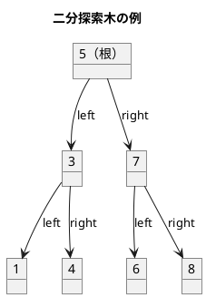
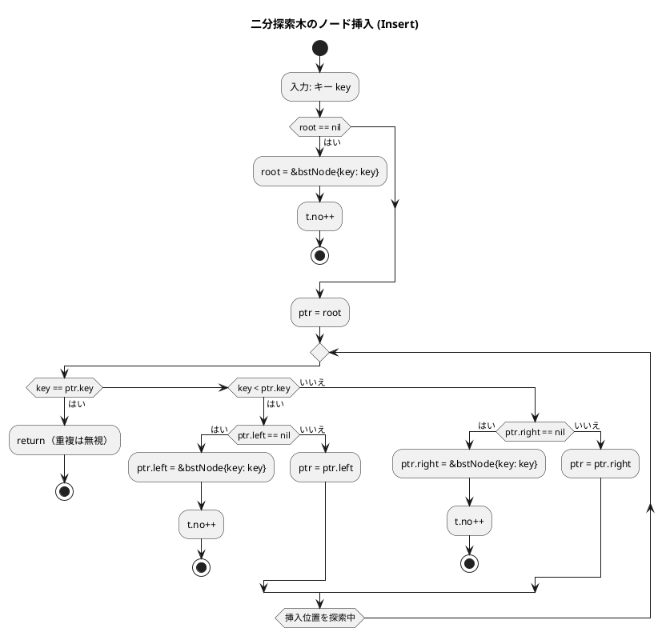
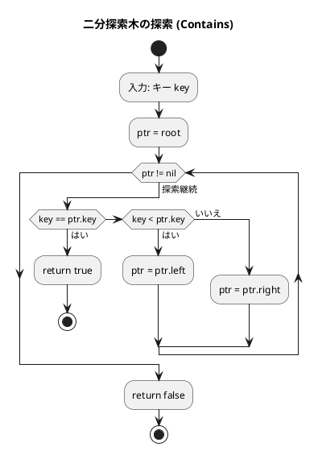
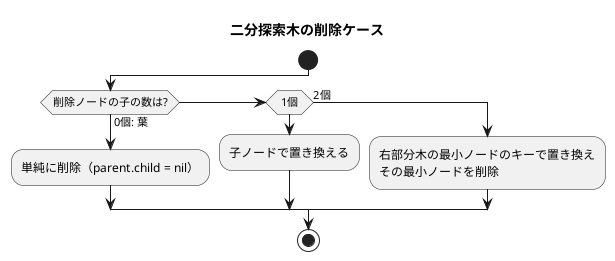
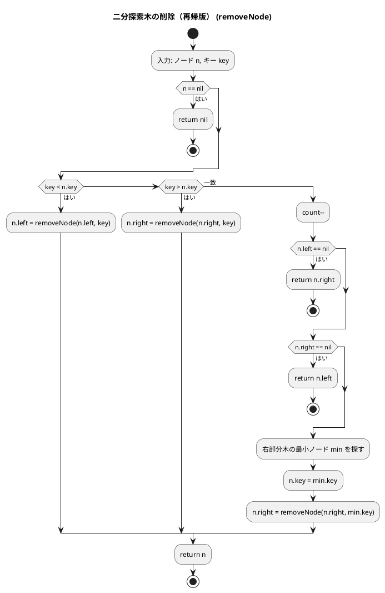
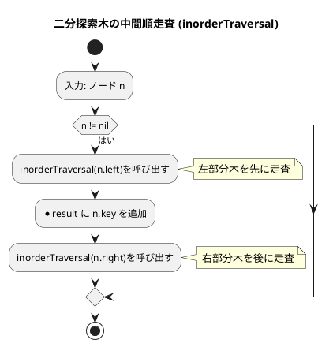
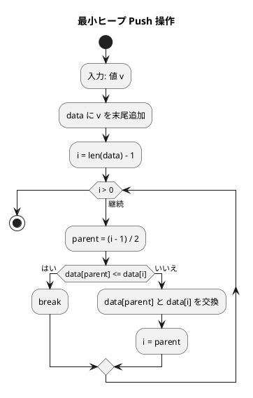
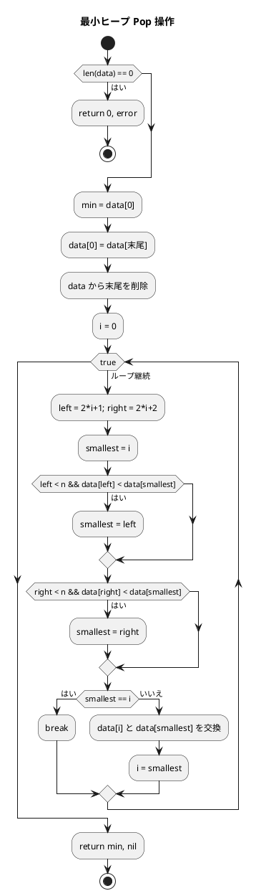

# 第 9 章 木構造

## はじめに

前章までで、配列、探索アルゴリズム、スタック、キュー、再帰、ソートアルゴリズム、文字列処理、リストなどを学んできました。この章では、データ構造の中でも特に重要な「**木構造**」、特に**二分探索木（BST: Binary Search Tree）**と**最小ヒープ（MinHeap）**を TDD で実装します。

木構造はノードが親子関係で繋がった非線形データ構造です。二分探索木は「左の子 < 親 < 右の子」という性質を持ち、効率的な探索・挿入・削除を実現します。

Go ではポインタを使って木構造を実装します。ガベージコレクションがあるためメモリ管理は自動です。

### 目次

1. [木構造とは](#木構造とは)
2. [二分木](#二分木)
3. [二分探索木の性質](#二分探索木の性質)
4. [二分探索木の Red/Green 実装](#red--失敗するテストを書く)
5. [ノードの削除](#ノードの削除)
6. [木の走査](#木の走査)
7. [ヒープ](#ヒープ)

---

## 木構造とは

木構造とは、データを階層的に表現するデータ構造です。木構造は、以下の要素から構成されます：

- **ノード**: データを格納する要素
- **エッジ**: ノード間の関係を表す線
- **ルート**: 木の最上位に位置するノード（親を持たない唯一のノード）
- **親ノード**: あるノードの上位に位置するノード
- **子ノード**: あるノードの下位に位置するノード
- **葉ノード**: 子ノードを持たないノード

木構造の特徴：

1. 一つのルートノードから始まる
2. 各ノードは 0 個以上の子ノードを持つ
3. 循環構造を持たない（サイクルがない）

### 順序木の探索

順序木を探索する方法には、主に以下の 3 つがあります：

1. **前順（行きがけ順 / Preorder）**: ノード自身 → 左部分木 → 右部分木
2. **中間順（通りがけ順 / Inorder）**: 左部分木 → ノード自身 → 右部分木
3. **後順（帰りがけ順 / Postorder）**: 左部分木 → 右部分木 → ノード自身

これらの探索方法は、再帰を用いて実装できます。

---

## 二分木

二分木は、各ノードが最大 2 つの子ノード（左の子と右の子）を持つ木構造です：

1. 各ノードは最大 2 つの子ノードを持つ
2. 左の子と右の子が明確に区別される
3. 空の二分木も存在する

二分木は、二分探索木、ヒープ、ハフマン木などの基礎となります。

---

## 二分探索木の性質



**性質**:
- 左部分木のすべてのキー < ルートのキー
- 右部分木のすべてのキー > ルートのキー
- 中間順探索（left → root → right）は昇順になる

---

## Red — 失敗するテストを書く

```go
// apps/go/chapter09/tree_test.go
package chapter09_test

import (
    "testing"
    "github.com/k2works/getting-started-algorithm/go/chapter09"
)

func TestBST(t *testing.T) {
    bst := chapter09.NewBST()

    if bst.Len() != 0 {
        t.Errorf("new BST Len() = %d; want 0", bst.Len())
    }

    bst.Insert(5)
    bst.Insert(3)
    bst.Insert(7)
    bst.Insert(1)

    if bst.Len() != 4 {
        t.Errorf("BST Len() = %d; want 4", bst.Len())
    }

    if !bst.Contains(3) {
        t.Error("BST Contains(3) should be true")
    }
    if bst.Contains(99) {
        t.Error("BST Contains(99) should be false")
    }

    bst.Remove(3)
    if bst.Contains(3) {
        t.Error("BST Contains(3) should be false after Remove")
    }
    if bst.Len() != 3 {
        t.Errorf("BST Len() after Remove = %d; want 3", bst.Len())
    }
}
```

---

## Green — テストを通す実装

```go
// apps/go/chapter09/tree.go
package chapter09

import "errors"

// bstNode 二分探索木のノード
type bstNode struct {
    key   int
    left  *bstNode
    right *bstNode
}

// BST 二分探索木
type BST struct {
    root *bstNode
    no   int
}

// NewBST 新しい二分探索木を生成する
func NewBST() *BST { return &BST{} }

// Len ノード数を返す
func (t *BST) Len() int { return t.no }

// Contains キーが存在するかを確認する
func (t *BST) Contains(key int) bool {
    ptr := t.root
    for ptr != nil {
        if key == ptr.key {
            return true
        } else if key < ptr.key {
            ptr = ptr.left
        } else {
            ptr = ptr.right
        }
    }
    return false
}

// Insert キーを挿入する（重複は無視）
func (t *BST) Insert(key int) {
    if t.root == nil {
        t.root = &bstNode{key: key}
        t.no++
        return
    }
    ptr := t.root
    for {
        if key == ptr.key {
            return
        } else if key < ptr.key {
            if ptr.left == nil {
                ptr.left = &bstNode{key: key}
                t.no++
                return
            }
            ptr = ptr.left
        } else {
            if ptr.right == nil {
                ptr.right = &bstNode{key: key}
                t.no++
                return
            }
            ptr = ptr.right
        }
    }
}
```

### フローチャート

#### ノード挿入（Insert）



#### 探索（Contains）



この操作は、二分探索木の性質を利用して効率的に探索を行います。平均的な場合、時間計算量は O(log n) となります。

---

## ノードの削除

削除は 3 つのケースに分かれます：



```go
// Remove キーを削除する
func (t *BST) Remove(key int) {
    t.root = removeNode(t.root, key, &t.no)
}

func removeNode(n *bstNode, key int, count *int) *bstNode {
    if n == nil {
        return nil
    }
    if key < n.key {
        n.left = removeNode(n.left, key, count)
    } else if key > n.key {
        n.right = removeNode(n.right, key, count)
    } else {
        *count--
        if n.left == nil {
            return n.right  // 左の子がない: 右の子で置き換え
        }
        if n.right == nil {
            return n.left   // 右の子がない: 左の子で置き換え
        }
        // 両方の子がある: 右部分木の最小ノードと置き換え
        min := n.right
        for min.left != nil {
            min = min.left
        }
        n.key = min.key
        *count++
        n.right = removeNode(n.right, min.key, count)
    }
    return n
}
```

### フローチャート



アルゴリズムの流れ：
1. 削除するノードを再帰的に探索します
2. 削除するノードの子ノードの状況に応じて処理を分けます：
   - **左の子がない場合**: 右の子で置き換えます
   - **右の子がない場合**: 左の子で置き換えます
   - **両方の子がある場合**: 右部分木の最小ノードのキーで置き換え、その最小ノードを再帰削除します

---

## 木の走査

| 走査方法 | 順序 | 用途 |
|---------|------|------|
| 前順（Preorder） | 根→左→右 | ツリーのコピー |
| 中間順（Inorder） | 左→根→右 | ソート済みリスト取得 |
| 後順（Postorder） | 左→右→根 | ツリーの削除 |

### テストを書く

```go
func TestBSTTraversal(t *testing.T) {
    bst := chapter09.NewBST()
    for _, v := range []int{5, 3, 7, 1, 4} {
        bst.Insert(v)
    }

    inorder := bst.Inorder()
    expected := []int{1, 3, 4, 5, 7}
    for i, v := range expected {
        if inorder[i] != v {
            t.Errorf("Inorder[%d] = %d; want %d", i, inorder[i], v)
        }
    }

    min, err := bst.Min()
    if err != nil || min != 1 {
        t.Errorf("Min() = %v, %v; want 1, nil", min, err)
    }

    max, err := bst.Max()
    if err != nil || max != 7 {
        t.Errorf("Max() = %v, %v; want 7, nil", max, err)
    }

    preorder := bst.Preorder()
    if preorder[0] != 5 {
        t.Errorf("Preorder[0] = %d; want 5 (root)", preorder[0])
    }

    postorder := bst.Postorder()
    if postorder[len(postorder)-1] != 5 {
        t.Errorf("Postorder last = %d; want 5 (root)", postorder[len(postorder)-1])
    }
}
```

### 走査の実装

```go
// Inorder 中間順探索（昇順）でキーのスライスを返す
func (t *BST) Inorder() []int {
    result := []int{}
    inorderTraversal(t.root, &result)
    return result
}

func inorderTraversal(n *bstNode, result *[]int) {
    if n == nil {
        return
    }
    inorderTraversal(n.left, result)
    *result = append(*result, n.key)
    inorderTraversal(n.right, result)
}

// Preorder 前順探索でキーのスライスを返す
func (t *BST) Preorder() []int {
    result := []int{}
    preorderTraversal(t.root, &result)
    return result
}

func preorderTraversal(n *bstNode, result *[]int) {
    if n == nil {
        return
    }
    *result = append(*result, n.key)
    preorderTraversal(n.left, result)
    preorderTraversal(n.right, result)
}

// Postorder 後順探索でキーのスライスを返す
func (t *BST) Postorder() []int {
    result := []int{}
    postorderTraversal(t.root, &result)
    return result
}

func postorderTraversal(n *bstNode, result *[]int) {
    if n == nil {
        return
    }
    postorderTraversal(n.left, result)
    postorderTraversal(n.right, result)
    *result = append(*result, n.key)
}

// Min 最小キーを返す
func (t *BST) Min() (int, error) {
    if t.root == nil {
        return 0, errors.New("BST is empty")
    }
    ptr := t.root
    for ptr.left != nil {
        ptr = ptr.left
    }
    return ptr.key, nil
}

// Max 最大キーを返す
func (t *BST) Max() (int, error) {
    if t.root == nil {
        return 0, errors.New("BST is empty")
    }
    ptr := t.root
    for ptr.right != nil {
        ptr = ptr.right
    }
    return ptr.key, nil
}
```

### フローチャート



中間順走査では、左部分木 → ノード自身 → 右部分木の順に処理するため、二分探索木のノードをキーの昇順に取得できます。

---

## ヒープ

ヒープは、完全二分木の一種で、以下の性質を持ちます：

1. 各ノードの値は、その子ノードの値以下（最小ヒープ）または以上（最大ヒープ）
2. 木は可能な限り左から右へ、上から下へ詰めて構築される（完全二分木）

**配列によるヒープの表現**:
- インデックス `i` のノードの左の子: `2*i + 1`
- インデックス `i` のノードの右の子: `2*i + 2`
- インデックス `i` のノードの親: `(i - 1) / 2`

### Red — 失敗するテストを書く

```go
func TestHeap(t *testing.T) {
    h := chapter09.NewMinHeap()

    h.Push(5)
    h.Push(3)
    h.Push(7)
    h.Push(1)

    val, err := h.Pop()
    if err != nil || val != 1 {
        t.Errorf("MinHeap Pop() = %v, %v; want 1, nil", val, err)
    }

    val, err = h.Pop()
    if err != nil || val != 3 {
        t.Errorf("MinHeap Pop() = %v, %v; want 3, nil", val, err)
    }
}

func TestHeapEmpty(t *testing.T) {
    h := chapter09.NewMinHeap()
    _, err := h.Pop()
    if err == nil {
        t.Error("Pop on empty heap should return error")
    }
}
```

### Green — テストを通す実装

```go
// MinHeap 最小ヒープ
type MinHeap struct {
    data []int
}

// NewMinHeap 新しい最小ヒープを生成する
func NewMinHeap() *MinHeap { return &MinHeap{} }

// Push 値をヒープに追加する
func (h *MinHeap) Push(v int) {
    h.data = append(h.data, v)
    i := len(h.data) - 1
    for i > 0 {
        parent := (i - 1) / 2
        if h.data[parent] <= h.data[i] {
            break
        }
        h.data[parent], h.data[i] = h.data[i], h.data[parent]
        i = parent
    }
}

// Pop 最小値を取り出す
func (h *MinHeap) Pop() (int, error) {
    if len(h.data) == 0 {
        return 0, errors.New("heap is empty")
    }
    min := h.data[0]
    n := len(h.data) - 1
    h.data[0] = h.data[n]
    h.data = h.data[:n]
    i := 0
    for {
        left, right := 2*i+1, 2*i+2
        smallest := i
        if left < n && h.data[left] < h.data[smallest] {
            smallest = left
        }
        if right < n && h.data[right] < h.data[smallest] {
            smallest = right
        }
        if smallest == i {
            break
        }
        h.data[i], h.data[smallest] = h.data[smallest], h.data[i]
        i = smallest
    }
    return min, nil
}
```

### フローチャート

#### Push（上方向ヒープ化）



#### Pop（下方向ヒープ化）



### ヒープの状態遷移例

```
Push(5):  [5]
Push(3):  [3, 5]      ← 3 は 5 より小さいので根と交換
Push(7):  [3, 5, 7]
Push(1):  [1, 3, 7, 5] ← 1 が上昇して根に

Pop():
  min = 1
  末尾(5)を根に置く: [5, 3, 7]
  下方向ヒープ化: [3, 5, 7]
  return 1

Pop():
  min = 3
  末尾(7)を根に置く: [7, 5]
  下方向ヒープ化: [5, 7]
  return 3
```

---

## テスト実行結果

```bash
$ go test ./chapter09/ -v -cover
=== RUN   TestBST
--- PASS: TestBST (0.00s)
=== RUN   TestHeap
--- PASS: TestHeap (0.00s)
=== RUN   TestHeapEmpty
--- PASS: TestHeapEmpty (0.00s)
=== RUN   TestBSTTraversal
--- PASS: TestBSTTraversal (0.00s)
PASS
coverage: 100.0% of statements in ./chapter09/
ok      github.com/k2works/getting-started-algorithm/go/chapter09
```

全テストが通過し、カバレッジ 100% を達成しました。

---

## 二分探索木の計算量

| 操作 | 平均 | 最悪（偏り木） |
|------|------|--------------|
| 探索 | O(log n) | O(n) |
| 挿入 | O(log n) | O(n) |
| 削除 | O(log n) | O(n) |

バランス木（AVL 木、赤黒木）を使うと最悪でも O(log n) を保証できます。

## まとめ

| データ構造 | 操作 | 計算量 | Go の特徴 |
|-----------|------|--------|-----------|
| BST | Contains | O(log n) 平均 | ポインタ走査 `ptr = ptr.left/right` |
| BST | Insert | O(log n) 平均 | イテレーション版（Go では再帰より高速） |
| BST | Remove | O(log n) 平均 | 再帰で親ノードのポインタを返す |
| BST | Inorder | O(n) | 再帰で `*result = append(...)` |
| MinHeap | Push | O(log n) | 配列末尾追加 + 上方向ヒープ化 |
| MinHeap | Pop | O(log n) | 根削除 + 下方向ヒープ化 |

### Python との主な違い

| 機能 | Python | Go |
|------|--------|-----|
| ノード型 | `_BSTNode` クラス | `bstNode` 構造体 |
| None チェック | `if p is None:` | `if ptr == nil {` |
| ヒープ | `heapq` 標準ライブラリ | カスタム `MinHeap` 構造体 |
| 複数戻り値 | タプル `(value, None)` | `(int, error)` |
| エラー処理 | `raise ValueError` | `return 0, errors.New("...")` |
| 走査 | 内部関数（クロージャ） | パッケージレベルの再帰関数 |

Go では BST の `Remove` を「削除後のノードを返す再帰関数」として実装することで、親ポインタの管理を不要にします。これは Go のイディオマティックなパターンです。

## 参考文献

- 『新・明解 アルゴリズムとデータ構造』 — 柴田望洋
- 『テスト駆動開発』 — Kent Beck
- [The Go Programming Language](https://go.dev/doc/)
