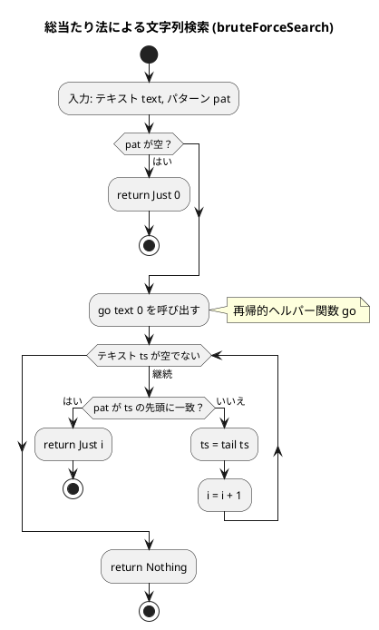
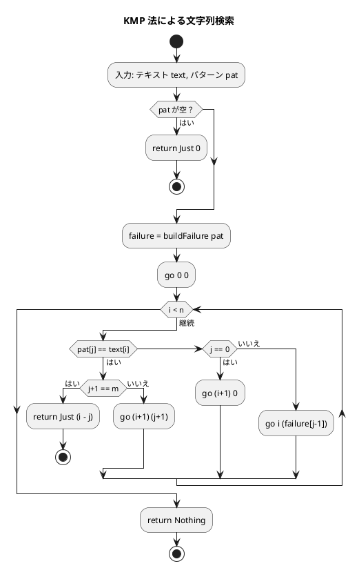
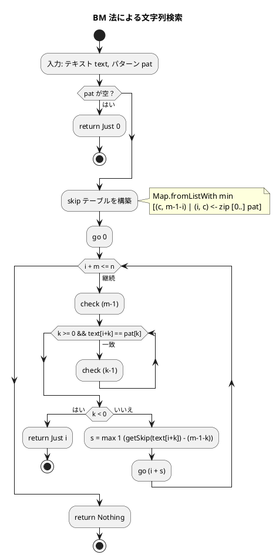

# 第 7 章 文字列処理

## はじめに

前章ではソートアルゴリズムを学びました。この章では、プログラミングにおいて非常に重要な「文字列処理」について TDD で実装します。

Haskell において、文字列は `[Char]` 型の型エイリアス、すなわち文字のリストです。この設計により、リスト処理の豊富な関数群がそのまま文字列操作に利用できます。一方で、パターンマッチングや純粋関数型スタイルにより、複雑な文字列アルゴリズムを簡潔かつ安全に記述できます。

### 目次

1. [Haskell の文字列基本操作](#haskell-の文字列基本操作)
2. [ブルートフォース文字列探索（総当たり法）](#1-ブルートフォース文字列探索)
3. [KMP 法](#2-kmp-法)
4. [Boyer-Moore 法](#3-boyer-moore-法)
5. [文字カウント・逆順・回文判定](#4-文字カウント逆順回文判定)
6. [Python 版との比較](#python-版との比較)

---

## Haskell の文字列基本操作

Haskell では `String` は `[Char]` の型エイリアスです。これにより、リスト操作のすべての関数が文字列に使用できます。

### 文字列の型

```haskell
-- String は [Char] の型エイリアス
type String = [Char]

-- 文字列リテラル
s1 :: String
s1 = "Hello"

-- 文字のリストとして扱える
firstChar :: Char
firstChar = head "Hello"  -- 'H'

restChars :: String
restChars = tail "Hello"  -- "ello"

-- 長さ
len :: Int
len = length "Hello"  -- 5
```

### 基本的な文字列操作

```haskell
-- 連結
s :: String
s = "Hello" ++ " " ++ "World"  -- "Hello World"

-- リバース
rev :: String
rev = reverse "Hello"  -- "olleh"

-- 検索（Data.List より）
import Data.List (isPrefixOf, isSuffixOf, isInfixOf)

startsWith :: Bool
startsWith = "Hello" `isPrefixOf` "Hello World"  -- True

endsWith :: Bool
endsWith = "World" `isSuffixOf` "Hello World"  -- True

contains :: Bool
contains = "lo W" `isInfixOf` "Hello World"  -- True

-- 変換（Data.Char より）
import Data.Char (toUpper, toLower, isAlpha, isDigit)

upper :: String
upper = map toUpper "hello"  -- "HELLO"

lower :: String
lower = map toLower "HELLO"  -- "hello"
```

### 文字列の分割とフィルタリング

```haskell
-- フィルタリング
onlyAlpha :: String
onlyAlpha = filter isAlpha "Hello, World! 123"  -- "HelloWorld"

-- 単語への分割（words / unwords）
wordList :: [String]
wordList = words "Hello World Haskell"  -- ["Hello", "World", "Haskell"]

rejoined :: String
rejoined = unwords ["Hello", "World", "Haskell"]  -- "Hello World Haskell"

-- 行への分割（lines / unlines）
lineList :: [String]
lineList = lines "line1\nline2\nline3"  -- ["line1", "line2", "line3"]
```

### モジュールのインポート

この章で実装する `Strings` モジュールは以下のインポートを使用します：

```haskell
module Strings
  ( bruteForceSearch
  , kmpSearch
  , bmSearch
  , charCount
  , reverseString
  , isPalindrome
  ) where

import Data.List (isPrefixOf)
import qualified Data.Map.Strict as Map
```

`Data.List.isPrefixOf` は、あるリスト（文字列）が別のリストの先頭に一致するかを判定します。ブルートフォース探索の核心部分で活用します。`Data.Map.Strict` は BM 法のスキップテーブル管理に使用します。

---

## 1. ブルートフォース文字列探索

テキストを左から順にパターンと比較する最もシンプルな方法です。Haskell では `isPrefixOf` と再帰により、簡潔に実装できます。

### Red — 失敗するテストを書く

```haskell
-- test/StringsSpec.hs
module StringsSpec (spec) where

import Test.Hspec
import Strings

spec :: Spec
spec = do
  describe "Strings" $ do
    let text    = "mississippi"
    let pattern = "issi"

    describe "bruteForceSearch" $ do
      it "総当たり法で部分文字列を探す" $ do
        bruteForceSearch text pattern `shouldBe` Just 1
        bruteForceSearch text "xxx"   `shouldBe` Nothing
        bruteForceSearch "" "a"       `shouldBe` Nothing
        bruteForceSearch "a" ""       `shouldBe` Just 0
```

このテストを実行すると、`bruteForceSearch` が未定義のためコンパイルエラーになります。

### Green — テストを通す実装

```haskell
-- src/Strings.hs

-- | 総当たり法（Brute-Force）による部分文字列探索
bruteForceSearch :: String -> String -> Maybe Int
bruteForceSearch _ [] = Just 0
bruteForceSearch text pat = go text 0
  where
    go [] _ = Nothing
    go ts i
      | pat `isPrefixOf` ts = Just i
      | otherwise            = go (tail ts) (i + 1)
```

### テストの実行

```bash
$ cabal test --test-show-details=streaming
...
  Strings
    bruteForceSearch
      総当たり法で部分文字列を探す [OK]
```

### 解説

`bruteForceSearch` の実装の流れ：

1. **空パターン対応**：`bruteForceSearch _ [] = Just 0` — パターンが空なら位置 0 を返す（Haskell のパターンマッチ）
2. **再帰的探索**：`go text 0` — テキストの先頭から探索開始
3. **終了条件**：`go [] _ = Nothing` — テキストを使い切ったら失敗
4. **一致チェック**：`pat `isPrefixOf` ts` — 現在位置でパターンが前置一致するか
5. **前進**：一致しなければ `tail ts`（先頭要素を除く）で 1 文字進む

`isPrefixOf` は `Data.List` の標準関数で、`"abc" `isPrefixOf` "abcde"` は `True` を返します。

**戻り値の型 `Maybe Int`**：

Haskell では検索失敗を例外ではなく `Maybe` 型で表現します：

- `Just 1` — 位置 1 で見つかった
- `Nothing` — 見つからなかった

**計算量**:
- 最良の場合：O(m)（m はパターンの長さ）
- 最悪の場合：O(n × m)（n はテキストの長さ）

### アルゴリズムの可視化

```
テキスト: mississippi
パターン: issi

i=0: mississippi
     issi          -> m≠i → 不一致
i=1: ississippi
      issi         -> i=i, s=s, s=s, i=i → 一致! -> Just 1
```

### フローチャート



---

## 2. KMP 法

KMP 法（Knuth-Morris-Pratt 法）は、失敗関数（failure function）を事前計算してムダな比較を省く効率的な文字列探索アルゴリズムです。

### Red — 失敗するテストを書く

```haskell
describe "kmpSearch" $ do
  it "KMP 法で部分文字列を探す" $ do
    kmpSearch text pattern `shouldBe` Just 1
    kmpSearch text "xxx"   `shouldBe` Nothing
    kmpSearch "aabaabaab" "aab" `shouldBe` Just 0
```

### Green — テストを通す実装

```haskell
-- | KMP 法による部分文字列探索
kmpSearch :: String -> String -> Maybe Int
kmpSearch _ [] = Just 0
kmpSearch text pat = go 0 0
  where
    m    = length pat
    n    = length text
    tarr = text
    parr = pat
    failure = buildFailure pat

    go i j
      | i >= n         = Nothing
      | parr !! j == tarr !! i =
          if j + 1 == m
          then Just (i - j)
          else go (i + 1) (j + 1)
      | j == 0         = go (i + 1) 0
      | otherwise       = go i (failure !! (j - 1))

    buildFailure p =
      let m' = length p
          go' 1 acc = acc
          go' k acc =
            let prev = acc !! (k - 2)
                fill f
                  | f > 0 && p !! f /= p !! (k - 1) = fill (acc !! (f - 1))
                  | otherwise = f
                f' = fill prev
                v  = if p !! f' == p !! (k - 1) then f' + 1 else 0
            in go' (k - 1) (take (k - 1) acc ++ [v] ++ drop k acc)
      in go' m' (replicate m' 0)
```

### テストの実行

```bash
$ cabal test --test-show-details=streaming
...
  Strings
    kmpSearch
      KMP 法で部分文字列を探す [OK]
```

### 解説

KMP 法は 2 段階で動作します：

#### 1. 失敗関数テーブルの構築（buildFailure）

失敗関数は、パターン内の各位置について「それまでの部分文字列の中で最長の真の接頭辞＝接尾辞の長さ」を格納します。

```
パターン: "aab"
インデックス: [0, 1, 2]
失敗関数:   [0, 1, 0]

パターン: "abab"
失敗関数:  [0, 0, 1, 2]
```

この情報により、不一致が発生した際にパターンのどこまで「巻き戻す」かが分かります。

#### 2. 実際の探索（go）

```
テキスト: mississippi (n=11)
パターン: issi        (m=4)
失敗関数: [0, 0, 0, 1]

i=0, j=0: m≠i → j=0 なので i++ → go 1 0
i=1, j=0: i=i → go 2 1
i=2, j=1: s=s → go 3 2
i=3, j=2: s=s → go 4 3
i=4, j=3: j+1=m → Just (4-3) = Just 1 ✓
```

**KMP 法の Haskell らしい特徴**：

- `go i j` という 2 引数の末尾再帰関数で探索を実装
- `buildFailure` もリスト操作と再帰で実装
- `(!!)` 演算子でリストへの添字アクセス

**計算量**:
- 前処理（失敗関数）：O(m)
- 探索：O(n)
- 合計：O(n + m)

### フローチャート



---

## 3. Boyer-Moore 法

BM 法は、パターンを**右から左**へ比較し、不一致時に大きくスキップする効率的な文字列探索アルゴリズムです。Haskell では `Data.Map.Strict` でスキップテーブルを管理します。

### Red — 失敗するテストを書く

```haskell
describe "bmSearch" $ do
  it "BM 法で部分文字列を探す" $ do
    bmSearch text pattern `shouldBe` Just 1
    bmSearch text "xxx"   `shouldBe` Nothing
```

### Green — テストを通す実装

```haskell
-- | BM 法による部分文字列探索
bmSearch :: String -> String -> Maybe Int
bmSearch _ [] = Just 0
bmSearch text pat = go 0
  where
    m    = length pat
    n    = length text
    -- スキップテーブル: 文字 -> スキップ量
    skip = Map.fromListWith min
             [(c, m - 1 - i) | (i, c) <- zip [0..] pat]
    getSkip c = Map.findWithDefault m c skip
    go i
      | i + m > n = Nothing
      | otherwise =
          let j = m - 1
              check k
                | k < 0     = Just i
                | text !! (i + k) == pat !! k = check (k - 1)
                | otherwise =
                    let s = max 1 (getSkip (text !! (i + k)) - (m - 1 - k))
                    in go (i + s)
          in check j
```

### テストの実行

```bash
$ cabal test --test-show-details=streaming
...
  Strings
    bmSearch
      BM 法で部分文字列を探す [OK]
```

### 解説

BM 法のスキップテーブル構築（Haskell らしいリスト内包表記）：

```haskell
skip = Map.fromListWith min
         [(c, m - 1 - i) | (i, c) <- zip [0..] pat]
```

このコードは：
1. `zip [0..] pat` でインデックスと文字のペアを生成
2. リスト内包表記で `(文字, スキップ量)` のリストを作成
3. 同じ文字が複数回出現する場合は `min` で最小値（最後の出現位置）を採用

**スキップ量の計算**：

パターン `"issi"` の場合：
```
i=0, c='i': skip = 3-0 = 3
i=1, c='s': skip = 3-1 = 2
i=2, c='s': skip = 3-2 = 1 (min(2,1) = 1)
i=3, c='i': skip = 3-3 = 0 (min(3,0) = 0)
```

テーブル: `{ 'i': 0, 's': 1 }`

パターンにない文字のデフォルトスキップ量は `m`（パターンの長さ）です。

**計算量**:
- 最良の場合：O(n / m)
- 最悪の場合：O(n × m)
- 平均の場合：O(n)（テキストのアルファベット種類が多いほど高速）

### フローチャート



---

## 4. 文字カウント・逆順・回文判定

### Red — 失敗するテストを書く

```haskell
describe "charCount" $ do
  it "各文字の出現頻度をカウントする" $ do
    charCount "hello" 'l' `shouldBe` 2
    charCount "hello" 'z' `shouldBe` 0
    charCount "" 'a'       `shouldBe` 0

describe "reverseString" $ do
  it "文字列を逆順にする" $ do
    reverseString "hello" `shouldBe` "olleh"
    reverseString ""      `shouldBe` ""
    reverseString "a"     `shouldBe` "a"

describe "isPalindrome" $ do
  it "回文かどうかを判定する" $ do
    isPalindrome "racecar" `shouldBe` True
    isPalindrome "hello"   `shouldBe` False
    isPalindrome ""        `shouldBe` True
    isPalindrome "a"       `shouldBe` True
```

### Green — テストを通す実装

```haskell
-- | 特定文字の出現回数をカウント
charCount :: String -> Char -> Int
charCount s c = length (filter (== c) s)

-- | 文字列を逆順にする
reverseString :: String -> String
reverseString = reverse

-- | 回文判定
isPalindrome :: String -> Bool
isPalindrome s = s == reverse s
```

### 解説

これらの実装は Haskell の特徴を活かした簡潔な実装です：

**charCount**：
- `filter (== c) s` — 文字 `c` と等しい要素だけを残す
- `length` でその数を数える
- `(== c)` は部分適用（セクション）で `\x -> x == c` と同等

**reverseString**：
- Prelude の `reverse` 関数をそのまま使用
- ポイントフリースタイル（`reverseString = reverse`）

**isPalindrome**：
- 文字列とその逆順が等しいかを比較
- Haskell では `(==)` は文字列を辞書順に比較

### テストの実行

```bash
$ cabal test --test-show-details=streaming
...
  Strings
    charCount
      各文字の出現頻度をカウントする [OK]
    reverseString
      文字列を逆順にする [OK]
    isPalindrome
      回文かどうかを判定する [OK]
```

---

## テスト実行結果

```bash
$ cabal test --test-show-details=streaming

  Strings
    bruteForceSearch
      総当たり法で部分文字列を探す [OK]
    kmpSearch
      KMP 法で部分文字列を探す [OK]
    bmSearch
      BM 法で部分文字列を探す [OK]
    charCount
      各文字の出現頻度をカウントする [OK]
    reverseString
      文字列を逆順にする [OK]
    isPalindrome
      回文かどうかを判定する [OK]

Finished in 0.0032 seconds
6 examples, 0 failures
```

---

## 文字列探索アルゴリズムの比較

| アルゴリズム | 計算量（平均） | 特徴 |
|-------------|--------------|------|
| ブルートフォース | O(n × m) | シンプル、小規模に有効 |
| KMP 法 | O(n + m) | 最悪でも線形、失敗関数が必要 |
| Boyer-Moore 法 | O(n / m) 平均 | 大規模テキストで最速 |

---

## Python 版との比較

| 概念 | Python | Haskell |
|------|--------|---------|
| 文字列型 | `str`（不変シーケンス） | `String = [Char]`（文字のリスト） |
| 部分文字列確認 | `"abc" in s` | `"abc" \`isInfixOf\` s` |
| 先頭確認 | `s.startswith("abc")` | `"abc" \`isPrefixOf\` s` |
| 文字逆順 | `s[::-1]` | `reverse s` |
| 文字フィルタ | `[c for c in s if pred(c)]` | `filter pred s` |
| 文字変換 | `[f(c) for c in s]` | `map f s` |
| 検索の失敗表現 | `-1`（整数）または `None` | `Nothing`（`Maybe Int`） |
| 検索成功表現 | 整数インデックス | `Just n`（`Maybe Int`） |
| 文字数カウント | `s.count(c)` | `length (filter (== c) s)` |
| 回文判定 | `s == s[::-1]` | `s == reverse s` |
| スキップテーブル | `dict` | `Data.Map.Strict` |

### 重要な違い

**1. 文字列 = 文字のリスト**

Python では `str` は専用のシーケンス型ですが、Haskell では `[Char]` です。これにより：

```haskell
-- リスト操作がすべて使える
take 3 "Hello"    -- "Hel"
drop 3 "Hello"    -- "lo"
zip "abc" "123"   -- [('a','1'),('b','2'),('c','3')]
```

**2. Maybe による安全な失敗表現**

Python の検索関数は `-1` や例外で失敗を表現しますが、Haskell では `Maybe` 型を使います：

```haskell
-- Haskell
case bruteForceSearch text pat of
  Just i  -> putStrLn $ "位置 " ++ show i ++ " で見つかった"
  Nothing -> putStrLn "見つからなかった"
```

```python
# Python
pos = bf_match(text, pat)
if pos == -1:
    print("見つからなかった")
else:
    print(f"位置 {pos} で見つかった")
```

**3. 宣言的・関数合成スタイル**

```haskell
-- Haskell: 関数合成と部分適用
charCount s c = length . filter (== c) $ s

-- ポイントフリースタイル
isPalindrome = (==) <*> reverse
```

```python
# Python: 命令的スタイル
def count_chars(s, c):
    return sum(1 for ch in s if ch == c)
```

---

## まとめ

この章では、Haskell における文字列処理について学びました：

1. **文字列 = [Char]** — Haskell の文字列はリストであり、すべてのリスト操作が使用可能
2. **文字列検索アルゴリズム**：
   - 総当たり法 — `isPrefixOf` と再帰で簡潔に実装
   - KMP 法 — 失敗関数を事前計算し O(n + m) を実現
   - BM 法 — `Data.Map.Strict` でスキップテーブルを管理
3. **Maybe 型** — 検索失敗を安全に表現
4. **関数型スタイル** — `filter`、`map`、`reverse` などの高階関数で簡潔に記述

テスト駆動開発（Red → Green）のサイクルにより、各アルゴリズムを正確かつ安全に実装できました。

次の章では、連結リスト（Linked Lists）について学びましょう。

## 参考文献

- 『アルゴリズムとデータ構造』 — 柴田望洋
- 『テスト駆動開発』 — Kent Beck
- 『Real World Haskell』 — Bryan O'Sullivan
- Haskell 標準ライブラリ: [Data.List](https://hackage.haskell.org/package/base/docs/Data-List.html)
- Haskell 標準ライブラリ: [Data.Map.Strict](https://hackage.haskell.org/package/containers/docs/Data-Map-Strict.html)
