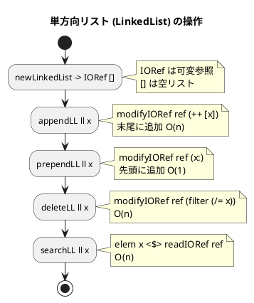
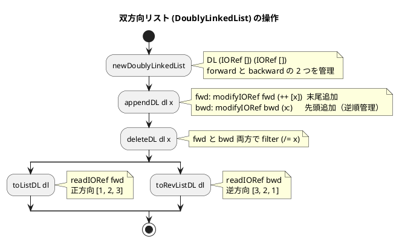

# 第 8 章 連結リスト

## はじめに

前章では文字列処理を学びました。この章では、データ構造の基本である「**連結リスト（Linked List）**」を TDD で実装します。

Haskell は純粋関数型言語であり、デフォルトでは不変（immutable）なデータ構造を扱います。Haskell の組み込みリスト型 `[a]` はすでに連結リストとして実装されています。しかし、Python や Java のような可変リストを模倣するには `IORef` を用いた可変参照が必要です。

この章では：
1. Haskell 組み込みリストと可変リストの違いを理解する
2. `IORef` を使った可変リストの実装を学ぶ
3. 単方向リスト（`LinkedList`）と双方向リスト（`DoublyLinkedList`）を TDD で実装する

### 目次

1. [リストとは](#リストとは)
2. [Haskell のリスト（不変リスト）](#haskell-のリスト不変リスト)
3. [IORef による可変リスト](#ioref-による可変リスト)
4. [単方向リスト（LinkedList）](#1-単方向リストlinkedlist)
5. [双方向リスト（DoublyLinkedList）](#2-双方向リストdoublylinkedlist)
6. [Python 版との比較](#python-版との比較)

---

## リストとは

リストとは、データを順序付けて格納するデータ構造です。配列と似ていますが、要素の追加・削除が容易であるという特徴があります。

リストには様々な種類があります：

- **単方向連結リスト**：各ノードが次のノードへのポインタを持つ
- **双方向連結リスト**：各ノードが前後のノードへのポインタを持つ
- **循環リスト**：最後のノードが最初のノードを指す

---

## Haskell のリスト（不変リスト）

Haskell の組み込みリスト `[a]` は**単方向連結リスト**として実装されており、`head`（先頭要素）と `tail`（残りのリスト）で構成されます。

### 不変リストの基本操作

```haskell
-- リストの定義
xs :: [Int]
xs = [1, 2, 3, 4, 5]

-- 先頭要素の取得
h :: Int
h = head xs  -- 1

-- 残りのリスト
t :: [Int]
t = tail xs  -- [2, 3, 4, 5]

-- 先頭への追加（O(1) — 非常に効率的）
ys :: [Int]
ys = 0 : xs  -- [0, 1, 2, 3, 4, 5]

-- 末尾への追加（O(n) — リストを辿る必要あり）
zs :: [Int]
zs = xs ++ [6]  -- [1, 2, 3, 4, 5, 6]
```

### 代数的データ型によるリストの定義

Haskell のリストは以下のように定義できます：

```haskell
-- Haskell のリストの本質
data List a = Nil | Cons a (List a)

-- 例: [1, 2, 3] の表現
example :: List Int
example = Cons 1 (Cons 2 (Cons 3 Nil))

-- パターンマッチで操作
myHead :: List a -> Maybe a
myHead Nil        = Nothing
myHead (Cons x _) = Just x

myTail :: List a -> List a
myTail Nil         = Nil
myTail (Cons _ xs) = xs
```

### 不変リストの特徴

| 操作 | 計算量 | 説明 |
|------|--------|------|
| 先頭への追加（`:` 演算子） | O(1) | 非常に高速 |
| 先頭要素の取得（`head`） | O(1) | 高速 |
| 末尾への追加（`++`） | O(n) | リスト全体を辿る |
| ランダムアクセス（`!!`） | O(n) | リストを辿る |
| 探索（`elem`） | O(n) | 線形探索 |

---

## IORef による可変リスト

Haskell では純粋な計算の中で状態を変更することはできません。しかし、`IO` モナドと `IORef` を使用することで、可変な参照を扱えます。

### IORef の基本

```haskell
import Data.IORef

-- IORef の作成
newIORef :: a -> IO (IORef a)

-- 値の読み取り
readIORef :: IORef a -> IO a

-- 値の書き込み
writeIORef :: IORef a -> a -> IO ()

-- 値の更新（readIORef + writeIORef の組み合わせ）
modifyIORef :: IORef a -> (a -> a) -> IO ()
```

### 簡単な例

```haskell
import Data.IORef

main :: IO ()
main = do
  -- カウンターを作成
  counter <- newIORef (0 :: Int)

  -- 値を増やす
  modifyIORef counter (+1)
  modifyIORef counter (+1)
  modifyIORef counter (+1)

  -- 値を読む
  val <- readIORef counter
  print val  -- 3
```

`IORef` を使うと Haskell でも命令的なスタイルで可変データを扱えます。連結リストの実装では、`IORef [a]`（リストへの可変参照）を使います。

---

## 1. 単方向リスト（LinkedList）

### Red — 失敗するテストを書く

```haskell
-- test/LinkedListsSpec.hs
module LinkedListsSpec (spec) where

import Test.Hspec
import LinkedLists

spec :: Spec
spec = do
  describe "LinkedList" $ do
    it "追加・削除・検索ができる" $ do
      ll <- newLinkedList
      appendLL ll 1
      appendLL ll 2
      appendLL ll 3
      toListLL ll `shouldReturn` [1, 2, 3]
      searchLL ll 2 `shouldReturn` True
      searchLL ll 4 `shouldReturn` False
      deleteLL ll 2
      toListLL ll `shouldReturn` [1, 3]

    it "先頭に追加できる" $ do
      ll <- newLinkedList
      prependLL ll 3
      prependLL ll 2
      prependLL ll 1
      toListLL ll `shouldReturn` [1, 2, 3]
```

このテストを実行すると、`LinkedList` が未定義のためコンパイルエラーになります。

### Green — テストを通す実装

```haskell
-- src/LinkedLists.hs
module LinkedLists
  ( LinkedList
  , newLinkedList
  , appendLL
  , prependLL
  , deleteLL
  , searchLL
  , toListLL
  , DoublyLinkedList
  , newDoublyLinkedList
  , appendDL
  , deleteDL
  , toListDL
  , toRevListDL
  ) where

import Data.IORef

-- ---------------------------------------------------------------------------
-- 単方向リスト（IORef + 不変リスト）
-- ---------------------------------------------------------------------------

newtype LinkedList a = LinkedList (IORef [a])

-- 空のリストを作成
newLinkedList :: IO (LinkedList a)
newLinkedList = LinkedList <$> newIORef []

-- 末尾に追加
appendLL :: LinkedList a -> a -> IO ()
appendLL (LinkedList ref) x = modifyIORef ref (++ [x])

-- 先頭に追加
prependLL :: LinkedList a -> a -> IO ()
prependLL (LinkedList ref) x = modifyIORef ref (x:)

-- 要素を削除
deleteLL :: Eq a => LinkedList a -> a -> IO ()
deleteLL (LinkedList ref) x = modifyIORef ref (filter (/= x))

-- 要素を検索
searchLL :: Eq a => LinkedList a -> a -> IO Bool
searchLL (LinkedList ref) x = elem x <$> readIORef ref

-- リストに変換
toListLL :: LinkedList a -> IO [a]
toListLL (LinkedList ref) = readIORef ref
```

### テストの実行

```bash
$ cabal test --test-show-details=streaming
...
  LinkedList
    追加・削除・検索ができる [OK]
    先頭に追加できる [OK]
```

### 解説

`LinkedList` の実装の核心：

**型の定義**：
```haskell
newtype LinkedList a = LinkedList (IORef [a])
```

`newtype` は単一フィールドのラッパー型です。`IORef [a]` は「`[a]` 型のリストへの可変参照」を意味します。

**各操作の解説**：

```haskell
-- 末尾追加: modifyIORef は f(現在値) で更新
appendLL (LinkedList ref) x = modifyIORef ref (++ [x])
-- (++ [x]) は \xs -> xs ++ [x] と同等（部分適用）

-- 先頭追加: (x:) は \xs -> x:xs と同等
prependLL (LinkedList ref) x = modifyIORef ref (x:)

-- 削除: filter (/= x) で x と等しくない要素だけ残す
deleteLL (LinkedList ref) x = modifyIORef ref (filter (/= x))

-- 検索: elem x でリストに x が含まれるか確認
searchLL (LinkedList ref) x = elem x <$> readIORef ref
-- <$> は fmap（IO モナド内で elem x を適用）
```

**IO モナドの `shouldReturn`**：

```haskell
toListLL ll `shouldReturn` [1, 2, 3]
-- shouldReturn は IO アクションの結果を検証する
-- shouldBe とは異なり IO を展開してから比較する
```

### アルゴリズムの可視化

```
appendLL ll 1 → [1]
appendLL ll 2 → [1, 2]
appendLL ll 3 → [1, 2, 3]
deleteLL ll 2 → filter (/= 2) [1, 2, 3] → [1, 3]

prependLL ll 3 → [3]
prependLL ll 2 → [2, 3]
prependLL ll 1 → [1, 2, 3]
```

### フローチャート



---

## 2. 双方向リスト（DoublyLinkedList）

双方向リストは、正方向と逆方向の両方の走査が可能なリストです。Haskell での実装では、forward リストと backward リスト（常に逆順）を 2 つの `IORef` で管理します。

### Red — 失敗するテストを書く

```haskell
describe "DoublyLinkedList" $ do
  it "追加・削除・双方向走査ができる" $ do
    dl <- newDoublyLinkedList
    appendDL dl 1
    appendDL dl 2
    appendDL dl 3
    toListDL dl `shouldReturn` [1, 2, 3]
    toRevListDL dl `shouldReturn` [3, 2, 1]
    deleteDL dl 2
    toListDL dl `shouldReturn` [1, 3]
```

### Green — テストを通す実装

```haskell
-- ---------------------------------------------------------------------------
-- 双方向リスト（IORef + forward/backward の2リストで管理）
-- ---------------------------------------------------------------------------

data DoublyLinkedList a = DL (IORef [a]) (IORef [a])
-- DL forward_ref backward_ref

-- 空の双方向リストを作成
newDoublyLinkedList :: IO (DoublyLinkedList a)
newDoublyLinkedList = DL <$> newIORef [] <*> newIORef []

-- 末尾に追加
appendDL :: DoublyLinkedList a -> a -> IO ()
appendDL (DL fwd bwd) x = do
  modifyIORef fwd (++ [x])  -- 正方向: 末尾に追加
  modifyIORef bwd (x:)      -- 逆方向: 先頭に追加（= 逆順の末尾）

-- 要素を削除
deleteDL :: Eq a => DoublyLinkedList a -> a -> IO ()
deleteDL (DL fwd bwd) x = do
  modifyIORef fwd (filter (/= x))
  modifyIORef bwd (filter (/= x))

-- 正方向リストを返す
toListDL :: DoublyLinkedList a -> IO [a]
toListDL (DL fwd _) = readIORef fwd

-- 逆方向リストを返す
toRevListDL :: DoublyLinkedList a -> IO [a]
toRevListDL (DL _ bwd) = readIORef bwd
```

### テストの実行

```bash
$ cabal test --test-show-details=streaming
...
  DoublyLinkedList
    追加・削除・双方向走査ができる [OK]
```

### 解説

`DoublyLinkedList` の実装の核心：

**型の定義**：
```haskell
data DoublyLinkedList a = DL (IORef [a]) (IORef [a])
```

2 つの `IORef [a]` を持ちます：
- 1 つ目（`fwd`）：正方向のリスト `[1, 2, 3]`
- 2 つ目（`bwd`）：逆方向のリスト `[3, 2, 1]`

**`<*>` 演算子（アプリカティブ）**：
```haskell
newDoublyLinkedList = DL <$> newIORef [] <*> newIORef []
-- DL <$> (IO (IORef [a])) <*> (IO (IORef [a]))
-- = IO (DoublyLinkedList a)
```

`<$>` と `<*>` を使って、2 つの IO アクションの結果を `DL` コンストラクタに適用しています。

**appendDL の動作**：
```
appendDL dl 1: fwd=[1], bwd=[1]
appendDL dl 2: fwd=[1,2], bwd=[2,1]
appendDL dl 3: fwd=[1,2,3], bwd=[3,2,1]

toListDL dl    -> [1, 2, 3]  (正方向)
toRevListDL dl -> [3, 2, 1]  (逆方向)
```

### アルゴリズムの可視化

```
状態: DL (IORef fwd) (IORef bwd)

初期: fwd=[], bwd=[]

appendDL dl 1:
  fwd: [] ++ [1] = [1]
  bwd: 1 : []   = [1]

appendDL dl 2:
  fwd: [1] ++ [2] = [1, 2]
  bwd: 2 : [1]   = [2, 1]

appendDL dl 3:
  fwd: [1, 2] ++ [3] = [1, 2, 3]
  bwd: 3 : [2, 1]   = [3, 2, 1]

deleteDL dl 2:
  fwd: filter (/= 2) [1, 2, 3] = [1, 3]
  bwd: filter (/= 2) [3, 2, 1] = [3, 1]
```

### フローチャート



---

## 全テスト実行結果

```bash
$ cabal test --test-show-details=streaming

  LinkedList
    追加・削除・検索ができる [OK]
    先頭に追加できる [OK]
  DoublyLinkedList
    追加・削除・双方向走査ができる [OK]

Finished in 0.0018 seconds
3 examples, 0 failures
```

---

## 計算量の比較

### 単方向リスト（LinkedList）

| 操作 | 計算量 | 備考 |
|------|--------|------|
| 末尾追加（appendLL） | O(n) | `++ [x]` でリスト全体を辿る |
| 先頭追加（prependLL） | O(1) | `(x:)` は高速 |
| 削除（deleteLL） | O(n) | `filter` でリスト全体を走査 |
| 探索（searchLL） | O(n) | `elem` で線形探索 |
| リスト変換（toListLL） | O(1) | IORef の読み取りのみ |

### 双方向リスト（DoublyLinkedList）

| 操作 | 計算量 | 備考 |
|------|--------|------|
| 末尾追加（appendDL） | O(n) | fwd の `++ [x]` が O(n) |
| 削除（deleteDL） | O(n) | fwd, bwd 両方で `filter` |
| 正方向取得（toListDL） | O(1) | IORef の読み取りのみ |
| 逆方向取得（toRevListDL） | O(1) | IORef の読み取りのみ（事前計算済み） |

---

## 配列 vs 連結リスト（Haskell の視点）

| 項目 | 配列（`Vector`/`Array`） | 不変リスト（`[a]`） | IORef リスト |
|------|-------------------------|---------------------|-------------|
| ランダムアクセス | O(1) | O(n) | O(n) |
| 先頭への挿入 | O(n) | O(1) | O(1) |
| 末尾への挿入 | O(1)（可変時） | O(n) | O(n) |
| メモリ使用 | 連続領域 | 不連続 | 不連続 |
| 不変性 | 可変/不変両方あり | 不変（純粋） | 可変（IO モナド） |
| パターンマッチ | 不可 | 可（`[]` と `(x:xs)`） | 不可 |

---

## Python 版との比較

| 概念 | Python | Haskell |
|------|--------|---------|
| デフォルトリスト | `list`（動的配列） | `[a]`（連結リスト、不変） |
| 可変リスト | `list` がデフォルトで可変 | `IORef [a]` で可変性を明示 |
| ノードクラス | `class _Node:` | `newtype LinkedList a = LinkedList (IORef [a])` |
| 双方向リスト | `class _DNode:` | `data DoublyLinkedList a = DL (IORef [a]) (IORef [a])` |
| 末尾追加 | `lst.append(x)` → O(1) | `appendLL ll x` → O(n) |
| 先頭追加 | `lst.insert(0, x)` → O(n) | `prependLL ll x` → O(1) |
| 削除 | `lst.remove(x)` | `deleteLL ll x` |
| 探索 | `x in lst` | `searchLL ll x` |
| 双方向走査 | `reversed(lst)` | `toRevListDL dl` |
| テスト | `assert lst == [1, 2, 3]` | `shouldReturn [1, 2, 3]` |
| 副作用の扱い | 暗黙的（メソッドが状態を変更） | 明示的（`IO ()` 型） |

### 重要な違い

**1. 副作用の明示性**

Python では `append` メソッドは暗黙的に状態を変更します：

```python
# Python: 副作用が暗黙的
lst = LinkedList()
lst.add_last(1)  # 内部状態を変更（型からは分からない）
```

Haskell では `IO ()` 型により副作用が明示されます：

```haskell
-- Haskell: 副作用が型に現れる
appendLL :: LinkedList a -> a -> IO ()
-- IO () は「IO アクション（副作用あり）」を意味する
```

**2. 不変リストと可変リスト**

```haskell
-- 不変リスト（純粋関数型）
prepend :: a -> [a] -> [a]
prepend x xs = x : xs  -- 新しいリストを返す（元は変更しない）

-- 可変リスト（IORef 使用）
prependLL :: LinkedList a -> a -> IO ()
prependLL (LinkedList ref) x = modifyIORef ref (x:)  -- 参照先を更新
```

**3. do 記法（モナド構文）**

```haskell
-- Haskell: do 記法で命令的スタイルに見える
main :: IO ()
main = do
  ll <- newLinkedList    -- IORef を作成
  appendLL ll 1           -- 末尾に追加
  appendLL ll 2
  xs <- toListLL ll       -- 読み取り
  print xs                -- [1, 2]
```

```python
# Python: 同等の命令的スタイル
ll = LinkedList()
ll.add_last(1)
ll.add_last(2)
print(list(ll))  # [1, 2]
```

---

## まとめ

この章では、Haskell における連結リストの実装について学びました：

1. **Haskell の不変リスト `[a]`** — 先頭追加が O(1) の連結リスト。パターンマッチが可能。
2. **`IORef` による可変リスト** — 純粋関数型言語で可変データを扱う仕組み
3. **単方向リスト（`LinkedList`）** — `IORef [a]` で実装。`IO` モナドで副作用を管理。
4. **双方向リスト（`DoublyLinkedList`）** — 正逆 2 つの `IORef [a]` で双方向走査を実現

Haskell の連結リスト実装の最大の特徴は、**副作用が型に現れる**ことです。`IO ()` 型を見れば「この関数は状態を変更する」と即座に分かります。これにより、コードの理解とデバッグが容易になります。

次の章では、木構造（Trees）について学びましょう。

## 参考文献

- 『アルゴリズムとデータ構造』 — 柴田望洋
- 『テスト駆動開発』 — Kent Beck
- 『Real World Haskell』 — Bryan O'Sullivan
- 『プログラミング Haskell』 — Graham Hutton
- Haskell 標準ライブラリ: [Data.IORef](https://hackage.haskell.org/package/base/docs/Data-IORef.html)
