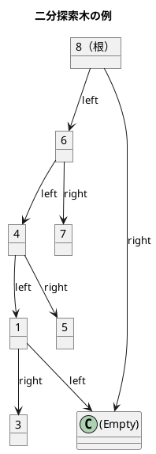
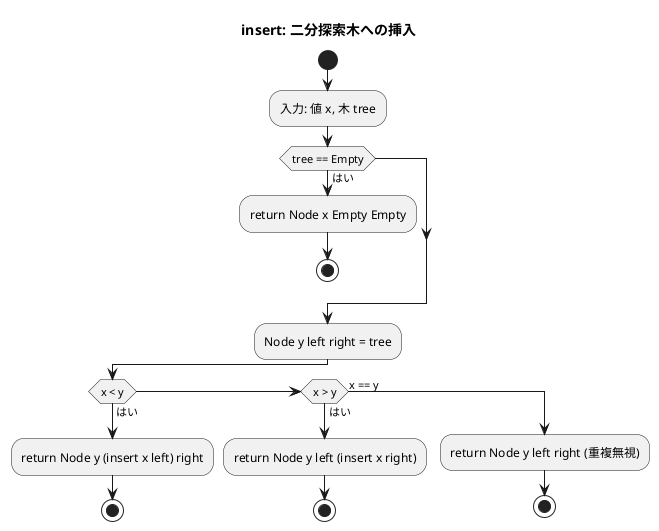
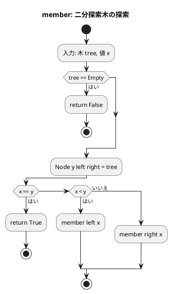
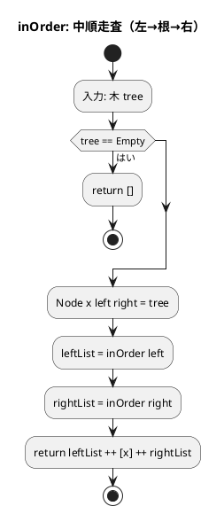
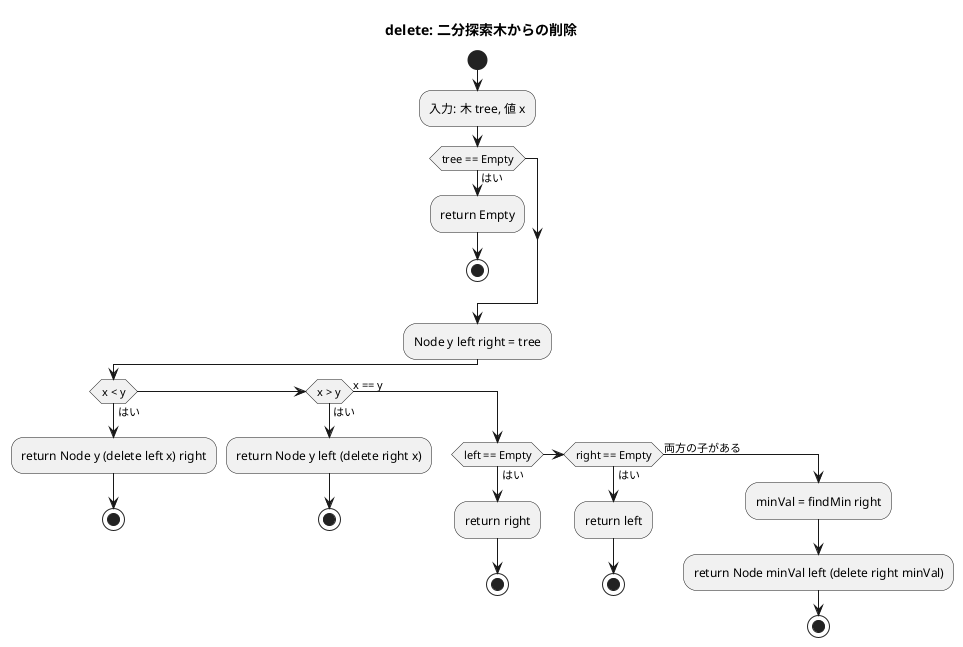

# 第 9 章 木構造

## はじめに

前章では連結リストを学びました。この章では、データ構造の中でも特に重要な「**木構造**」、特に**二分探索木（BST: Binary Search Tree）**を TDD で実装します。

Haskell では、代数的データ型（Algebraic Data Types, ADT）を使って木構造を非常にエレガントに表現できます。Python やオブジェクト指向言語では「クラスのインスタンスへのポインタ」で木を表現しますが、Haskell では `data BST a = Empty | Node a (BST a) (BST a)` という型定義一行で木の構造を完全に表現できます。

この章では：
1. 代数的データ型（ADT）による木の表現を理解する
2. パターンマッチングによる木の操作を学ぶ
3. 二分探索木の各操作を TDD で実装する

### 目次

1. [木構造とは](#木構造とは)
2. [代数的データ型による BST の表現](#代数的データ型による-bst-の表現)
3. [二分探索木の性質](#二分探索木の性質)
4. [挿入と探索](#1-挿入と探索)
5. [木の走査](#2-木の走査)
6. [最小値・最大値](#3-最小値最大値)
7. [ノードの削除](#4-ノードの削除)
8. [Python 版との比較](#python-版との比較)

---

## 木構造とは

木構造とは、データを階層的に表現するデータ構造です。以下の要素から構成されます：

- **ノード**：データを格納する要素
- **エッジ**：ノード間の関係を表す線
- **ルート**：木の最上位に位置するノード
- **子ノード**：あるノードの下位に位置するノード
- **葉ノード**：子ノードを持たないノード

### 木の走査方法

順序木を探索する方法には、主に 3 つがあります：

1. **前順（preorder）**：ノード自身 → 左部分木 → 右部分木
2. **中順（inorder）**：左部分木 → ノード自身 → 右部分木
3. **後順（postorder）**：左部分木 → 右部分木 → ノード自身

---

## 代数的データ型による BST の表現

Haskell の代数的データ型（ADT）は、複数の形状を持てるデータ型です。BST は「空」または「ノード」のどちらかです：

```haskell
-- 二分探索木の代数的データ型
data BST a = Empty | Node a (BST a) (BST a)
  deriving (Show, Eq)
```

この一行が表すもの：

| 構成要素 | 意味 |
|---------|------|
| `data BST a` | 型パラメータ `a` を持つ型 `BST` を定義 |
| `Empty` | 空の木（葉ノードの終端） |
| `Node a (BST a) (BST a)` | 値 `a` と左右の部分木を持つノード |
| `deriving (Show, Eq)` | 自動で `show` と `==` の実装を生成 |

### 木の可視化

```
BST Int の例: [5, 3, 7, 1, 4, 6, 8] を挿入後

        8
       / \
      6   (Empty)
     / \
    4   7
   / \
  1   5
 / \
(E) 3

-- Haskell の値として表現:
Node 8
  (Node 6
    (Node 4
      (Node 1 Empty (Node 3 Empty Empty))
      (Node 5 Empty Empty))
    (Node 7 Empty Empty))
  Empty
```

### ADT の利点

```haskell
-- パターンマッチングで安全に木を操作
example :: BST Int -> String
example Empty       = "空の木"
example (Node x _ _) = "ルートは " ++ show x

-- コンパイラが全ケースの処理を確認する
-- Empty を忘れるとコンパイラが警告を出す
```

---

## 二分探索木の性質



**性質**：
- 左部分木のすべてのキー < ルートのキー
- 右部分木のすべてのキー > ルートのキー
- 中順走査（left → root → right）は昇順になる

---

## 1. 挿入と探索

### Red — 失敗するテストを書く

```haskell
-- test/TreesSpec.hs
module TreesSpec (spec) where

import Test.Hspec
import Trees

spec :: Spec
spec = do
  describe "BinarySearchTree" $ do
    let bst = foldr insert empty [5, 3, 7, 1, 4, 6, 8]

    describe "insert / member" $ do
      it "要素を挿入して探索できる" $ do
        member bst 5 `shouldBe` True
        member bst 3 `shouldBe` True
        member bst 9 `shouldBe` False
        member empty 1 `shouldBe` False
```

このテストを実行すると、`BST`、`insert`、`member`、`empty` が未定義のためコンパイルエラーになります。

### Green — テストを通す実装

```haskell
-- src/Trees.hs
module Trees
  ( BST
  , empty
  , insert
  , member
  , inOrder
  , preOrder
  , postOrder
  , findMin
  , findMax
  , delete
  ) where

-- | 二分探索木の代数的データ型
data BST a = Empty | Node a (BST a) (BST a)
  deriving (Show, Eq)

-- | 空の BST
empty :: BST a
empty = Empty

-- | 要素を挿入する
insert :: Ord a => a -> BST a -> BST a
insert x Empty = Node x Empty Empty
insert x (Node y left right)
  | x < y    = Node y (insert x left) right
  | x > y    = Node y left (insert x right)
  | otherwise = Node y left right  -- 重複は無視

-- | 要素が含まれるか
member :: Ord a => BST a -> a -> Bool
member Empty _ = False
member (Node y left right) x
  | x == y   = True
  | x < y    = member left x
  | otherwise = member right x
```

### テストの実行

```bash
$ cabal test --test-show-details=streaming
...
  BinarySearchTree
    insert / member
      要素を挿入して探索できる [OK]
```

### 解説

**`insert` のパターンマッチ**：

```haskell
insert x Empty = Node x Empty Empty
-- 空の木に挿入 → 新しいノードを作成

insert x (Node y left right)
  | x < y    = Node y (insert x left) right   -- 左部分木に挿入
  | x > y    = Node y left (insert x right)   -- 右部分木に挿入
  | otherwise = Node y left right              -- 重複は無視
```

重要な点：Haskell の木は**不変**です。`insert` は元の木を変更せず、**新しい木を返します**。変更されたパスのみが再生成され、他の部分は共有されます（構造共有）。

**`member` のパターンマッチ**：

```haskell
member Empty _ = False
-- 空の木には何も含まれない

member (Node y left right) x
  | x == y   = True         -- 見つかった
  | x < y    = member left x  -- 左部分木を探索
  | otherwise = member right x -- 右部分木を探索
```

**型クラス制約 `Ord a`**：

```haskell
insert :: Ord a => a -> BST a -> BST a
member :: Ord a => BST a -> a -> Bool
```

`Ord a` は「型 `a` が比較可能（`<`、`>`、`==` が使える）」という制約です。これにより、`BST Int`、`BST String`、`BST Char` など様々な型の BST が使えます。

### `foldr` による木の構築

テストの `let bst = foldr insert empty [5, 3, 7, 1, 4, 6, 8]` について：

```haskell
-- foldr f z [a, b, c] = f a (f b (f c z))
-- foldr insert empty [5, 3, 7, 1, 4, 6, 8]
-- = insert 5 (insert 3 (insert 7 (insert 1 (insert 4 (insert 6 (insert 8 Empty))))))
```

右畳み込みにより、要素を右から左へ挿入します。

### フローチャート





---

## 2. 木の走査

### Red — 失敗するテストを書く

```haskell
describe "inOrder" $ do
  it "中順走査でソート済みリストを返す" $ do
    inOrder bst `shouldBe` [1, 3, 4, 5, 6, 7, 8]

describe "preOrder" $ do
  it "前順走査を返す" $ do
    preOrder bst `shouldBe` [8, 6, 4, 1, 3, 5, 7]

describe "postOrder" $ do
  it "後順走査を返す" $ do
    postOrder bst `shouldBe` [3, 1, 5, 4, 7, 6, 8]
```

### Green — テストを通す実装

```haskell
-- | 中順走査（昇順）: 左 → 根 → 右
inOrder :: BST a -> [a]
inOrder Empty               = []
inOrder (Node x left right) = inOrder left ++ [x] ++ inOrder right

-- | 前順走査: 根 → 左 → 右
preOrder :: BST a -> [a]
preOrder Empty               = []
preOrder (Node x left right) = [x] ++ preOrder left ++ preOrder right

-- | 後順走査: 左 → 右 → 根
postOrder :: BST a -> [a]
postOrder Empty               = []
postOrder (Node x left right) = postOrder left ++ postOrder right ++ [x]
```

### テストの実行

```bash
$ cabal test --test-show-details=streaming
...
  BinarySearchTree
    inOrder
      中順走査でソート済みリストを返す [OK]
    preOrder
      前順走査を返す [OK]
    postOrder
      後順走査を返す [OK]
```

### 解説

走査の実装は**再帰と構造的パターンマッチング**で非常に簡潔に表現されています：

**中順走査（inOrder）**：

```
inOrder (Node 8 (...) Empty)
= inOrder left ++ [8] ++ inOrder Empty
= inOrder left ++ [8] ++ []
= ...（左部分木を再帰的に展開）
= [1, 3, 4, 5, 6, 7] ++ [8]
= [1, 3, 4, 5, 6, 7, 8]
```

BST の性質により、中順走査は常に昇順のリストを返します。

### 走査方法の比較

| 走査 | 順序 | 用途 |
|------|------|------|
| 前順（preOrder） | 根→左→右 | ツリーのコピー、前置記法 |
| 中順（inOrder） | 左→根→右 | ソート済みリストの取得 |
| 後順（postOrder） | 左→右→根 | ツリーの削除、後置記法 |

### フローチャート



---

## 3. 最小値・最大値

### Red — 失敗するテストを書く

```haskell
describe "findMin / findMax" $ do
  it "最小値・最大値を返す" $ do
    findMin bst `shouldBe` Just 1
    findMax bst `shouldBe` Just 8
    findMin (empty :: BST Int) `shouldBe` Nothing
    findMax (empty :: BST Int) `shouldBe` Nothing
```

### Green — テストを通す実装

```haskell
-- | 最小値を返す
findMin :: BST a -> Maybe a
findMin Empty            = Nothing
findMin (Node x Empty _) = Just x     -- 左に子がなければここが最小
findMin (Node _ left _)  = findMin left  -- さらに左へ

-- | 最大値を返す
findMax :: BST a -> Maybe a
findMax Empty             = Nothing
findMax (Node x _ Empty)  = Just x     -- 右に子がなければここが最大
findMax (Node _ _ right)  = findMax right  -- さらに右へ
```

### テストの実行

```bash
$ cabal test --test-show-details=streaming
...
  BinarySearchTree
    findMin / findMax
      最小値・最大値を返す [OK]
```

### 解説

**`findMin` のパターンマッチ（3 ケース）**：

```haskell
findMin Empty            = Nothing   -- 空の木 → Nothing
findMin (Node x Empty _) = Just x    -- 左に子がない → このノードが最小
findMin (Node _ left _)  = findMin left -- 左に子がある → さらに左へ
```

BST の性質（左 < 根 < 右）により、最小値は常に最も左のノードにあります。

**`Maybe` 型による安全性**：

```haskell
-- 空の木でも安全に使える
findMin (empty :: BST Int)  -- Nothing（例外が発生しない）
findMax (empty :: BST Int)  -- Nothing

-- 値がある場合は Just で包まれる
findMin bst  -- Just 1
findMax bst  -- Just 8
```

**パターンマッチの「ワイルドカード `_`」**：

```haskell
findMin (Node x Empty _) = Just x
-- _ は右部分木を無視することを明示
-- これにより「左が空なら右は何でもよい」という意図が伝わる
```

---

## 4. ノードの削除

### Red — 失敗するテストを書く

```haskell
describe "delete" $ do
  it "要素を削除できる" $ do
    let bst2 = delete bst 3
    member bst2 3 `shouldBe` False
    inOrder bst2 `shouldBe` [1, 4, 5, 6, 7, 8]
    let bst3 = delete bst 5
    member bst3 5 `shouldBe` False
    inOrder bst3 `shouldBe` [1, 3, 4, 6, 7, 8]
```

### Green — テストを通す実装

```haskell
-- | 要素を削除する
delete :: Ord a => BST a -> a -> BST a
delete Empty _ = Empty
delete (Node y left right) x
  | x < y    = Node y (delete left x) right    -- 左部分木から削除
  | x > y    = Node y left (delete right x)    -- 右部分木から削除
  | otherwise = case (left, right) of
      (Empty, _) -> right   -- 左の子がない → 右の子で置き換え
      (_, Empty) -> left    -- 右の子がない → 左の子で置き換え
      _          -> let Just minVal = findMin right  -- 両方の子がある
                    in Node minVal left (delete right minVal)
                    -- 右部分木の最小値で置き換え、その最小値を右部分木から削除
```

### テストの実行

```bash
$ cabal test --test-show-details=streaming
...
  BinarySearchTree
    delete
      要素を削除できる [OK]
```

### 解説

削除は 3 つのケースに分かれます：

**ケース 1：葉ノード（子が 0 個）または左の子がない**
```
   5             5
  / \    →      / \
 3   7         (right) 7
(Empty)
```

**ケース 2：右の子がない**
```
   5             5
  / \    →      / \
 3   7         1   7
(Empty)
```

**ケース 3：両方の子がある（最も複雑）**

BST の性質を維持するため、**右部分木の最小値**（中順後継）で置き換えます：

```
削除前:          削除 3 後:
    8                8
   /                /
  6                6
 / \              / \
4   7            4   7
/\              /\
1  5            1  5
\               \
 3               (削除)

Node 4 の左の子 3 を削除:
  left=Node 1 Empty (Node 3 Empty Empty)
  right=Node 5 Empty Empty
  → findMin right = Just 5
  → Node 5 (Node 1 Empty Empty) (delete right_subtree 5)
  → Node 5 (Node 1 Empty Empty) Empty
```

**Haskell の不変性と削除**：

```haskell
-- 元の bst は変更されない
let bst2 = delete bst 3  -- 新しい木を作る
member bst 3   -- True（元は変わっていない）
member bst2 3  -- False（新しい木から削除済み）
```

### フローチャート



---

## 全テスト実行結果

```bash
$ cabal test --test-show-details=streaming

  BinarySearchTree
    insert / member
      要素を挿入して探索できる [OK]
    inOrder
      中順走査でソート済みリストを返す [OK]
    preOrder
      前順走査を返す [OK]
    postOrder
      後順走査を返す [OK]
    findMin / findMax
      最小値・最大値を返す [OK]
    delete
      要素を削除できる [OK]

Finished in 0.0024 seconds
6 examples, 0 failures
```

---

## 二分探索木の計算量

| 操作 | 平均 | 最悪（偏り木） |
|------|------|--------------|
| 探索（member） | O(log n) | O(n) |
| 挿入（insert） | O(log n) | O(n) |
| 削除（delete） | O(log n) | O(n) |
| 中順走査（inOrder） | O(n) | O(n) |

バランス木（AVL 木、赤黒木）を使うと最悪でも O(log n) を保証できます。

---

## Python 版との比較

| 概念 | Python | Haskell |
|------|--------|---------|
| ノードの型定義 | `class _BSTNode:` | `data BST a = Empty \| Node a (BST a) (BST a)` |
| 空の木 | `None`（根ノードが `None`） | `Empty`（ADT のコンストラクタ） |
| 挿入 | `def add(self, key, value)` メソッド | `insert :: Ord a => a -> BST a -> BST a` 関数 |
| 探索 | `def search(self, key)` メソッド | `member :: Ord a => BST a -> a -> Bool` 関数 |
| 中順走査 | `def dump(self)` → 副作用で表示 | `inOrder :: BST a -> [a]` → リストを返す |
| 最小値 | `def min_key(self)` | `findMin :: BST a -> Maybe a` |
| 最大値 | `def max_key(self)` | `findMax :: BST a -> Maybe a` |
| 削除 | `def remove(self, key)` → 可変 | `delete :: Ord a => BST a -> a -> BST a` → 不変 |
| 失敗の表現 | `return None` | `Nothing` |
| 成功の表現 | 値を直接返す | `Just value` |
| 型安全性 | 型ヒント（オプション） | コンパイル時に強制 |

### 重要な違い

**1. 不変性（Immutability）**

Python の BST は可変オブジェクトです：
```python
# Python: 木を直接変更する
bst = BinarySearchTree()
bst.insert(5)  # self.root を変更
bst.delete(5)  # ノードのポインタを書き換え
```

Haskell の BST は不変です：
```haskell
-- Haskell: 常に新しい木を返す
bst  = foldr insert empty [5, 3, 7]
bst2 = delete bst 3   -- bst は変更されない
-- bst  にはまだ 3 が含まれる
-- bst2 には 3 が含まれない
```

**2. パターンマッチングの表現力**

Python では `if node is None` などの条件分岐が必要ですが、Haskell ではパターンマッチで構造を直接分解できます：

```haskell
-- Haskell: 構造を直接分解
findMin Empty            = Nothing
findMin (Node x Empty _) = Just x
findMin (Node _ left _)  = findMin left
```

```python
# Python: 条件分岐が必要
def min_key(self):
    if self.root is None:
        return None
    p = self.root
    while p.left is not None:
        p = p.left
    return p.key
```

**3. 型パラメータと型クラス**

```haskell
-- Haskell: 任意の Ord 型で BST が使える
bstInt    :: BST Int
bstInt    = foldr insert empty [3, 1, 4, 1, 5, 9, 2, 6]

bstString :: BST String
bstString = foldr insert empty ["banana", "apple", "cherry"]

-- 型クラス制約が安全性を保証
member bstInt 3    -- True
member bstString "apple"  -- True
```

```python
# Python: 型安全性は型ヒントのみ（ランタイムチェックなし）
class BinarySearchTree:
    def insert(self, key: Any) -> None: ...
```

**4. `Maybe` vs `None`**

```haskell
-- Haskell: Maybe で「失敗」を型で表現
case findMin bst of
  Nothing -> putStrLn "空の木です"
  Just x  -> putStrLn $ "最小値: " ++ show x

-- findMin の戻り値を必ず処理しないとコンパイルエラー
-- （パターンマッチの網羅性チェック）
```

```python
# Python: None チェックを忘れがち
min_val = bst.min_key()
# min_val が None のまま使うと AttributeError
print(f"最小値: {min_val}")  # None かもしれない
```

---

## ヒープ（参考）

Python 版では `heapq` モジュールを使った最小ヒープを扱いましたが、Haskell にも同様の機能があります。

### Data.Set（バランス木）

Haskell 標準ライブラリの `Data.Set` は **赤黒木**（自己平衡 BST）として実装されており、最悪でも O(log n) を保証します：

```haskell
import qualified Data.Set as Set

-- Set は BST の最適化版（自己平衡）
s :: Set.Set Int
s = Set.fromList [5, 3, 7, 1, 4, 6, 8]

-- O(log n) で要素の確認
member5 :: Bool
member5 = Set.member 5 s  -- True

-- ソート済みリストに変換
sorted :: [Int]
sorted = Set.toList s  -- [1, 3, 4, 5, 6, 7, 8]
```

### Data.Map（連想配列、BST ベース）

```haskell
import qualified Data.Map.Strict as Map

-- キーと値のペアを管理する BST
m :: Map.Map String Int
m = Map.fromList [("alice", 30), ("bob", 25), ("charlie", 35)]

-- O(log n) で値を取得
age :: Maybe Int
age = Map.lookup "alice" m  -- Just 30
```

### 優先度キュー（最小ヒープ）

```haskell
-- Data.PSQueue や heaps パッケージが使える
-- または Data.Set で代用可能
import qualified Data.Set as Set

-- 最小値の取得: O(log n)
minVal :: Maybe Int
minVal = Set.lookupMin s  -- Just 1
```

---

## まとめ

この章では、Haskell における木構造の実装について学びました：

1. **代数的データ型（ADT）**：
   - `data BST a = Empty | Node a (BST a) (BST a)`
   - 木の構造を型で完全に表現
   - コンパイラが全ケースの処理を確認

2. **パターンマッチング**：
   - 木の操作を宣言的に記述
   - 再帰と組み合わせて簡潔な実装

3. **不変性**：
   - `insert`、`delete` は新しい木を返す
   - 構造共有によりメモリ効率を維持

4. **型クラス `Ord a`**：
   - 比較可能な任意の型で BST が使える
   - 型安全性をコンパイル時に保証

5. **`Maybe` 型**：
   - `findMin`、`findMax` の失敗を安全に表現
   - `Nothing` と `Just` によるパターンマッチ

Haskell の BST 実装の最大の特徴は、**代数的データ型とパターンマッチング**の組み合わせにより、木の操作が数学的な定義に近い形で記述できることです。

## 参考文献

- 『アルゴリズムとデータ構造』 — 柴田望洋
- 『テスト駆動開発』 — Kent Beck
- 『Real World Haskell』 — Bryan O'Sullivan
- 『プログラミング Haskell』 — Graham Hutton
- Haskell 標準ライブラリ: [Data.Set](https://hackage.haskell.org/package/containers/docs/Data-Set.html)
- Haskell 標準ライブラリ: [Data.Map.Strict](https://hackage.haskell.org/package/containers/docs/Data-Map-Strict.html)
