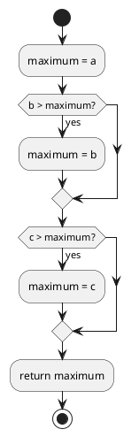
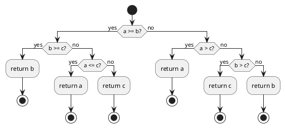
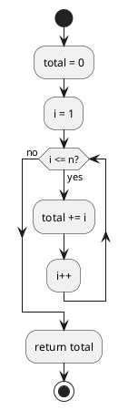
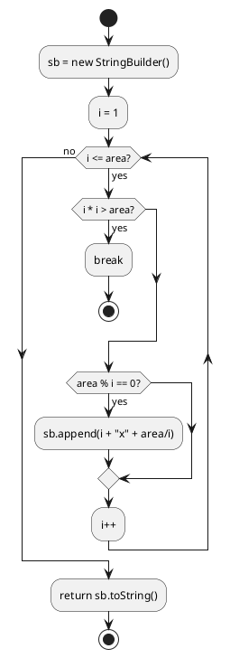

# 第 1 章 基本的なアルゴリズム

## はじめに

プログラミングを学ぶ上で、アルゴリズムの理解は非常に重要です。アルゴリズムとは、問題を解決するための手順や方法のことです。この章では、Java を使って基本的なアルゴリズムを学びながら、テスト駆動開発（TDD）の手法を用いて実装していきます。

テスト駆動開発とは、コードを書く前にまずテストを書き、そのテストが通るようにコードを実装していく開発手法です。Red-Green-Refactor というサイクルを繰り返しながら、確実に動作するコードを段階的に作り上げます。

- **Red**: 失敗するテストを書く
- **Green**: テストを通す最小のコードを書く
- **Refactor**: コードの設計を改善する

## 準備

### 環境構築

```bash
# Nix 環境に入る（Java + Gradle が利用可能になる）
nix develop .#java

# プロジェクトディレクトリへ移動
cd apps/java

# テスト実行
./gradlew test
```

### プロジェクト構成

```
apps/java/
├── build.gradle                          # ビルド設定
├── src/
│   ├── main/java/algorithm/
│   │   └── BasicAlgorithms.java          # 実装ファイル
│   └── test/java/algorithm/
│       └── BasicAlgorithmsTest.java      # テストファイル
```

### テスト実行コマンド

```bash
# 全テスト実行
./gradlew test

# 特定テストクラスのみ実行
./gradlew test --tests "algorithm.BasicAlgorithmsTest"

# テスト結果の詳細表示
./gradlew test --info
```

---

## 1. アルゴリズムとは

アルゴリズムとは、問題を解決するための明確な手順のことです。コンピュータプログラムは、アルゴリズムを実行可能な形で表現したものと言えます。

良いアルゴリズムは以下の特徴を持ちます:

- 入力と出力が明確である
- 各ステップが明確である
- 有限のステップで終了する
- 効率的である

---

## 2. 3 値の最大値

3 つの整数値の中から最大値を求めるアルゴリズムを TDD で実装します。

### Red -- 失敗するテストを書く

まず、3 値の最大値を求める `max3` メソッドのテストを書きます。まだ実装がないため、コンパイルエラー（Red）になります。

```java
// src/test/java/algorithm/BasicAlgorithmsTest.java
package algorithm;

import org.junit.jupiter.api.Nested;
import org.junit.jupiter.api.Test;

import static org.junit.jupiter.api.Assertions.*;

class BasicAlgorithmsTest {

    @Nested
    class Max3Test {
        @Test
        void 各パターンで最大値を返す() {
            int[][] cases = {
                {3, 2, 1, 3}, {3, 2, 2, 3}, {3, 1, 2, 3},
                {3, 2, 3, 3}, {2, 1, 3, 3}, {3, 3, 2, 3},
                {3, 3, 3, 3}, {2, 2, 3, 3}, {2, 3, 1, 3},
                {2, 3, 2, 3}, {1, 3, 2, 3}, {2, 3, 3, 3},
                {1, 2, 3, 3},
            };
            for (int[] c : cases) {
                assertEquals(c[3], BasicAlgorithms.max3(c[0], c[1], c[2]),
                    String.format("max3(%d, %d, %d) should be %d", c[0], c[1], c[2], c[3]));
            }
        }
    }
}
```

テストでは 13 パターンの入力を網羅的にテストしています。3 つの値の大小関係の全パターンを確認することで、if 文の分岐漏れを防ぎます。

### Green -- テストを通す最小のコードを書く

```java
// src/main/java/algorithm/BasicAlgorithms.java
package algorithm;

public class BasicAlgorithms {

    /** 3つの整数値の最大値を返す */
    public static int max3(int a, int b, int c) {
        int maximum = a;
        if (b > maximum) maximum = b;
        if (c > maximum) maximum = c;
        return maximum;
    }
}
```

`maximum` 変数を使って順番に比較することで、シンプルかつ正確に最大値を求められます。

### フローチャート



---

## 3. 3 値の中央値

3 つの整数値の中央値（2 番目に大きい値）を求めるアルゴリズムを実装します。

### Red -- 失敗するテストを書く

```java
@Nested
class Med3Test {
    @Test
    void 各パターンで中央値を返す() {
        int[][] cases = {
            {3, 2, 1, 2}, {3, 2, 2, 2}, {3, 1, 2, 2},
            {3, 2, 3, 3}, {2, 1, 3, 2}, {3, 3, 2, 3},
            {3, 3, 3, 3}, {2, 2, 3, 2}, {2, 3, 1, 2},
            {2, 3, 2, 2}, {1, 3, 2, 2}, {2, 3, 3, 3},
            {1, 2, 3, 2},
        };
        for (int[] c : cases) {
            assertEquals(c[3], BasicAlgorithms.med3(c[0], c[1], c[2]),
                String.format("med3(%d, %d, %d) should be %d", c[0], c[1], c[2], c[3]));
        }
    }
}
```

中央値は最大値より複雑な条件分岐が必要です。max3 と同様に全パターンを網羅的にテストします。

### Green -- テストを通す最小のコードを書く

```java
/** 3つの整数値の中央値を返す */
public static int med3(int a, int b, int c) {
    if (a >= b) {
        if (b >= c) return b;
        else if (a <= c) return a;
        else return c;
    } else if (a > c) {
        return a;
    } else if (b > c) {
        return c;
    } else {
        return b;
    }
}
```

条件分岐のネストが深くなりますが、各分岐が明確に 1 つのケースを扱っています。

### フローチャート



---

## 4. 条件判定と分岐

整数値の符号（正・負・ゼロ）を判定するアルゴリズムを実装します。

### Red -- 失敗するテストを書く

```java
@Nested
class JudgeSignTest {
    @Test
    void 正の値() {
        assertEquals("その値は正です。", BasicAlgorithms.judgeSign(17));
    }

    @Test
    void 負の値() {
        assertEquals("その値は負です。", BasicAlgorithms.judgeSign(-5));
    }

    @Test
    void ゼロ() {
        assertEquals("その値は0です。", BasicAlgorithms.judgeSign(0));
    }
}
```

3 つの分岐（正・負・ゼロ）をそれぞれ独立したテストメソッドで検証します。テスト名を日本語にすることで、テスト結果がそのまま仕様書として読めます。

### Green -- テストを通す最小のコードを書く

```java
/** 整数値の符号を判定する */
public static String judgeSign(int n) {
    if (n > 0) return "その値は正です。";
    else if (n < 0) return "その値は負です。";
    else return "その値は0です。";
}
```

if-else if-else のチェインで 3 分岐を処理します。早期 return により、ネストを浅く保っています。

---

## 5. 繰り返し処理（while 文と for 文）

1 から n までの総和を求めるアルゴリズムを、while 文と for 文の 2 通りで実装します。

### Red -- 失敗するテストを書く

```java
@Nested
class Sum1ToNTest {
    @Test
    void while文で総和() {
        assertEquals(15, BasicAlgorithms.sum1ToNWhile(5));
    }

    @Test
    void for文で総和() {
        assertEquals(15, BasicAlgorithms.sum1ToNFor(5));
    }
}
```

1 + 2 + 3 + 4 + 5 = 15 という分かりやすいケースでテストします。while 文と for 文の両方が同じ結果を返すことを確認します。

### Green -- テストを通す最小のコードを書く

```java
/** while 文で 1 から n までの総和を求める */
public static int sum1ToNWhile(int n) {
    int total = 0;
    int i = 1;
    while (i <= n) {
        total += i;
        i++;
    }
    return total;
}

/** for 文で 1 から n までの総和を求める */
public static int sum1ToNFor(int n) {
    int total = 0;
    for (int i = 1; i <= n; i++) {
        total += i;
    }
    return total;
}
```

while 文ではカウンタ変数 `i` の初期化・条件判定・更新を別々に記述します。for 文ではそれらを 1 行にまとめることで、繰り返し構造がより明確になります。

### フローチャート（while 文）



---

## 6. 記号文字の交互表示

`+` と `-` を交互に表示する文字列を生成するアルゴリズムを 2 通りの方法で実装します。

### Red -- 失敗するテストを書く

```java
@Nested
class AlternativeTest {
    @Test
    void 剰余判定方式で12文字() {
        assertEquals("+-+-+-+-+-+-", BasicAlgorithms.alternative1(12));
    }

    @Test
    void パターン繰り返し方式で12文字() {
        assertEquals("+-+-+-+-+-+-", BasicAlgorithms.alternative2(12));
    }

    @Test
    void 奇数文字() {
        assertEquals("+-+-+", BasicAlgorithms.alternative1(5));
        assertEquals("+-+-+", BasicAlgorithms.alternative2(5));
    }
}
```

偶数長と奇数長の両方をテストすることで、境界条件を確認しています。

### Green -- テストを通す最小のコードを書く

```java
/** 記号文字 '+' と '-' を交互に表示する（剰余判定方式） */
public static String alternative1(int n) {
    StringBuilder sb = new StringBuilder();
    for (int i = 0; i < n; i++) {
        sb.append(i % 2 != 0 ? '-' : '+');
    }
    return sb.toString();
}

/** 記号文字 '+' と '-' を交互に表示する（パターン繰り返し方式） */
public static String alternative2(int n) {
    StringBuilder sb = new StringBuilder();
    for (int i = 0; i < n / 2; i++) {
        sb.append("+-");
    }
    if (n % 2 != 0) sb.append('+');
    return sb.toString();
}
```

方式 1 は各文字ごとに剰余で判定します。方式 2 は `"+-"` をペアで追加し、奇数の場合に最後の `+` を補完します。Java では `StringBuilder` を使うことで文字列連結のパフォーマンスを確保します。

---

## 7. 面積と長方形の組み合わせ

縦横が整数で面積が指定値となる長方形の辺の長さを列挙します。

### Red -- 失敗するテストを書く

```java
@Nested
class RectangleTest {
    @Test
    void 面積32の長方形() {
        assertEquals("1x32 2x16 4x8 ", BasicAlgorithms.rectangle(32));
    }
}
```

面積 32 の場合、(1,32), (2,16), (4,8) の 3 組が列挙されることを確認します。

### Green -- テストを通す最小のコードを書く

```java
/** 縦横が整数で面積が area の長方形の辺の長さを列挙する */
public static String rectangle(int area) {
    StringBuilder sb = new StringBuilder();
    for (int i = 1; i <= area; i++) {
        if ((long) i * i > area) break;
        if (area % i != 0) continue;
        sb.append(i).append("x").append(area / i).append(" ");
    }
    return sb.toString();
}
```

`i * i > area` で探索を打ち切ることにより、重複する組み合わせを除外しています。`(long)` にキャストしてオーバーフローを防いでいる点も注意です。

### フローチャート



---

## 8. 九九の表

九九の掛け算表を文字列として生成するアルゴリズムを実装します。

### Red -- 失敗するテストを書く

```java
@Nested
class MultiplicationTableTest {
    @Test
    void 九九の表() {
        String expected =
            "---------------------------\n" +
            "  1  2  3  4  5  6  7  8  9\n" +
            "  2  4  6  8 10 12 14 16 18\n" +
            "  3  6  9 12 15 18 21 24 27\n" +
            "  4  8 12 16 20 24 28 32 36\n" +
            "  5 10 15 20 25 30 35 40 45\n" +
            "  6 12 18 24 30 36 42 48 54\n" +
            "  7 14 21 28 35 42 49 56 63\n" +
            "  8 16 24 32 40 48 56 64 72\n" +
            "  9 18 27 36 45 54 63 72 81\n" +
            "---------------------------";
        assertEquals(expected, BasicAlgorithms.multiplicationTable());
    }
}
```

出力フォーマットを厳密にテストしています。`String.format("%3d", ...)` で 3 桁右寄せの書式を期待します。

### Green -- テストを通す最小のコードを書く

```java
/** 九九の表を返す */
public static String multiplicationTable() {
    StringBuilder sb = new StringBuilder();
    sb.append("-".repeat(27)).append("\n");
    for (int i = 1; i <= 9; i++) {
        for (int j = 1; j <= 9; j++) {
            sb.append(String.format("%3d", i * j));
        }
        sb.append("\n");
    }
    sb.append("-".repeat(27));
    return sb.toString();
}
```

二重ループで 9x9 の表を生成します。`String.format("%3d", ...)` は Python の `f"{value:3d}"` に相当し、3 桁右寄せでフォーマットします。`"-".repeat(27)` は Java 11 以降で利用可能です。

---

## 9. 直角三角形

左下側が直角の二等辺三角形をアスタリスクで描画するアルゴリズムを実装します。

### Red -- 失敗するテストを書く

```java
@Nested
class TriangleLbTest {
    @Test
    void 直角三角形() {
        String expected = "*\n**\n***\n****\n*****\n";
        assertEquals(expected, BasicAlgorithms.triangleLb(5));
    }
}
```

5 段の直角三角形を生成し、各行のアスタリスク数が 1, 2, 3, 4, 5 であることを検証します。

### Green -- テストを通す最小のコードを書く

```java
/** 左下側が直角の二等辺三角形を返す */
public static String triangleLb(int n) {
    StringBuilder sb = new StringBuilder();
    for (int i = 0; i < n; i++) {
        sb.append("*".repeat(i + 1)).append("\n");
    }
    return sb.toString();
}
```

`"*".repeat(i + 1)` で各行に必要な数のアスタリスクを生成します。Python の `"*" * (i + 1)` に相当する表現です。

---

## Python との比較表

| 項目 | Java | Python |
|:---|:---|:---|
| テストフレームワーク | JUnit 5 (`@Nested`, `@Test`) | pytest (`class Test...`, `def test_...`) |
| アサーション | `assertEquals(expected, actual)` | `assert actual == expected` |
| 文字列連結 | `StringBuilder` | `+` 演算子 / f-string |
| 文字列フォーマット | `String.format("%3d", n)` | `f"{n:3d}"` |
| 文字列の繰り返し | `"*".repeat(n)` (Java 11+) | `"*" * n` |
| 型宣言 | `int`, `String` 等の明示的型宣言 | 型宣言不要（動的型付け） |
| メソッド定義 | `public static int max3(int a, int b, int c)` | `def max3(a, b, c):` |
| エントリポイント | `public static void main(String[] args)` | `if __name__ == "__main__":` |
| パラメタライズドテスト | 配列 + ループ / `@ParameterizedTest` | `@pytest.mark.parametrize` |

---

## テスト実行結果

```
BasicAlgorithmsTest > Max3Test > 各パターンで最大値を返す PASSED
BasicAlgorithmsTest > Med3Test > 各パターンで中央値を返す PASSED
BasicAlgorithmsTest > JudgeSignTest > 正の値 PASSED
BasicAlgorithmsTest > JudgeSignTest > 負の値 PASSED
BasicAlgorithmsTest > JudgeSignTest > ゼロ PASSED
BasicAlgorithmsTest > Sum1ToNTest > while文で総和 PASSED
BasicAlgorithmsTest > Sum1ToNTest > for文で総和 PASSED
BasicAlgorithmsTest > AlternativeTest > 剰余判定方式で12文字 PASSED
BasicAlgorithmsTest > AlternativeTest > パターン繰り返し方式で12文字 PASSED
BasicAlgorithmsTest > AlternativeTest > 奇数文字 PASSED
BasicAlgorithmsTest > RectangleTest > 面積32の長方形 PASSED
BasicAlgorithmsTest > MultiplicationTableTest > 九九の表 PASSED
BasicAlgorithmsTest > TriangleLbTest > 直角三角形 PASSED

BUILD SUCCESSFUL
13 tests completed, 0 failed
```
