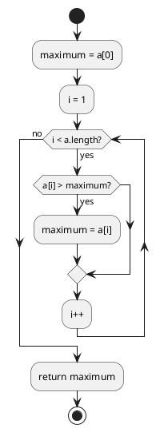
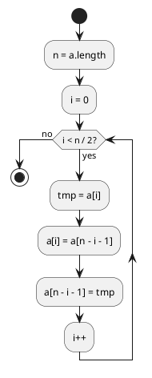
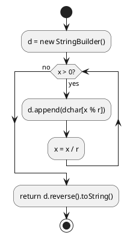
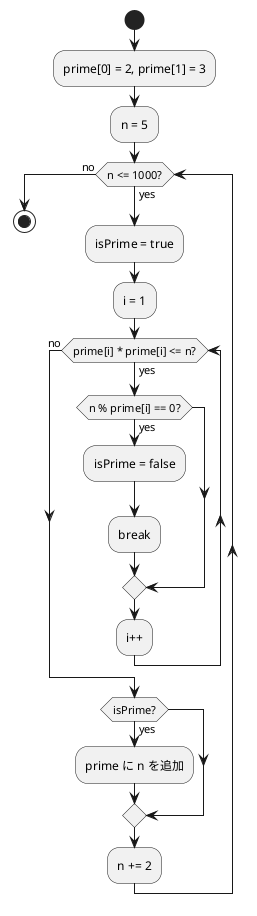

# 第 2 章 配列

## はじめに

配列はデータを連続した領域に格納するもっとも基本的なデータ構造です。この章では配列を使った基本的なアルゴリズム -- 最大値の探索、配列の反転、基数変換、素数の列挙 -- を TDD で実装します。

配列操作はすべてのアルゴリズムの基礎となるため、ここで確実に理解しておきましょう。

## 準備

### Java の配列の基本

Java の配列は固定長で、宣言時にサイズが決定します。Python のリストとは異なり、後からサイズを変更することはできません。

```java
// 配列の宣言と初期化
int[] a = new int[5];           // サイズ5の配列（0で初期化）
int[] b = {1, 2, 3, 4, 5};     // 初期値を指定
int[] c = new int[]{10, 20};    // new と初期値の組み合わせ

// 配列の長さ
int len = a.length;              // 5

// 配列のコピー
int[] copy = a.clone();          // 浅いコピー
int[] copy2 = Arrays.copyOf(a, a.length); // Arrays ユーティリティ

// 配列の部分コピー
int[] sub = Arrays.copyOfRange(b, 1, 4); // {2, 3, 4}
```

### プロジェクト構成

```
apps/java/src/
├── main/java/algorithm/
│   └── ArrayAlgorithms.java          # 実装ファイル
└── test/java/algorithm/
    └── ArrayAlgorithmsTest.java      # テストファイル
```

---

## 1. 配列の最大値

配列の全要素をスキャンして最大値を求めるアルゴリズムを実装します。

### Red -- 失敗するテストを書く

```java
// src/test/java/algorithm/ArrayAlgorithmsTest.java
package algorithm;

import org.junit.jupiter.api.Nested;
import org.junit.jupiter.api.Test;

import static org.junit.jupiter.api.Assertions.*;

class ArrayAlgorithmsTest {

    @Nested
    class MaxOfTest {
        @Test
        void 複数要素の最大値() {
            assertEquals(192, ArrayAlgorithms.maxOf(new int[]{172, 153, 192, 140, 165}));
        }

        @Test
        void 単一要素() {
            assertEquals(42, ArrayAlgorithms.maxOf(new int[]{42}));
        }

        @Test
        void 全て同じ値() {
            assertEquals(5, ArrayAlgorithms.maxOf(new int[]{5, 5, 5}));
        }
    }
}
```

3 つのテストケースで境界条件を網羅しています。

- 通常のケース（複数要素）
- 境界ケース（単一要素）
- 特殊ケース（全要素が同じ値）

### Green -- テストを通す最小のコードを書く

```java
// src/main/java/algorithm/ArrayAlgorithms.java
package algorithm;

public class ArrayAlgorithms {

    /** 配列の要素の最大値を返す */
    public static int maxOf(int[] a) {
        int maximum = a[0];
        for (int i = 1; i < a.length; i++) {
            if (a[i] > maximum) maximum = a[i];
        }
        return maximum;
    }
}
```

先頭要素を初期値として、残りの要素を順に比較していきます。計算量は O(n) です。

### フローチャート



---

## 2. 配列の反転

配列の要素の並びを反転するアルゴリズムを実装します。先頭と末尾の要素を交換しながら中央に向かって進みます。

### Red -- 失敗するテストを書く

```java
@Nested
class ReverseArrayTest {
    @Test
    void 奇数長の配列を反転() {
        int[] a = {2, 5, 1, 3, 9, 6, 7};
        ArrayAlgorithms.reverse(a);
        assertArrayEquals(new int[]{7, 6, 9, 3, 1, 5, 2}, a);
    }

    @Test
    void 偶数長の配列を反転() {
        int[] a = {1, 2, 3, 4};
        ArrayAlgorithms.reverse(a);
        assertArrayEquals(new int[]{4, 3, 2, 1}, a);
    }

    @Test
    void 単一要素() {
        int[] a = {42};
        ArrayAlgorithms.reverse(a);
        assertArrayEquals(new int[]{42}, a);
    }
}
```

奇数長・偶数長・単一要素の 3 パターンをテストします。奇数長では中央の要素が動かないことを確認しています。`assertArrayEquals` は Java 配列の全要素を比較するアサーションです。

### Green -- テストを通す最小のコードを書く

```java
/** 配列の要素の並びを反転する */
public static void reverse(int[] a) {
    int n = a.length;
    for (int i = 0; i < n / 2; i++) {
        int tmp = a[i];
        a[i] = a[n - i - 1];
        a[n - i - 1] = tmp;
    }
}
```

`n / 2` 回のスワップで反転が完了します。追加メモリは `tmp` 変数のみで O(1) です。

### フローチャート



---

## 3. 基数変換

10 進数の整数値を任意の基数（2進数、8進数、16進数など）に変換するアルゴリズムを実装します。

### Red -- 失敗するテストを書く

```java
@Nested
class CardConvTest {
    @Test
    void 二進数変換() {
        assertEquals("11101", ArrayAlgorithms.cardConv(29, 2));
    }

    @Test
    void 八進数変換() {
        assertEquals("35", ArrayAlgorithms.cardConv(29, 8));
    }

    @Test
    void 十六進数変換() {
        assertEquals("FF", ArrayAlgorithms.cardConv(255, 16));
    }
}
```

3 つの代表的な基数でテストします。16 進数では `A`-`F` の大文字表記を確認しています。

### Green -- テストを通す最小のコードを書く

```java
/** 整数値 x を r 進数に変換した文字列を返す */
public static String cardConv(int x, int r) {
    String dchar = "0123456789ABCDEFGHIJKLMNOPQRSTUVWXYZ";
    StringBuilder d = new StringBuilder();
    while (x > 0) {
        d.append(dchar.charAt(x % r));
        x /= r;
    }
    return d.reverse().toString();
}
```

`x % r` で各桁の値を求め、`dchar` 文字列から対応する文字を取得します。結果は下の桁から順に追加されるため、最後に `reverse()` で反転します。

基数変換の例（29 を 2 進数に変換）:

| ステップ | x | x % 2 | 対応文字 |
|:---|:---|:---|:---|
| 1 | 29 | 1 | "1" |
| 2 | 14 | 0 | "0" |
| 3 | 7 | 1 | "1" |
| 4 | 3 | 1 | "1" |
| 5 | 1 | 1 | "1" |

結果: "10111" → reverse → "11101"

### フローチャート



---

## 4. 素数の列挙

n 以下のすべての素数を列挙するアルゴリズムを 3 つのバージョンで実装します。各バージョンで除算回数を比較することで、アルゴリズムの効率改善を学びます。

### Red -- 失敗するテストを書く

```java
@Nested
class PrimeTest {
    @Test
    void 素数列挙第1版の除算回数() {
        assertEquals(78022, ArrayAlgorithms.prime1(1000));
    }

    @Test
    void 素数列挙第2版の除算回数() {
        assertEquals(14622, ArrayAlgorithms.prime2(1000));
    }

    @Test
    void 素数列挙第3版の除算回数() {
        assertEquals(3774, ArrayAlgorithms.prime3(1000));
    }
}
```

3 つのバージョンそれぞれの除算回数をテストします。バージョンが上がるにつれて除算回数が大幅に減少していることが分かります。

- 第 1 版: 78,022 回
- 第 2 版: 14,622 回（約 81% 削減）
- 第 3 版: 3,774 回（約 95% 削減）

### Green -- テストを通す最小のコードを書く

#### 第 1 版: 素朴な方法

```java
/** x 以下の素数を列挙する（第1版）-- 除算回数を返す */
public static int prime1(int x) {
    int counter = 0;
    for (int n = 2; n <= x; n++) {
        for (int i = 2; i < n; i++) {
            counter++;
            if (n % i == 0) break;
        }
    }
    return counter;
}
```

各数 n について 2 から n-1 までのすべての数で割って素数判定します。もっとも非効率な方法です。

#### 第 2 版: 既知の素数のみで判定

```java
/** x 以下の素数を列挙する（第2版）-- 除算回数を返す */
public static int prime2(int x) {
    int counter = 0;
    int ptr = 0;
    int[] prime = new int[500];
    prime[ptr++] = 2;

    outer:
    for (int n = 3; n <= x; n += 2) {
        for (int i = 1; i < ptr; i++) {
            counter++;
            if (n % prime[i] == 0) continue outer;
        }
        prime[ptr++] = n;
    }
    return counter;
}
```

偶数をスキップし、既に見つけた素数でのみ判定します。`continue outer` はラベル付き continue で、外側のループの次の反復に進みます。

#### 第 3 版: 平方根までの素数で判定

```java
/** x 以下の素数を列挙する（第3版）-- 除算回数を返す */
public static int prime3(int x) {
    int counter = 0;
    int ptr = 0;
    int[] prime = new int[500];
    prime[ptr++] = 2;
    prime[ptr++] = 3;

    for (int n = 5; n <= 1000; n += 2) {
        boolean isPrime = true;
        int i = 1;
        while (prime[i] * prime[i] <= n) {
            counter += 2;
            if (n % prime[i] == 0) {
                isPrime = false;
                break;
            }
            i++;
        }
        if (isPrime) {
            prime[ptr++] = n;
            counter++;
        }
    }
    return counter;
}
```

`prime[i] * prime[i] <= n` の条件により、sqrt(n) 以下の素数でのみ判定します。合成数 n = a * b において a <= sqrt(n) が必ず成立するため、この範囲で十分です。

### 3 バージョンの除算回数比較

| バージョン | 除算回数 | 最適化内容 |
|:---|:---|:---|
| 第 1 版 | 78,022 | 最適化なし（2 から n-1 まで全て試す） |
| 第 2 版 | 14,622 | 偶数スキップ + 既知の素数のみで判定 |
| 第 3 版 | 3,774 | sqrt(n) 以下の素数のみで判定 |

第 1 版から第 3 版にかけて、除算回数が約 95% 削減されています。アルゴリズムの改善がいかに大きな効果をもたらすかを示す好例です。

### Refactor -- Java 固有の注意点

Java のラベル付き `continue` 文（`continue outer;`）は、ネストしたループの制御に便利です。Python にはこの機能がないため、フラグ変数やリスト内包表記で代用する必要があります。

```java
// Java: ラベル付き continue
outer:
for (int n = 3; n <= x; n += 2) {
    for (int i = 1; i < ptr; i++) {
        if (n % prime[i] == 0) continue outer; // 外側ループの次の反復へ
    }
    prime[ptr++] = n;
}
```

### フローチャート（第 3 版）



---

## 配列操作の計算量まとめ

| 操作 | 計算量 | 説明 |
|:---|:---|:---|
| 最大値の探索 | O(n) | 全要素を 1 回走査 |
| 配列の反転 | O(n) | n/2 回のスワップ |
| 基数変換 | O(log_r(x)) | x を r で割る回数 |
| 素数列挙（第 1 版） | O(n^2) | 全ての数で割り算 |
| 素数列挙（第 2 版） | O(n * sqrt(n) / ln(n)) | 素数のみで割り算 |
| 素数列挙（第 3 版） | O(n * sqrt(n) / ln(n)^2) | sqrt(n) 以下の素数のみ |

## Java 配列と Python リストの違い

Java の配列は以下の点で Python のリストと根本的に異なります:

1. **固定長**: Java の配列はサイズ変更不可。Python のリストは動的に拡張
2. **型安全**: Java の `int[]` は整数のみ格納。Python のリストは任意の型を混在可能
3. **プリミティブ型**: Java は `int[]` でプリミティブ型を直接格納。Python は全てオブジェクト
4. **メモリ効率**: Java の `int[]` は連続メモリに格納され、キャッシュ効率が良い
5. **初期値**: Java の `int[]` は 0 で自動初期化。Python のリストは明示的に初期化が必要

```java
// Java: 配列のユーティリティメソッド
import java.util.Arrays;

int[] a = {3, 1, 4, 1, 5};
Arrays.sort(a);                    // ソート（in-place）
int idx = Arrays.binarySearch(a, 4); // 二分探索
String s = Arrays.toString(a);     // "[1, 1, 3, 4, 5]"
boolean eq = Arrays.equals(a, b);  // 配列の等価比較
Arrays.fill(a, 0);                 // 全要素を 0 に
```

## Python との比較表

| 項目 | Java | Python |
|:---|:---|:---|
| 配列宣言 | `int[] a = {1, 2, 3}` | `a = [1, 2, 3]` |
| 配列長 | `a.length` | `len(a)` |
| 配列比較 | `assertArrayEquals(expected, actual)` | `assert actual == expected` |
| 配列コピー | `a.clone()` / `Arrays.copyOf(a, n)` | `a[:]` / `a.copy()` |
| 配列の反転 | 手動スワップ | `a.reverse()` / `a[::-1]` |
| 文字列変換 | `StringBuilder` + `reverse()` | `"".join(reversed(digits))` |
| ラベル付き制御構造 | `outer: for (...) { continue outer; }` | なし（フラグ変数で代用） |
| 配列サイズ | 固定長（宣言時に決定） | 可変長（動的に拡張） |
| オーバーフロー対策 | `(long)` キャスト | 自動的に多倍長整数 |
| ソート | `Arrays.sort(a)` | `a.sort()` / `sorted(a)` |
| 文字列表現 | `Arrays.toString(a)` | `str(a)` |

---

## テスト実行結果

```
ArrayAlgorithmsTest > MaxOfTest > 複数要素の最大値 PASSED
ArrayAlgorithmsTest > MaxOfTest > 単一要素 PASSED
ArrayAlgorithmsTest > MaxOfTest > 全て同じ値 PASSED
ArrayAlgorithmsTest > ReverseArrayTest > 奇数長の配列を反転 PASSED
ArrayAlgorithmsTest > ReverseArrayTest > 偶数長の配列を反転 PASSED
ArrayAlgorithmsTest > ReverseArrayTest > 単一要素 PASSED
ArrayAlgorithmsTest > CardConvTest > 二進数変換 PASSED
ArrayAlgorithmsTest > CardConvTest > 八進数変換 PASSED
ArrayAlgorithmsTest > CardConvTest > 十六進数変換 PASSED
ArrayAlgorithmsTest > PrimeTest > 素数列挙第1版の除算回数 PASSED
ArrayAlgorithmsTest > PrimeTest > 素数列挙第2版の除算回数 PASSED
ArrayAlgorithmsTest > PrimeTest > 素数列挙第3版の除算回数 PASSED

BUILD SUCCESSFUL
12 tests completed, 0 failed
```
