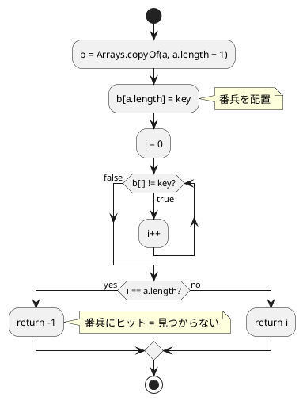
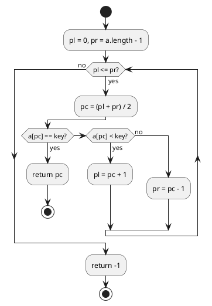
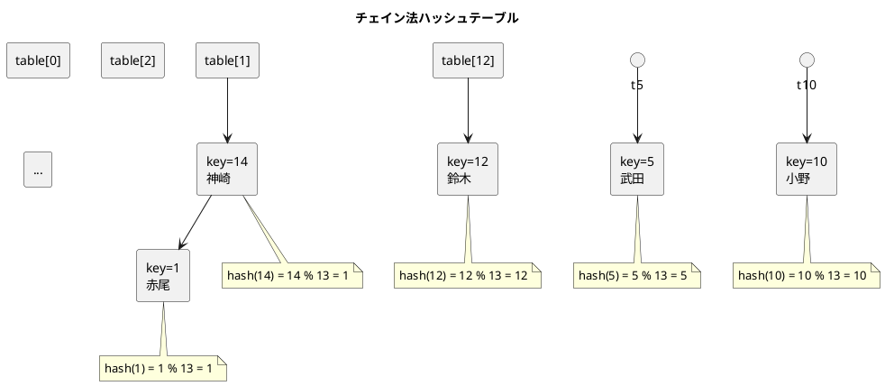
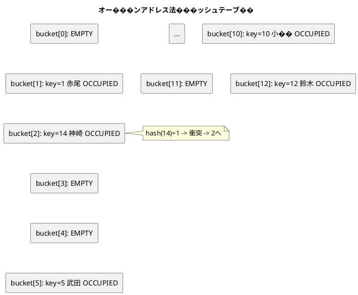

# 第 3 章 探索アルゴリズム

## はじめに

探索（Search）は、データの中から目的の値を見つけ出すアルゴリズムです。この章では線形探索、二分探索、ハッシュ法（チェイン法・オープンアドレス法）を TDD で実装します。データ構造の選択がアルゴリ���ムの効率にどのように影響するかを学びましょう。

---

## 1. 線形探索

配列の先頭から順に要素を調べていく、もっとも基本的な探索アルゴリズムです。while 文、for 文、番兵法の 3 通りで実装します。

### Red -- 失敗するテストを書く

```java
// src/test/java/algorithm/SearchTest.java
package algorithm;

import org.junit.jupiter.api.BeforeEach;
import org.junit.jupiter.api.Nested;
import org.junit.jupiter.api.Test;

import static org.junit.jupiter.api.Assertions.*;

class SearchTest {

    @Nested
    class LinearSearchTest {
        @Test
        void while文で探索_見つかる() {
            assertEquals(3, Search.linearSearchWhile(new int[]{6, 4, 3, 2, 1, 2, 8}, 2));
        }

        @Test
        void while文で探索_見つからない() {
            assertEquals(-1, Search.linearSearchWhile(new int[]{1, 2, 3}, 99));
        }

        @Test
        void for文で探索_見つかる() {
            assertEquals(3, Search.linearSearchFor(new int[]{6, 4, 3, 2, 1, 2, 8}, 2));
        }

        @Test
        void for文で探索_見つからない() {
            assertEquals(-1, Search.linearSearchFor(new int[]{1, 2, 3}, 99));
        }

        @Test
        void 番兵法で探索_見つかる() {
            assertEquals(3, Search.linearSearchSentinel(new int[]{6, 4, 3, 2, 1, 2, 8}, 2));
        }

        @Test
        void 番兵法で探索_見つからない() {
            assertEquals(-1, Search.linearSearchSentinel(new int[]{1, 2, 3}, 99));
        }
    }
}
```

各方式で「見つかる」「見つからない」の 2 パターンをテストします。見つかった場合は最初に一致した要素のインデックスを返し、見つからなかった場合は `-1` を返すことを検証して���ます。

### Green -- テストを通す最小のコードを書く

#### while 文による線形探索

```java
// src/main/java/algorithm/Search.java
package algorithm;

import java.util.Arrays;

public class Search {

    /** 線形探索（while 文） */
    public static int linearSearchWhile(int[] a, int key) {
        int i = 0;
        while (true) {
            if (i == a.length) return -1;
            if (a[i] == key) return i;
            i++;
        }
    }
}
```

#### for 文��よる線形探索

```java
/** 線形探索（for 文） */
public static int linearSearchFor(int[] a, int key) {
    for (int i = 0; i < a.length; i++) {
        if (a[i] == key) return i;
    }
    return -1;
}
```

#### 番兵法による線形探索

```java
/** 線形探索（番兵法） */
public static int linearSearchSentinel(int[] a, int key) {
    int[] b = Arrays.copyOf(a, a.length + 1);
    b[a.length] = key; // 番兵
    int i = 0;
    while (b[i] != key) i++;
    return i == a.length ? -1 : i;
}
```

番兵法では、配列の末尾に探索対象の値（番兵）を追加することで、ループ内の終了判定を省略できます。`Arrays.copyOf` で 1 要素大きい配列を作成し、末尾に `key` を配置します。

### フローチャート（番兵法）



---

## 2. 二分探索

ソート済み配列を対象に、探索範囲を半分ずつ絞り込む効率的な探索アルゴ��ズムです。計算量は O(log n) です。

### Red -- 失敗するテストを書く

```java
@Nested
class BinarySearchTest {
    @Test
    void 中央の要素を探索() {
        assertEquals(3, Search.binarySearch(new int[]{1, 2, 3, 5, 7, 8, 9}, 5));
    }

    @Test
    void 先頭の要素���探索() {
        assertEquals(0, Search.binarySearch(new int[]{1, 2, 3, 5, 7, 8, 9}, 1));
    }

    @Test
    void 末尾の要素を探索() {
        assertEquals(6, Search.binarySearch(new int[]{1, 2, 3, 5, 7, 8, 9}, 9));
    }

    @Test
    void 見つからない() {
        assertEquals(-1, Search.binarySearch(new int[]{1, 2, 3, 5, 7, 8, 9}, 4));
    }
}
```

中央・先頭・末尾・存在しない値の 4 パターンをテストします。二分探索ではソート済みの配列が前提条件です。

### Green -- テストを通す最小のコードを書く

```java
/** 二分探索 */
public static int binarySearch(int[] a, int key) {
    int pl = 0;
    int pr = a.length - 1;
    while (pl <= pr) {
        int pc = (pl + pr) / 2;
        if (a[pc] == key) return pc;
        else if (a[pc] < key) pl = pc + 1;
        else pr = pc - 1;
    }
    return -1;
}
```

`pl`（左端）と `pr`（右端）で探索範囲を管理し、中央値 `pc` と比較して範囲を半分に絞り���みます。

### フローチャート



---

## 3. チェイン法ハッシュ

ハッシュテーブルの衝突をリンクリストで解決する方法です。同じハッシュ値を持つ要素はリンクリストのチェインとして接続されます。

### 概念図



### Red -- 失敗するテストを書く

```java
@Nested
class ChainedHashTest {
    private Search.ChainedHash h;

    @BeforeEach
    void setUp() {
        h = new Search.ChainedHash(13);
        h.add(1, "赤尾");
        h.add(5, "武田");
        h.add(10, "小野");
        h.add(12, "鈴木");
        h.add(14, "神崎");
    }

    @Test
    void 探索_見つかる() {
        assertEquals("赤尾", h.search(1));
        assertEquals("神崎", h.search(14));
    }

    @Test
    void 探索_見つからない() {
        assertNull(h.search(100));
    }

    @Test
    void 追加して探索() {
        h.add(100, "山田");
        assertEquals("山田", h.search(100));
    }

    @Test
    void 重複キーは追加できない() {
        assertFalse(h.add(1, "重複"));
    }

    @Test
    void 削除() {
        h.add(100, "山田");
        assertTrue(h.remove(100));
        assertNull(h.search(100));
    }

    @Test
    void 衝突したノードの削除() {
        assertTrue(h.remove(1));
        assertTrue(h.remove(14));
        assertNull(h.search(1));
        assertNull(h.search(14));
    }

    @Test
    void 存在しないキーの削除() {
        assertFalse(h.remove(999));
    }
}
```

`@BeforeEach` で各テスト前にハッシュテーブルを初期化し、5 件のデータを投入します。key=1 と key=14 はハッシュ値が衝突（`1 % 13 = 1`, `14 % 13 = 1`）するため、チェインの動作確認に使えます。

### Green -- テ��トを通す最小のコードを書く

```java
/** チェイン法ハッ���ュテーブル */
public static class ChainedHash {
    private static class Node {
        int key;
        String value;
        Node next;

        Node(int key, String value, Node next) {
            this.key = key;
            this.value = value;
            this.next = next;
        }
    }

    private final int capacity;
    private final Node[] table;

    public ChainedHash(int capacity) {
        this.capacity = capacity;
        this.table = new Node[capacity];
    }

    private int hashValue(int key) {
        return key % capacity;
    }

    public String search(int key) {
        int h = hashValue(key);
        Node p = table[h];
        while (p != null) {
            if (p.key == key) return p.value;
            p = p.next;
        }
        return null;
    }

    public boolean add(int key, String value) {
        int h = hashValue(key);
        Node p = table[h];
        while (p != null) {
            if (p.key == key) return false;
            p = p.next;
        }
        table[h] = new Node(key, value, table[h]);
        return true;
    }

    public boolean remove(int key) {
        int h = hashValue(key);
        Node p = table[h];
        Node pp = null;
        while (p != null) {
            if (p.key == key) {
                if (pp == null) table[h] = p.next;
                else pp.next = p.next;
                return true;
            }
            pp = p;
            p = p.next;
        }
        return false;
    }
}
```

`add` メソッドでは、チェインの先頭に新しいノードを挿入します（O(1)）。`remove` メソッドでは前のノードへの参照 `pp` を保持しながらチェインをたどり、見つかったノードをリンクリストから外します。

---

## 4. オープンアドレス法ハッシュ

衝突時にテーブル内の別の空きバケットを探す方法です。リンクリストを使わないため、メモリ効率に優れます���

### 概念図



### Red -- 失敗するテストを書く

```java
@Nested
class OpenHashTest {
    private Search.OpenHash h;

    @BeforeEach
    void setUp() {
        h = new Search.OpenHash(13);
        h.add(1, "赤尾");
        h.add(5, "武田");
        h.add(10, "小野");
        h.add(12, "鈴木");
        h.add(14, "神崎");
    }

    @Test
    void 探索_見つかる() {
        assertEquals("赤尾", h.search(1));
    }

    @Test
    void 探索_見つからない() {
        assertNull(h.search(999));
    }

    @Test
    void 追加して探索() {
        h.add(100, "山田");
        assertEquals("山田", h.search(100));
    }

    @Test
    void 重複キーは追加できない() {
        assertFalse(h.add(1, "重複"));
    }

    @Test
    void 削除() {
        h.add(100, "山田");
        assertTrue(h.remove(100));
        assertNull(h.search(100));
    }

    @Test
    void 存在しないキーの削除() {
        assertFalse(h.remove(999));
    }

    @Test
    void テーブル満杯時の追加() {
        Search.OpenHash small = new Search.OpenHash(3);
        small.add(0, "a");
        small.add(1, "b");
        small.add(2, "c");
        assertFalse(small.add(99, "d"));
    }

    @Test
    void テーブル満杯時の存在しないキー削除() {
        Search.OpenHash small = new Search.OpenHash(3);
        small.add(0, "a");
        small.add(1, "b");
        small.add(2, "c");
        assertFalse(small.remove(99));
    }
}
```

オープンアドレス法特有のテストとして、テーブル満杯時の追加失敗と、満杯テーブルでの存在しないキーの削除を含めています。

### Green -- テストを通す最小のコードを書く

```java
/** オープンアドレス法（線形探索法）ハッシュテーブル */
public static class OpenHash {
    private enum Status { OCCUPIED, EMPTY, DELETED }

    private static class Bucket {
        int key;
        String value;
        Status stat;

        Bucket() { this.stat = Status.EMPTY; }
        Bucket(int key, String value) {
            this.key = key;
            this.value = value;
            this.stat = Status.OCCUPIED;
        }
    }

    private final int capacity;
    private final Bucket[] table;

    public OpenHash(int capacity) {
        this.capacity = capacity;
        this.table = new Bucket[capacity];
        for (int i = 0; i < capacity; i++) {
            table[i] = new Bucket();
        }
    }

    private int hashValue(int key) {
        return key % capacity;
    }

    public String search(int key) {
        int h = hashValue(key);
        for (int i = 0; i < capacity; i++) {
            Bucket p = table[h];
            if (p.stat == Status.EMPTY) break;
            if (p.stat == Status.OCCUPIED && p.key == key) return p.value;
            h = (h + 1) % capacity;
        }
        return null;
    }

    public boolean add(int key, String value) {
        if (search(key) != null) return false;
        int h = hashValue(key);
        for (int i = 0; i < capacity; i++) {
            Bucket p = table[h];
            if (p.stat == Status.EMPTY || p.stat == Status.DELETED) {
                table[h] = new Bucket(key, value);
                return true;
            }
            h = (h + 1) % capacity;
        }
        return false;
    }

    public boolean remove(int key) {
        int h = hashValue(key);
        for (int i = 0; i < capacity; i++) {
            Bucket p = table[h];
            if (p.stat == Status.EMPTY) return false;
            if (p.stat == Status.OCCUPIED && p.key == key) {
                p.stat = Status.DELETED;
                return true;
            }
            h = (h + 1) % capacity;
        }
        return false;
    }
}
```

各バケットは `OCCUPIED`（使用中）、`EMPTY`（空）、`DELETED`（削除済み）の 3 状態を持ちます。削除時にバケットを `DELETED` にすることで、その後の探索が正しくチェインをたどれるようにしています。

---

## Python との比較表

| 項目 | Java | Python |
|:---|:---|:---|
| 配列コピー | `Arrays.copyOf(a, a.length + 1)` | `a + [key]` / `a.copy()` |
| ハッシュテーブル | 手動実装（`Node[]`） | `dict` が組み込み |
| 内部クラス | `private static class Node` | クラス内クラス |
| enum | `private enum Status { ... }` | `enum.Enum` |
| null チェック | `assertNull(result)` | `assert result is None` |
| ラベル付き break/continue | `outer: for ... continue outer;` | なし |
| メモリ管理 | GC（参照をnullにすれば回収） | GC（参照カウント + 循環参照検出） |
| 可視性 | `private`, `public` 等 | 慣習的に `_` プレフィックス |

---

## テスト実行結果

```
SearchTest > LinearSearchTest > while文で探索_見つかる PASSED
SearchTest > LinearSearchTest > while文で探索_見つからない PASSED
SearchTest > LinearSearchTest > for文で探索_見つかる PASSED
SearchTest > LinearSearchTest > for文で探索_見つからない PASSED
SearchTest > LinearSearchTest > 番兵法で探索_見つかる PASSED
SearchTest > LinearSearchTest > 番兵法で探索_見つからない PASSED
SearchTest > BinarySearchTest > 中央の要素を探索 PASSED
SearchTest > BinarySearchTest > 先頭の要素を探索 PASSED
SearchTest > BinarySearchTest > 末尾の要素を探索 PASSED
SearchTest > BinarySearchTest > 見つからない PASSED
SearchTest > ChainedHashTest > 探索_見つかる PASSED
SearchTest > ChainedHashTest > 探索_見つからない PASSED
SearchTest > ChainedHashTest > 追加して探索 PASSED
SearchTest > ChainedHashTest > 重複キーは追加できない PASSED
SearchTest > ChainedHashTest > 削除 PASSED
SearchTest > ChainedHashTest > 衝突したノードの削除 PASSED
SearchTest > ChainedHashTest > 存在しないキーの削除 PASSED
SearchTest > OpenHashTest > 探索_見つかる PASSED
SearchTest > OpenHashTest > 探索_見つからない PASSED
SearchTest > OpenHashTest > 追加して探索 PASSED
SearchTest > OpenHashTest > 重複キーは追加できない PASSED
SearchTest > OpenHashTest > 削除 PASSED
SearchTest > OpenHashTest > 存在しないキーの削除 PASSED
SearchTest > OpenHashTest > テーブル満杯時の追加 PASSED
SearchTest > OpenHashTest > テーブル満杯時の存在しないキー削除 PASSED

BUILD SUCCESSFUL
25 tests completed, 0 failed
```
