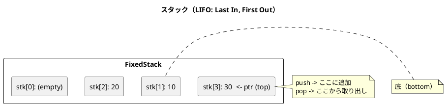
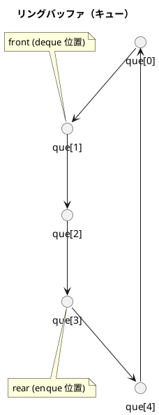

# 第 4 章 スタックとキュー

## はじめに

スタックとキューは、データの追加・取り出し順序に特徴を持つ基本的なデータ構造です。スタックは LIFO（Last In, First Out）、キューは FIFO（First In, First Out）の順序でデータを処理します。

この章では、固定長配列を使ったスタックとキュー（リングバッファ）をジェネリクスで TDD 実装します。

---

## 1. 固定長スタック -- FixedStack\<T\>

### 概念図



### Red -- 失敗するテストを書く

```java
// src/test/java/algorithm/StackQueueTest.java
package algorithm;

import org.junit.jupiter.api.BeforeEach;
import org.junit.jupiter.api.Nested;
import org.junit.jupiter.api.Test;

import static org.junit.jupiter.api.Assertions.*;

class StackQueueTest {

    @Nested
    class FixedStackTest {
        private FixedStack<Integer> stack;

        @BeforeEach
        void setUp() { stack = new FixedStack<>(64); }

        @Test
        void 初期状態は空() {
            assertTrue(stack.isEmpty());
            assertFalse(stack.isFull());
        }

        @Test
        void pushしてpeek() {
            stack.push(1);
            assertEquals(1, stack.peek());
        }

        @Test
        void pushしてpop() {
            stack.push(1);
            assertEquals(1, stack.pop());
        }

        @Test
        void 複数pushしてLIFO順にpop() {
            stack.push(1);
            stack.push(2);
            stack.push(3);
            assertEquals(3, stack.pop());
            assertEquals(2, stack.pop());
            assertEquals(1, stack.pop());
        }

        @Test
        void 満杯判定() {
            FixedStack<Integer> small = new FixedStack<>(3);
            small.push(1); small.push(2); small.push(3);
            assertTrue(small.isFull());
        }

        @Test
        void 空のpopで例外() {
            assertThrows(FixedStack.EmptyException.class, () -> stack.pop());
        }

        @Test
        void 満杯のpushで例外() {
            FixedStack<Integer> small = new FixedStack<>(2);
            small.push(1); small.push(2);
            assertThrows(FixedStack.FullException.class, () -> small.push(3));
        }

        @Test
        void 空のpeekで例外() {
            assertThrows(FixedStack.EmptyException.class, () -> stack.peek());
        }

        @Test
        void find() {
            stack.push(10); stack.push(20); stack.push(30);
            assertEquals(1, stack.find(20));
        }

        @Test
        void find_見つからない() {
            stack.push(10);
            assertEquals(-1, stack.find(99));
        }

        @Test
        void count() {
            stack.push(5); stack.push(5); stack.push(10);
            assertEquals(2, stack.count(5));
            assertEquals(1, stack.count(10));
            assertEquals(0, stack.count(99));
        }

        @Test
        void contains() {
            stack.push(42);
            assertTrue(stack.contains(42));
            assertFalse(stack.contains(0));
        }

        @Test
        void clear() {
            stack.push(1); stack.push(2);
            stack.clear();
            assertTrue(stack.isEmpty());
        }

        @Test
        void size() {
            stack.push(1); stack.push(2);
            assertEquals(2, stack.size());
        }

        @Test
        void capacity() {
            assertEquals(64, stack.getCapacity());
        }
    }
}
```

15 個のテストメソッドで、スタックの全操作を網羅的に検証しています。

- 基本操作: `push`, `pop`, `peek`
- 状態確認: `isEmpty`, `isFull`, `size`, `getCapacity`
- 探索操作: `find`, `count`, `contains`
- 例外: `EmptyException`, `FullException`
- リセット: `clear`

### Green -- テストを通す最小のコードを書く

```java
// src/main/java/algorithm/FixedStack.java
package algorithm;

import java.util.Arrays;

public class FixedStack<T> {

    public static class EmptyException extends RuntimeException {
        public EmptyException() { super("スタックは空です"); }
    }

    public static class FullException extends RuntimeException {
        public FullException() { super("スタックは満杯です"); }
    }

    private final Object[] stk;
    private final int capacity;
    private int ptr;

    public FixedStack(int capacity) {
        this.capacity = capacity;
        this.stk = new Object[capacity];
        this.ptr = 0;
    }

    public boolean isEmpty() { return ptr <= 0; }
    public boolean isFull() { return ptr >= capacity; }
    public int size() { return ptr; }
    public int getCapacity() { return capacity; }

    public void push(T value) {
        if (isFull()) throw new FullException();
        stk[ptr++] = value;
    }

    @SuppressWarnings("unchecked")
    public T pop() {
        if (isEmpty()) throw new EmptyException();
        return (T) stk[--ptr];
    }

    @SuppressWarnings("unchecked")
    public T peek() {
        if (isEmpty()) throw new EmptyException();
        return (T) stk[ptr - 1];
    }

    public int find(T value) {
        for (int i = ptr - 1; i >= 0; i--) {
            if (stk[i].equals(value)) return i;
        }
        return -1;
    }

    public boolean contains(T value) {
        return find(value) != -1;
    }

    public int count(T value) {
        int c = 0;
        for (int i = 0; i < ptr; i++) {
            if (stk[i].equals(value)) c++;
        }
        return c;
    }

    public void clear() { ptr = 0; }
}
```

Java のジェネリクスはイレイジャ方式のため、内部配列は `Object[]` として宣言し、取り出し時にキャストします。`@SuppressWarnings("unchecked")` でキャスト警告を抑制しています。

### Refactor -- 設計の考察

- `EmptyException` と `FullException` を `RuntimeException` のサブクラスとして定義し、スタック固有のエラーを表現しています
- `ptr` はスタックポインタで、次に push する位置を示します。`ptr == 0` が空、`ptr == capacity` が満杯です
- `find` メソッドは top から bottom に向かって探索するため、最後に push した値が先に見つかります

---

## 2. 固定長キュー（リングバッファ） -- FixedQueue\<T\>

### 概念図



リングバッファは配列の末尾と先頭を論理的に接続した構造です。`front` と `rear` の 2 つのポインタで、データの出入り口を管理します。

### Red -- 失敗するテストを書く

```java
@Nested
class FixedQueueTest {
    private FixedQueue<Integer> queue;

    @BeforeEach
    void setUp() { queue = new FixedQueue<>(64); }

    @Test
    void 初期状態は空() {
        assertTrue(queue.isEmpty());
        assertFalse(queue.isFull());
    }

    @Test
    void enqueしてdeque() {
        queue.enque(1);
        assertEquals(1, queue.deque());
    }

    @Test
    void 複数enqueしてFIFO順にdeque() {
        queue.enque(1); queue.enque(2); queue.enque(3);
        assertEquals(1, queue.deque());
        assertEquals(2, queue.deque());
        assertEquals(3, queue.deque());
    }

    @Test
    void peek() {
        queue.enque(10); queue.enque(20);
        assertEquals(10, queue.peek());
    }

    @Test
    void 満杯判定() {
        FixedQueue<Integer> small = new FixedQueue<>(3);
        small.enque(1); small.enque(2); small.enque(3);
        assertTrue(small.isFull());
    }

    @Test
    void 空のdequeで例外() {
        assertThrows(FixedQueue.EmptyException.class, () -> queue.deque());
    }

    @Test
    void 満杯のenqueで例外() {
        FixedQueue<Integer> small = new FixedQueue<>(2);
        small.enque(1); small.enque(2);
        assertThrows(FixedQueue.FullException.class, () -> small.enque(3));
    }

    @Test
    void 空のpeekで例外() {
        assertThrows(FixedQueue.EmptyException.class, () -> queue.peek());
    }

    @Test
    void find() {
        queue.enque(10); queue.enque(20); queue.enque(30);
        assertEquals(0, queue.find(10));
    }

    @Test
    void find_見つからない() {
        queue.enque(10);
        assertEquals(-1, queue.find(99));
    }

    @Test
    void count() {
        queue.enque(5); queue.enque(5); queue.enque(10);
        assertEquals(2, queue.count(5));
    }

    @Test
    void contains() {
        queue.enque(42);
        assertTrue(queue.contains(42));
        assertFalse(queue.contains(0));
    }

    @Test
    void clear() {
        queue.enque(1); queue.enque(2);
        queue.clear();
        assertTrue(queue.isEmpty());
    }

    @Test
    void size() {
        queue.enque(1); queue.enque(2);
        assertEquals(2, queue.size());
    }

    @Test
    void capacity() {
        assertEquals(64, queue.getCapacity());
    }

    @Test
    void リングバッファの折り返し() {
        FixedQueue<Integer> small = new FixedQueue<>(3);
        small.enque(1); small.enque(2); small.enque(3);
        small.deque(); // 1 を取り出す
        small.enque(4); // 空き位置に追加
        assertEquals(2, small.deque());
        assertEquals(3, small.deque());
        assertEquals(4, small.deque());
    }
}
```

16 個のテストメソッドでキューの全操作を検証しています。特に「リングバッファの折り返し」テストが重要です。容量 3 のキューに 3 つ入れて 1 つ取り出し、再び 1 つ入れることで、rear ポインタが配列の先頭に戻る動作を確認しています。

### Green -- テストを通す最小のコードを書く

```java
// src/main/java/algorithm/FixedQueue.java
package algorithm;

public class FixedQueue<T> {

    public static class EmptyException extends RuntimeException {
        public EmptyException() { super("キューは空です"); }
    }

    public static class FullException extends RuntimeException {
        public FullException() { super("キューは満杯です"); }
    }

    private final Object[] que;
    private final int capacity;
    private int front;
    private int rear;
    private int num;

    public FixedQueue(int capacity) {
        this.capacity = capacity;
        this.que = new Object[capacity];
        this.front = 0;
        this.rear = 0;
        this.num = 0;
    }

    public boolean isEmpty() { return num <= 0; }
    public boolean isFull() { return num >= capacity; }
    public int size() { return num; }
    public int getCapacity() { return capacity; }

    public void enque(T value) {
        if (isFull()) throw new FullException();
        que[rear] = value;
        rear++;
        num++;
        if (rear == capacity) rear = 0;
    }

    @SuppressWarnings("unchecked")
    public T deque() {
        if (isEmpty()) throw new EmptyException();
        T value = (T) que[front];
        front++;
        num--;
        if (front == capacity) front = 0;
        return value;
    }

    @SuppressWarnings("unchecked")
    public T peek() {
        if (isEmpty()) throw new EmptyException();
        return (T) que[front];
    }

    public int find(T value) {
        for (int i = 0; i < num; i++) {
            int idx = (i + front) % capacity;
            if (que[idx].equals(value)) return i;
        }
        return -1;
    }

    public boolean contains(T value) {
        return find(value) != -1;
    }

    public int count(T value) {
        int c = 0;
        for (int i = 0; i < num; i++) {
            int idx = (i + front) % capacity;
            if (que[idx].equals(value)) c++;
        }
        return c;
    }

    public void clear() {
        front = rear = num = 0;
    }
}
```

リングバッファの鍵は `if (rear == capacity) rear = 0;` と `if (front == capacity) front = 0;` です。ポインタが配列の末尾を超えたら先頭に戻すことで、配列を環状に使います。`num` 変数で要素数を別途管理することで、空と満杯の区別を可能にしています。

---

## Python との比較表

| 項目 | Java | Python |
|:---|:---|:---|
| ジェネリクス | `FixedStack<T>` (型消去) | 型ヒント `FixedStack[T]` |
| 内部配列 | `Object[]` + キャスト | `list`（動的型付け） |
| 例外クラス | `static class EmptyException extends RuntimeException` | `class EmptyError(Exception)` |
| 例外テスト | `assertThrows(Exception.class, () -> ...)` | `with pytest.raises(Exception):` |
| アクセス修飾子 | `private`, `public` | 慣習的に `_` プレフィックス |
| 初期化 | コンストラクタ `public FixedStack(int cap)` | `def __init__(self, cap):` |
| キュー | 手動実装（リングバッファ） | `collections.deque` が組み込み |
| suppress warning | `@SuppressWarnings("unchecked")` | 不要（動的型付け） |

---

## テスト実行結果

```
StackQueueTest > FixedStackTest > 初期状態は空 PASSED
StackQueueTest > FixedStackTest > pushしてpeek PASSED
StackQueueTest > FixedStackTest > pushしてpop PASSED
StackQueueTest > FixedStackTest > 複数pushしてLIFO順にpop PASSED
StackQueueTest > FixedStackTest > 満杯判定 PASSED
StackQueueTest > FixedStackTest > 空のpopで例外 PASSED
StackQueueTest > FixedStackTest > 満杯のpushで例外 PASSED
StackQueueTest > FixedStackTest > 空のpeekで例外 PASSED
StackQueueTest > FixedStackTest > find PASSED
StackQueueTest > FixedStackTest > find_見つからない PASSED
StackQueueTest > FixedStackTest > count PASSED
StackQueueTest > FixedStackTest > contains PASSED
StackQueueTest > FixedStackTest > clear PASSED
StackQueueTest > FixedStackTest > size PASSED
StackQueueTest > FixedStackTest > capacity PASSED
StackQueueTest > FixedQueueTest > 初期状態は空 PASSED
StackQueueTest > FixedQueueTest > enqueしてdeque PASSED
StackQueueTest > FixedQueueTest > 複数enqueしてFIFO順にdeque PASSED
StackQueueTest > FixedQueueTest > peek PASSED
StackQueueTest > FixedQueueTest > 満杯判定 PASSED
StackQueueTest > FixedQueueTest > 空のdequeで例外 PASSED
StackQueueTest > FixedQueueTest > 満杯のenqueで例外 PASSED
StackQueueTest > FixedQueueTest > 空のpeekで例外 PASSED
StackQueueTest > FixedQueueTest > find PASSED
StackQueueTest > FixedQueueTest > find_見つからない PASSED
StackQueueTest > FixedQueueTest > count PASSED
StackQueueTest > FixedQueueTest > contains PASSED
StackQueueTest > FixedQueueTest > clear PASSED
StackQueueTest > FixedQueueTest > size PASSED
StackQueueTest > FixedQueueTest > capacity PASSED
StackQueueTest > FixedQueueTest > リングバッファの折り返し PASSED

BUILD SUCCESSFUL
31 tests completed, 0 failed
```
